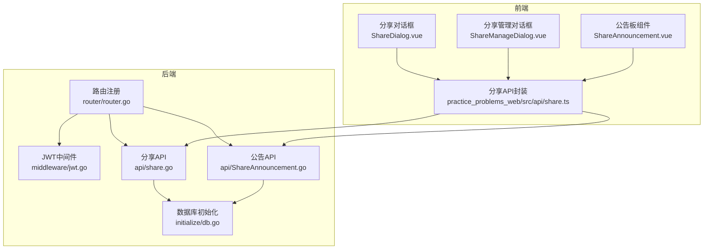
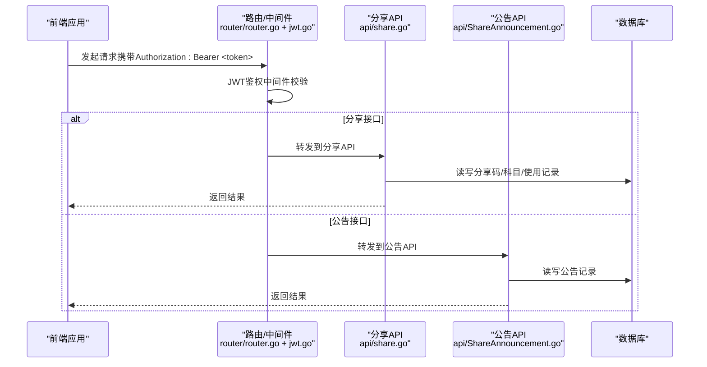
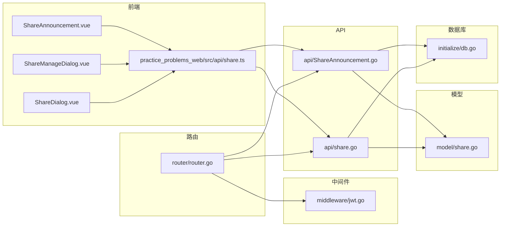
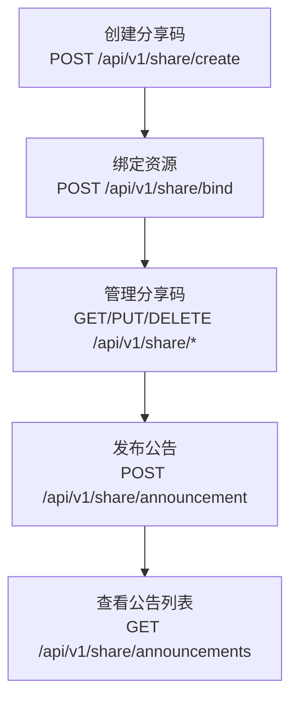

# 分享与公告API

<cite>
**本文引用的文件**
- [api/share.go](file://api/share.go)
- [api/ShareAnnouncement.go](file://api/ShareAnnouncement.go)
- [router/router.go](file://router/router.go)
- [middleware/jwt.go](file://middleware/jwt.go)
- [model/share.go](file://model/share.go)
- [initialize/db.go](file://initialize/db.go)
- [practice_problems_web/src/api/share.ts](file://practice_problems_web/src/api/share.ts)
- [practice_problems_web/src/views/Home/components/ShareDialog.vue](file://practice_problems_web/src/views/Home/components/ShareDialog.vue)
- [practice_problems_web/src/views/Home/components/ShareManageDialog.vue](file://practice_problems_web/src/views/Home/components/ShareManageDialog.vue)
- [practice_problems_web/src/components/ShareAnnouncement.vue](file://practice_problems_web/src/components/ShareAnnouncement.vue)
</cite>

## 目录
1. [简介](#简介)
2. [项目结构](#项目结构)
3. [核心组件](#核心组件)
4. [架构总览](#架构总览)
5. [详细组件分析](#详细组件分析)
6. [依赖关系分析](#依赖关系分析)
7. [性能考量](#性能考量)
8. [故障排查指南](#故障排查指南)
9. [结论](#结论)
10. [附录](#附录)

## 简介
本文面向后端与前端开发者，系统化梳理“分享系统”相关API，覆盖分享码的创建、绑定、管理以及公告发布能力。重点接口包括：
- 分享码相关：POST /api/v1/share/create、POST /api/v1/share/bind、GET /api/v1/share/list、DELETE /api/v1/share/:id、PUT /api/v1/share/:id
- 公告相关：POST /api/v1/share/announcement、GET /api/v1/share/announcements、DELETE /api/v1/share/announcement/:id、PUT /api/v1/share/announcement/:id

文档明确各接口的认证要求（JWT）、请求参数、响应格式、业务规则与边界条件，并结合前端调用方式与实现细节，给出从创建分享码到发布公告的完整流程示例。

## 项目结构
后端采用 Gin 路由分组与 JWT 中间件进行权限控制；分享与公告API位于 v1 下的共享分组中；数据库初始化脚本定义了分享码、公告及关联表结构。

图表来源
- [router/router.go](file://router/router.go#L33-L69)
- [middleware/jwt.go](file://middleware/jwt.go#L40-L99)
- [api/share.go](file://api/share.go#L53-L133)
- [api/ShareAnnouncement.go](file://api/ShareAnnouncement.go#L17-L75)
- [initialize/db.go](file://initialize/db.go#L204-L268)
- [practice_problems_web/src/api/share.ts](file://practice_problems_web/src/api/share.ts#L1-L92)
- [practice_problems_web/src/views/Home/components/ShareDialog.vue](file://practice_problems_web/src/views/Home/components/ShareDialog.vue#L1-L168)
- [practice_problems_web/src/views/Home/components/ShareManageDialog.vue](file://practice_problems_web/src/views/Home/components/ShareManageDialog.vue#L1-L120)
- [practice_problems_web/src/components/ShareAnnouncement.vue](file://practice_problems_web/src/components/ShareAnnouncement.vue#L1-L120)

章节来源
- [router/router.go](file://router/router.go#L33-L69)
- [middleware/jwt.go](file://middleware/jwt.go#L40-L99)
- [initialize/db.go](file://initialize/db.go#L204-L268)

## 核心组件
- 分享API模块：负责分享码创建、定向授权、绑定资源、查询我的分享码、删除与更新分享码。
- 公告API模块：负责公告发布、列表查询、删除与更新。
- 路由与中间件：v1分组下挂载JWT鉴权中间件，对分享与公告相关接口进行统一保护。
- 数据模型：定义分享请求、绑定请求、分享码与公告实体。
- 前端封装：统一的HTTP请求封装与组件交互逻辑。

章节来源
- [api/share.go](file://api/share.go#L53-L133)
- [api/ShareAnnouncement.go](file://api/ShareAnnouncement.go#L17-L75)
- [router/router.go](file://router/router.go#L33-L69)
- [middleware/jwt.go](file://middleware/jwt.go#L40-L99)
- [model/share.go](file://model/share.go#L1-L36)
- [practice_problems_web/src/api/share.ts](file://practice_problems_web/src/api/share.ts#L1-L92)

## 架构总览
分享与公告API遵循“JWT鉴权 + 路由分组 + 业务模块”的分层架构。JWT中间件在进入具体业务前校验请求头中的Bearer Token，并将用户标识注入上下文；路由层将不同业务域的接口归并到v1分组下，便于统一管理。

图表来源
- [router/router.go](file://router/router.go#L33-L69)
- [middleware/jwt.go](file://middleware/jwt.go#L40-L99)
- [api/share.go](file://api/share.go#L53-L133)
- [api/ShareAnnouncement.go](file://api/ShareAnnouncement.go#L17-L75)

## 详细组件分析

### 分享码创建：POST /api/v1/share/create
- 认证要求：需要JWT（Bearer Token）。
- 功能概述：支持两种创建方式：
  - 指定用户（私密授权）：将科目直接授权给目标用户，自动计算资源有效期并写入用户-科目表。
  - 生成分享码（公开分享）：生成唯一分享码，设定分享码有效期与资源有效期，写入分享码主表与科目关联表。
- 请求参数（JSON）：
  - subject_ids: 数组，必填，科目ID列表（至少1个）。
  - duration: 字符串，必填，资源有效期（给用户看的），如 "7d"、"30d"、"365d"、"forever"。
  - code_duration: 字符串，可选，分享码有效期（给码用的），如 "1d"、"7d"、"30d"、"365d"。
  - type: 整数，必填，1表示定向授权，2表示生成分享码。
  - targets: 字符串数组，当type=1时必填，目标用户user_code列表。
- 响应：
  - 成功：返回code=200，msg描述性信息；当type=2时返回data为分享码字符串。
  - 失败：返回对应错误码与消息（如400参数错误、403无权限、500服务器错误）。
- 业务要点：
  - 分享码有效期最大不超过1年，超过将返回400。
  - 定向授权会校验目标用户是否存在，不存在则拒绝。
  - 生成分享码时会校验科目归属权（仅创建者可生成）。
- 前端调用参考：
  - 前端封装：见 [createShare](file://practice_problems_web/src/api/share.ts#L16-L21)。
  - 前端界面：见 [ShareDialog.vue](file://practice_problems_web/src/views/Home/components/ShareDialog.vue#L1-L168) 的“我要分享”页签与提交逻辑。

章节来源
- [api/share.go](file://api/share.go#L53-L133)
- [model/share.go](file://model/share.go#L1-L17)
- [practice_problems_web/src/api/share.ts](file://practice_problems_web/src/api/share.ts#L16-L21)
- [practice_problems_web/src/views/Home/components/ShareDialog.vue](file://practice_problems_web/src/views/Home/components/ShareDialog.vue#L186-L315)

### 分享码绑定：POST /api/v1/share/bind
- 认证要求：需要JWT。
- 功能概述：将当前用户绑定到某个分享码所包含的科目集合，自动计算资源有效期并去重写入用户-科目表；同时统计该分享码的使用次数。
- 请求参数（JSON）：
  - code: 字符串，必填，分享码。
- 响应：
  - 成功：返回code=200，msg描述绑定结果（新增数量、跳过数量、总使用人数）。
  - 失败：返回对应错误码与消息（如404无效/失效、400已过期/无科目、500系统错误）。
- 业务要点：
  - 不能绑定自己创建的分享码。
  - 分享码必须处于有效期内。
  - 若用户已拥有该科目且未过期，则跳过绑定。
- 前端调用参考：
  - 前端封装：见 [bindShare](file://practice_problems_web/src/api/share.ts#L22-L25)。
  - 前端界面：见 [ShareDialog.vue](file://practice_problems_web/src/views/Home/components/ShareDialog.vue#L149-L168) 的“绑定资源”页签。

章节来源
- [api/share.go](file://api/share.go#L247-L406)
- [model/share.go](file://model/share.go#L13-L17)
- [practice_problems_web/src/api/share.ts](file://practice_problems_web/src/api/share.ts#L22-L25)
- [practice_problems_web/src/views/Home/components/ShareDialog.vue](file://practice_problems_web/src/views/Home/components/ShareDialog.vue#L149-L168)

### 获取我的分享码列表：GET /api/v1/share/list
- 认证要求：需要JWT。
- 功能概述：返回当前用户创建的有效分享码列表，包含资源有效期、过期时间、使用次数、科目数量与状态（active/expired）。
- 响应：
  - 成功：返回code=200，data为列表数组。
- 业务要点：
  - 会根据过期时间动态计算状态。
- 前端调用参考：
  - 前端封装：见 [getMyShareCodes](file://practice_problems_web/src/api/share.ts#L27-L30)。
  - 前端界面：见 [ShareManageDialog.vue](file://practice_problems_web/src/views/Home/components/ShareManageDialog.vue#L303-L318) 的列表加载逻辑。

章节来源
- [api/share.go](file://api/share.go#L408-L468)
- [practice_problems_web/src/api/share.ts](file://practice_problems_web/src/api/share.ts#L27-L30)
- [practice_problems_web/src/views/Home/components/ShareManageDialog.vue](file://practice_problems_web/src/views/Home/components/ShareManageDialog.vue#L303-L318)

### 删除分享码：DELETE /api/v1/share/:id
- 认证要求：需要JWT。
- 功能概述：软删除（更新状态字段）当前用户创建的分享码。
- 响应：
  - 成功：返回code=200。
  - 失败：返回对应错误码与消息（如404不存在/无权）。
- 前端调用参考：
  - 前端封装：见 [deleteShareCode](file://practice_problems_web/src/api/share.ts#L31-L36)。
  - 前端界面：见 [ShareManageDialog.vue](file://practice_problems_web/src/views/Home/components/ShareManageDialog.vue#L471-L481) 的删除逻辑。

章节来源
- [api/share.go](file://api/share.go#L470-L497)
- [practice_problems_web/src/api/share.ts](file://practice_problems_web/src/api/share.ts#L31-L36)
- [practice_problems_web/src/views/Home/components/ShareManageDialog.vue](file://practice_problems_web/src/views/Home/components/ShareManageDialog.vue#L471-L481)

### 更新分享码：PUT /api/v1/share/:id
- 认证要求：需要JWT。
- 功能概述：更新分享码的截止时间与资源有效期字符串，限制截止时间最晚不超过创建后1年内。
- 请求参数（JSON）：
  - new_expire_date: 字符串，可选，截止时间（YYYY-MM-DD HH:mm:ss）。
  - new_duration: 字符串，可选，资源有效期字符串（如 "7d"、"30d"、"365d"、"forever"）。
- 响应：
  - 成功：返回code=200。
  - 失败：返回对应错误码与消息（如400格式错误/超限、404不存在/无权）。
- 前端调用参考：
  - 前端封装：见 [updateShareCode](file://practice_problems_web/src/api/share.ts#L37-L43)。
  - 前端界面：见 [ShareManageDialog.vue](file://practice_problems_web/src/views/Home/components/ShareManageDialog.vue#L320-L412) 的编辑弹窗与提交逻辑。

章节来源
- [api/share.go](file://api/share.go#L499-L580)
- [practice_problems_web/src/api/share.ts](file://practice_problems_web/src/api/share.ts#L37-L43)
- [practice_problems_web/src/views/Home/components/ShareManageDialog.vue](file://practice_problems_web/src/views/Home/components/ShareManageDialog.vue#L320-L412)

### 公告发布：POST /api/v1/share/announcement
- 认证要求：需要JWT。
- 功能概述：发布一条分享公告，绑定到某个分享码，可设置备注与过期时间。
- 请求参数（JSON）：
  - shareCode: 字符串，必填，目标分享码。
  - note: 字符串，可选，备注说明（最多200字）。
  - expireTime: 字符串，可选，过期时间（YYYY-MM-DD HH:mm:ss）。
- 响应：
  - 成功：返回code=200，data为公告对象。
  - 失败：返回对应错误码与消息（如400参数错误/格式错误、500系统错误）。
- 业务要点：
  - 新增对分享码过期状态的验证：在发布公告前，系统会检查目标分享码是否已过期。若分享码已过期，则拒绝发布，返回错误信息“发布失败：分享码已过期，不允许发布公告”。
  - note长度限制。
  - expireTime格式校验。
- 前端调用参考：
  - 前端封装：见 [createShareAnnouncement](file://practice_problems_web/src/api/share.ts#L79-L82)。
  - 前端界面：见 [ShareManageDialog.vue](file://practice_problems_web/src/views/Home/components/ShareManageDialog.vue#L429-L467) 的发布公告弹窗与提交逻辑。

章节来源
- [api/ShareAnnouncement.go](file://api/ShareAnnouncement.go#L17-L75)
- [practice_problems_web/src/api/share.ts](file://practice_problems_web/src/api/share.ts#L79-L82)
- [practice_problems_web/src/views/Home/components/ShareManageDialog.vue](file://practice_problems_web/src/views/Home/components/ShareManageDialog.vue#L429-L467)

### 公告列表：GET /api/v1/share/announcements
- 认证要求：需要JWT。
- 功能概述：返回未过期且状态有效的公告列表，按创建时间倒序。
- 响应：
  - 成功：返回code=200，data为列表数组。
- 前端调用参考：
  - 前端封装：见 [getShareAnnouncements](file://practice_problems_web/src/api/share.ts#L74-L77)。
  - 前端界面：见 [ShareAnnouncement.vue](file://practice_problems_web/src/components/ShareAnnouncement.vue#L142-L164) 的数据拉取逻辑。

章节来源
- [api/ShareAnnouncement.go](file://api/ShareAnnouncement.go#L77-L130)
- [practice_problems_web/src/api/share.ts](file://practice_problems_web/src/api/share.ts#L74-L77)
- [practice_problems_web/src/components/ShareAnnouncement.vue](file://practice_problems_web/src/components/ShareAnnouncement.vue#L142-L164)

### 删除公告：DELETE /api/v1/share/announcement/:id
- 认证要求：需要JWT。
- 功能概述：仅公告创建者可删除（软删除，更新状态字段）。**新增对分享码过期状态的验证**：在删除公告前，系统会先检查该公告所关联的分享码是否已过期。若分享码已过期，则拒绝删除操作，返回错误信息“删除失败：分享码已过期，不允许删除公告”。
- 响应：
  - 成功：返回code=200。
  - 失败：返回对应错误码与消息（如403无权、400分享码已过期）。
- 前端调用参考：
  - 前端封装：见 [deleteShareAnnouncement](file://practice_problems_web/src/api/share.ts#L84-L87)。
  - 前端界面：见 [ShareAnnouncement.vue](file://practice_problems_web/src/components/ShareAnnouncement.vue#L166-L171) 的删除逻辑。

章节来源
- [api/ShareAnnouncement.go](file://api/ShareAnnouncement.go#L133-L161)
- [practice_problems_web/src/api/share.ts](file://practice_problems_web/src/api/share.ts#L84-L87)
- [practice_problems_web/src/components/ShareAnnouncement.vue](file://practice_problems_web/src/components/ShareAnnouncement.vue#L166-L171)

### 更新公告：PUT /api/v1/share/announcement/:id
- 认证要求：需要JWT。
- 功能概述：仅公告创建者可更新备注与过期时间。**新增双重过期状态验证**：在更新公告时，系统会进行两次检查：
  1. 检查公告本身是否已过期，若已过期则拒绝更新。
  2. 检查公告所关联的分享码是否已过期，若分享码已过期则拒绝更新。
- 响应：
  - 成功：返回code=200。
  - 失败：返回对应错误码与消息（如403无权、400公告或分享码已过期）。
- 前端调用参考：
  - 前端封装：见 [updateShareAnnouncement](file://practice_problems_web/src/api/share.ts#L88-L92)。
  - 前端界面：见 [ShareAnnouncement.vue](file://practice_problems_web/src/components/ShareAnnouncement.vue#L173-L199) 的编辑弹窗与提交逻辑。

章节来源
- [api/ShareAnnouncement.go](file://api/ShareAnnouncement.go#L163-L212)
- [practice_problems_web/src/api/share.ts](file://practice_problems_web/src/api/share.ts#L88-L92)
- [practice_problems_web/src/components/ShareAnnouncement.vue](file://practice_problems_web/src/components/ShareAnnouncement.vue#L173-L199)

## 依赖关系分析

图表来源
- [router/router.go](file://router/router.go#L33-L69)
- [middleware/jwt.go](file://middleware/jwt.go#L40-L99)
- [api/share.go](file://api/share.go#L53-L133)
- [api/ShareAnnouncement.go](file://api/ShareAnnouncement.go#L17-L75)
- [model/share.go](file://model/share.go#L1-L36)
- [initialize/db.go](file://initialize/db.go#L204-L268)
- [practice_problems_web/src/api/share.ts](file://practice_problems_web/src/api/share.ts#L1-L92)
- [practice_problems_web/src/views/Home/components/ShareDialog.vue](file://practice_problems_web/src/views/Home/components/ShareDialog.vue#L1-L168)
- [practice_problems_web/src/views/Home/components/ShareManageDialog.vue](file://practice_problems_web/src/views/Home/components/ShareManageDialog.vue#L1-L120)
- [practice_problems_web/src/components/ShareAnnouncement.vue](file://practice_problems_web/src/components/ShareAnnouncement.vue#L1-L120)

章节来源
- [router/router.go](file://router/router.go#L33-L69)
- [middleware/jwt.go](file://middleware/jwt.go#L40-L99)
- [api/share.go](file://api/share.go#L53-L133)
- [api/ShareAnnouncement.go](file://api/ShareAnnouncement.go#L17-L75)
- [model/share.go](file://model/share.go#L1-L36)
- [initialize/db.go](file://initialize/db.go#L204-L268)
- [practice_problems_web/src/api/share.ts](file://practice_problems_web/src/api/share.ts#L1-L92)

## 性能考量
- 数据库索引与约束：分享码与科目关联表、用户-科目表、使用记录表均具备外键与唯一约束，有助于减少重复绑定与提升查询稳定性。
- 事务控制：创建分享码与定向授权均使用事务，确保原子性与一致性。
- 查询优化：列表查询使用单次SQL聚合字段，避免多次往返。
- 前端缓存策略：建议在前端对公告列表与我的分享码列表做本地缓存，减少重复请求。

[本节为通用指导，不直接分析具体文件]

## 故障排查指南
- JWT鉴权失败（401）：
  - 检查请求头是否包含正确的Authorization: Bearer <token>。
  - 确认Token未过期且未被加入黑名单。
- 参数错误（400）：
  - 分享码创建：检查subject_ids、duration、code_duration、type、targets是否符合要求。
  - 分享码绑定：检查code格式与有效性。
  - 公告发布/更新：检查shareCode、note长度、expireTime格式。
- 权限不足（403）：
  - 定向授权时目标用户不存在或无权限。
  - 公告删除/更新时非创建者。
- 资源不存在（404）：
  - 分享码不存在或已被删除。
  - 公告不存在或已被删除。
- 服务器错误（500）：
  - 检查数据库连接与SQL执行日志，定位异常点。

章节来源
- [middleware/jwt.go](file://middleware/jwt.go#L40-L99)
- [api/share.go](file://api/share.go#L53-L133)
- [api/ShareAnnouncement.go](file://api/ShareAnnouncement.go#L17-L75)

## 结论
本API体系以JWT为统一鉴权入口，围绕“分享码”与“公告”两大业务域构建了完整的生命周期管理能力。后端通过严谨的参数校验、事务控制与状态机设计保障数据一致性；前端通过组件化封装与直观交互提升用户体验。**特别地，通过在公告的创建、删除和更新操作中增加对分享码过期状态的验证，系统增强了安全性和数据一致性，防止了在无效分享码上进行无效的公告操作**。建议在生产环境中进一步完善日志分级、限流与审计机制，确保系统的可观测性与安全性。

[本节为总结性内容，不直接分析具体文件]

## 附录

### 数据模型与表结构
- 分享码主表：包含分享码、创建者、资源有效期字符串、过期时间、创建时间、使用次数、状态。
- 公告表：包含创建者user_code、关联分享码、备注、创建时间、过期时间、状态。
- 关联表：用户-科目绑定、分享码-科目关联、分享码使用记录。

章节来源
- [initialize/db.go](file://initialize/db.go#L204-L268)

### 从创建分享码到发布公告的完整流程示例
- 步骤1：创建分享码
  - 前端：调用 [createShare](file://practice_problems_web/src/api/share.ts#L16-L21)，在 [ShareDialog.vue](file://practice_problems_web/src/views/Home/components/ShareDialog.vue#L286-L315) 中组织subject_ids、duration、code_duration、type、targets。
  - 后端：[CreateShare](file://api/share.go#L53-L133) 校验参数、校验科目归属、生成分享码并写入主表与关联表。
- 步骤2：绑定资源
  - 前端：调用 [bindShare](file://practice_problems_web/src/api/share.ts#L22-L25)，在 [ShareDialog.vue](file://practice_problems_web/src/views/Home/components/ShareDialog.vue#L317-L329) 中输入分享码并提交。
  - 后端：[BindSubject](file://api/share.go#L247-L406) 校验分享码有效性、计算资源过期时间、去重写入用户-科目表并统计使用次数。
- 步骤3：管理分享码
  - 前端：调用 [getMyShareCodes](file://practice_problems_web/src/api/share.ts#L27-L30)、[updateShareCode](file://practice_problems_web/src/api/share.ts#L37-L43)、[deleteShareCode](file://practice_problems_web/src/api/share.ts#L31-L36)，在 [ShareManageDialog.vue](file://practice_problems_web/src/views/Home/components/ShareManageDialog.vue#L303-L481) 中查看与编辑。
  - 后端：[GetMyShareCodes](file://api/share.go#L408-L468)、[UpdateShareCode](file://api/share.go#L499-L580)、[DeleteShareCode](file://api/share.go#L470-L497)。
- 步骤4：发布公告
  - 前端：调用 [createShareAnnouncement](file://practice_problems_web/src/api/share.ts#L79-L82)、[getShareAnnouncements](file://practice_problems_web/src/api/share.ts#L74-L77)、[updateShareAnnouncement](file://practice_problems_web/src/api/share.ts#L88-L92)、[deleteShareAnnouncement](file://practice_problems_web/src/api/share.ts#L84-L87)，在 [ShareManageDialog.vue](file://practice_problems_web/src/views/Home/components/ShareManageDialog.vue#L429-L467) 与 [ShareAnnouncement.vue](file://practice_problems_web/src/components/ShareAnnouncement.vue#L142-L199) 中操作。
  - 后端：[CreateShareAnnouncement](file://api/ShareAnnouncement.go#L17-L75)、[GetShareAnnouncementList](file://api/ShareAnnouncement.go#L77-L130)、[UpdateShareAnnouncement](file://api/ShareAnnouncement.go#L163-L212)、[DeleteShareAnnouncement](file://api/ShareAnnouncement.go#L133-L161)。

图表来源
- [api/share.go](file://api/share.go#L53-L133)
- [api/ShareAnnouncement.go](file://api/ShareAnnouncement.go#L17-L75)
- [practice_problems_web/src/api/share.ts](file://practice_problems_web/src/api/share.ts#L16-L92)