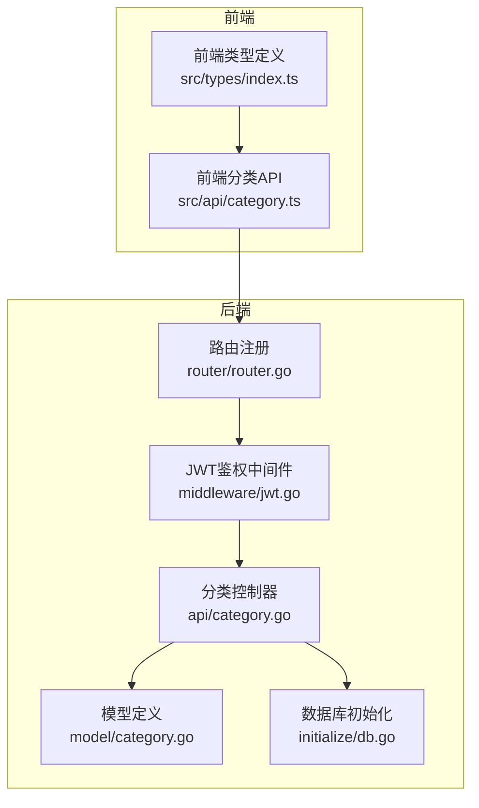
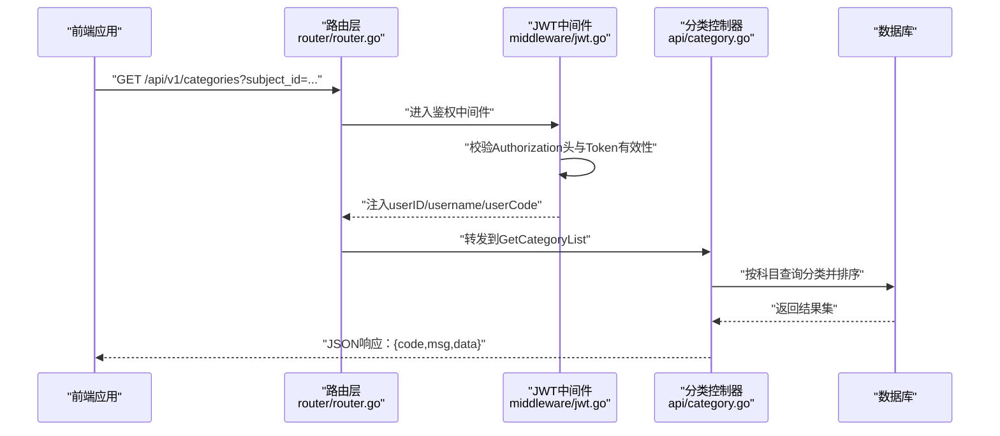
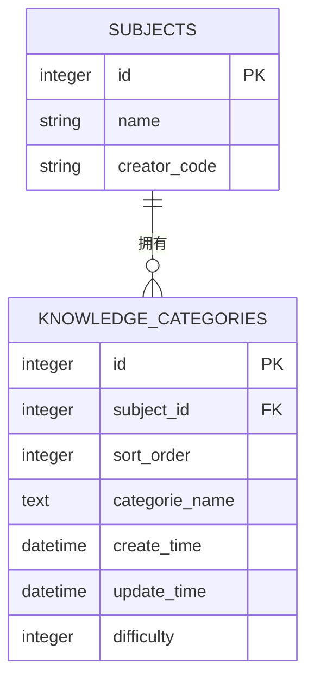
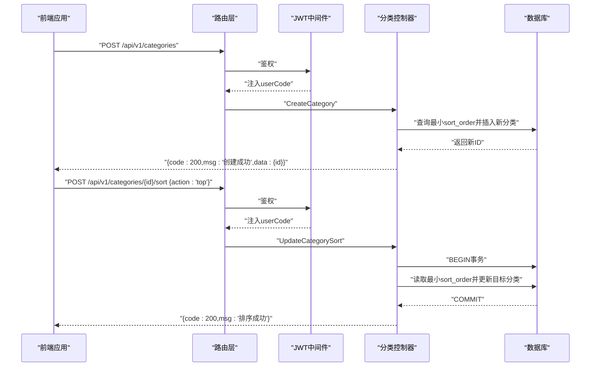
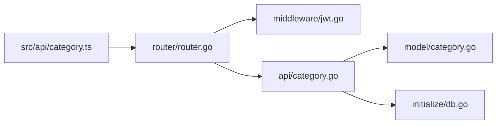

# 分类API

<cite>
**本文引用的文件**
- [api/category.go](file://api/category.go)
- [router/router.go](file://router/router.go)
- [middleware/jwt.go](file://middleware/jwt.go)
- [model/category.go](file://model/category.go)
- [practice_problems_web/src/api/category.ts](file://practice_problems_web/src/api/category.ts)
- [practice_problems_web/src/types/index.ts](file://practice_problems_web/src/types/index.ts)
- [initialize/db.go](file://initialize/db.go)
</cite>

## 目录
1. [简介](#简介)
2. [项目结构](#项目结构)
3. [核心组件](#核心组件)
4. [架构总览](#架构总览)
5. [详细组件分析](#详细组件分析)
6. [依赖分析](#依赖分析)
7. [性能考虑](#性能考虑)
8. [故障排查指南](#故障排查指南)
9. [结论](#结论)
10. [附录](#附录)

## 简介
本文件为“分类管理”相关API的权威文档，覆盖以下接口：
- GET /api/v1/categories（获取分类列表）
- POST /api/v1/categories（创建分类）
- PUT /api/v1/categories/:id（更新分类）
- DELETE /api/v1/categories/:id（删除分类）
- POST /api/v1/categories/:id/sort（更新分类排序）

所有接口均需通过JWT认证，且与前端接口定义保持一致。文档将详细说明每个接口的用途、HTTP方法、URL路径、请求参数（路径参数和查询参数）、请求体结构（如分类名称、所属科目ID、排序值等）以及响应格式；并结合后端实现解释分类与科目的关联关系，提供创建分类并设置排序的完整调用流程示例。

## 项目结构
围绕分类API的关键文件组织如下：
- 路由层：router/router.go 将 /api/v1/categories 及其子路由挂载到鉴权组
- 中间件：middleware/jwt.go 提供JWT鉴权，注入userID、username、userCode
- 控制器：api/category.go 实现分类的增删改查与排序
- 模型：model/category.go 定义知识分类的数据结构与请求参数
- 前端：practice_problems_web/src/api/category.ts 定义与后端一致的调用方法
- 数据库：initialize/db.go 定义 knowledge_categories 表结构及外键约束

图表来源
- [router/router.go](file://router/router.go#L82-L88)
- [middleware/jwt.go](file://middleware/jwt.go#L39-L99)
- [api/category.go](file://api/category.go#L19-L86)
- [model/category.go](file://model/category.go#L1-L26)
- [initialize/db.go](file://initialize/db.go#L270-L281)
- [practice_problems_web/src/api/category.ts](file://practice_problems_web/src/api/category.ts#L1-L40)
- [practice_problems_web/src/types/index.ts](file://practice_problems_web/src/types/index.ts#L17-L39)

章节来源
- [router/router.go](file://router/router.go#L82-L88)
- [middleware/jwt.go](file://middleware/jwt.go#L39-L99)
- [api/category.go](file://api/category.go#L19-L86)
- [model/category.go](file://model/category.go#L1-L26)
- [initialize/db.go](file://initialize/db.go#L270-L281)
- [practice_problems_web/src/api/category.ts](file://practice_problems_web/src/api/category.ts#L1-L40)
- [practice_problems_web/src/types/index.ts](file://practice_problems_web/src/types/index.ts#L17-L39)

## 核心组件
- 路由与鉴权
  - 路由在 v1 分组下挂载分类相关接口，并统一使用 JWTAuthMiddleware 进行鉴权
  - 鉴权中间件从 Authorization 请求头中提取 Bearer Token，校验有效性并注入 userID、username、userCode
- 控制器
  - GetCategoryList：按科目查询分类列表，支持排序与权限校验
  - CreateCategory：创建分类，计算排序并校验科目作者权限
  - UpdateCategory：更新分类名称与难度，校验科目作者权限
  - DeleteCategory：删除分类，校验科目作者权限，处理外键约束场景
  - UpdateCategorySort：对分类进行置顶/上移/下移排序，使用事务保证一致性
- 模型
  - KnowledgeCategory：分类实体，包含科目ID、名称、排序、难度等字段
  - CreateCategoryRequest/UpdateCategoryRequest：创建与更新请求参数
- 前端
  - 提供 getCategories、createCategory、updateCategory、deleteCategory、updateCategorySort 等方法
  - 类型定义与后端字段保持一致

章节来源
- [router/router.go](file://router/router.go#L82-L88)
- [middleware/jwt.go](file://middleware/jwt.go#L39-L99)
- [api/category.go](file://api/category.go#L19-L378)
- [model/category.go](file://model/category.go#L1-L26)
- [practice_problems_web/src/api/category.ts](file://practice_problems_web/src/api/category.ts#L1-L40)
- [practice_problems_web/src/types/index.ts](file://practice_problems_web/src/types/index.ts#L17-L39)

## 架构总览
下面以序列图展示一次典型“获取分类列表”的端到端流程，体现路由、鉴权、控制器与数据库之间的交互。

图表来源
- [router/router.go](file://router/router.go#L82-L88)
- [middleware/jwt.go](file://middleware/jwt.go#L39-L99)
- [api/category.go](file://api/category.go#L19-L86)
- [initialize/db.go](file://initialize/db.go#L270-L281)

## 详细组件分析

### 接口定义与行为说明

- GET /api/v1/categories
  - 用途：按科目获取分类列表
  - 方法：GET
  - 路径：/api/v1/categories
  - 查询参数：
    - subject_id：必需，科目ID
  - 请求头：
    - Authorization：Bearer <token>（JWT）
  - 成功响应：
    - code：200
    - msg：success
    - data：分类数组，元素包含 id、subjectId、categoryName、createTime、updateTime、sortOrder、difficulty
  - 错误响应：
    - 400：缺少 subject_id
    - 401：未授权
    - 403：无权访问该科目或授权已过期
    - 500：查询失败
  - 权限与排序：
    - 会校验用户对该科目的访问权限（作者或有效授权）
    - 结果按 sort_order 升序、id 降序排列
  - 前端对接：
    - 前端方法：getCategories(subjectId)
    - 类型：Category[]
  - 章节来源
    - [api/category.go](file://api/category.go#L19-L86)
    - [router/router.go](file://router/router.go#L82-L88)
    - [middleware/jwt.go](file://middleware/jwt.go#L39-L99)
    - [practice_problems_web/src/api/category.ts](file://practice_problems_web/src/api/category.ts#L8-L11)
    - [practice_problems_web/src/types/index.ts](file://practice_problems_web/src/types/index.ts#L17-L25)

- POST /api/v1/categories
  - 用途：创建分类
  - 方法：POST
  - 路径：/api/v1/categories
  - 请求头：
    - Authorization：Bearer <token>
  - 请求体：
    - subjectId：必需，所属科目ID
    - categoryName：必需，分类名称
  - 成功响应：
    - code：200
    - msg：创建成功
    - data：{ id }（新创建的分类ID）
  - 错误响应：
    - 400：参数错误
    - 401：未授权
    - 403：非科目作者
    - 404：所属科目不存在
    - 500：创建失败
  - 权限与排序：
    - 校验当前用户是否为科目作者
    - 新分类的排序值为当前最小排序值减一，确保排在最前
  - 前端对接：
    - 前端方法：createCategory({ subjectId, categoryName })
    - 类型：CategoryForm
  - 章节来源
    - [api/category.go](file://api/category.go#L89-L147)
    - [router/router.go](file://router/router.go#L82-L88)
    - [middleware/jwt.go](file://middleware/jwt.go#L39-L99)
    - [practice_problems_web/src/api/category.ts](file://practice_problems_web/src/api/category.ts#L14-L16)
    - [practice_problems_web/src/types/index.ts](file://practice_problems_web/src/types/index.ts#L34-L39)

- PUT /api/v1/categories/:id
  - 用途：更新分类
  - 方法：PUT
  - 路径：/api/v1/categories/:id
  - 路径参数：
    - id：必需，分类ID
  - 请求头：
    - Authorization：Bearer <token>
  - 请求体：
    - categoryName：必需，分类名称
    - difficulty：可选，难度等级（0-3）
  - 成功响应：
    - code：200
    - msg：更新成功
  - 错误响应：
    - 400：参数错误或难度值非法
    - 401：未授权
    - 403：非科目作者
    - 404：分类不存在
    - 500：更新失败
  - 权限与行为：
    - 校验当前用户是否为科目作者
    - 若未提供任何可更新字段，则返回“无变更”
  - 前端对接：
    - 前端方法：updateCategory(id, { categoryName, difficulty? })
    - 类型：CategoryForm
  - 章节来源
    - [api/category.go](file://api/category.go#L150-L224)
    - [router/router.go](file://router/router.go#L82-L88)
    - [middleware/jwt.go](file://middleware/jwt.go#L39-L99)
    - [practice_problems_web/src/api/category.ts](file://practice_problems_web/src/api/category.ts#L19-L21)
    - [practice_problems_web/src/types/index.ts](file://practice_problems_web/src/types/index.ts#L34-L39)

- DELETE /api/v1/categories/:id
  - 用途：删除分类
  - 方法：DELETE
  - 路径：/api/v1/categories/:id
  - 路径参数：
    - id：必需，分类ID
  - 请求头：
    - Authorization：Bearer <token>
  - 成功响应：
    - code：200
    - msg：删除成功
  - 错误响应：
    - 401：未授权
    - 403：非科目作者
    - 404：分类不存在
    - 500：删除失败（若存在外键约束，提示“该分类下仍有知识点”）
  - 权限与行为：
    - 校验当前用户是否为科目作者
    - 若存在外键约束（分类下仍有知识点），返回业务错误提示
  - 前端对接：
    - 前端方法：deleteCategory(id)
  - 章节来源
    - [api/category.go](file://api/category.go#L226-L283)
    - [router/router.go](file://router/router.go#L82-L88)
    - [middleware/jwt.go](file://middleware/jwt.go#L39-L99)
    - [practice_problems_web/src/api/category.ts](file://practice_problems_web/src/api/category.ts#L24-L26)

- POST /api/v1/categories/:id/sort
  - 用途：更新分类排序（置顶/上移/下移）
  - 方法：POST
  - 路径：/api/v1/categories/:id/sort
  - 路径参数：
    - id：必需，分类ID
  - 请求头：
    - Authorization：Bearer <token>
  - 请求体：
    - action：必需，取值范围为 top、up、down
  - 成功响应：
    - code：200
    - msg：排序成功
  - 错误响应：
    - 400：参数错误
    - 401：未授权
    - 403：非科目作者
    - 404：分类不存在
    - 500：排序失败
  - 权限与行为：
    - 校验当前用户是否为科目作者
    - 使用事务执行排序，避免并发导致的顺序错乱
    - 当已在首位或末位时，返回相应提示
  - 前端对接：
    - 前端方法：updateCategorySort(id, direction)，其中 direction ∈ { top, up, down }
    - 注意：前端内部将 direction 映射为 action 字段发送
  - 章节来源
    - [api/category.go](file://api/category.go#L285-L378)
    - [router/router.go](file://router/router.go#L82-L88)
    - [middleware/jwt.go](file://middleware/jwt.go#L39-L99)
    - [practice_problems_web/src/api/category.ts](file://practice_problems_web/src/api/category.ts#L29-L40)

### 数据模型与数据库关系
- 数据表：knowledge_categories
  - 字段：id、subject_id、sort_order、categorie_name、create_time、update_time、difficulty
  - 外键：subject_id 引用 subjects(id)，删除策略为 NO ACTION
  - 触发器：更新时自动更新 update_time
- 关系说明：
  - 分类隶属于科目（一对多）
  - 分类之间通过 sort_order 字段维护顺序
  - 分类与知识点（knowledge_points）通过外键关联（后续知识点API中体现）

图表来源
- [initialize/db.go](file://initialize/db.go#L270-L281)

章节来源
- [initialize/db.go](file://initialize/db.go#L270-L281)
- [model/category.go](file://model/category.go#L1-L26)

### 权限与认证机制
- JWT 鉴权
  - 中间件从 Authorization 头解析 Bearer Token
  - 校验 Token 是否存在于内存白名单、签名与有效期
  - 成功后注入 userID、username、userCode 到上下文
- 分类权限
  - 所有分类相关接口均要求当前用户为科目作者或具有有效授权
  - 作者校验通过 subject_id 与 user_code 进行关联查询
- 前端注意事项
  - 所有请求需携带 Authorization: Bearer <token>
  - 建议在拦截器中统一注入该头

章节来源
- [middleware/jwt.go](file://middleware/jwt.go#L39-L99)
- [api/category.go](file://api/category.go#L19-L86)
- [api/category.go](file://api/category.go#L89-L147)
- [api/category.go](file://api/category.go#L150-L224)
- [api/category.go](file://api/category.go#L226-L283)
- [api/category.go](file://api/category.go#L285-L378)

### 创建分类并设置排序的完整调用流程示例
- 步骤说明
  1) 创建分类
     - 调用 POST /api/v1/categories，请求体包含 subjectId 与 categoryName
     - 成功后返回新建分类的 id
  2) 设置排序
     - 调用 POST /api/v1/categories/{id}/sort，请求体包含 action："top"
     - 服务端将该分类的排序值设为当前最小排序值减一，使其排在最前
- 前端调用要点
  - createCategory({ subjectId, categoryName }) -> 返回 { data: { id } }
  - updateCategorySort(id, "top") -> 无 data
- 注意事项
  - 仅科目作者可操作
  - 排序使用事务，避免并发冲突
  - 若分类下仍有知识点，删除将被业务规则阻止

图表来源
- [router/router.go](file://router/router.go#L82-L88)
- [middleware/jwt.go](file://middleware/jwt.go#L39-L99)
- [api/category.go](file://api/category.go#L89-L147)
- [api/category.go](file://api/category.go#L285-L378)
- [initialize/db.go](file://initialize/db.go#L270-L281)

章节来源
- [api/category.go](file://api/category.go#L89-L147)
- [api/category.go](file://api/category.go#L285-L378)
- [practice_problems_web/src/api/category.ts](file://practice_problems_web/src/api/category.ts#L14-L40)

## 依赖分析
- 组件耦合
  - 路由层仅负责挂载与分组，不直接处理业务逻辑
  - 控制器依赖模型与全局数据库连接
  - 前端通过统一的 request 工具与后端交互
- 外部依赖
  - Gin 路由框架
  - JWT 库进行签名校验
  - SQLite/MySQL（由 initialize/db.go 初始化）
- 潜在循环依赖
  - 未发现循环导入；各模块职责清晰

图表来源
- [router/router.go](file://router/router.go#L82-L88)
- [middleware/jwt.go](file://middleware/jwt.go#L39-L99)
- [api/category.go](file://api/category.go#L19-L378)
- [model/category.go](file://model/category.go#L1-L26)
- [initialize/db.go](file://initialize/db.go#L270-L281)
- [practice_problems_web/src/api/category.ts](file://practice_problems_web/src/api/category.ts#L1-L40)

章节来源
- [router/router.go](file://router/router.go#L82-L88)
- [middleware/jwt.go](file://middleware/jwt.go#L39-L99)
- [api/category.go](file://api/category.go#L19-L378)
- [model/category.go](file://model/category.go#L1-L26)
- [initialize/db.go](file://initialize/db.go#L270-L281)
- [practice_problems_web/src/api/category.ts](file://practice_problems_web/src/api/category.ts#L1-L40)

## 性能考虑
- 查询优化
  - 分类列表按 sort_order 升序、id 降序排序，适合前端直接渲染
  - 建议在 sort_order 上建立索引以提升排序性能（可选）
- 并发控制
  - 排序使用事务，避免并发更新导致的顺序错乱
- 日志与可观测性
  - 鉴权与关键业务操作均有日志记录，便于定位问题
- 前端缓存
  - 建议在前端对分类列表做轻量缓存，减少重复请求

## 故障排查指南
- 401 未授权
  - 检查 Authorization 头是否为 Bearer <token>
  - 确认 Token 未过期且未被登出
- 403 无权限
  - 确认当前用户为科目作者或具有有效授权
  - 若授权已过期，重新登录获取新 Token
- 404 分类/科目不存在
  - 确认 subject_id 与 id 是否正确
- 500 排序失败/创建失败/更新失败
  - 查看服务端日志，确认数据库异常或事务提交失败
- 外键约束导致删除失败
  - 该分类下可能存在知识点，请先清理后再删除

章节来源
- [middleware/jwt.go](file://middleware/jwt.go#L39-L99)
- [api/category.go](file://api/category.go#L19-L86)
- [api/category.go](file://api/category.go#L89-L147)
- [api/category.go](file://api/category.go#L150-L224)
- [api/category.go](file://api/category.go#L226-L283)
- [api/category.go](file://api/category.go#L285-L378)

## 结论
本文档系统化梳理了分类管理API的接口规范、权限与认证机制、数据模型与数据库关系，并提供了完整的调用流程示例。建议前后端在字段命名与请求体结构上严格保持一致，以降低集成成本并提升稳定性。

## 附录
- 常见状态码
  - 200：成功
  - 400：参数错误
  - 401：未授权
  - 403：无权限
  - 404：资源不存在
  - 500：服务器错误
- 前端类型参考
  - Category、CategoryForm、ApiResponse

章节来源
- [practice_problems_web/src/types/index.ts](file://practice_problems_web/src/types/index.ts#L17-L39)
- [practice_problems_web/src/api/category.ts](file://practice_problems_web/src/api/category.ts#L1-L40)