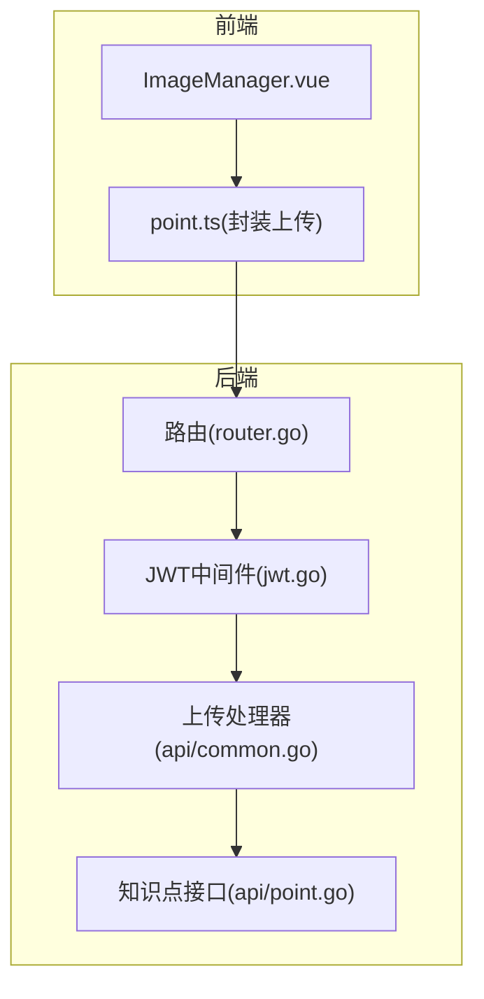
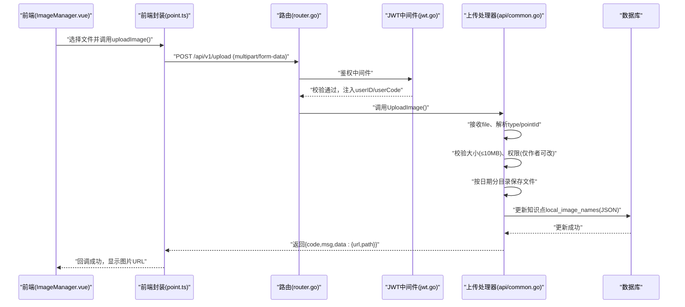
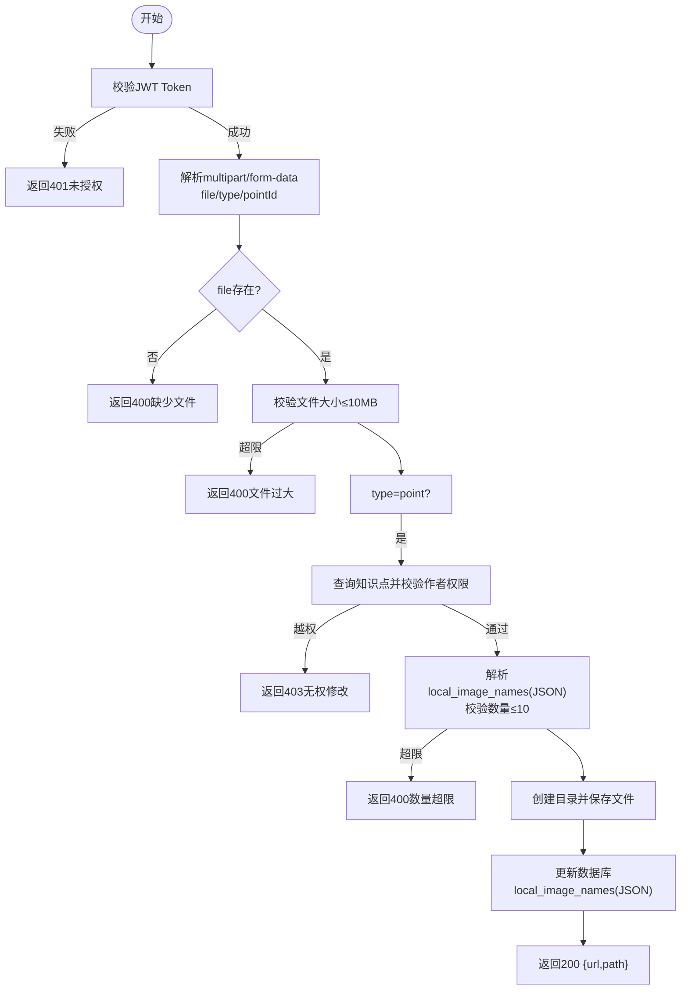
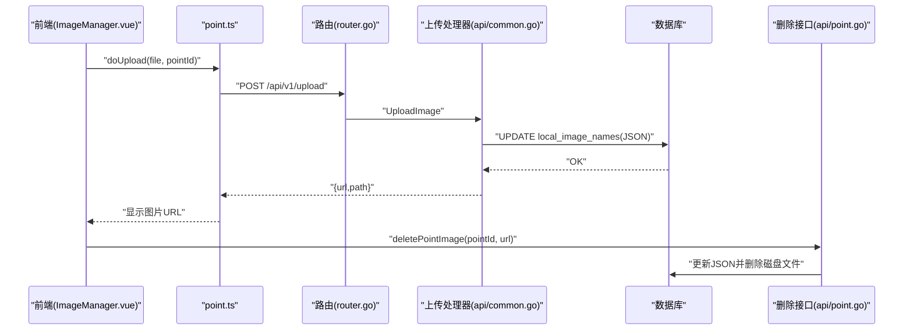
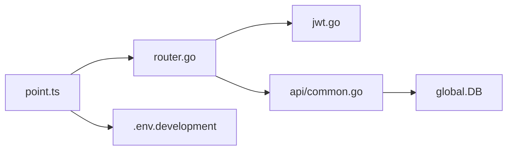

# 文件上传API

<cite>
**本文档引用的文件**
- [api/common.go](file://api/common.go)
- [router/router.go](file://router/router.go)
- [middleware/jwt.go](file://middleware/jwt.go)
- [api/point.go](file://api/point.go)
- [practice_problems_web/src/api/point.ts](file://practice_problems_web/src/api/point.ts)
- [practice_problems_web/src/components/ImageManager.vue](file://practice_problems_web/src/components/ImageManager.vue)
- [router/router.go](file://router/router.go)
- [config.yaml](file://config.yaml)
- [README.md](file://README.md)
- [practice_problems_web/.env.development](file://practice_problems_web/.env.development)
- [practice_problems_web/vite.config.js](file://practice_problems_web/vite.config.js)
</cite>

## 目录
1. [简介](#简介)
2. [项目结构](#项目结构)
3. [核心组件](#核心组件)
4. [架构总览](#架构总览)
5. [详细组件分析](#详细组件分析)
6. [依赖关系分析](#依赖关系分析)
7. [性能考虑](#性能考虑)
8. [故障排查指南](#故障排查指南)
9. [结论](#结论)
10. [附录](#附录)

## 简介
本文件聚焦于图片资源上传API，接口为POST /api/v1/upload，用于上传图片文件。文档覆盖以下要点：
- HTTP方法与认证要求（需要JWT Token）
- 请求格式（multipart/form-data）
- 字段说明（file、type、pointId）
- 支持的文件类型与大小限制
- 成功响应的JSON结构（包含图片访问URL）
- 可能的错误码（文件过大、类型不符、未授权等）
- 上传后的图片URL如何被其他资源（如知识点）引用
- 使用curl与JavaScript FormData的上传示例
- 静态资源路径/static/uploads的访问方式

## 项目结构
后端采用Gin框架，路由在router中注册；上传接口位于api层；JWT鉴权通过中间件完成；前端Vue项目通过封装的request工具发起上传请求。

图表来源
- [router/router.go](file://router/router.go#L30-L60)
- [middleware/jwt.go](file://middleware/jwt.go#L40-L100)
- [api/common.go](file://api/common.go#L26-L174)
- [api/point.go](file://api/point.go#L456-L538)
- [practice_problems_web/src/api/point.ts](file://practice_problems_web/src/api/point.ts#L46-L60)
- [practice_problems_web/src/components/ImageManager.vue](file://practice_problems_web/src/components/ImageManager.vue#L300-L320)

章节来源
- [router/router.go](file://router/router.go#L30-L60)
- [middleware/jwt.go](file://middleware/jwt.go#L40-L100)
- [api/common.go](file://api/common.go#L26-L174)
- [api/point.go](file://api/point.go#L456-L538)
- [practice_problems_web/src/api/point.ts](file://practice_problems_web/src/api/point.ts#L46-L60)
- [practice_problems_web/src/components/ImageManager.vue](file://practice_problems_web/src/components/ImageManager.vue#L300-L320)

## 核心组件
- 上传接口：POST /api/v1/upload
  - 认证：需要Authorization: Bearer <JWT Token>
  - 请求体：multipart/form-data
  - 字段：
    - file：必填，图片文件
    - type：可选，枚举值point、question、common，默认common
    - pointId：当type=point时必填，表示目标知识点ID
  - 限制：
    - 文件大小≤10MB
    - 当type=point时，同一知识点最多10张图片
  - 成功响应：包含data.url与data.path两个字段，均为对外可访问的URL路径
  - 错误码：400（参数/大小/数量错误）、401（未授权）、403（越权）、404（知识点不存在）、500（内部错误）

章节来源
- [router/router.go](file://router/router.go#L52-L54)
- [middleware/jwt.go](file://middleware/jwt.go#L40-L100)
- [api/common.go](file://api/common.go#L26-L174)
- [api/point.go](file://api/point.go#L456-L538)

## 架构总览
下面的序列图展示了从浏览器到后端的完整上传流程，包括JWT鉴权、文件接收、权限校验、存储与数据库更新。

图表来源
- [practice_problems_web/src/components/ImageManager.vue](file://practice_problems_web/src/components/ImageManager.vue#L300-L320)
- [practice_problems_web/src/api/point.ts](file://practice_problems_web/src/api/point.ts#L46-L60)
- [router/router.go](file://router/router.go#L52-L54)
- [middleware/jwt.go](file://middleware/jwt.go#L40-L100)
- [api/common.go](file://api/common.go#L26-L174)
- [api/point.go](file://api/point.go#L456-L538)

## 详细组件分析

### 上传接口：POST /api/v1/upload
- 认证要求
  - 必须携带Authorization头，格式为Bearer <JWT Token>
  - 中间件会校验Token有效性与白名单状态
- 请求格式
  - Content-Type: multipart/form-data
  - 字段：
    - file：必填，图片文件
    - type：可选，point/question/common，默认common
    - pointId：当type=point时必填
- 业务逻辑
  - 校验用户身份（从Token解析userCode）
  - 校验文件大小（≤10MB）
  - 当type=point时：
    - 校验pointId存在且当前用户为作者
    - 读取当前local_image_names(JSON)，限制最多10张
  - 保存文件：
    - 目录：./uploads/{type}/{YYYYMMDD}
    - 文件名：UUID.ext
    - 目录权限：0755，文件权限：0644
  - 返回data.url与data.path，均为对外可访问的URL路径
- 错误处理
  - 400：缺少文件、文件过大、pointId缺失、JSON解析失败、数量超限
  - 401：未携带Token、Token格式错误、Token失效
  - 403：非作者越权
  - 404：知识点不存在
  - 500：创建目录失败、保存失败、数据库更新失败

图表来源
- [api/common.go](file://api/common.go#L26-L174)
- [middleware/jwt.go](file://middleware/jwt.go#L40-L100)

章节来源
- [router/router.go](file://router/router.go#L52-L54)
- [middleware/jwt.go](file://middleware/jwt.go#L40-L100)
- [api/common.go](file://api/common.go#L26-L174)

### 知识点图片引用流程
- 上传成功后，后端将新图片信息追加到知识点的local_image_names(JSON)字段
- 前端在编辑器中展示图片时，会将图片URL拼接到基础地址（由环境变量提供）
- 删除图片时，前端调用删除接口，后端更新JSON并删除磁盘文件

图表来源
- [practice_problems_web/src/components/ImageManager.vue](file://practice_problems_web/src/components/ImageManager.vue#L257-L328)
- [practice_problems_web/src/api/point.ts](file://practice_problems_web/src/api/point.ts#L32-L45)
- [router/router.go](file://router/router.go#L52-L54)
- [api/common.go](file://api/common.go#L147-L174)
- [api/point.go](file://api/point.go#L456-L538)

章节来源
- [api/common.go](file://api/common.go#L147-L174)
- [api/point.go](file://api/point.go#L456-L538)
- [practice_problems_web/src/components/ImageManager.vue](file://practice_problems_web/src/components/ImageManager.vue#L257-L328)
- [practice_problems_web/src/api/point.ts](file://practice_problems_web/src/api/point.ts#L32-L45)

## 依赖关系分析
- 路由层将POST /api/v1/upload挂载到JWT中间件，再转发到UploadImage处理器
- 上传处理器依赖全局DB连接与日志组件
- 前端通过封装的request工具统一发起请求，自动携带Authorization头

图表来源
- [router/router.go](file://router/router.go#L30-L60)
- [middleware/jwt.go](file://middleware/jwt.go#L40-L100)
- [api/common.go](file://api/common.go#L26-L174)
- [practice_problems_web/src/api/point.ts](file://practice_problems_web/src/api/point.ts#L46-L60)
- [practice_problems_web/.env.development](file://practice_problems_web/.env.development#L1-L5)

章节来源
- [router/router.go](file://router/router.go#L30-L60)
- [middleware/jwt.go](file://middleware/jwt.go#L40-L100)
- [api/common.go](file://api/common.go#L26-L174)
- [practice_problems_web/src/api/point.ts](file://practice_problems_web/src/api/point.ts#L46-L60)
- [practice_problems_web/.env.development](file://practice_problems_web/.env.development#L1-L5)

## 性能考虑
- 文件大小限制（10MB）有助于控制带宽与存储压力
- 目录按日期分层，便于清理与管理
- 上传完成后立即更新JSON字段，避免后续查询时的额外开销
- 建议在生产环境配合CDN缓存静态资源

## 故障排查指南
- 401 未授权
  - 检查Authorization头是否为Bearer <JWT Token>
  - 确认Token未过期且未被加入黑名单
- 403 越权
  - 确认当前用户为目标知识点作者
- 400 参数/大小/数量错误
  - 确认file字段存在
  - 确认文件大小不超过10MB
  - 确认type=point时pointId有效
  - 确认同一知识点图片数量不超过10张
- 500 内部错误
  - 检查uploads目录权限与磁盘空间
  - 查看后端日志定位具体错误

章节来源
- [middleware/jwt.go](file://middleware/jwt.go#L40-L100)
- [api/common.go](file://api/common.go#L26-L174)

## 结论
POST /api/v1/upload提供了安全、可控的图片上传能力，具备严格的鉴权、大小与数量限制，并与知识点资源形成闭环引用。前端通过封装的上传方法与删除方法，实现了完整的图片管理体验。

## 附录

### 接口定义
- 方法：POST
- 路径：/api/v1/upload
- 认证：Bearer <JWT Token>
- 请求体：multipart/form-data
- 字段：
  - file：必填，图片文件
  - type：可选，point/question/common，默认common
  - pointId：当type=point时必填
- 成功响应：包含data.url与data.path
- 错误码：400、401、403、404、500

章节来源
- [router/router.go](file://router/router.go#L52-L54)
- [middleware/jwt.go](file://middleware/jwt.go#L40-L100)
- [api/common.go](file://api/common.go#L26-L174)

### 使用示例

- curl示例
  - 基本上传（type=point，pointId=123）
  - 需要在请求头中设置Authorization: Bearer <你的JWT Token>
  - 示例命令（请替换实际文件路径与pointId）：
    - curl -X POST http://localhost:19527/api/v1/upload -H "Authorization: Bearer <JWT>" -F "file=@/path/to/image.jpg" -F "type=point" -F "pointId=123"

- JavaScript FormData示例
  - 前端封装见：[practice_problems_web/src/api/point.ts](file://practice_problems_web/src/api/point.ts#L46-L60)
  - 前端组件触发上传见：[practice_problems_web/src/components/ImageManager.vue](file://practice_problems_web/src/components/ImageManager.vue#L300-L320)

章节来源
- [practice_problems_web/src/api/point.ts](file://practice_problems_web/src/api/point.ts#L46-L60)
- [practice_problems_web/src/components/ImageManager.vue](file://practice_problems_web/src/components/ImageManager.vue#L300-L320)

### 静态资源访问
- 后端静态资源映射
  - 路由中将/uploads映射到本地目录
  - Nginx部署时需将/uploads映射到实际存储目录
- 前端基础地址
  - 通过环境变量VITE_IMG_BASE_URL拼接图片URL
  - 开发环境默认指向本地后端端口

章节来源
- [router/router.go](file://router/router.go#L30-L32)
- [README.md](file://README.md#L120-L150)
- [practice_problems_web/.env.development](file://practice_problems_web/.env.development#L1-L5)
- [practice_problems_web/vite.config.js](file://practice_problems_web/vite.config.js#L1-L39)