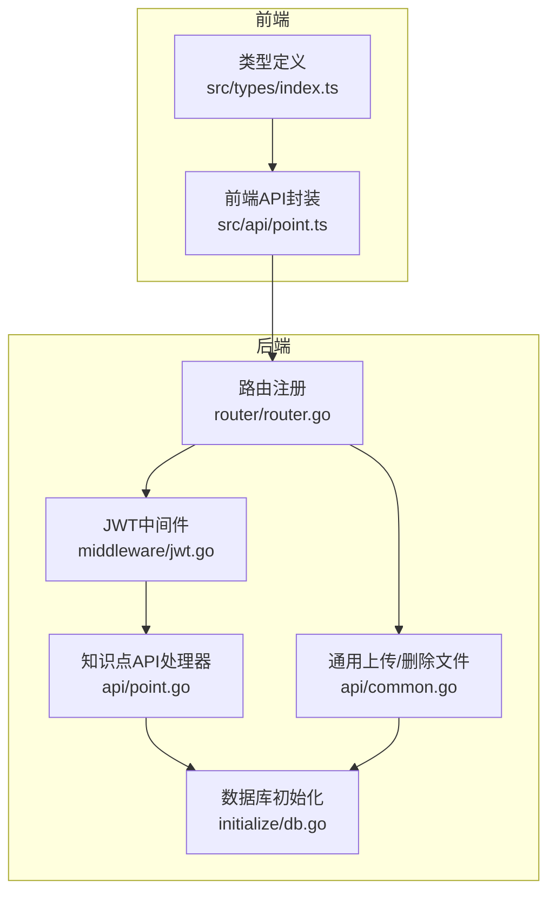
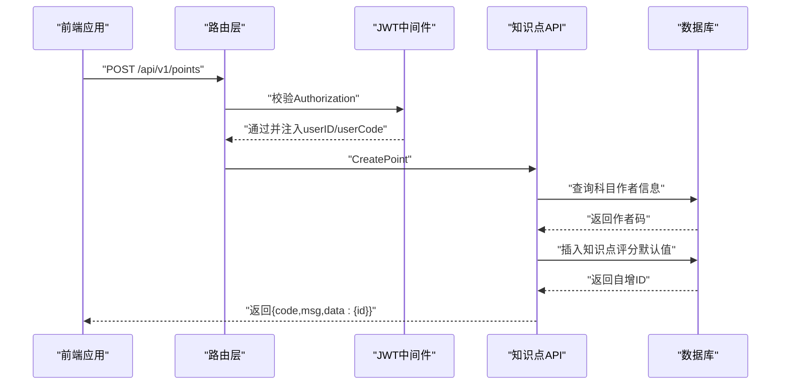
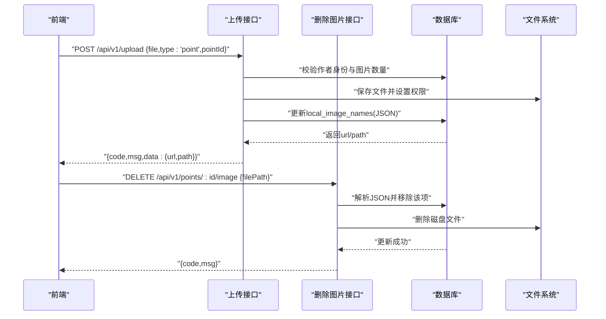
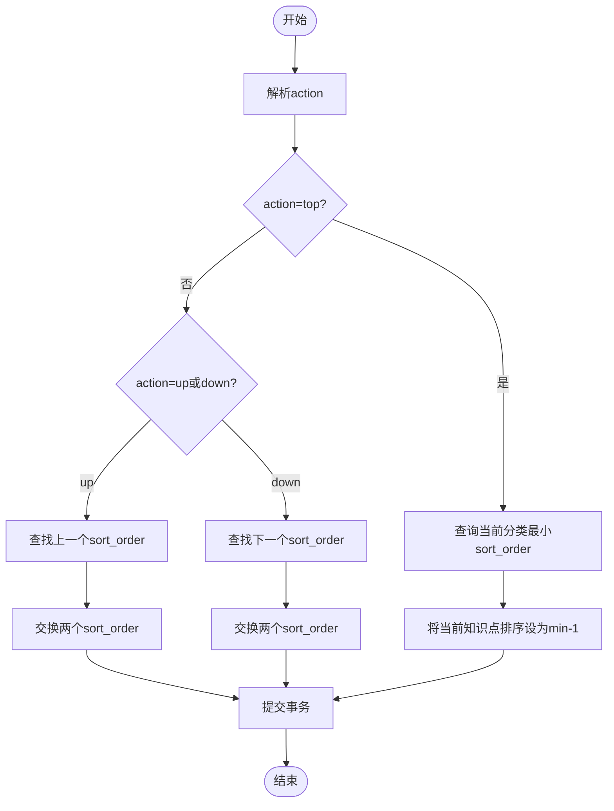
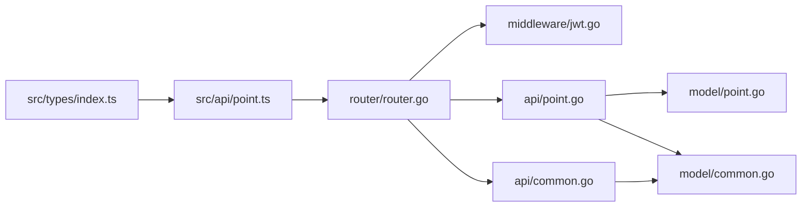
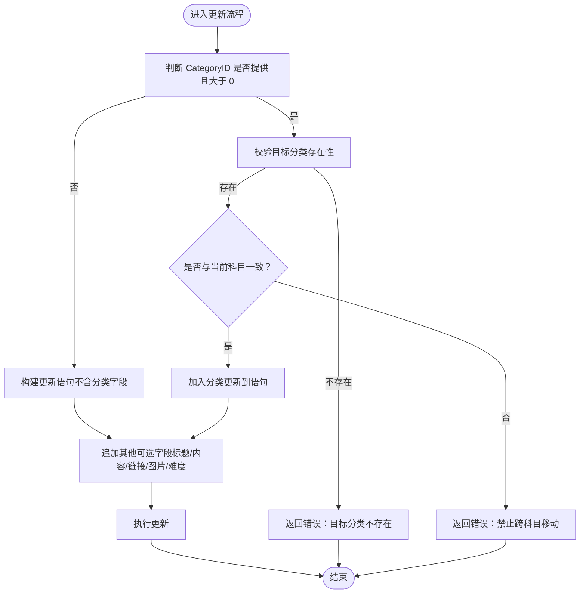

# 知识点API

<cite>
**本文档引用的文件**
- [api/point.go](file://api/point.go)
- [model/point.go](file://model/point.go)
- [practice_problems_web/src/api/point.ts](file://practice_problems_web/src/api/point.ts)
- [practice_problems_web/src/types/index.ts](file://practice_problems_web/src/types/index.ts)
</cite>

## 更新摘要
**变更内容**
- 在更新知识点接口（PUT /api/v1/points/:id）中新增了对目标分类的科目一致性校验逻辑，防止跨科目移动知识点导致的数据不一致问题。
- 更新了 `UpdatePointRequest` 数据结构说明，明确 `categoryId` 字段为可选更新的指针类型。
- 前端 `UpdatePointParams` 类型定义同步更新以支持分类ID更新。
- 详细组件分析中的“接口清单与规范”和“数据模型与类型定义”部分已相应修订。
- 新增了关于知识点移动功能的流程图及说明。

## 目录
1. [简介](#简介)
2. [项目结构](#项目结构)
3. [核心组件](#核心组件)
4. [架构总览](#架构总览)
5. [详细组件分析](#详细组件分析)
6. [依赖关系分析](#依赖关系分析)
7. [性能考量](#性能考量)
8. [故障排查指南](#故障排查指南)
9. [结论](#结论)
10. [附录](#附录)

## 简介
本文件面向后端与前端开发者，系统化梳理“知识点”相关API，覆盖列表、详情、创建、更新、删除、删除图片、排序等完整生命周期。重点说明：
- 所有接口均受JWT保护
- 图片上传需先通过上传接口完成，返回可直接使用的URL
- 知识点内容支持富文本与图片引用，图片以JSON数组形式存储
- 排序更新基于数据库事务，保证一致性
- **新增：更新知识点时若涉及分类移动，会强制校验目标分类是否属于同一科目，禁止跨科目移动**

## 项目结构
后端采用Gin框架，路由按模块分组；前端通过封装的HTTP客户端调用后端接口。

图表来源
- [router/router.go](file://router/router.go#L33-L106)
- [middleware/jwt.go](file://middleware/jwt.go#L39-L99)
- [api/point.go](file://api/point.go#L1-L120)
- [api/common.go](file://api/common.go#L25-L174)
- [initialize/db.go](file://initialize/db.go#L287-L307)
- [practice_problems_web/src/api/point.ts](file://practice_problems_web/src/api/point.ts#L1-L60)
- [practice_problems_web/src/types/index.ts](file://practice_problems_web/src/types/index.ts#L41-L84)

章节来源
- [router/router.go](file://router/router.go#L33-L106)
- [middleware/jwt.go](file://middleware/jwt.go#L39-L99)
- [initialize/db.go](file://initialize/db.go#L287-L307)

## 核心组件
- 路由与鉴权：所有知识点接口挂载在JWT鉴权组下，统一由中间件校验Token并注入用户上下文
- 知识点API：提供列表、详情、创建、更新、删除、删除图片、排序等接口
- 通用上传：支持按知识点ID上传图片，带权限校验与数量限制
- 数据模型：后端模型与前端类型定义一一对应，便于前后端协作

章节来源
- [router/router.go](file://router/router.go#L45-L106)
- [middleware/jwt.go](file://middleware/jwt.go#L39-L99)
- [api/point.go](file://api/point.go#L1-L120)
- [api/common.go](file://api/common.go#L25-L174)
- [model/point.go](file://model/point.go#L1-L35)
- [model/common.go](file://model/common.go#L1-L14)
- [practice_problems_web/src/types/index.ts](file://practice_problems_web/src/types/index.ts#L41-L84)

## 架构总览
后端请求处理流程概览（以创建知识点为例）：

图表来源
- [router/router.go](file://router/router.go#L90-L96)
- [middleware/jwt.go](file://middleware/jwt.go#L39-L99)
- [api/point.go](file://api/point.go#L135-L193)
- [initialize/db.go](file://initialize/db.go#L287-L307)

## 详细组件分析

### 接口清单与规范

- GET /api/v1/points
  - 功能：获取指定分类下的知识点列表
  - 请求参数
    - query.category_id: 必填，分类ID
  - 鉴权：需要JWT
  - 权限：仅限该分类所属科目的授权用户
  - 响应：data为列表，元素包含id、title、createTime、sortOrder、difficulty
  - 排序规则：按sortOrder升序，id降序

- GET /api/v1/points/:id
  - 功能：获取知识点详情
  - 鉴权：需要JWT
  - 权限：仅限该知识点所在分类所属科目的授权用户
  - 响应：data为对象，包含id、categoryId、title、content、referenceLinks、localImageNames、updateTime

- POST /api/v1/points
  - 功能：创建知识点
  - 鉴权：需要JWT
  - 权限：仅限该分类所属科目的作者
  - 请求体：categoryId、title（必填）
  - 响应：data包含新建知识点的id
  - 默认行为：创建时难度为0，排序使用当前最小值-1

- PUT /api/v1/points/:id
  - 功能：更新知识点
  - 鉴权：需要JWT
  - 权限：仅限该知识点所属科目的作者
  - 请求体：可选字段包括title、content、referenceLinks、localImageNames、difficulty、categoryId
  - 特殊逻辑：
    - 当更新categoryId时，会进行同科目校验；难度范围限制为0~3
    - **新增：若提供新的categoryId，系统会检查其所属科目是否与当前知识点一致，不一致则返回“不能跨科目移动知识点”错误**
  - 响应：成功返回“更新成功”

- DELETE /api/v1/points/:id
  - 功能：删除知识点
  - 鉴权：需要JWT
  - 权限：仅限该知识点所属科目的作者
  - 约束：若该知识点下存在题目则禁止删除
  - 响应：成功返回“删除成功”

- DELETE /api/v1/points/:id/image
  - 功能：删除知识点关联的某张图片
  - 鉴权：需要JWT
  - 权限：仅限该知识点所属科目的作者
  - 请求体：filePath（必填，需与数据库中存储的URL完全一致）
  - 响应：成功返回“图片删除成功”
  - 行为：从JSON数组中移除该项并持久化，同时从磁盘删除对应文件

- PUT /api/v1/points/:id/sort
  - 功能：更新知识点排序
  - 鉴权：需要JWT
  - 权限：仅限该知识点所属科目的作者
  - 请求体：action（枚举："top"|"up"|"down"）
  - 行为：开启事务，按动作交换sort_order值
  - 响应：成功返回“排序成功”

章节来源
- [router/router.go](file://router/router.go#L90-L96)
- [api/point.go](file://api/point.go#L19-L79)
- [api/point.go](file://api/point.go#L81-L129)
- [api/point.go](file://api/point.go#L132-L193)
- [api/point.go](file://api/point.go#L195-L313)
- [api/point.go](file://api/point.go#L315-L365)
- [api/point.go](file://api/point.go#L456-L538)

### 数据模型与类型定义

- 后端模型
  - 知识点详情：id、categoryId、title、content、referenceLinks、localImageNames、createTime、updateTime、sortOrder、difficulty
  - 创建请求：categoryId、title
  - 更新请求：title、content、referenceLinks、localImageNames、difficulty（可选）、categoryId（可选）

- 前端类型
  - 列表项：id、title、createTime、sortOrder、difficulty
  - 详情项：id、categoryId、title、content、referenceLinks、localImageNames、updateTime
  - 创建参数：categoryId、title
  - 更新参数：title、content、referenceLinks、localImageNames、difficulty、categoryId

- 图片项结构
  - name、url（字符串）

章节来源
- [model/point.go](file://model/point.go#L1-L35)
- [model/common.go](file://model/common.go#L1-L14)
- [practice_problems_web/src/types/index.ts](file://practice_problems_web/src/types/index.ts#L41-L84)

### 图片上传与引用流程

- 上传接口
  - POST /api/v1/upload
  - 参数：file（必填）、type（point/question/common，默认common）、pointId（当type=point时必填）
  - 校验：仅允许上传者上传；同一知识点最多10张；文件大小≤10MB
  - 存储：按日期分目录，返回webPath与fullURL
  - 更新：将新图片以{name:"新图片",url:webPath}追加到knowledge_points.local_image_names的JSON数组中

- 删除图片
  - DELETE /api/v1/points/:id/image
  - 参数：filePath（必填，需与数据库中存储的URL完全一致）
  - 行为：从JSON数组中移除该项并持久化，同时从磁盘删除对应文件

- 前端集成
  - 上传：前端调用uploadImage，传入file、pointId，得到url/path后，将其加入localImageNames并调用updatePoint持久化
  - 删除：前端调用deletePointImage，传入id与filePath，成功后再刷新本地列表并调用updatePoint

图表来源
- [api/common.go](file://api/common.go#L25-L174)
- [api/point.go](file://api/point.go#L456-L538)
- [router/router.go](file://router/router.go#L52-L54)

章节来源
- [api/common.go](file://api/common.go#L25-L174)
- [api/point.go](file://api/point.go#L456-L538)
- [router/router.go](file://router/router.go#L52-L54)

### 排序更新机制

- 接口：PUT /api/v1/points/:id/sort
- 请求体：action（"top"|"up"|"down"）
- 事务性：开启事务，查询相邻节点，交换sort_order值后提交
- 影响：前端列表按sortOrder升序、id降序展示，排序变更直接影响展示顺序

图表来源
- [api/point.go](file://api/point.go#L371-L454)

章节来源
- [api/point.go](file://api/point.go#L371-L454)

### 前端API封装与类型

- 前端封装
  - getPoints、getPointDetail、createPoint、updatePoint、deletePoint、deletePointImage、updatePointSort、uploadImage
  - uploadImage使用multipart/form-data，携带Authorization

- 类型定义
  - ApiResponse、PointSummary、PointDetail、CreatePointParams、UpdatePointParams
  - 与后端模型字段保持一致，便于TS强类型约束

章节来源
- [practice_problems_web/src/api/point.ts](file://practice_problems_web/src/api/point.ts#L1-L60)
- [practice_problems_web/src/types/index.ts](file://practice_problems_web/src/types/index.ts#L41-L84)

## 依赖关系分析

图表来源
- [router/router.go](file://router/router.go#L33-L106)
- [middleware/jwt.go](file://middleware/jwt.go#L39-L99)
- [api/point.go](file://api/point.go#L1-L120)
- [api/common.go](file://api/common.go#L25-L174)
- [model/point.go](file://model/point.go#L1-L35)
- [model/common.go](file://model/common.go#L1-L14)
- [practice_problems_web/src/api/point.ts](file://practice_problems_web/src/api/point.ts#L1-L60)
- [practice_problems_web/src/types/index.ts](file://practice_problems_web/src/types/index.ts#L41-L84)

章节来源
- [router/router.go](file://router/router.go#L33-L106)
- [middleware/jwt.go](file://middleware/jwt.go#L39-L99)
- [api/point.go](file://api/point.go#L1-L120)
- [api/common.go](file://api/common.go#L25-L174)
- [model/point.go](file://model/point.go#L1-L35)
- [model/common.go](file://model/common.go#L1-L14)
- [practice_problems_web/src/api/point.ts](file://practice_problems_web/src/api/point.ts#L1-L60)
- [practice_problems_web/src/types/index.ts](file://practice_problems_web/src/types/index.ts#L41-L84)

## 性能考量
- 列表查询：按sort_order与id排序，索引建议在sort_order上建立索引以提升排序效率
- 更新操作：更新字段动态拼接SQL，避免不必要的字段更新
- 事务排序：排序操作在事务内完成，减少并发冲突
- 上传限制：单知识点最多10张图片，避免JSON过大影响序列化/反序列化性能
- 静态资源：静态文件映射至/uploads目录，建议配合CDN与缓存策略

## 故障排查指南
- 401 未授权
  - 检查Authorization头是否为Bearer Token，且Token有效
  - 确认Token未过期、未被登出
- 403 无权操作
  - 知识点所属科目作者与当前用户不一致
  - 删除/更新/排序/删除图片时，需为该知识点所属科目的作者
- 400 参数错误
  - 创建/更新/排序接口参数格式不正确
  - 删除图片时filePath与数据库存储不一致
  - **新增：尝试跨科目移动知识点时，会返回“不能跨科目移动知识点”**
- 404 知识点不存在/未找到图片
  - 指定ID的知识点不存在
  - 删除图片时未找到匹配的filePath
- 500 服务器错误
  - 数据库查询/更新异常
  - 上传/删除文件失败

章节来源
- [middleware/jwt.go](file://middleware/jwt.go#L39-L99)
- [api/point.go](file://api/point.go#L19-L79)
- [api/point.go](file://api/point.go#L132-L193)
- [api/point.go](file://api/point.go#L195-L313)
- [api/point.go](file://api/point.go#L315-L365)
- [api/point.go](file://api/point.go#L456-L538)
- [api/common.go](file://api/common.go#L25-L174)

## 结论
本套知识点API围绕“分类-知识点-题目”的层级设计，提供完整的CRUD与排序能力，并通过JWT保障安全。图片上传采用先上传再引用的方式，既保证了权限控制，也便于前端灵活管理富文本内容。排序采用事务化更新，确保前端展示顺序与后端一致。**新增的科目一致性校验有效防止了因跨科目移动知识点而导致的数据不一致问题，增强了系统的健壮性。**

## 附录

### 数据库表结构要点
- knowledge_points
  - 主键id、外键categorie_id、title、content、reference_links、local_image_names、create_time、update_time、sort_order、difficulty
  - 触发器自动维护update_time

章节来源
- [initialize/db.go](file://initialize/db.go#L287-L307)

### 知识点移动功能增强说明
当通过 `PUT /api/v1/points/:id` 接口更新知识点的 `categoryId` 时，系统会执行以下安全校验：

1.  **目标分类存在性校验**：检查提供的 `categoryId` 是否在 `knowledge_categories` 表中存在。
2.  **科目一致性校验**：查询当前知识点所属的科目ID（`currentSubjectId`）和目标分类所属的科目ID（`targetSubjectId`），如果两者不一致，则拒绝移动操作，并返回错误信息“不能跨科目移动知识点”。

此逻辑在 `api/point.go` 的 `UpdatePoint` 函数中实现，确保了知识点只能在同一个科目内的不同分类之间移动，维护了数据的完整性和业务逻辑的正确性。

图表来源
- [api/point.go](file://api/point.go#L238-L313)

章节来源
- [model/point.go](file://model/point.go#L24-L35)
- [api/point.go](file://api/point.go#L238-L313)