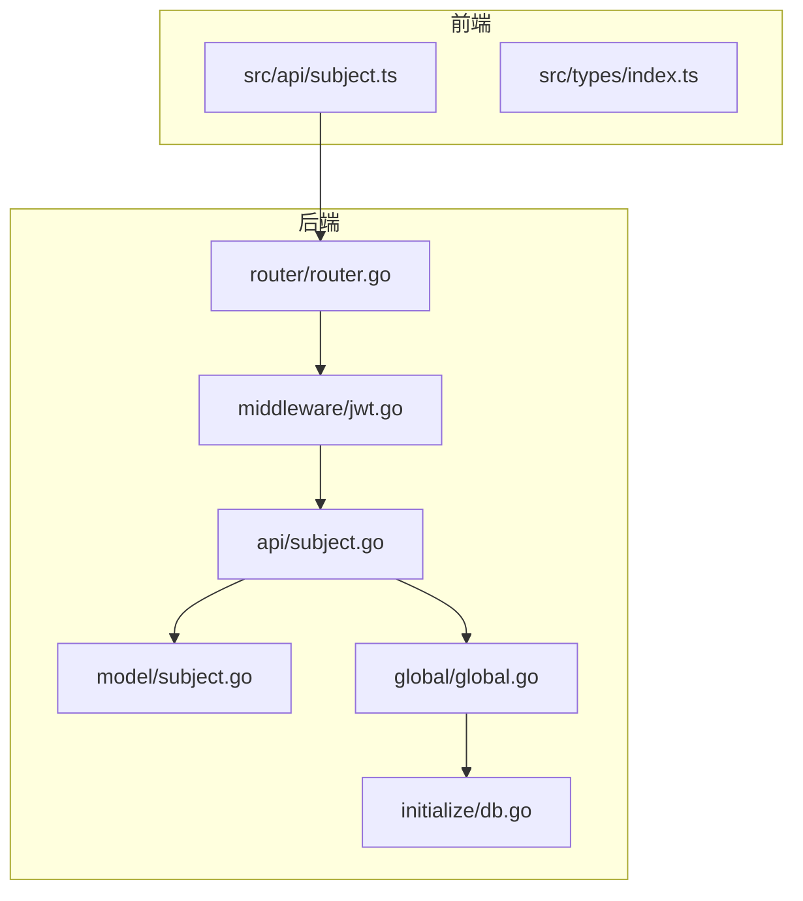
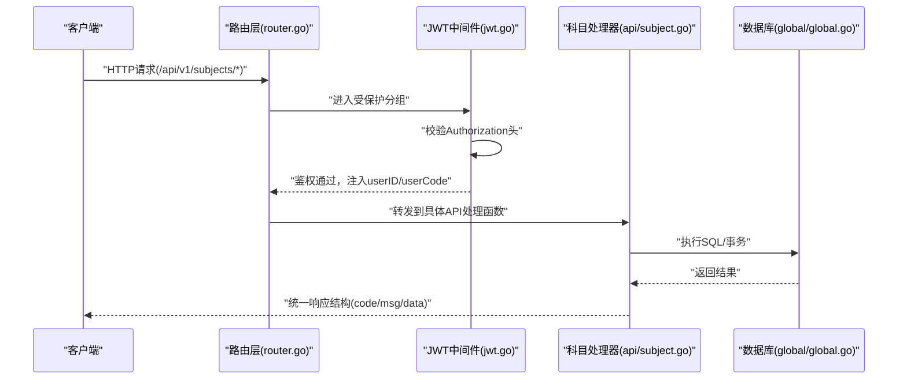
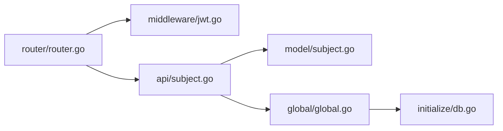
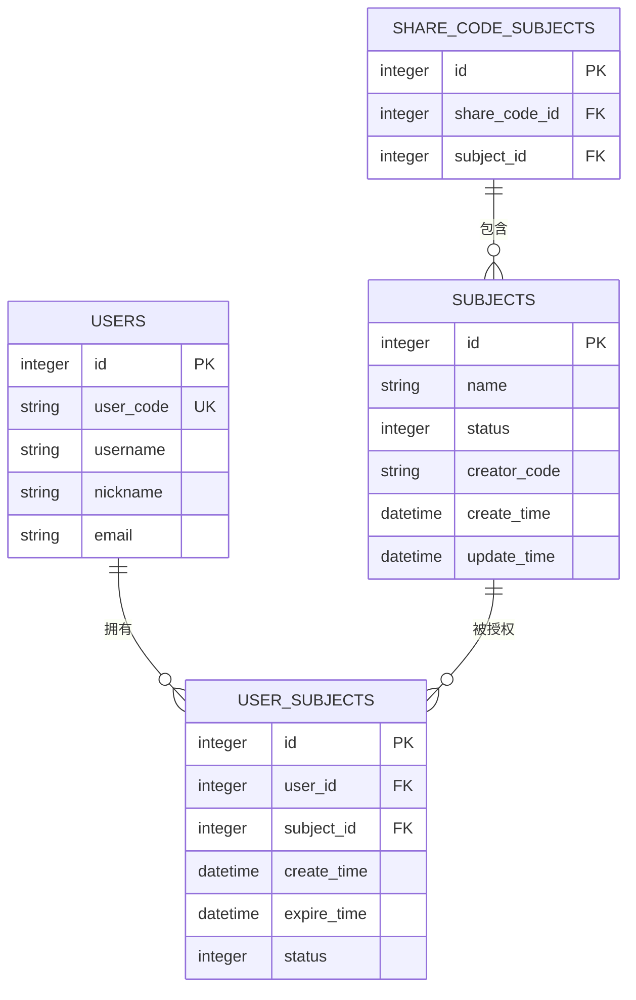

# 科目API

<cite>
**本文引用的文件**
- [api/subject.go](file://api/subject.go)
- [router/router.go](file://router/router.go)
- [middleware/jwt.go](file://middleware/jwt.go)
- [model/subject.go](file://model/subject.go)
- [practice_problems_web/src/api/subject.ts](file://practice_problems_web/src/api/subject.ts)
- [practice_problems_web/src/types/index.ts](file://practice_problems_web/src/types/index.ts)
- [initialize/db.go](file://initialize/db.go)
- [global/global.go](file://global/global.go)
</cite>

## 目录
1. [简介](#简介)
2. [项目结构](#项目结构)
3. [核心组件](#核心组件)
4. [架构总览](#架构总览)
5. [详细组件分析](#详细组件分析)
6. [依赖关系分析](#依赖关系分析)
7. [性能考量](#性能考量)
8. [故障排查指南](#故障排查指南)
9. [结论](#结论)
10. [附录](#附录)

## 简介
本文件面向“科目管理”相关API的使用者与维护者，覆盖以下接口：
- 科目基础能力：获取科目列表、获取科目详情、创建科目、更新科目、删除科目
- 权限管理能力：获取科目授权用户列表、更新单个用户权限、移除用户权限、批量更新权限、批量移除权限

所有接口均需通过JWT认证。本文基于后端Go实现与前端TypeScript类型定义，给出接口规范、请求/响应结构、调用流程与最佳实践，并提供JSON Schema示例与常见调用场景说明（如创建科目后批量授权给多个用户）。

## 项目结构
- 后端路由注册集中在路由层，JWT鉴权中间件统一挂载于受保护分组
- 科目相关API集中在API层，使用全局数据库连接与日志
- 前端通过独立模块封装各API调用，类型定义与后端保持一致



图表来源
- [router/router.go](file://router/router.go#L33-L81)
- [middleware/jwt.go](file://middleware/jwt.go#L39-L99)
- [api/subject.go](file://api/subject.go#L1-L508)
- [model/subject.go](file://model/subject.go#L1-L24)
- [global/global.go](file://global/global.go#L1-L32)
- [initialize/db.go](file://initialize/db.go#L154-L200)

章节来源
- [router/router.go](file://router/router.go#L33-L81)
- [middleware/jwt.go](file://middleware/jwt.go#L39-L99)
- [api/subject.go](file://api/subject.go#L1-L508)
- [model/subject.go](file://model/subject.go#L1-L24)
- [global/global.go](file://global/global.go#L1-L32)
- [initialize/db.go](file://initialize/db.go#L154-L200)

## 核心组件
- 路由与鉴权
  - 受保护接口统一挂载JWT中间件，要求请求头携带合法Bearer Token
  - 路由组“/api/v1”下注册科目与权限相关接口
- API层
  - 提供科目CRUD与权限管理接口，内部进行参数校验、事务处理、鉴权判断与日志记录
- 模型层
  - 定义科目实体与创建/更新请求体结构，便于前后端契约一致
- 前端API封装
  - 以函数形式封装REST调用，返回统一响应结构

章节来源
- [router/router.go](file://router/router.go#L33-L81)
- [middleware/jwt.go](file://middleware/jwt.go#L39-L99)
- [api/subject.go](file://api/subject.go#L1-L508)
- [model/subject.go](file://model/subject.go#L1-L24)
- [practice_problems_web/src/api/subject.ts](file://practice_problems_web/src/api/subject.ts#L1-L27)
- [practice_problems_web/src/types/index.ts](file://practice_problems_web/src/types/index.ts#L1-L84)

## 架构总览
下面的序列图展示了JWT认证与科目接口的典型调用链路。



图表来源
- [router/router.go](file://router/router.go#L33-L81)
- [middleware/jwt.go](file://middleware/jwt.go#L39-L99)
- [api/subject.go](file://api/subject.go#L1-L508)
- [global/global.go](file://global/global.go#L1-L32)

## 详细组件分析

### 接口一览与鉴权说明
- 鉴权方式：所有受保护接口均需在请求头携带“Authorization: Bearer <token>”
- 鉴权中间件会校验Token有效性、是否在白名单、并把用户标识注入上下文
- 以下接口均属于“/api/v1”受保护分组

章节来源
- [router/router.go](file://router/router.go#L33-L81)
- [middleware/jwt.go](file://middleware/jwt.go#L39-L99)

### 科目列表：GET /api/v1/subjects
- 功能：获取当前用户可访问的科目列表（按创建时间倒序）
- 请求参数：无
- 响应数据：数组，每项包含科目基本信息与作者信息
- 鉴权：必需
- 错误码：401未授权、500服务器错误

JSON Schema示例（响应data为数组）
```json
{
  "type": "array",
  "items": {
    "type": "object",
    "properties": {
      "id": { "type": "integer" },
      "name": { "type": "string" },
      "status": { "type": "integer" },
      "creatorCode": { "type": "string" },
      "createTime": { "type": "string" },
      "updateTime": { "type": "string" },
      "creatorEmail": { "type": "string" },
      "creatorName": { "type": "string" }
    },
    "required": ["id", "name", "status", "creatorCode", "createTime", "updateTime"]
  }
}
```

章节来源
- [api/subject.go](file://api/subject.go#L19-L79)
- [router/router.go](file://router/router.go#L71-L71)

### 科目详情：GET /api/v1/subjects/:id
- 功能：获取指定科目详情（仅当用户对该科目有授权且未过期时可见）
- 路径参数：id（整数）
- 响应数据：对象，包含科目基本信息与作者信息
- 鉴权：必需
- 错误码：403无权限/找不到、500服务器错误

JSON Schema示例（响应data为对象）
```json
{
  "type": "object",
  "properties": {
    "id": { "type": "integer" },
    "name": { "type": "string" },
    "status": { "type": "integer" },
    "creatorCode": { "type": "string" },
    "createTime": { "type": "string" },
    "updateTime": { "type": "string" },
    "creatorEmail": { "type": "string" },
    "creatorName": { "type": "string" }
  },
  "required": ["id", "name", "status", "creatorCode", "createTime", "updateTime"]
}
```

章节来源
- [api/subject.go](file://api/subject.go#L84-L132)
- [router/router.go](file://router/router.go#L72-L72)

### 创建科目：POST /api/v1/subjects
- 功能：创建新科目，并自动将创建者绑定为该科目的授权用户
- 请求体：CreateSubjectRequest
- 响应数据：包含新建科目id
- 鉴权：必需
- 错误码：400参数错误、500服务器错误
- 事务：插入科目与绑定关系在事务内完成，失败回滚

JSON Schema示例（请求体）
```json
{
  "type": "object",
  "properties": {
    "name": { "type": "string" },
    "status": { "type": "integer" }
  },
  "required": ["name"]
}
```

JSON Schema示例（响应data）
```json
{
  "type": "object",
  "properties": {
    "id": { "type": "integer" }
  },
  "required": ["id"]
}
```

章节来源
- [api/subject.go](file://api/subject.go#L137-L185)
- [model/subject.go](file://model/subject.go#L13-L24)
- [router/router.go](file://router/router.go#L73-L73)

### 更新科目：PUT /api/v1/subjects/:id
- 功能：仅科目创建者可更新；非创建者会被拒绝
- 路径参数：id（整数）
- 请求体：UpdateSubjectRequest
- 响应数据：无额外data
- 鉴权：必需
- 错误码：400参数错误、403无权限、404不存在、500服务器错误

JSON Schema示例（请求体）
```json
{
  "type": "object",
  "properties": {
    "name": { "type": "string" },
    "status": { "type": "integer" }
  }
}
```

章节来源
- [api/subject.go](file://api/subject.go#L188-L251)
- [model/subject.go](file://model/subject.go#L19-L24)
- [router/router.go](file://router/router.go#L74-L74)

### 删除科目：DELETE /api/v1/subjects/:id
- 功能：仅科目创建者可删除；非创建者会被拒绝；实际为软删除（更新状态为禁用）
- 路径参数：id（整数）
- 响应数据：无额外data
- 鉴权：必需
- 错误码：400参数错误、403无权限、404不存在、500服务器错误

章节来源
- [api/subject.go](file://api/subject.go#L253-L310)
- [router/router.go](file://router/router.go#L75-L75)

### 权限管理：获取授权用户列表
- 接口：GET /api/v1/subject/:id/users
- 功能：获取某科目被授权的用户列表（排除作者自身），支持分页、搜索用户编码
- 路径参数：id（整数）
- 查询参数：page、pageSize、user_code
- 响应数据：包含list与total
- 鉴权：必需（仅科目作者可查询）
- 错误码：403无权限、500服务器错误

JSON Schema示例（响应data）
```json
{
  "type": "object",
  "properties": {
    "list": {
      "type": "array",
      "items": {
        "type": "object",
        "properties": {
          "id": { "type": "integer" },
          "user_code": { "type": "string" },
          "nickname": { "type": "string" },
          "email": { "type": "string" },
          "bind_time": { "type": "string" },
          "expire_time": { "type": "string" },
          "raw_expire": { "type": "string" }
        },
        "required": ["id", "user_code", "nickname", "email", "bind_time", "expire_time"]
      }
    },
    "total": { "type": "integer" }
  },
  "required": ["list", "total"]
}
```

章节来源
- [api/subject.go](file://api/subject.go#L354-L441)
- [router/router.go](file://router/router.go#L76-L76)

### 权限管理：更新单个用户权限
- 接口：PUT /api/v1/auth/:id
- 功能：更新user_subjects关联记录的有效期
- 路径参数：id（user_subjects表主键）
- 请求体：包含new_expire_date（字符串，"forever"或日期时间）
- 响应数据：无额外data
- 鉴权：必需
- 错误码：400参数错误、500服务器错误

JSON Schema示例（请求体）
```json
{
  "type": "object",
  "properties": {
    "new_expire_date": { "type": "string" }
  },
  "required": ["new_expire_date"]
}
```

章节来源
- [api/subject.go](file://api/subject.go#L312-L337)
- [router/router.go](file://router/router.go#L77-L77)

### 权限管理：移除用户权限
- 接口：DELETE /api/v1/auth/:id
- 功能：将user_subjects记录标记为失效（status=0）
- 路径参数：id（user_subjects表主键）
- 响应数据：无额外data
- 鉴权：必需
- 错误码：500服务器错误

章节来源
- [api/subject.go](file://api/subject.go#L339-L352)
- [router/router.go](file://router/router.go#L78-L78)

### 权限管理：批量更新权限
- 接口：PUT /api/v1/auth/batch/update
- 功能：批量更新多个user_subjects记录的有效期
- 请求体：ids（整数数组）、new_expire_date（字符串）
- 响应数据：包含更新数量的消息
- 鉴权：必需
- 错误码：400参数错误、500服务器错误

JSON Schema示例（请求体）
```json
{
  "type": "object",
  "properties": {
    "ids": { "type": "array", "items": { "type": "integer" } },
    "new_expire_date": { "type": "string" }
  },
  "required": ["ids", "new_expire_date"]
}
```

章节来源
- [api/subject.go](file://api/subject.go#L443-L478)
- [router/router.go](file://router/router.go#L79-L79)

### 权限管理：批量移除权限
- 接口：PUT /api/v1/auth/batch/remove
- 功能：批量将多个user_subjects记录标记为失效
- 请求体：ids（整数数组）
- 响应数据：包含移除人数的消息
- 鉴权：必需
- 错误码：400参数错误、500服务器错误

JSON Schema示例（请求体）
```json
{
  "type": "object",
  "properties": {
    "ids": { "type": "array", "items": { "type": "integer" } }
  },
  "required": ["ids"]
}
```

章节来源
- [api/subject.go](file://api/subject.go#L480-L507)
- [router/router.go](file://router/router.go#L80-L80)

### 前端调用与类型定义
- 前端封装了科目相关的API函数，返回统一的响应结构
- 前端类型定义与后端保持一致，确保TS类型安全

章节来源
- [practice_problems_web/src/api/subject.ts](file://practice_problems_web/src/api/subject.ts#L1-L27)
- [practice_problems_web/src/types/index.ts](file://practice_problems_web/src/types/index.ts#L1-L84)

## 依赖关系分析



图表来源
- [router/router.go](file://router/router.go#L33-L81)
- [middleware/jwt.go](file://middleware/jwt.go#L39-L99)
- [api/subject.go](file://api/subject.go#L1-L508)
- [model/subject.go](file://model/subject.go#L1-L24)
- [global/global.go](file://global/global.go#L1-L32)
- [initialize/db.go](file://initialize/db.go#L154-L200)

章节来源
- [router/router.go](file://router/router.go#L33-L81)
- [middleware/jwt.go](file://middleware/jwt.go#L39-L99)
- [api/subject.go](file://api/subject.go#L1-L508)
- [model/subject.go](file://model/subject.go#L1-L24)
- [global/global.go](file://global/global.go#L1-L32)
- [initialize/db.go](file://initialize/db.go#L154-L200)

## 性能考量
- 数据库连接池：已设置最大空闲与打开连接数、连接生命周期，建议在高并发场景下监控连接使用情况
- WAL模式与外键：SQLite启用WAL与外键约束，有助于提升并发读写与数据一致性
- SQL查询：列表与详情接口使用JOIN与条件过滤，注意索引与字段选择；分页查询避免一次性加载过多数据
- 事务：创建科目涉及多表写入，使用事务保障原子性，减少回滚成本

章节来源
- [initialize/db.go](file://initialize/db.go#L66-L71)
- [initialize/db.go](file://initialize/db.go#L39-L57)
- [api/subject.go](file://api/subject.go#L137-L185)

## 故障排查指南
- 401未授权
  - 检查请求头是否包含正确的“Authorization: Bearer <token>”
  - 确认Token未过期且在白名单中
- 403无权限
  - 科目详情：可能无授权或已过期
  - 更新/删除：非创建者会被拒绝
  - 获取授权用户列表：仅科目作者可查询
- 404不存在
  - 指定id的科目不存在
- 500服务器错误
  - 数据库异常、事务失败、SQL执行错误等
- 日志定位
  - 后端使用带RequestID的日志，可在日志中快速定位请求上下文

章节来源
- [middleware/jwt.go](file://middleware/jwt.go#L39-L99)
- [api/subject.go](file://api/subject.go#L84-L132)
- [api/subject.go](file://api/subject.go#L188-L310)
- [api/subject.go](file://api/subject.go#L354-L441)
- [global/global.go](file://global/global.go#L1-L32)

## 结论
本API体系围绕“科目”与“用户-科目授权”两大主题构建，采用JWT统一鉴权、严格的权限控制与事务保障，配合前端类型定义与统一响应结构，形成清晰、可维护的接口契约。建议在生产环境中关注数据库连接池、索引设计与日志监控，以进一步提升稳定性与可观测性。

## 附录

### 数据模型与表结构（与权限相关）
- subjects：科目表
- user_subjects：用户-科目关联表，包含user_id、subject_id、create_time、expire_time、status等
- share_code_subjects：分享码-科目关联表（与权限查询无直接关系）



图表来源
- [initialize/db.go](file://initialize/db.go#L231-L246)
- [initialize/db.go](file://initialize/db.go#L248-L256)
- [initialize/db.go](file://initialize/db.go#L190-L200)

### 调用场景示例：创建科目后批量授权
- 步骤
  1) 调用创建科目接口，得到新科目id
  2) 调用批量更新权限接口，传入ids为待授权用户的user_subjects记录id，new_expire_date为有效期
  3) 若需要移除部分用户，调用批量移除权限接口
- 注意
  - 批量更新/移除的ids应来自“获取授权用户列表”的返回值
  - 有效期支持“forever”或具体日期时间字符串

章节来源
- [api/subject.go](file://api/subject.go#L137-L185)
- [api/subject.go](file://api/subject.go#L443-L507)
- [api/subject.go](file://api/subject.go#L354-L441)