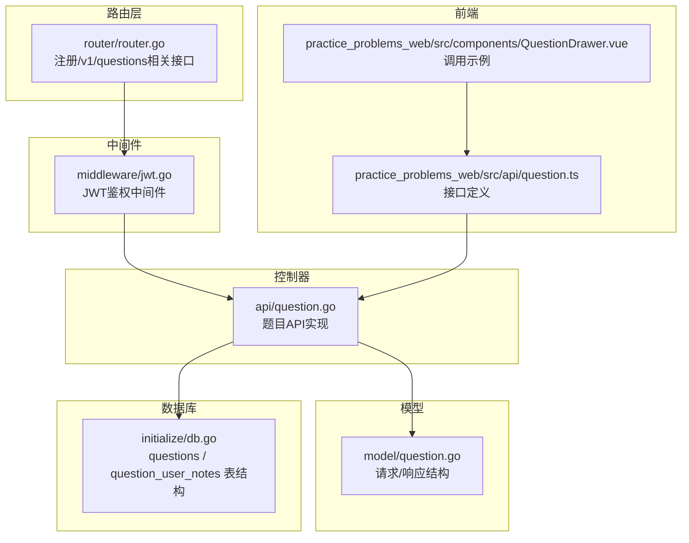
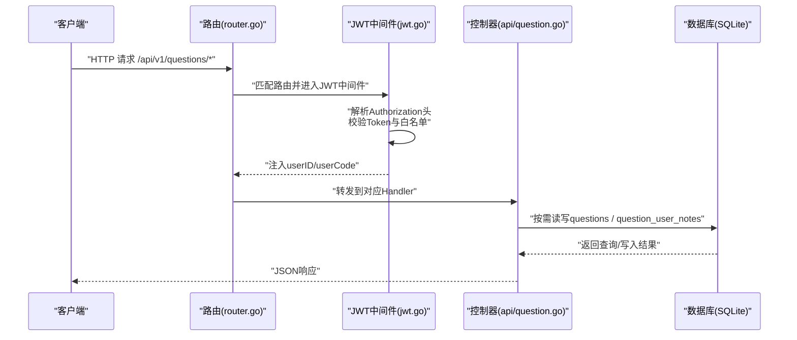
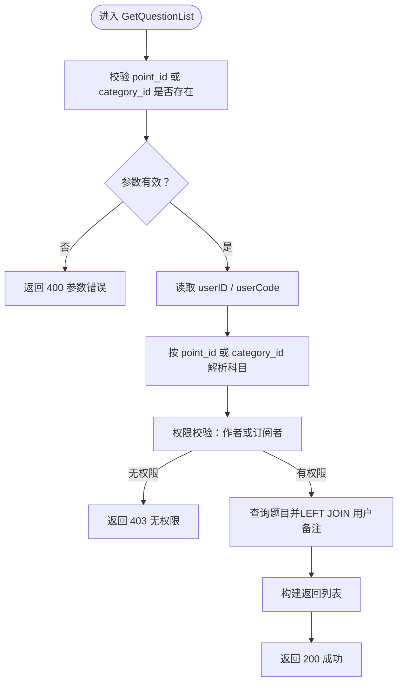
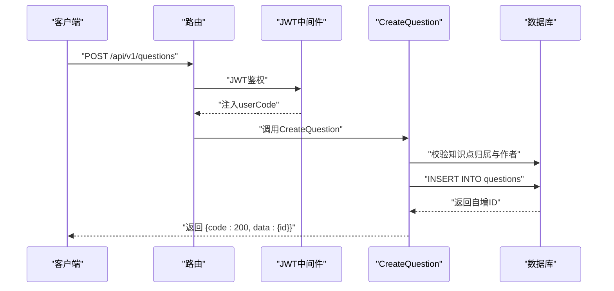
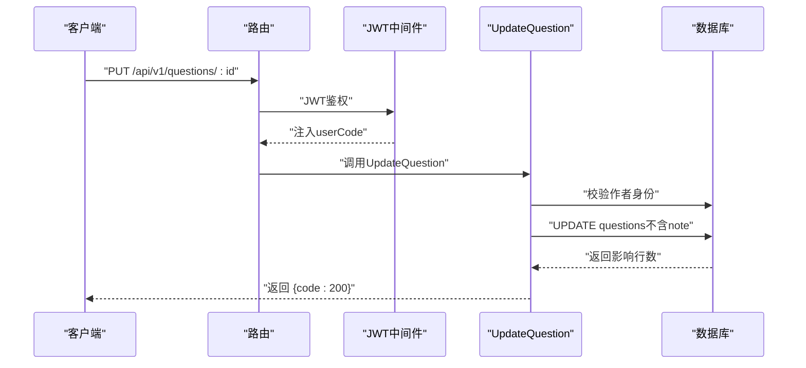
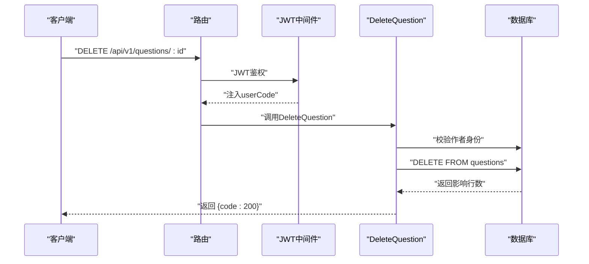
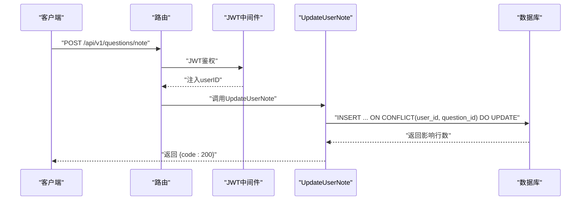
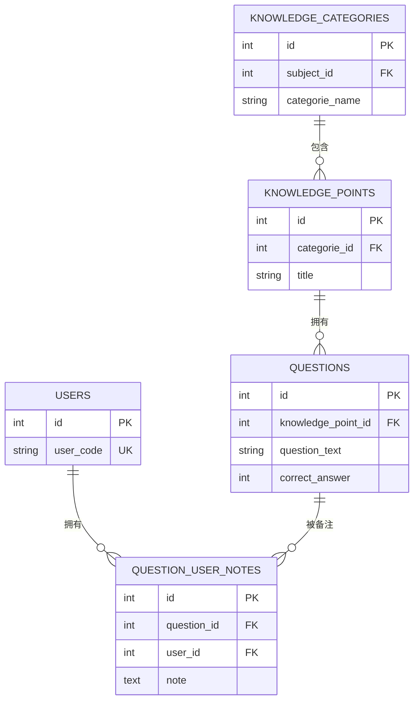
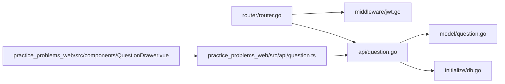

# 题目API

<cite>
**本文引用的文件**
- [api/question.go](file://api/question.go)
- [model/question.go](file://model/question.go)
- [router/router.go](file://router/router.go)
- [middleware/jwt.go](file://middleware/jwt.go)
- [initialize/db.go](file://initialize/db.go)
- [practice_problems_web/src/api/question.ts](file://practice_problems_web/src/api/question.ts)
- [practice_problems_web/src/components/QuestionDrawer.vue](file://practice_problems_web/src/components/QuestionDrawer.vue)
</cite>

## 目录
1. [简介](#简介)
2. [项目结构](#项目结构)
3. [核心组件](#核心组件)
4. [架构总览](#架构总览)
5. [详细组件分析](#详细组件分析)
6. [依赖关系分析](#依赖关系分析)
7. [性能考量](#性能考量)
8. [故障排查指南](#故障排查指南)
9. [结论](#结论)
10. [附录](#附录)

## 简介
本文件面向“题目管理”相关API，覆盖以下接口：
- GET /api/v1/questions（获取题目列表）
- POST /api/v1/questions（创建题目）
- PUT /api/v1/questions/:id（更新题目）
- DELETE /api/v1/questions/:id（删除题目）
- POST /api/v1/questions/note（更新用户对题目的备注）

所有接口均需通过JWT认证。其中，POST /api/v1/questions/note用于保存用户个人笔记，与题目内容本身分离，采用独立表存储，保证用户备注的私有性与可维护性。

## 项目结构
围绕题目API的关键文件与职责如下：
- 路由层：在路由组中挂载JWT中间件后，将题目相关接口注册到/v1下
- 中间件：JWT鉴权中间件负责解析Authorization头并注入用户上下文
- 控制器：api/question.go中实现各接口逻辑
- 模型：model/question.go定义请求/响应数据结构
- 数据库：initialize/db.go定义questions与question_user_notes表结构及外键约束
- 前端：practice_problems_web/src/api/question.ts声明接口定义；QuestionDrawer.vue演示调用

图表来源
- [router/router.go](file://router/router.go#L98-L104)
- [middleware/jwt.go](file://middleware/jwt.go#L40-L99)
- [api/question.go](file://api/question.go#L1-L425)
- [model/question.go](file://model/question.go#L1-L65)
- [initialize/db.go](file://initialize/db.go#L154-L379)
- [practice_problems_web/src/api/question.ts](file://practice_problems_web/src/api/question.ts#L1-L86)
- [practice_problems_web/src/components/QuestionDrawer.vue](file://practice_problems_web/src/components/QuestionDrawer.vue#L497-L522)

章节来源
- [router/router.go](file://router/router.go#L98-L104)
- [middleware/jwt.go](file://middleware/jwt.go#L40-L99)
- [api/question.go](file://api/question.go#L1-L425)
- [model/question.go](file://model/question.go#L1-L65)
- [initialize/db.go](file://initialize/db.go#L154-L379)
- [practice_problems_web/src/api/question.ts](file://practice_problems_web/src/api/question.ts#L1-L86)
- [practice_problems_web/src/components/QuestionDrawer.vue](file://practice_problems_web/src/components/QuestionDrawer.vue#L497-L522)

## 核心组件
- 路由注册：在/v1下注册题目相关接口，并统一挂载JWT中间件
- JWT鉴权：从Authorization头解析Bearer Token，校验白名单并注入userID、userCode
- 题目控制器：实现列表查询、创建、更新、删除、用户备注更新
- 数据模型：定义请求体与响应体字段映射
- 数据库表：questions与question_user_notes，前者存储题目内容，后者存储用户备注

章节来源
- [router/router.go](file://router/router.go#L98-L104)
- [middleware/jwt.go](file://middleware/jwt.go#L40-L99)
- [api/question.go](file://api/question.go#L1-L425)
- [model/question.go](file://model/question.go#L1-L65)
- [initialize/db.go](file://initialize/db.go#L154-L379)

## 架构总览
下图展示从客户端到后端的典型调用链路，以及JWT鉴权与题目数据流的关系。

图表来源
- [router/router.go](file://router/router.go#L98-L104)
- [middleware/jwt.go](file://middleware/jwt.go#L40-L99)
- [api/question.go](file://api/question.go#L1-L425)
- [initialize/db.go](file://initialize/db.go#L154-L379)

## 详细组件分析

### 接口一览与鉴权要求
- GET /api/v1/questions
  - 功能：按知识点或分类获取题目列表
  - 鉴权：需要JWT
  - 查询参数：point_id 或 category_id（二者至少传一个）
  - 响应：包含每道题的用户备注字段
- POST /api/v1/questions
  - 功能：创建题目
  - 鉴权：需要JWT
  - 请求体：题目内容与选项、答案、解释等
  - 响应：返回新建题目的ID
- PUT /api/v1/questions/:id
  - 功能：更新题目
  - 鉴权：需要JWT
  - 请求体：可部分更新题目内容
  - 响应：成功提示
- DELETE /api/v1/questions/:id
  - 功能：删除题目
  - 鉴权：需要JWT
  - 响应：成功提示
- POST /api/v1/questions/note
  - 功能：更新用户对题目的备注（个人笔记）
  - 鉴权：需要JWT
  - 请求体：question_id与note
  - 响应：保存成功提示

章节来源
- [router/router.go](file://router/router.go#L98-L104)
- [middleware/jwt.go](file://middleware/jwt.go#L40-L99)
- [api/question.go](file://api/question.go#L1-L425)
- [practice_problems_web/src/api/question.ts](file://practice_problems_web/src/api/question.ts#L1-L86)

### GET /api/v1/questions（获取题目列表）
- 请求
  - 方法：GET
  - 路径：/api/v1/questions
  - 查询参数：
    - point_id：知识点ID（可选）
    - category_id：分类ID（可选）
  - 请求头：Authorization: Bearer <token>
- 处理流程
  - 参数校验：至少提供point_id或category_id之一
  - 获取用户信息：从JWT上下文中读取userID与userCode
  - 权限校验：
    - 若按知识点查询：通过知识点定位科目，判断userCode与科目作者是否一致；否则检查用户是否订阅该科目且未过期
    - 若按分类查询：同上，但通过分类定位科目
  - 数据查询：
    - 按知识点：直接查询questions并LEFT JOIN question_user_notes，返回每道题的用户备注
    - 按分类：JOIN知识要点再LEFT JOIN用户备注
- 响应
  - 成功：返回code=200与data数组，数组元素包含题目字段与note字段
  - 失败：返回相应错误码与消息

图表来源
- [api/question.go](file://api/question.go#L17-L178)

章节来源
- [api/question.go](file://api/question.go#L17-L178)

### POST /api/v1/questions（创建题目）
- 请求
  - 方法：POST
  - 路径：/api/v1/questions
  - 请求头：Authorization: Bearer <token>
  - 请求体字段（来自CreateQuestionRequest）：
    - knowledgePointId：必填
    - questionText：必填
    - option1~option4：可选
    - option1Img~option4Img：可选
    - correctAnswer：必填（1~4）
    - explanation：可选
- 处理流程
  - 从JWT上下文读取userCode
  - 通过知识点ID查询科目作者userCode，仅作者可创建
  - 插入questions表
- 响应
  - 成功：返回code=200与data{id}

图表来源
- [api/question.go](file://api/question.go#L183-L248)
- [model/question.go](file://model/question.go#L26-L42)

章节来源
- [api/question.go](file://api/question.go#L183-L248)
- [model/question.go](file://model/question.go#L26-L42)

### PUT /api/v1/questions/:id（更新题目）
- 请求
  - 方法：PUT
  - 路径：/api/v1/questions/:id
  - 请求头：Authorization: Bearer <token>
  - 请求体字段（来自UpdateQuestionRequest）：
    - questionText：可选
    - option1~option4：可选
    - option1Img~option4Img：可选
    - correctAnswer：可选
    - explanation：可选
- 处理流程
  - 从JWT上下文读取userCode
  - 通过题目ID查询科目作者userCode，仅作者可更新
  - 更新questions表（注意：不再更新原表note字段）
- 响应
  - 成功：返回code=200

图表来源
- [api/question.go](file://api/question.go#L253-L325)
- [model/question.go](file://model/question.go#L44-L59)

章节来源
- [api/question.go](file://api/question.go#L253-L325)
- [model/question.go](file://model/question.go#L44-L59)

### DELETE /api/v1/questions/:id（删除题目）
- 请求
  - 方法：DELETE
  - 路径：/api/v1/questions/:id
  - 请求头：Authorization: Bearer <token>
- 处理流程
  - 从JWT上下文读取userCode
  - 通过题目ID查询科目作者userCode，仅作者可删除
  - 删除questions表对应记录
- 响应
  - 成功：返回code=200

图表来源
- [api/question.go](file://api/question.go#L381-L424)

章节来源
- [api/question.go](file://api/question.go#L381-L424)

### POST /api/v1/questions/note（更新用户备注）
- 请求
  - 方法：POST
  - 路径：/api/v1/questions/note
  - 请求头：Authorization: Bearer <token>
  - 请求体字段（来自UpdateNoteRequest）：
    - question_id：必填
    - note：可为空（清空备注）
- 处理流程
  - 从JWT上下文读取userID
  - 执行UPSERT到question_user_notes表（SQLite ON CONFLICT语法）
- 响应
  - 成功：返回code=200

图表来源
- [api/question.go](file://api/question.go#L327-L376)
- [model/question.go](file://model/question.go#L61-L65)
- [initialize/db.go](file://initialize/db.go#L330-L354)

章节来源
- [api/question.go](file://api/question.go#L327-L376)
- [model/question.go](file://model/question.go#L61-L65)
- [initialize/db.go](file://initialize/db.go#L330-L354)

### 题目与知识点的关联方式
- 题目表questions包含knowledge_point_id外键，指向知识要点表knowledge_points
- 知识要点表knowledge_points包含categorie_id外键，指向知识分类表knowledge_categories
- 因此，题目与知识点直接关联；通过分类获取题目时，会先JOIN知识要点再LEFT JOIN用户备注

图表来源
- [initialize/db.go](file://initialize/db.go#L270-L354)

章节来源
- [initialize/db.go](file://initialize/db.go#L270-L354)

### 前端对接与调用示例
- 前端接口定义位于practice_problems_web/src/api/question.ts，包含：
  - getQuestions(pointId)
  - createQuestion(data)
  - updateQuestion(id, data)
  - deleteQuestion(id)
  - getQuestionsByCategory(categoryId)
  - updateUserNote({question_id, note})
- 前端组件QuestionDrawer.vue中演示了调用updateUserNote保存用户备注的流程

章节来源
- [practice_problems_web/src/api/question.ts](file://practice_problems_web/src/api/question.ts#L1-L86)
- [practice_problems_web/src/components/QuestionDrawer.vue](file://practice_problems_web/src/components/QuestionDrawer.vue#L497-L522)

## 依赖关系分析
- 路由到中间件：路由层统一挂载JWT中间件，确保所有/v1下题目接口均受保护
- 控制器到模型：控制器使用model/question.go中的结构体进行请求绑定与响应构造
- 控制器到数据库：控制器直接使用全局DB连接执行SQL，涉及questions与question_user_notes两张表
- 前端到控制器：前端通过axios封装的request调用后端接口，与控制器方法一一对应

图表来源
- [router/router.go](file://router/router.go#L98-L104)
- [middleware/jwt.go](file://middleware/jwt.go#L40-L99)
- [api/question.go](file://api/question.go#L1-L425)
- [model/question.go](file://model/question.go#L1-L65)
- [initialize/db.go](file://initialize/db.go#L154-L379)
- [practice_problems_web/src/api/question.ts](file://practice_problems_web/src/api/question.ts#L1-L86)
- [practice_problems_web/src/components/QuestionDrawer.vue](file://practice_problems_web/src/components/QuestionDrawer.vue#L497-L522)

章节来源
- [router/router.go](file://router/router.go#L98-L104)
- [middleware/jwt.go](file://middleware/jwt.go#L40-L99)
- [api/question.go](file://api/question.go#L1-L425)
- [model/question.go](file://model/question.go#L1-L65)
- [initialize/db.go](file://initialize/db.go#L154-L379)
- [practice_problems_web/src/api/question.ts](file://practice_problems_web/src/api/question.ts#L1-L86)
- [practice_problems_web/src/components/QuestionDrawer.vue](file://practice_problems_web/src/components/QuestionDrawer.vue#L497-L522)

## 性能考量
- 数据库连接与模式
  - 初始化时启用WAL模式与外键约束，有助于并发与一致性
  - 连接池参数合理设置，避免高并发下的连接瓶颈
- 查询优化
  - 列表查询使用LEFT JOIN用户备注，避免N+1问题
  - 按知识点与按分类的查询路径分别优化，减少不必要的JOIN
- 写入优化
  - UPSERT使用SQLite ON CONFLICT语法，减少条件判断与多次写入
  - 更新题目时不再更新原表note字段，避免冗余写入

章节来源
- [initialize/db.go](file://initialize/db.go#L1-L83)
- [api/question.go](file://api/question.go#L118-L178)
- [api/question.go](file://api/question.go#L356-L376)

## 故障排查指南
- 401 未授权
  - 检查Authorization头格式是否为Bearer <token>
  - 确认Token未过期且存在于白名单
- 403 无权限
  - 仅科目作者可创建/更新/删除题目
  - 订阅者可查看题目列表，但不可修改
- 404 题目不存在
  - 检查题目ID是否正确
- 500 服务器错误
  - 查看服务端日志，定位数据库执行错误
- 前端调用异常
  - 确认前端接口定义与后端路由一致
  - 检查请求头Authorization是否正确传递

章节来源
- [middleware/jwt.go](file://middleware/jwt.go#L40-L99)
- [api/question.go](file://api/question.go#L183-L248)
- [api/question.go](file://api/question.go#L253-L325)
- [api/question.go](file://api/question.go#L381-L424)
- [practice_problems_web/src/api/question.ts](file://practice_problems_web/src/api/question.ts#L1-L86)

## 结论
本节文档系统梳理了题目管理相关API的接口规范、鉴权机制、数据模型与前后端对接方式。通过将用户备注独立存储于question_user_notes表，实现了题目内容与个人笔记的解耦，既满足了作者对题目的统一管理，也保障了用户备注的私有性与可维护性。建议在生产环境中结合日志与监控，持续关注接口的可用性与性能表现。

## 附录

### 数据模型与字段对照
- Question（列表/详情）
  - id、knowledgePointId、questionText、option1~option4、option1Img~option4Img、correctAnswer、explanation、note、createTime、updateTime
- CreateQuestionRequest
  - knowledgePointId、questionText、option1~option4、option1Img~option4Img、correctAnswer、explanation
- UpdateQuestionRequest
  - questionText、option1~option4、option1Img~option4Img、correctAnswer、explanation
- UpdateNoteRequest
  - question_id、note

章节来源
- [model/question.go](file://model/question.go#L1-L65)

### 调用示例（路径参考）
- 创建选择题
  - POST /api/v1/questions
  - 请求体字段：knowledgePointId、questionText、option1~option4、correctAnswer、explanation
  - 响应：{code:200, data:{id}}
  - 参考路径：[api/question.go](file://api/question.go#L183-L248)，[model/question.go](file://model/question.go#L26-L42)
- 更新用户备注
  - POST /api/v1/questions/note
  - 请求体字段：question_id、note
  - 响应：{code:200}
  - 参考路径：[api/question.go](file://api/question.go#L327-L376)，[model/question.go](file://model/question.go#L61-L65)，[initialize/db.go](file://initialize/db.go#L330-L354)