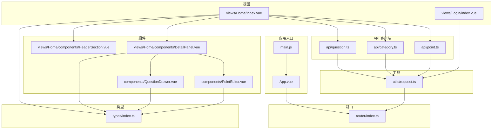
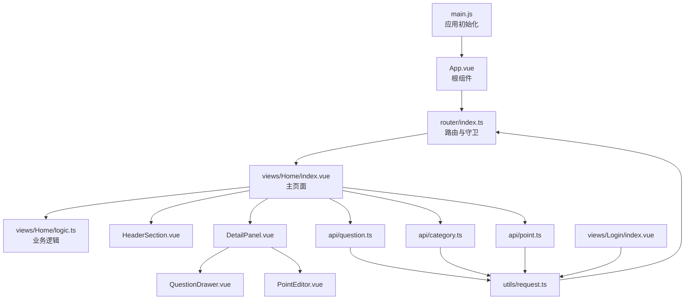
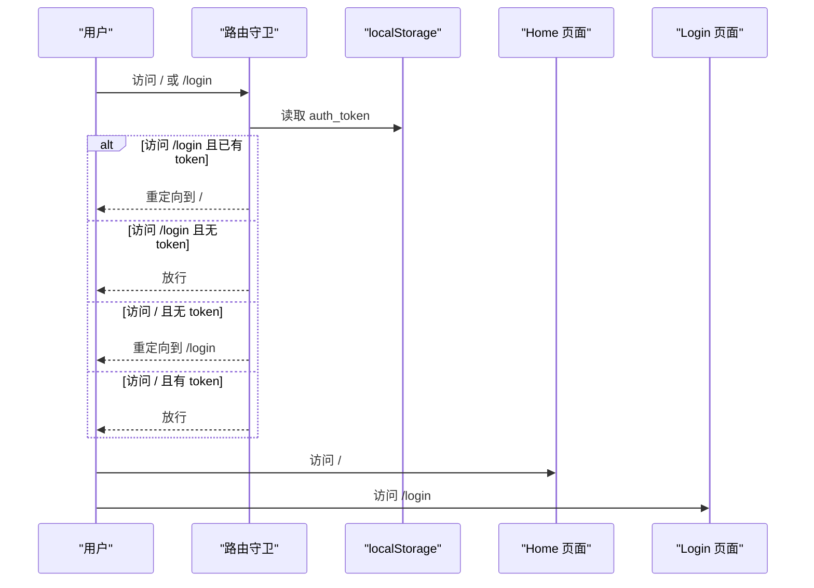
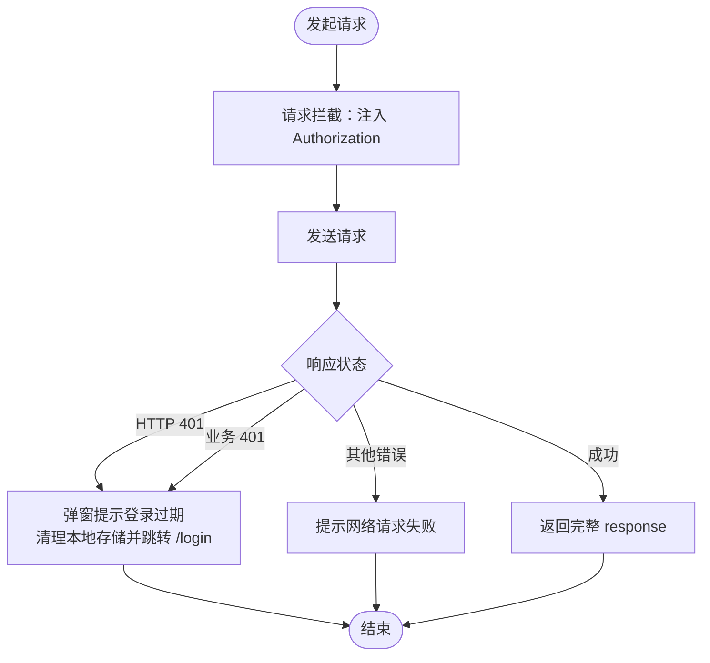
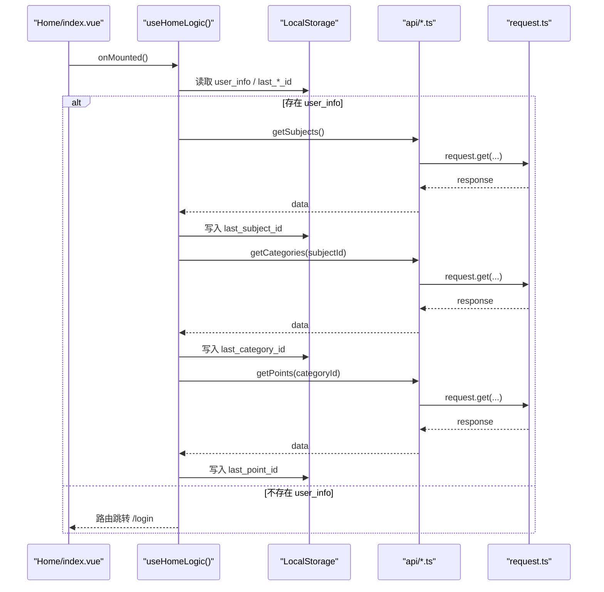
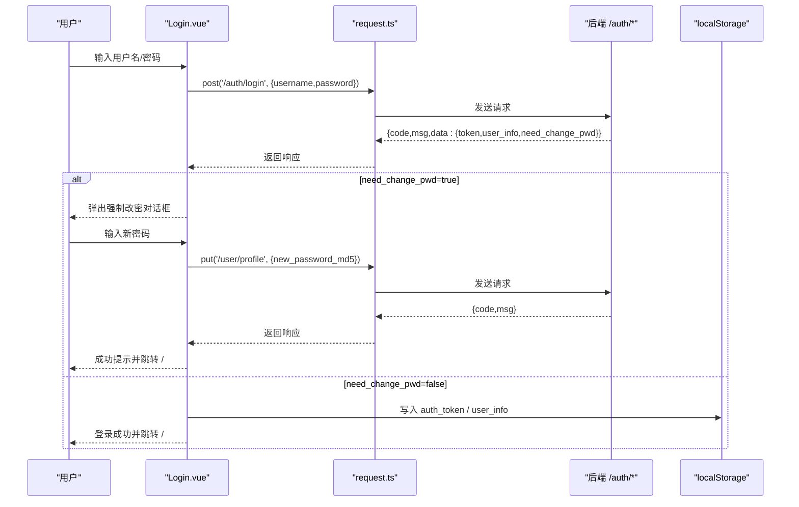
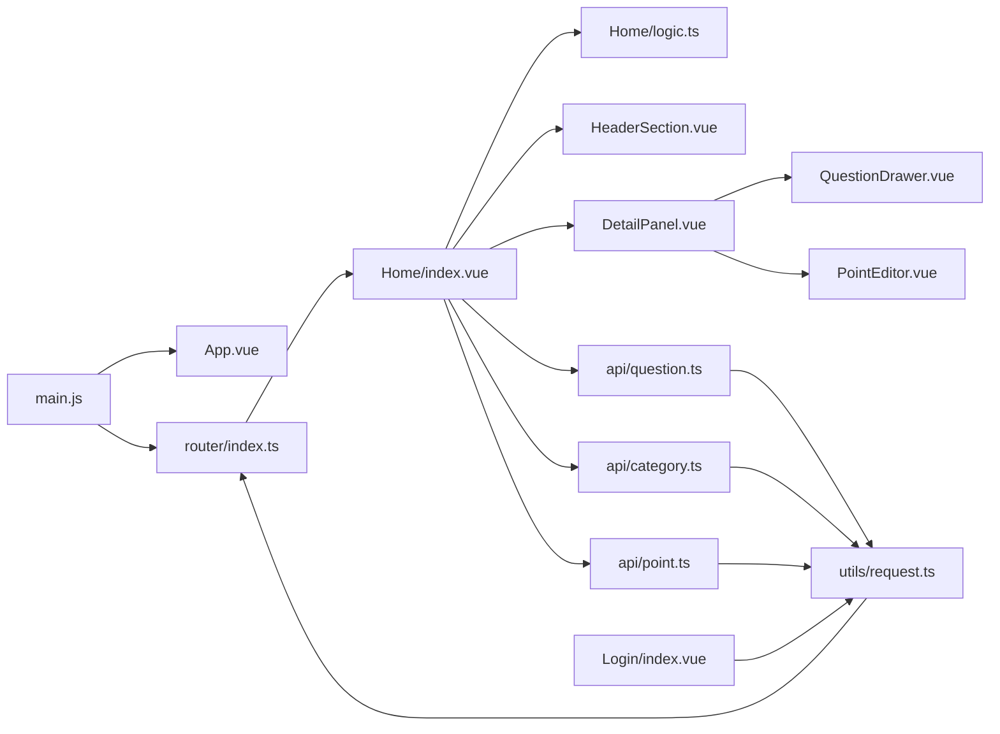

# 前端架构

<cite>
**本文引用的文件**
- [main.js](file://practice_problems_web/src/main.js)
- [App.vue](file://practice_problems_web/src/App.vue)
- [router/index.ts](file://practice_problems_web/src/router/index.ts)
- [utils/request.ts](file://practice_problems_web/src/utils/request.ts)
- [views/Home/index.vue](file://practice_problems_web/src/views/Home/index.vue)
- [views/Home/logic.ts](file://practice_problems_web/src/views/Home/logic.ts)
- [views/Home/components/HeaderSection.vue](file://practice_problems_web/src/views/Home/components/HeaderSection.vue)
- [views/Home/components/DetailPanel.vue](file://practice_problems_web/src/views/Home/components/DetailPanel.vue)
- [components/QuestionDrawer.vue](file://practice_problems_web/src/components/QuestionDrawer.vue)
- [components/PointEditor.vue](file://practice_problems_web/src/components/PointEditor.vue)
- [api/question.ts](file://practice_problems_web/src/api/question.ts)
- [api/category.ts](file://practice_problems_web/src/api/category.ts)
- [api/point.ts](file://practice_problems_web/src/api/point.ts)
- [types/index.ts](file://practice_problems_web/src/types/index.ts)
</cite>

## 目录
1. [引言](#引言)
2. [项目结构](#项目结构)
3. [核心组件](#核心组件)
4. [架构总览](#架构总览)
5. [详细组件分析](#详细组件分析)
6. [依赖关系分析](#依赖关系分析)
7. [性能考量](#性能考量)
8. [故障排查指南](#故障排查指南)
9. [结论](#结论)

## 引言
本文件面向前端应用的架构设计，围绕以下目标展开：
- 说明 main.js 如何初始化 Vue 应用并挂载 App.vue 根组件
- 解释基于 Vue Router 的前端路由配置与页面导航
- 阐述 src/utils/request.ts 如何封装 axios，统一处理 API 请求、响应拦截与错误处理
- 分析组件结构：views 目录下的 Home 与 Login 页面，以及 components 目录下的可复用 UI 组件（如 QuestionDrawer、PointEditor）
- 说明 API 客户端（src/api/*.ts）如何与后端 RESTful API 进行通信
- 讨论状态管理策略（当前为组件内状态或简单全局状态）

## 项目结构
前端位于 practice_problems_web/src 目录，采用典型的 Vue 3 + Vite 工程组织方式：
- 应用入口与根组件：main.js、App.vue
- 路由：router/index.ts
- 工具与 API：utils/request.ts、api/*.ts
- 视图与组件：views/Home、views/Login、components
- 类型定义：types/index.ts

图表来源
- [main.js](file://practice_problems_web/src/main.js#L1-L75)
- [App.vue](file://practice_problems_web/src/App.vue#L1-L26)
- [router/index.ts](file://practice_problems_web/src/router/index.ts#L1-L52)
- [utils/request.ts](file://practice_problems_web/src/utils/request.ts#L1-L70)
- [views/Home/index.vue](file://practice_problems_web/src/views/Home/index.vue#L1-L159)
- [views/Home/components/HeaderSection.vue](file://practice_problems_web/src/views/Home/components/HeaderSection.vue#L1-L624)
- [views/Home/components/DetailPanel.vue](file://practice_problems_web/src/views/Home/components/DetailPanel.vue#L1-L268)
- [components/QuestionDrawer.vue](file://practice_problems_web/src/components/QuestionDrawer.vue#L1-L702)
- [components/PointEditor.vue](file://practice_problems_web/src/components/PointEditor.vue#L1-L584)
- [api/question.ts](file://practice_problems_web/src/api/question.ts#L1-L86)
- [api/category.ts](file://practice_problems_web/src/api/category.ts#L1-L40)
- [api/point.ts](file://practice_problems_web/src/api/point.ts#L1-L60)
- [types/index.ts](file://practice_problems_web/src/types/index.ts#L1-L84)

章节来源
- [main.js](file://practice_problems_web/src/main.js#L1-L75)
- [router/index.ts](file://practice_problems_web/src/router/index.ts#L1-L52)

## 核心组件
- 应用入口与根组件
  - main.js：创建 Vue 应用实例，注册路由、Element Plus、全局图标、自定义 v-reclick 防重复提交指令，并挂载根组件 App.vue
  - App.vue：包裹 Element Plus 的语言配置，提供全局样式与 router-view 容器
- 路由与导航
  - router/index.ts：定义首页与登录页的动态导入路由，配置全局前置守卫，基于 localStorage 中的 auth_token 控制访问
- 请求封装与 API 客户端
  - utils/request.ts：基于 axios 创建服务实例，设置 baseURL、超时、请求头携带 Authorization、统一响应拦截与登录过期处理
  - api/*.ts：按领域划分的 API 客户端，封装 GET/POST/PUT/DELETE 请求，统一返回结构 ApiResponse<T>
- 视图与组件
  - views/Home/index.vue：主界面布局，组合 HeaderSection、CategorySidebar、PointSidebar、DetailPanel
  - views/Home/logic.ts：集中管理 Home 页面的状态与交互逻辑，包含加载数据、CRUD、权限判断、自动恢复等
  - views/Login/index.vue：登录/注册表单，使用 request.ts 发起认证请求，处理首次登录强制改密流程
  - components/QuestionDrawer.vue：题目抽屉，支持练习/考试/批量管理、快捷键、JSON 导入、笔记编辑
  - components/PointEditor.vue：知识点内容编辑器，集成富文本编辑器、图片上传、朗读播放与语音控制

章节来源
- [main.js](file://practice_problems_web/src/main.js#L1-L75)
- [App.vue](file://practice_problems_web/src/App.vue#L1-L26)
- [router/index.ts](file://practice_problems_web/src/router/index.ts#L1-L52)
- [utils/request.ts](file://practice_problems_web/src/utils/request.ts#L1-L70)
- [views/Home/index.vue](file://practice_problems_web/src/views/Home/index.vue#L1-L159)
- [views/Home/logic.ts](file://practice_problems_web/src/views/Home/logic.ts#L1-L448)
- [views/Login/index.vue](file://practice_problems_web/src/views/Login/index.vue#L1-L477)
- [components/QuestionDrawer.vue](file://practice_problems_web/src/components/QuestionDrawer.vue#L1-L702)
- [components/PointEditor.vue](file://practice_problems_web/src/components/PointEditor.vue#L1-L584)
- [api/question.ts](file://practice_problems_web/src/api/question.ts#L1-L86)
- [api/category.ts](file://practice_problems_web/src/api/category.ts#L1-L40)
- [api/point.ts](file://practice_problems_web/src/api/point.ts#L1-L60)
- [types/index.ts](file://practice_problems_web/src/types/index.ts#L1-L84)

## 架构总览
前端采用“入口初始化 + 路由守卫 + 请求封装 + 视图/组件 + API 客户端”的分层架构：
- 入口层：main.js 负责应用初始化、插件注册、全局指令与挂载
- 路由层：router/index.ts 提供页面导航与鉴权守卫
- 交互层：views/Home 作为主页面承载业务逻辑；views/Login 处理认证流程
- 组件层：可复用组件（QuestionDrawer、PointEditor 等）提升 UI 一致性与复用性
- 数据层：utils/request.ts 统一封装请求与错误处理；api/*.ts 以领域划分对接后端 RESTful 接口；types/index.ts 定义通用响应结构与实体类型

图表来源
- [main.js](file://practice_problems_web/src/main.js#L1-L75)
- [App.vue](file://practice_problems_web/src/App.vue#L1-L26)
- [router/index.ts](file://practice_problems_web/src/router/index.ts#L1-L52)
- [views/Home/index.vue](file://practice_problems_web/src/views/Home/index.vue#L1-L159)
- [views/Home/logic.ts](file://practice_problems_web/src/views/Home/logic.ts#L1-L448)
- [views/Home/components/HeaderSection.vue](file://practice_problems_web/src/views/Home/components/HeaderSection.vue#L1-L624)
- [views/Home/components/DetailPanel.vue](file://practice_problems_web/src/views/Home/components/DetailPanel.vue#L1-L268)
- [components/QuestionDrawer.vue](file://practice_problems_web/src/components/QuestionDrawer.vue#L1-L702)
- [components/PointEditor.vue](file://practice_problems_web/src/components/PointEditor.vue#L1-L584)
- [api/question.ts](file://practice_problems_web/src/api/question.ts#L1-L86)
- [api/category.ts](file://practice_problems_web/src/api/category.ts#L1-L40)
- [api/point.ts](file://practice_problems_web/src/api/point.ts#L1-L60)
- [utils/request.ts](file://practice_problems_web/src/utils/request.ts#L1-L70)

## 详细组件分析

### 应用初始化与根组件
- main.js
  - 创建应用实例并注册路由
  - 注册 Element Plus 与图标
  - 注册全局 v-reclick 指令，防重复提交与加载态反馈
  - 挂载根组件 App.vue
- App.vue
  - 使用 Element Plus 的 ConfigProvider 设置语言为中文
  - 提供全局样式，隐藏页面整体滚动条，保证全屏体验

章节来源
- [main.js](file://practice_problems_web/src/main.js#L1-L75)
- [App.vue](file://practice_problems_web/src/App.vue#L1-L26)

### 路由与导航
- 路由配置
  - 首页与登录页均使用动态导入，确保路径正确指向 views/Home/index.vue 与 views/Login/index.vue
  - 历史模式 createWebHistory
- 全局前置守卫
  - 读取 localStorage 中的 auth_token
  - 若访问 /login 且已有 token，则重定向至 /
  - 若访问非 /login 且无 token，则重定向至 /login
  - 该策略配合 utils/request.ts 的响应拦截实现“登录过期”自动跳转

图表来源
- [router/index.ts](file://practice_problems_web/src/router/index.ts#L1-L52)

章节来源
- [router/index.ts](file://practice_problems_web/src/router/index.ts#L1-L52)

### 请求封装与错误处理
- request.ts
  - baseURL 设为 /api/v1，timeout 5000ms
  - 请求拦截：从 localStorage 读取 auth_token，注入 Authorization 头
  - 响应拦截：
    - 业务 401（即使 HTTP 200）：弹窗提示“登录状态已过期”，清理本地存储并跳转 /login
    - HTTP 401：统一错误提示
    - 其他错误：统一提示网络请求失败
  - 返回值：保持返回完整 response，便于调用方 res.data.data 的链式读取

图表来源
- [utils/request.ts](file://practice_problems_web/src/utils/request.ts#L1-L70)

章节来源
- [utils/request.ts](file://practice_problems_web/src/utils/request.ts#L1-L70)

### 主页面与状态管理
- views/Home/index.vue
  - 采用 script setup + 组合式 API
  - 通过 useHomeLogic() 引入集中逻辑，解耦视图与业务
  - 组合 HeaderSection、CategorySidebar、PointSidebar、DetailPanel
  - 维护 viewMode（read/edit/dev）并持久化到 localStorage
- views/Home/logic.ts
  - 状态：subjects、currentSubject、categories、currentCategory、points、currentPoint、userInfo、各弹窗与表单状态
  - 生命周期：onMounted 从 localStorage 恢复用户信息与层级选择，随后加载科目
  - 自动恢复：按 last_subject_id、last_category_id、last_point_id 逐步恢复
  - 交互：选择科目/分类/知识点、CRUD、排序、移动知识点、链接管理、登出
  - 权限：isSubjectOwner、isPointOwner、水印文案、视图模式控制
  - API：getSubjects、getCategories、getPoints、getPointDetail、create/update/delete、updatePointSort、updateCategorySort、updatePoint

图表来源
- [views/Home/index.vue](file://practice_problems_web/src/views/Home/index.vue#L1-L159)
- [views/Home/logic.ts](file://practice_problems_web/src/views/Home/logic.ts#L1-L448)
- [api/category.ts](file://practice_problems_web/src/api/category.ts#L1-L40)
- [api/point.ts](file://practice_problems_web/src/api/point.ts#L1-L60)
- [utils/request.ts](file://practice_problems_web/src/utils/request.ts#L1-L70)

章节来源
- [views/Home/index.vue](file://practice_problems_web/src/views/Home/index.vue#L1-L159)
- [views/Home/logic.ts](file://practice_problems_web/src/views/Home/logic.ts#L1-L448)

### 登录页面与认证流程
- views/Login/index.vue
  - 登录/注册表单，使用 Element Plus 表单组件与图标
  - 使用 request.post('/auth/login') 与 request.post('/auth/register') 发起认证
  - 登录成功后写入 auth_token 与 user_info，必要时弹出强制改密对话框
  - 注册成功后自动登录并走相同流程
  - 使用 md5 对密码进行加密传输

图表来源
- [views/Login/index.vue](file://practice_problems_web/src/views/Login/index.vue#L1-L477)
- [utils/request.ts](file://practice_problems_web/src/utils/request.ts#L1-L70)

章节来源
- [views/Login/index.vue](file://practice_problems_web/src/views/Login/index.vue#L1-L477)
- [utils/request.ts](file://practice_problems_web/src/utils/request.ts#L1-L70)

### 可复用 UI 组件

#### QuestionDrawer（题目抽屉）
- 功能特性
  - 练习/考试/批量管理三种模式
  - 快捷键配置与键盘答题
  - JSON 导入题目
  - 笔记编辑（updateUserNote）
  - 选项乱序、对错高亮、交卷评分
- 与 API 的交互
  - getQuestions/getQuestionsByCategory/createQuestion/updateQuestion/deleteQuestion/updateUserNote
- 与父组件的通信
  - 通过 visible 与 update:visible 双向绑定控制显示
  - 通过 props 传递 viewMode、userInfo、isOwner 等权限信息

章节来源
- [components/QuestionDrawer.vue](file://practice_problems_web/src/components/QuestionDrawer.vue#L1-L702)
- [api/question.ts](file://practice_problems_web/src/api/question.ts#L1-L86)

#### PointEditor（知识点编辑器）
- 功能特性
  - 集成富文本编辑器 @wangeditor/editor-for-vue
  - 上传图片并插入编辑器（uploadImage）
  - 文本朗读（SpeechSynthesis），支持音色、语速、暂停/继续/停止
  - 选择文本朗读与全文朗读
- 与 API 的交互
  - updatePoint（保存内容）
  - uploadImage（上传图片）

章节来源
- [components/PointEditor.vue](file://practice_problems_web/src/components/PointEditor.vue#L1-L584)
- [api/point.ts](file://practice_problems_web/src/api/point.ts#L1-L60)

### API 客户端与后端通信
- api/question.ts
  - getQuestions(point_id)
  - createQuestion(data)
  - updateQuestion(id, data)
  - deleteQuestion(id)
  - getQuestionsByCategory(category_id)
  - updateUserNote({question_id, note})
- api/category.ts
  - getCategories(subject_id)
  - createCategory(data)
  - updateCategory(id, data)
  - deleteCategory(id)
  - sortCategories(id, direction) 与 updateCategorySort(id, action)
- api/point.ts
  - getPoints(category_id)
  - getPointDetail(id)
  - createPoint(data)
  - updatePoint(id, data)
  - deletePoint(id)
  - updatePointSort(id, action)
  - uploadImage(file, pointId)
- 通用响应结构
  - types/index.ts 定义 ApiResponse<T>，统一前后端响应格式

章节来源
- [api/question.ts](file://practice_problems_web/src/api/question.ts#L1-L86)
- [api/category.ts](file://practice_problems_web/src/api/category.ts#L1-L40)
- [api/point.ts](file://practice_problems_web/src/api/point.ts#L1-L60)
- [types/index.ts](file://practice_problems_web/src/types/index.ts#L1-L84)

## 依赖关系分析
- 入口依赖
  - main.js 依赖 App.vue、router/index.ts、Element Plus、图标库、v-reclick 指令
- 路由依赖
  - router/index.ts 依赖 localStorage、vue-router
- 视图依赖
  - Home/index.vue 依赖 HeaderSection、DetailPanel、useHomeLogic
  - DetailPanel 依赖 QuestionDrawer、PointEditor
  - Login/index.vue 依赖 request.ts
- API 客户端依赖
  - api/*.ts 依赖 utils/request.ts 与 types/index.ts
- 组件依赖
  - QuestionDrawer 依赖 api/question.ts
  - PointEditor 依赖 api/point.ts 与 @wangeditor/editor-for-vue

图表来源
- [main.js](file://practice_problems_web/src/main.js#L1-L75)
- [router/index.ts](file://practice_problems_web/src/router/index.ts#L1-L52)
- [views/Home/index.vue](file://practice_problems_web/src/views/Home/index.vue#L1-L159)
- [views/Home/logic.ts](file://practice_problems_web/src/views/Home/logic.ts#L1-L448)
- [views/Home/components/HeaderSection.vue](file://practice_problems_web/src/views/Home/components/HeaderSection.vue#L1-L624)
- [views/Home/components/DetailPanel.vue](file://practice_problems_web/src/views/Home/components/DetailPanel.vue#L1-L268)
- [components/QuestionDrawer.vue](file://practice_problems_web/src/components/QuestionDrawer.vue#L1-L702)
- [components/PointEditor.vue](file://practice_problems_web/src/components/PointEditor.vue#L1-L584)
- [api/question.ts](file://practice_problems_web/src/api/question.ts#L1-L86)
- [api/category.ts](file://practice_problems_web/src/api/category.ts#L1-L40)
- [api/point.ts](file://practice_problems_web/src/api/point.ts#L1-L60)
- [utils/request.ts](file://practice_problems_web/src/utils/request.ts#L1-L70)
- [views/Login/index.vue](file://practice_problems_web/src/views/Login/index.vue#L1-L477)

## 性能考量
- 路由懒加载：首页与登录页使用动态导入，减少首屏体积
- 组件拆分：HeaderSection、DetailPanel、QuestionDrawer、PointEditor 等职责清晰，利于按需渲染
- 请求拦截：统一注入 token，避免重复代码
- 本地存储：自动恢复 last_subject_id/last_category_id/last_point_id，减少重复请求
- 图片上传：FormData 上传，明确 Content-Type，避免多余转换

[本节为通用指导，无需列出具体文件来源]

## 故障排查指南
- 登录过期
  - 现象：出现“登录状态已过期”提示并跳转登录页
  - 原因：响应拦截捕获业务 401 或 HTTP 401
  - 处理：清理本地存储并重新登录
- 网络请求失败
  - 现象：统一提示“网络请求失败”
  - 原因：异常错误或后端返回错误
  - 处理：检查网络与后端状态，重试或联系管理员
- 防重复提交
  - 现象：按钮点击后出现 loading 态
  - 原因：v-reclick 指令生效
  - 处理：等待异步完成或手动取消
- 语音朗读中断
  - 现象：切换音色/语速或快速切换导致中断
  - 原因：浏览器 GC 或 speak 冲突
  - 处理：组件内部使用延时与全局引用规避中断

章节来源
- [utils/request.ts](file://practice_problems_web/src/utils/request.ts#L1-L70)
- [components/PointEditor.vue](file://practice_problems_web/src/components/PointEditor.vue#L1-L584)
- [main.js](file://practice_problems_web/src/main.js#L1-L75)

## 结论
该前端应用采用清晰的分层架构：入口初始化、路由守卫、请求封装、视图/组件与 API 客户端协同工作。通过集中逻辑（useHomeLogic）、可复用组件与统一的 API 客户端，实现了良好的可维护性与扩展性。当前状态管理以组件内状态与简单全局状态为主，满足当前业务规模；未来可根据需要引入更完善的全局状态方案（如 Pinia）以进一步降低组件间耦合。