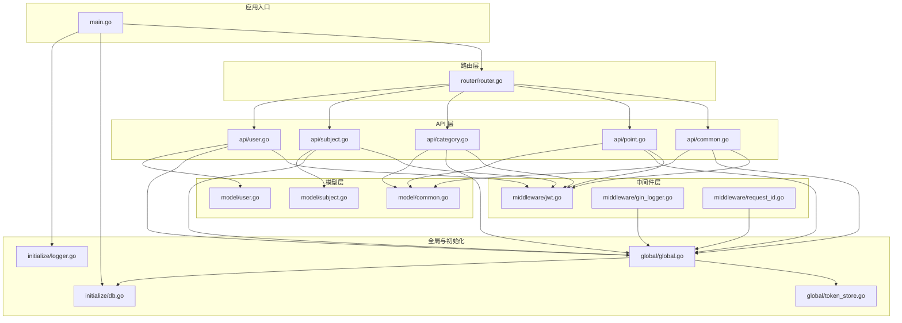
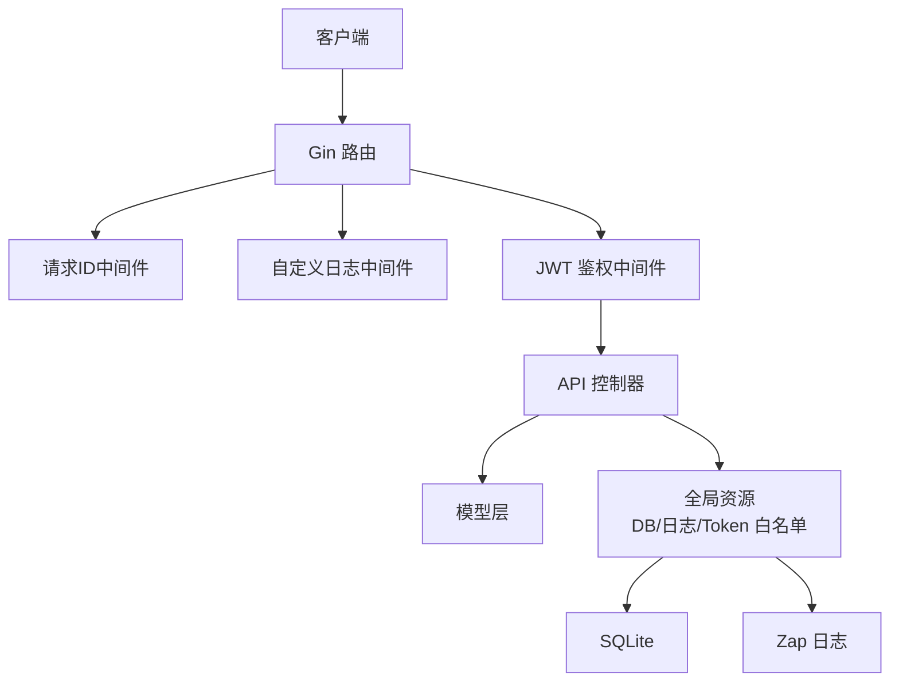
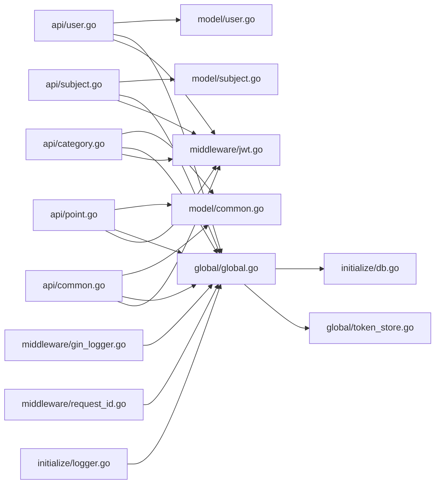

# 后端架构

<cite>
**本文引用的文件**
- [main.go](file://main.go)
- [router.go](file://router/router.go)
- [user.go](file://api/user.go)
- [subject.go](file://api/subject.go)
- [category.go](file://api/category.go)
- [point.go](file://api/point.go)
- [common.go](file://api/common.go)
- [user.go](file://model/user.go)
- [subject.go](file://model/subject.go)
- [common.go](file://model/common.go)
- [jwt.go](file://middleware/jwt.go)
- [gin_logger.go](file://middleware/gin_logger.go)
- [request_id.go](file://middleware/request_id.go)
- [global.go](file://global/global.go)
- [token_store.go](file://global/token_store.go)
- [db.go](file://initialize/db.go)
- [logger.go](file://initialize/logger.go)
</cite>

## 目录
1. [简介](#简介)
2. [项目结构](#项目结构)
3. [核心组件](#核心组件)
4. [架构总览](#架构总览)
5. [详细组件分析](#详细组件分析)
6. [依赖关系分析](#依赖关系分析)
7. [性能考量](#性能考量)
8. [故障排查指南](#故障排查指南)
9. [结论](#结论)

## 简介
本文件面向后端服务的整体架构与实现，围绕以下目标展开：
- 解释 api 包中的控制器如何处理具体业务逻辑（以 user.go、subject.go 为代表）。
- 说明 model 包结构体如何定义数据模型并与 SQLite 表进行映射。
- 描述 middleware 包如何实现横切关注点（JWT 认证、请求日志、请求 ID 生成）。
- 阐述 global 包如何存储全局的数据库连接与日志实例。
- 讨论 Gin 框架的依赖注入模式（通过上下文传递）与错误处理机制。
- 提供后端分层架构图，清晰展示 API 层、业务逻辑层（隐含在 API 中）、数据访问层（Model）与基础设施层（Middleware、Global）。

## 项目结构
项目采用按职责分层的组织方式：
- API 层：api/* 控制器，负责接收请求、参数校验、调用业务逻辑、返回响应。
- Model 层：model/* 定义数据模型与数据库表映射。
- Middleware 层：middleware/* 实现横切关注点（JWT、日志、请求 ID）。
- Global 层：global/* 提供全局资源（DB、日志、Token 白名单）。
- Initialize 层：initialize/* 负责初始化（数据库、日志）。
- Router 层：router/router.go 路由注册与中间件装配。

图表来源
- [main.go](file://main.go#L1-L59)
- [router.go](file://router/router.go#L1-L127)
- [user.go](file://api/user.go#L1-L342)
- [subject.go](file://api/subject.go#L1-L508)
- [category.go](file://api/category.go#L1-L387)
- [point.go](file://api/point.go#L1-L538)
- [common.go](file://api/common.go#L1-L222)
- [user.go](file://model/user.go#L1-L35)
- [subject.go](file://model/subject.go#L1-L24)
- [common.go](file://model/common.go#L1-L14)
- [jwt.go](file://middleware/jwt.go#L1-L101)
- [gin_logger.go](file://middleware/gin_logger.go#L1-L61)
- [request_id.go](file://middleware/request_id.go#L1-L28)
- [global.go](file://global/global.go#L1-L32)
- [token_store.go](file://global/token_store.go#L1-L50)
- [db.go](file://initialize/db.go#L1-L380)
- [logger.go](file://initialize/logger.go#L1-L184)

章节来源
- [main.go](file://main.go#L1-L59)
- [router.go](file://router/router.go#L1-L127)

## 核心组件
- 应用入口与初始化
  - main.go 负责初始化日志、SQLite、路由并启动服务；关闭数据库连接。
  - initialize/logger.go 初始化彩色日志系统，统一输出到控制台与文件，并将 Gin 输出重定向到同一日志系统。
  - initialize/db.go 初始化 SQLite 连接、WAL 模式、外键约束、连接池，并创建/维护表结构。
- 全局资源
  - global/global.go 提供全局 DB、Log，并通过 GetLog(c) 从上下文中提取 RequestID，生成带请求标识的日志。
  - global/token_store.go 提供内存 Token 白名单，支持保存、校验、移除 Token。
- 中间件
  - middleware/request_id.go 为每个请求生成短请求 ID 并写入响应头，便于链路追踪。
  - middleware/gin_logger.go 替代默认 Logger，统一输出格式与级别，结合全局日志实例记录请求耗时、状态码等。
  - middleware/jwt.go 实现 JWT 鉴权：校验 Authorization 头、内存白名单、解析 Token、向上下文注入用户信息。
- API 控制器
  - api/user.go：用户注册、登录（Token 自动登录与账号密码登录）、退出、修改用户信息/密码。
  - api/subject.go：科目列表/详情、创建/更新/删除、授权管理（绑定/解绑、有效期更新、批量操作）。
  - api/category.go：分类列表/创建/更新/删除、排序。
  - api/point.go：知识点列表/详情、创建/更新/删除、排序、删除图片。
  - api/common.go：通用图片上传（含权限校验、数量限制、JSON 更新、目录权限设置）。
- 模型
  - model/user.go：注册/登录/更新请求体与数据库用户结构体。
  - model/subject.go：科目实体与创建/更新请求体。
  - model/common.go：删除图片请求体与图片项结构体。

章节来源
- [main.go](file://main.go#L1-L59)
- [logger.go](file://initialize/logger.go#L1-L184)
- [db.go](file://initialize/db.go#L1-L380)
- [global.go](file://global/global.go#L1-L32)
- [token_store.go](file://global/token_store.go#L1-L50)
- [request_id.go](file://middleware/request_id.go#L1-L28)
- [gin_logger.go](file://middleware/gin_logger.go#L1-L61)
- [jwt.go](file://middleware/jwt.go#L1-L101)
- [user.go](file://api/user.go#L1-L342)
- [subject.go](file://api/subject.go#L1-L508)
- [category.go](file://api/category.go#L1-L387)
- [point.go](file://api/point.go#L1-L538)
- [common.go](file://api/common.go#L1-L222)
- [user.go](file://model/user.go#L1-L35)
- [subject.go](file://model/subject.go#L1-L24)
- [common.go](file://model/common.go#L1-L14)

## 架构总览
后端采用典型的四层架构：
- API 层：暴露 REST 接口，负责参数绑定、鉴权、调用业务逻辑、返回响应。
- 业务逻辑层：隐含在 API 控制器中，包含鉴权、权限校验、事务处理、复杂查询与更新。
- 数据访问层（Model）：定义结构体与数据库表映射，配合全局 DB 进行 CRUD。
- 基础设施层（Middleware、Global）：提供日志、JWT、请求 ID、全局 DB/日志、Token 白名单。

图表来源
- [router.go](file://router/router.go#L1-L127)
- [request_id.go](file://middleware/request_id.go#L1-L28)
- [gin_logger.go](file://middleware/gin_logger.go#L1-L61)
- [jwt.go](file://middleware/jwt.go#L1-L101)
- [user.go](file://api/user.go#L1-L342)
- [subject.go](file://api/subject.go#L1-L508)
- [category.go](file://api/category.go#L1-L387)
- [point.go](file://api/point.go#L1-L538)
- [common.go](file://api/common.go#L1-L222)
- [global.go](file://global/global.go#L1-L32)
- [token_store.go](file://global/token_store.go#L1-L50)
- [db.go](file://initialize/db.go#L1-L380)
- [logger.go](file://initialize/logger.go#L1-L184)

## 详细组件分析

### API 层：控制器与业务逻辑
- 用户模块（api/user.go）
  - 注册：参数绑定、双 MD5 + bcrypt 加密、生成唯一 UserCode、入库。
  - 登录：优先尝试 Token 自动登录（白名单校验 + JWT 解析 + DB 查询用户），否则走账号密码登录（bcrypt 校验），成功后生成新 Token 并写入白名单。
  - 退出：从白名单移除 Token。
  - 修改用户信息/密码：旧密码 MD5 + bcrypt 校验，新密码 MD5 + bcrypt 存储；支持仅修改昵称/邮箱。
- 科目模块（api/subject.go）
  - 列表/详情：基于用户绑定关系与有效期过滤，返回作者信息。
  - 创建：事务插入 subjects 与 user_subjects，保证原子性。
  - 更新/删除：鉴权校验（仅创建者可操作），更新/删除时写入更新时间。
  - 授权管理：更新有效期、解除授权、批量更新/移除授权。
- 分类模块（api/category.go）
  - 列表：权限校验（科目绑定且未过期）。
  - 创建/更新/删除：仅科目作者可操作，更新时支持难度校验。
  - 排序：事务内交换排序值，保证一致性。
- 知识点模块（api/point.go）
  - 列表/详情：权限校验（通过 user_subjects 关联）。
  - 创建/更新/删除：仅科目作者可操作；更新支持跨分类移动（同科目内）。
  - 排序：事务内交换排序值。
  - 删除图片：解析 JSON，移除指定图片并删除磁盘文件。
- 通用上传（api/common.go）
  - 上传：权限校验（仅知识点作者）、图片数量限制（最多 10 张）、目录权限设置（755）、文件权限（644）、数据库 JSON 更新。
  - 删除独立文件：安全路径校验，避免目录穿越。

章节来源
- [user.go](file://api/user.go#L1-L342)
- [subject.go](file://api/subject.go#L1-L508)
- [category.go](file://api/category.go#L1-L387)
- [point.go](file://api/point.go#L1-L538)
- [common.go](file://api/common.go#L1-L222)

### 模型层：数据模型与数据库映射
- 用户模型（model/user.go）
  - RegisterReq/LoginReq/UpdateUserReq：注册、登录、更新请求体。
  - DbUser：数据库用户结构体，包含 NullString 字段以兼容可空邮箱/昵称。
- 科目模型（model/subject.go）
  - Subject：科目实体，映射 subjects 表。
  - CreateSubjectRequest/UpdateSubjectRequest：创建/更新请求体。
- 通用模型（model/common.go）
  - DeletePointImageRequest：删除图片请求体。
  - ImageItem：图片项结构体，用于 JSON 存储。

章节来源
- [user.go](file://model/user.go#L1-L35)
- [subject.go](file://model/subject.go#L1-L24)
- [common.go](file://model/common.go#L1-L14)

### 中间件层：横切关注点
- 请求 ID（middleware/request_id.go）
  - 生成 UUID 并截取前 8 位，写入上下文与响应头，便于日志关联。
- 日志（middleware/gin_logger.go）
  - 计算耗时、拼接日志格式，按状态码选择日志级别，统一通过全局日志实例输出。
- JWT 鉴权（middleware/jwt.go）
  - 校验 Authorization 头格式，内存白名单校验，JWT 解析并注入 userID/username/userCode，记录访问日志。

章节来源
- [request_id.go](file://middleware/request_id.go#L1-L28)
- [gin_logger.go](file://middleware/gin_logger.go#L1-L61)
- [jwt.go](file://middleware/jwt.go#L1-L101)

### 全局与初始化：资源与基础设施
- 全局资源（global/global.go）
  - DB、Log 全局变量；GetLog(c) 从上下文提取 RequestID，返回带命名的 SugaredLogger。
- Token 白名单（global/token_store.go）
  - 保存/校验/移除 Token，支持按用户踢出。
- 初始化（initialize/db.go）
  - 初始化 SQLite：目录创建、WAL、同步、外键、连接池、Ping；创建/维护表结构。
- 日志初始化（initialize/logger.go）
  - 彩色控制台编码、文件编码、tee 组合、调用栈、Gin 输出重定向。

章节来源
- [global.go](file://global/global.go#L1-L32)
- [token_store.go](file://global/token_store.go#L1-L50)
- [db.go](file://initialize/db.go#L1-L380)
- [logger.go](file://initialize/logger.go#L1-L184)

### Gin 依赖注入与错误处理机制
- 依赖注入（上下文传递）
  - 中间件将 userID、username、userCode、RequestID 写入上下文，API 控制器通过 c.Get(key) 获取。
  - 日志通过 global.GetLog(c) 获取带 RequestID 的 Logger，实现请求级日志聚合。
- 错误处理
  - 参数绑定失败返回 400；鉴权失败返回 401；无权限返回 403；资源不存在返回 404；数据库错误返回 500。
  - 中间件与控制器均使用全局日志记录错误与警告，便于定位问题。

章节来源
- [jwt.go](file://middleware/jwt.go#L1-L101)
- [gin_logger.go](file://middleware/gin_logger.go#L1-L61)
- [global.go](file://global/global.go#L1-L32)
- [user.go](file://api/user.go#L1-L342)
- [subject.go](file://api/subject.go#L1-L508)
- [category.go](file://api/category.go#L1-L387)
- [point.go](file://api/point.go#L1-L538)
- [common.go](file://api/common.go#L1-L222)

## 依赖关系分析
- 控制器到模型
  - api/user.go 依赖 model/user.go 的请求体与 DbUser。
  - api/subject.go 依赖 model/subject.go 的实体与请求体。
  - api/category.go、api/point.go、api/common.go 依赖 model/common.go 的通用结构体。
- 控制器到全局
  - 所有控制器依赖 global.DB 进行数据库操作，依赖 global.GetLog(c) 记录日志。
- 控制器到中间件
  - 所有受保护接口依赖 middleware.JWTAuthMiddleware 注入用户信息。
  - 所有接口依赖 middleware.RequestIDMiddleware 与 middleware.GinLogger 记录请求信息。
- 中间件到全局
  - middleware.JWTAuthMiddleware 依赖 global.TokenStore 进行白名单校验。
  - middleware.GinLogger 依赖 global.GetLog(c) 输出统一日志。
- 初始化到全局
  - initialize/db.go 初始化 global.DB；initialize/logger.go 初始化 global.Log，并将 Gin 输出重定向至全局日志。

图表来源
- [user.go](file://api/user.go#L1-L342)
- [subject.go](file://api/subject.go#L1-L508)
- [category.go](file://api/category.go#L1-L387)
- [point.go](file://api/point.go#L1-L538)
- [common.go](file://api/common.go#L1-L222)
- [user.go](file://model/user.go#L1-L35)
- [subject.go](file://model/subject.go#L1-L24)
- [common.go](file://model/common.go#L1-L14)
- [jwt.go](file://middleware/jwt.go#L1-L101)
- [gin_logger.go](file://middleware/gin_logger.go#L1-L61)
- [request_id.go](file://middleware/request_id.go#L1-L28)
- [global.go](file://global/global.go#L1-L32)
- [token_store.go](file://global/token_store.go#L1-L50)
- [db.go](file://initialize/db.go#L1-L380)
- [logger.go](file://initialize/logger.go#L1-L184)

## 性能考量
- 数据库连接与模式
  - WAL 模式提升并发读写性能；外键约束保障数据一致性；连接池参数（最大空闲/打开连接、生命周期）优化资源占用。
- 日志与中间件
  - 统一日志格式与级别，减少 IO 抖动；请求 ID 便于快速定位问题。
- 事务与批量操作
  - 科目创建、分类排序、知识点排序均使用事务，保证一致性与原子性。
- 图片上传
  - 目录权限设置（755）与文件权限（644）确保静态资源可读；上传前进行数量限制与权限校验，降低数据库与磁盘压力。

章节来源
- [db.go](file://initialize/db.go#L1-L380)
- [logger.go](file://initialize/logger.go#L1-L184)
- [subject.go](file://api/subject.go#L1-L508)
- [category.go](file://api/category.go#L1-L387)
- [point.go](file://api/point.go#L1-L538)
- [common.go](file://api/common.go#L1-L222)

## 故障排查指南
- 登录失败
  - 检查 Authorization 头格式（Bearer Token）；确认 Token 在白名单中；核对 JWT 解析是否成功。
  - 若使用账号密码登录，确认密码经过双 MD5 + bcrypt 流程。
- 权限拒绝
  - 确认用户是否绑定到目标科目且未过期；仅科目作者可执行创建/更新/删除操作。
- 数据库错误
  - 查看全局日志中带 RequestID 的错误信息；检查 SQL 执行结果与外键约束。
- 图片上传失败
  - 检查目录权限（755）与文件权限（644）；确认上传类型与数量限制；核对 JSON 更新是否成功。
- 服务启动失败
  - 检查日志初始化与数据库 Ping 是否成功；确认 SQLite 数据库文件路径与 WAL/同步参数设置。

章节来源
- [jwt.go](file://middleware/jwt.go#L1-L101)
- [user.go](file://api/user.go#L1-L342)
- [subject.go](file://api/subject.go#L1-L508)
- [category.go](file://api/category.go#L1-L387)
- [point.go](file://api/point.go#L1-L538)
- [common.go](file://api/common.go#L1-L222)
- [db.go](file://initialize/db.go#L1-L380)
- [logger.go](file://initialize/logger.go#L1-L184)

## 结论
该后端服务通过清晰的分层与中间件体系，实现了稳定的 API 层、完善的业务逻辑、可靠的数据库访问与统一的日志与鉴权基础设施。Gin 的上下文注入与全局资源配合，使得请求级日志、用户信息与 Token 白名单得以高效协同。建议持续关注：
- 完善错误码与国际化文案；
- 增强幂等性与重试策略；
- 对热点接口引入缓存与限流；
- 持续优化日志级别与采样策略。