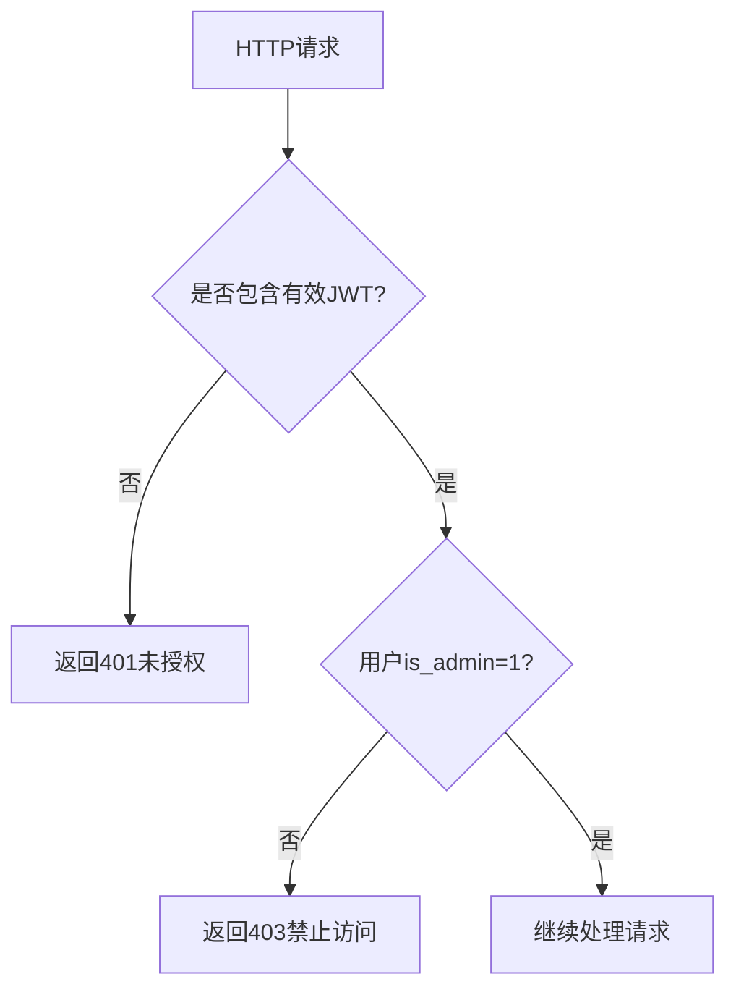
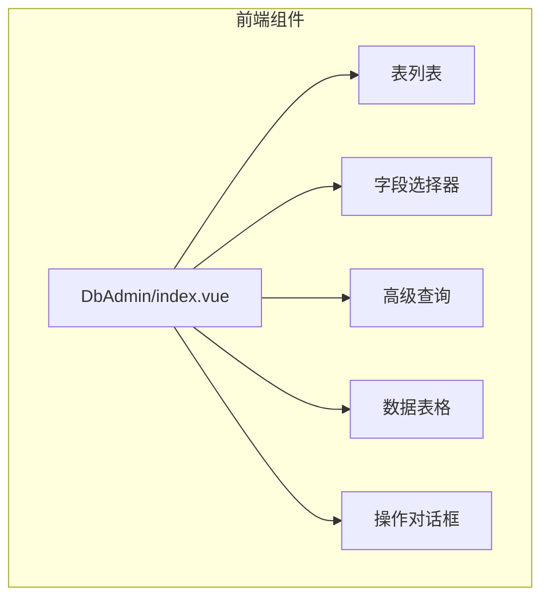
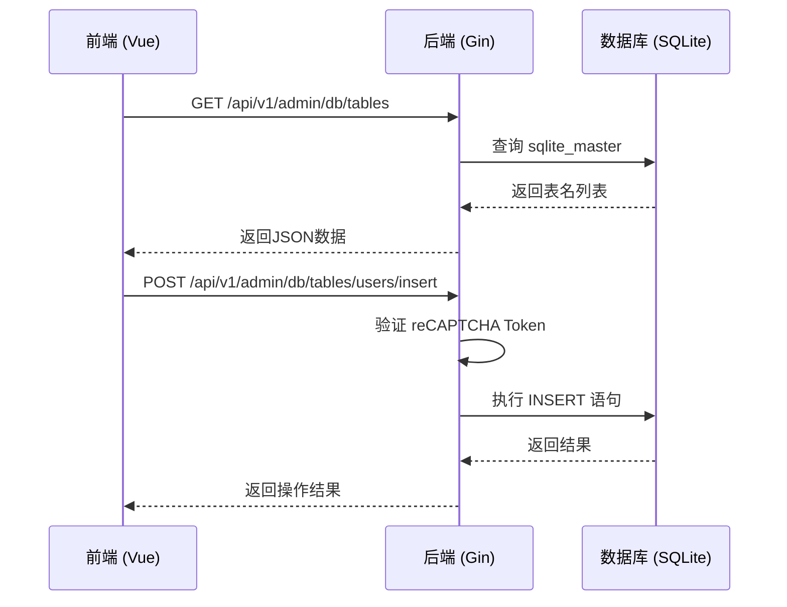

# 数据库管理界面

<cite>
**本文档引用文件**  
- [db_admin.go](file://api/db_admin.go)
- [dbAdmin.ts](file://practice_problems_web/src/api/dbAdmin.ts)
- [index.vue](file://practice_problems_web/src/views/DbAdmin/index.vue)
- [admin.go](file://middleware/admin.go)
- [recaptcha.go](file://middleware/recaptcha.go)
- [router.go](file://router/router.go)
- [DB_ADMIN_README.md](file://DB_ADMIN_README.md)
- [initialize/db.go](file://initialize/db.go)
- [user.go](file://model/user.go)
</cite>

## 目录
1. [简介](#简介)
2. [功能概述](#功能概述)
3. [核心特性](#核心特性)
4. [权限与安全机制](#权限与安全机制)
5. [前端界面分析](#前端界面分析)
6. [后端接口设计](#后端接口设计)
7. [数据库初始化与维护](#数据库初始化与维护)
8. [使用流程](#使用流程)
9. [注意事项与建议](#注意事项与建议)

## 简介

数据库管理界面是为本项目新增的核心功能模块，旨在为管理员提供一个可视化、安全的SQLite数据库操作平台。该界面允许管理员直接查看、查询、修改和管理数据库中的所有表及数据，极大地提升了系统的可维护性和数据操作的便捷性。系统通过严格的权限控制和多重安全验证，确保数据库操作的安全性。

## 功能概述

数据库管理功能为系统管理员提供了一套完整的数据库可视化操作工具，支持对SQLite数据库进行全方位的管理。该功能不仅限于简单的数据查看，还涵盖了数据的增、删、改、查、批量操作以及表结构和字段的管理。

**Section sources**
- [DB_ADMIN_README.md](file://DB_ADMIN_README.md#L3-L32)

## 核心特性

数据库管理界面具备以下核心特性：

- **用户角色管理**：系统通过在`users`表中添加`is_admin`字段来区分管理员和普通用户。只有管理员才能访问数据库管理界面。
- **全面的数据操作**：支持查看所有表、查询表结构、自定义字段查询、分页查询、条件查询、新增、编辑、删除单条或批量数据，以及批量更新。
- **表结构管理**：支持对字段进行排序、添加新字段、删除字段（主键除外）以及为表和字段添加备注信息。
- **实时反馈**：所有操作均提供明确的用户反馈，包括成功提示、错误信息和操作日志。

**Section sources**
- [DB_ADMIN_README.md](file://DB_ADMIN_README.md#L8-L32)

## 权限与安全机制

为确保数据库操作的安全，系统设计了多层安全验证机制。

### 管理员权限中间件

`middleware/admin.go` 文件中定义了 `AdminMiddleware` 中间件。该中间件在JWT鉴权通过后，进一步检查用户的`is_admin`字段。如果用户不是管理员（`is_admin != 1`），则返回403禁止访问状态码，从而阻止非管理员用户访问管理接口。

**Diagram sources**
- [admin.go](file://middleware/admin.go#L10-L54)

### Google reCAPTCHA 验证

所有修改类操作（如插入、更新、删除）都必须通过Google reCAPTCHA v3验证。`middleware/recaptcha.go` 中的 `RecaptchaMiddleware` 会检查请求体中的 `recaptcha_token`。在开发模式下，系统会跳过验证；在生产环境中，必须配置真实的密钥以启用验证，防止自动化脚本攻击。

**Section sources**
- [recaptcha.go](file://middleware/recaptcha.go#L26-L93)
- [DB_ADMIN_README.md](file://DB_ADMIN_README.md#L17-L19)

## 前端界面分析

前端界面采用Vue 3 + Element Plus构建，提供了直观且功能丰富的用户交互体验。

### 界面布局

界面采用经典的左右分栏布局：
- **左侧**：显示所有数据表的列表，包含表名和记录数。
- **右侧**：主操作区，根据选中的表动态展示数据和操作按钮。

### 核心组件

- **字段选择器**：允许用户勾选需要查询的字段，实现自定义查询。
- **高级查询**：提供一个可折叠的面板，支持为每个字段设置查询条件（等于、不等于、包含、为空等）。
- **数据表格**：展示查询结果，支持分页、行选择，并提供“编辑”和“删除”操作按钮。
- **操作对话框**：用于新增和编辑数据，表单字段根据表结构动态生成。

**Diagram sources**
- [index.vue](file://practice_problems_web/src/views/DbAdmin/index.vue#L1-L800)

**Section sources**
- [index.vue](file://practice_problems_web/src/views/DbAdmin/index.vue#L1-L800)

## 后端接口设计

后端API由 `api/db_admin.go` 文件提供，通过 `router/router.go` 进行路由注册。

### 查询接口

- `GET /api/v1/admin/db/tables`：获取所有表的列表。
- `GET /api/v1/admin/db/tables/:table/structure`：获取指定表的结构（字段信息）。
- `GET /api/v1/admin/db/tables/:table/data`：获取表数据，支持分页、字段选择和条件查询。

### 修改接口

所有修改接口均需在请求体中携带 `recaptcha_token`，并在后端进行验证。
- `POST /api/v1/admin/db/tables/:table/insert`：插入新数据。
- `PUT /api/v1/admin/db/tables/:table/update`：更新数据。
- `DELETE /api/v1/admin/db/tables/:table/delete`：删除数据。
- `PUT /api/v1/admin/db/tables/:table/batch-update`：批量更新。
- `DELETE /api/v1/admin/db/tables/:table/batch-delete`：批量删除。

**Diagram sources**
- [db_admin.go](file://api/db_admin.go#L91-L746)
- [router.go](file://router/router.go#L126-L149)

**Section sources**
- [db_admin.go](file://api/db_admin.go#L1-L1194)
- [router.go](file://router/router.go#L11-L172)

## 数据库初始化与维护

`initialize/db.go` 文件负责数据库的初始化和版本维护。

### 表结构初始化

`initSQLiteTables` 函数定义了所有数据表的创建语句，包括`users`、`subjects`、`knowledge_points`等业务表，以及`table_comments`、`column_comments`等用于管理界面的系统表。

### 数据库维护

`maintainingDatabaseTables` 函数在每次启动时检查数据库结构，并进行必要的维护：
- 为`users`表添加`is_admin`、`totp_secret`、`status`等新字段。
- 为`knowledge_points`表添加`video_url`字段。
- 移除`questions`表中已废弃的`note`字段。

**Section sources**
- [db.go](file://initialize/db.go#L1-L706)

## 使用流程

1. **设置管理员**：通过数据库直接修改`users`表，将目标用户的`is_admin`字段设为1。
2. **访问界面**：登录后，管理员可在首页右上角点击“数据库管理”按钮进入。
3. **执行操作**：
   - 选择一个表。
   - 选择要查询的字段。
   - 设置查询条件（可选）。
   - 点击“查询”按钮。
   - 进行增、删、改等操作，系统会要求输入Google验证码。

**Section sources**
- [DB_ADMIN_README.md](file://DB_ADMIN_README.md#L50-L68)

## 注意事项与建议

- **权限控制**：仅将管理员权限授予可信用户。
- **数据备份**：在执行任何修改操作前，务必备份数据库文件（`uploads/data.db`）。
- **生产环境配置**：必须在`middleware/recaptcha.go`中配置真实的Google reCAPTCHA密钥，以启用安全验证。
- **操作审计**：所有操作均记录在日志中，便于追踪和审计。

**Section sources**
- [DB_ADMIN_README.md](file://DB_ADMIN_README.md#L150-L157)