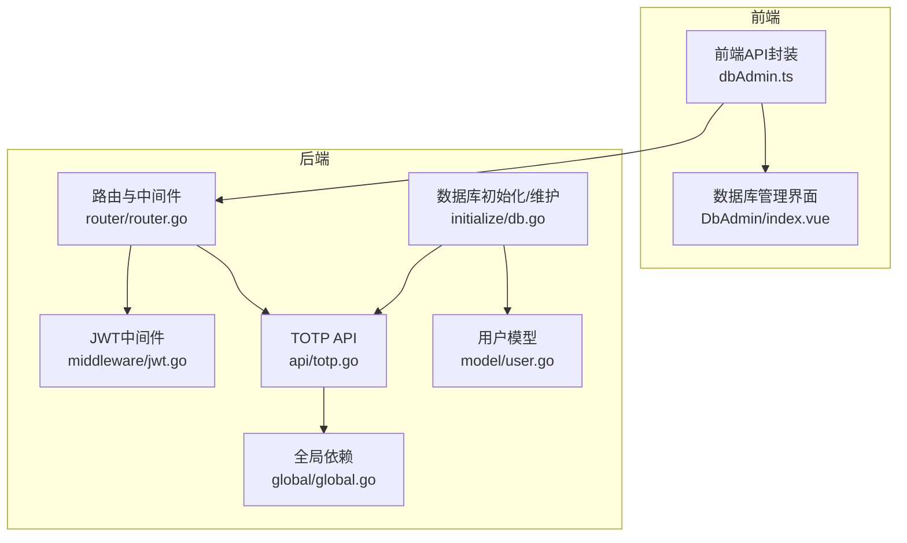
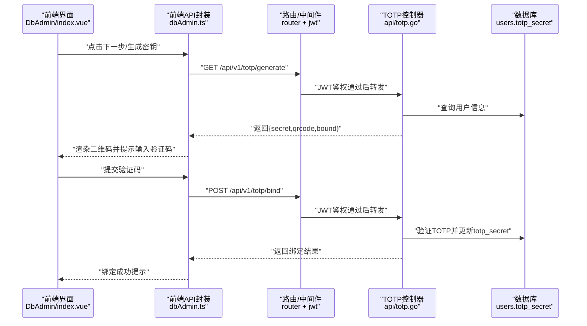
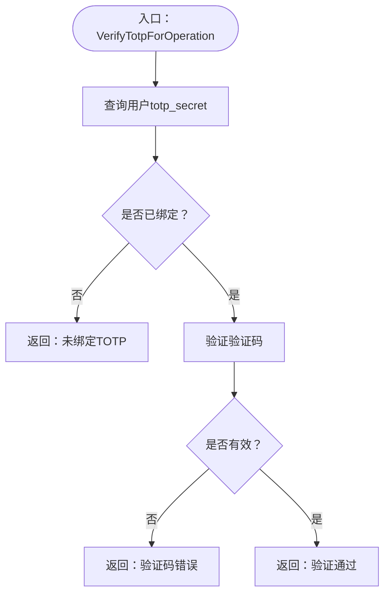
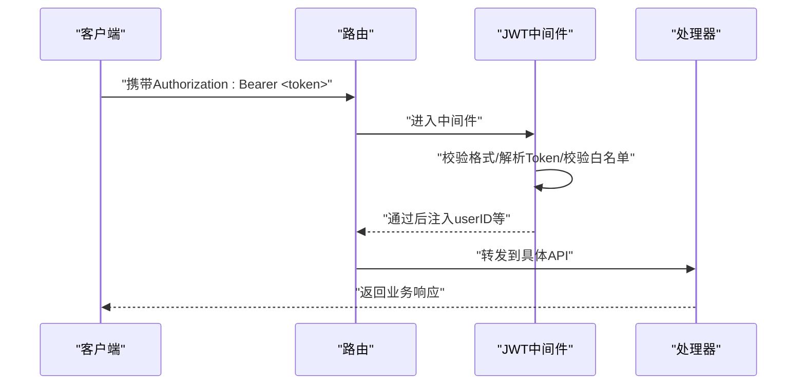
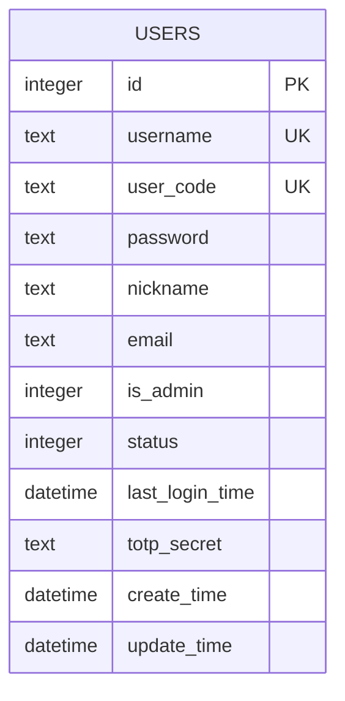
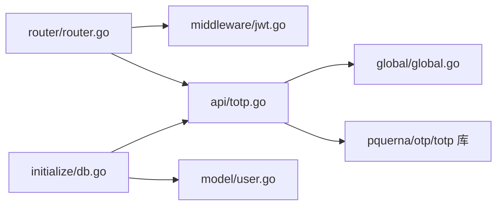

# TOTP二次验证

<cite>
**本文引用的文件**
- [api/totp.go](file://api/totp.go)
- [router/router.go](file://router/router.go)
- [middleware/jwt.go](file://middleware/jwt.go)
- [initialize/db.go](file://initialize/db.go)
- [model/user.go](file://model/user.go)
- [global/global.go](file://global/global.go)
- [practice_problems_web/src/api/dbAdmin.ts](file://practice_problems_web/src/api/dbAdmin.ts)
- [practice_problems_web/src/views/DbAdmin/index.vue](file://practice_problems_web/src/views/DbAdmin/index.vue)
</cite>

## 目录
1. [简介](#简介)
2. [项目结构](#项目结构)
3. [核心组件](#核心组件)
4. [架构总览](#架构总览)
5. [详细组件分析](#详细组件分析)
6. [依赖关系分析](#依赖关系分析)
7. [性能考量](#性能考量)
8. [故障排查指南](#故障排查指南)
9. [结论](#结论)
10. [附录](#附录)

## 简介
本文件系统性梳理本项目的TOTP（基于时间的一次性口令）二次验证能力，覆盖后端API、路由与中间件、数据库结构、前端交互与调用链路。目标是帮助开发者快速理解如何在现有系统中集成并使用TOTP，包括密钥生成、绑定、验证与解绑流程，并提供可操作的排障建议。

## 项目结构
围绕TOTP功能的关键文件分布如下：
- 后端API：api/totp.go
- 路由与鉴权：router/router.go、middleware/jwt.go
- 数据库初始化与维护：initialize/db.go
- 全局依赖：global/global.go
- 前端调用封装与界面：practice_problems_web/src/api/dbAdmin.ts、practice_problems_web/src/views/DbAdmin/index.vue
- 用户模型：model/user.go

图表来源
- [router/router.go](file://router/router.go#L33-L70)
- [middleware/jwt.go](file://middleware/jwt.go#L39-L99)
- [api/totp.go](file://api/totp.go#L12-L68)
- [initialize/db.go](file://initialize/db.go#L211-L267)
- [model/user.go](file://model/user.go#L27-L39)
- [global/global.go](file://global/global.go#L12-L23)

章节来源
- [router/router.go](file://router/router.go#L33-L70)
- [middleware/jwt.go](file://middleware/jwt.go#L39-L99)
- [api/totp.go](file://api/totp.go#L12-L68)
- [initialize/db.go](file://initialize/db.go#L211-L267)
- [model/user.go](file://model/user.go#L27-L39)
- [global/global.go](file://global/global.go#L12-L23)

## 核心组件
- 路由与鉴权
  - 路由在v1组下挂载JWT中间件，所有TOTP相关接口均需登录态。
  - JWT中间件负责校验Authorization头、解析Token并注入用户信息。
- TOTP API
  - 生成密钥与二维码、绑定、检查绑定状态、验证TOTP码、解绑。
  - 所有接口均通过c.Get("userID")获取当前用户ID，保证操作范围限定在当前登录用户。
- 数据库
  - users表新增totp_secret字段；初始化与维护脚本会在启动时自动补齐缺失字段。
- 前端
  - 前端提供TOTP相关API封装，界面实现“生成密钥→输入验证码→确认绑定”的流程。

章节来源
- [router/router.go](file://router/router.go#L33-L70)
- [middleware/jwt.go](file://middleware/jwt.go#L39-L99)
- [api/totp.go](file://api/totp.go#L12-L68)
- [initialize/db.go](file://initialize/db.go#L211-L267)
- [practice_problems_web/src/api/dbAdmin.ts](file://practice_problems_web/src/api/dbAdmin.ts#L5-L20)
- [practice_problems_web/src/views/DbAdmin/index.vue](file://practice_problems_web/src/views/DbAdmin/index.vue#L37-L76)

## 架构总览
下图展示TOTP在系统中的调用链与职责分工：

图表来源
- [router/router.go](file://router/router.go#L33-L70)
- [middleware/jwt.go](file://middleware/jwt.go#L39-L99)
- [api/totp.go](file://api/totp.go#L12-L68)
- [practice_problems_web/src/api/dbAdmin.ts](file://practice_problems_web/src/api/dbAdmin.ts#L13-L18)
- [practice_problems_web/src/views/DbAdmin/index.vue](file://practice_problems_web/src/views/DbAdmin/index.vue#L37-L76)

## 详细组件分析

### 后端API：TOTP控制器
- GenerateTotpSecret
  - 功能：为当前用户生成TOTP密钥与二维码URL；若已绑定则直接返回已绑定状态。
  - 关键点：使用pquerna/otp/totp生成密钥；返回字段包含secret与qrcode。
- VerifyTotpCode
  - 功能：接收secret与验证码，验证通过后将secret写入users.totp_secret。
  - 关键点：参数校验、验证失败日志、绑定成功日志。
- CheckTotpBound
  - 功能：查询当前用户是否已绑定TOTP，并返回is_admin标识。
- ValidateTotpCode
  - 功能：在执行敏感数据库操作前进行TOTP二次验证。
  - 关键点：先查密钥再验证，避免未绑定场景。
- UnbindTotp
  - 功能：解绑TOTP，需要用户提供一次验证码确认。
- VerifyTotpForOperation
  - 功能：供业务代码复用的二次验证辅助函数，返回error便于上层处理。

图表来源
- [api/totp.go](file://api/totp.go#L272-L297)

章节来源
- [api/totp.go](file://api/totp.go#L12-L68)
- [api/totp.go](file://api/totp.go#L71-L115)
- [api/totp.go](file://api/totp.go#L118-L151)
- [api/totp.go](file://api/totp.go#L154-L204)
- [api/totp.go](file://api/totp.go#L207-L269)
- [api/totp.go](file://api/totp.go#L272-L297)

### 路由与鉴权
- 路由
  - /api/v1/totp/* 接口均在auth组下，受JWT中间件保护。
- JWT中间件
  - 校验Authorization头格式、解析Token、注入userID/username/user_code等上下文。
  - 结合全局白名单校验，确保Token未被登出或撤销。

图表来源
- [router/router.go](file://router/router.go#L33-L70)
- [middleware/jwt.go](file://middleware/jwt.go#L39-L99)

章节来源
- [router/router.go](file://router/router.go#L33-L70)
- [middleware/jwt.go](file://middleware/jwt.go#L39-L99)

### 数据库与模型
- users表
  - 新增字段：totp_secret（TEXT），用于存储TOTP密钥。
  - 初始化与维护脚本会在启动时检测并自动添加该字段。
- model/user.go
  - DbUser结构体包含TotpSecret字段，类型为sql.NullString，便于处理NULL值。

图表来源
- [initialize/db.go](file://initialize/db.go#L432-L445)
- [model/user.go](file://model/user.go#L27-L39)

章节来源
- [initialize/db.go](file://initialize/db.go#L211-L267)
- [initialize/db.go](file://initialize/db.go#L432-L445)
- [model/user.go](file://model/user.go#L27-L39)

### 前端交互与调用
- 前端API封装
  - 提供checkTotpBound、generateTotpSecret、bindTotp、verifyTotp、unbindTotp等方法。
- 数据库管理界面
  - 实现“生成密钥→输入验证码→确认绑定”的交互流程，调用上述API。

章节来源
- [practice_problems_web/src/api/dbAdmin.ts](file://practice_problems_web/src/api/dbAdmin.ts#L5-L20)
- [practice_problems_web/src/api/dbAdmin.ts](file://practice_problems_web/src/api/dbAdmin.ts#L21-L53)
- [practice_problems_web/src/views/DbAdmin/index.vue](file://practice_problems_web/src/views/DbAdmin/index.vue#L37-L76)

## 依赖关系分析
- 组件耦合
  - api/totp.go依赖global.DB与日志；依赖pquerna/otp/totp进行密钥生成与验证。
  - 路由与中间件为TOTP接口提供统一的鉴权入口。
  - initialize/db.go负责数据库结构维护，确保users表具备totp_secret字段。
- 外部依赖
  - Gin框架、JWT库、Zap日志库、SQLite驱动与pquerna/otp/totp库。

图表来源
- [api/totp.go](file://api/totp.go#L12-L68)
- [global/global.go](file://global/global.go#L12-L23)
- [router/router.go](file://router/router.go#L33-L70)
- [middleware/jwt.go](file://middleware/jwt.go#L39-L99)
- [initialize/db.go](file://initialize/db.go#L211-L267)
- [model/user.go](file://model/user.go#L27-L39)

章节来源
- [api/totp.go](file://api/totp.go#L12-L68)
- [router/router.go](file://router/router.go#L33-L70)
- [middleware/jwt.go](file://middleware/jwt.go#L39-L99)
- [initialize/db.go](file://initialize/db.go#L211-L267)
- [model/user.go](file://model/user.go#L27-L39)
- [global/global.go](file://global/global.go#L12-L23)

## 性能考量
- 数据库连接与事务
  - 初始化阶段设置连接池参数，建议在高并发场景下根据业务峰值调整最大连接数与空闲连接数。
- 日志与中间件
  - JWT中间件使用zap日志，注意生产环境日志级别与输出频率，避免过多Debug日志影响性能。
- TOTP验证
  - 验证过程为本地算法计算，开销极低；建议避免在高频路径重复查询数据库以减少IO。

[本节为通用指导，不直接分析具体文件]

## 故障排查指南
- 未授权/鉴权失败
  - 现象：返回401或“未携带Token/格式错误/解析失败/登录已失效”。
  - 排查：确认Authorization头格式为Bearer <token>；检查Token是否在白名单中；核对签名密钥与过期时间。
  - 参考
    - [middleware/jwt.go](file://middleware/jwt.go#L39-L99)
- 生成密钥失败
  - 现象：生成TOTP密钥或二维码失败。
  - 排查：检查数据库连接、日志错误；确认用户存在且未被禁用。
  - 参考
    - [api/totp.go](file://api/totp.go#L12-L68)
- 绑定失败
  - 现象：验证码正确但绑定失败。
  - 排查：检查数据库写入权限、字段类型；查看日志定位错误。
  - 参考
    - [api/totp.go](file://api/totp.go#L71-L115)
- 未绑定TOTP
  - 现象：验证或解绑时报“未绑定TOTP”。
  - 排查：确认前端已成功绑定；检查users表totp_secret字段是否写入。
  - 参考
    - [api/totp.go](file://api/totp.go#L154-L204)
    - [api/totp.go](file://api/totp.go#L207-L269)
- 数据库字段缺失
  - 现象：启动时报错或功能异常。
  - 排查：确认users表包含totp_secret字段；如缺失，初始化脚本会自动添加。
  - 参考
    - [initialize/db.go](file://initialize/db.go#L211-L267)

章节来源
- [middleware/jwt.go](file://middleware/jwt.go#L39-L99)
- [api/totp.go](file://api/totp.go#L12-L68)
- [api/totp.go](file://api/totp.go#L71-L115)
- [api/totp.go](file://api/totp.go#L154-L204)
- [api/totp.go](file://api/totp.go#L207-L269)
- [initialize/db.go](file://initialize/db.go#L211-L267)

## 结论
本项目通过简洁的API与中间件机制实现了TOTP二次验证闭环：前端发起生成与绑定流程，后端在JWT保护下完成密钥生成、验证码验证与数据库写入；初始化脚本自动维护数据库结构，确保功能可用。建议在生产环境中强化日志与监控，完善异常回退与重试策略，并对高并发场景下的数据库连接池进行容量评估。

[本节为总结性内容，不直接分析具体文件]

## 附录
- 常用接口清单
  - GET /api/v1/totp/check：检查是否已绑定TOTP
  - GET /api/v1/totp/generate：生成TOTP密钥与二维码
  - POST /api/v1/totp/bind：验证并绑定TOTP
  - POST /api/v1/totp/verify：验证TOTP码（用于敏感操作前）
  - POST /api/v1/totp/unbind：解绑TOTP（需验证码）

章节来源
- [router/router.go](file://router/router.go#L33-L70)
- [practice_problems_web/src/api/dbAdmin.ts](file://practice_problems_web/src/api/dbAdmin.ts#L5-L20)
- [practice_problems_web/src/api/dbAdmin.ts](file://practice_problems_web/src/api/dbAdmin.ts#L21-L53)