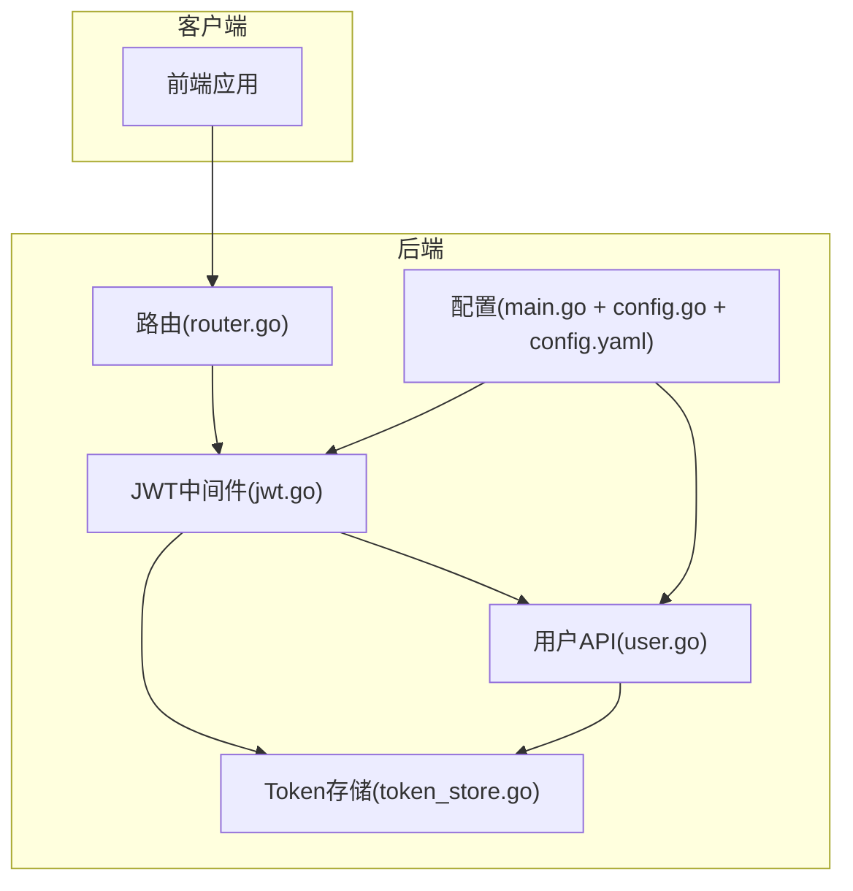
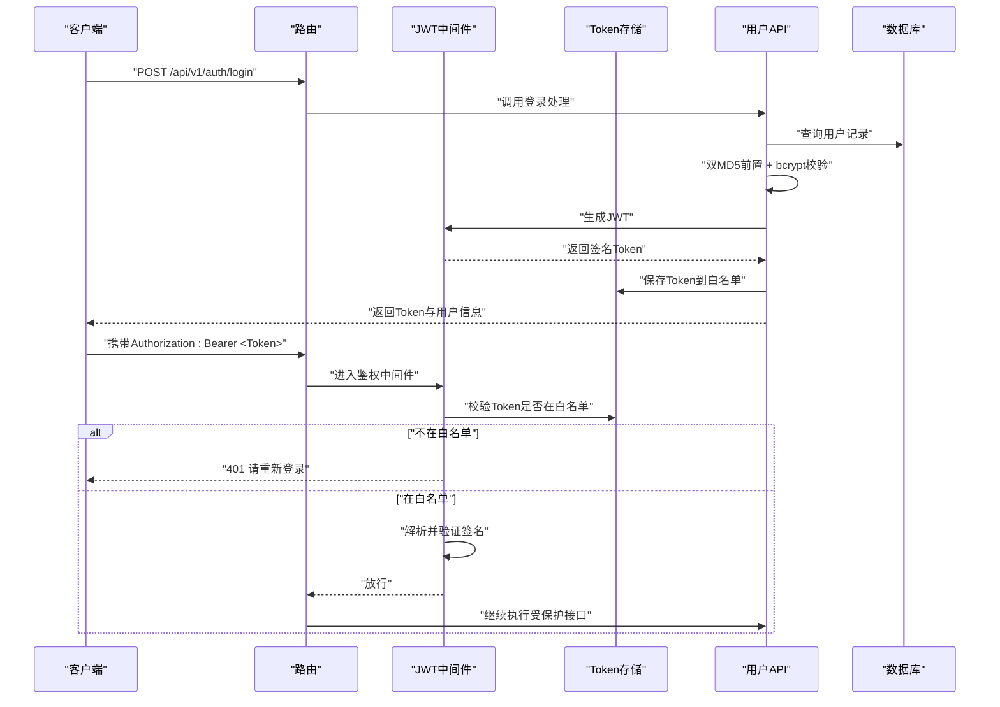
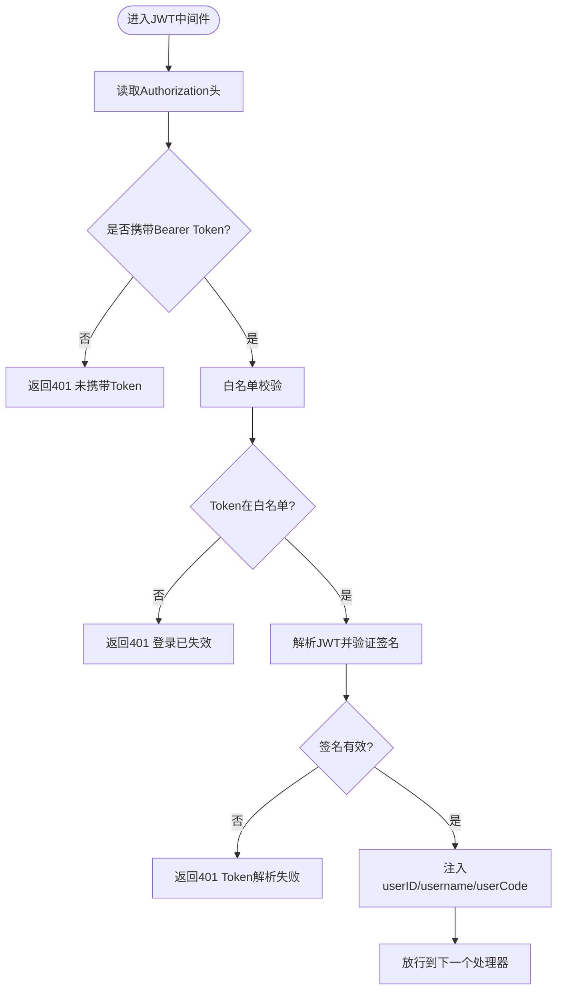
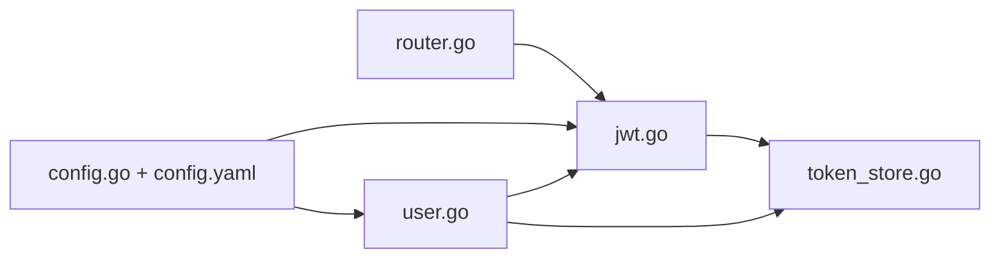

# 安全考虑

<cite>
**本文引用的文件**
- [config.yaml](file://config.yaml)
- [config.go](file://config/config.go)
- [main.go](file://main.go)
- [router.go](file://router/router.go)
- [jwt.go](file://middleware/jwt.go)
- [token_store.go](file://global/token_store.go)
- [user.go](file://api/user.go)
- [user_model.go](file://model/user.go)
- [bcrypt](file://api/user.go)
- [jwt](file://middleware/jwt.go)
</cite>

## 目录
1. [引言](#引言)
2. [项目结构](#项目结构)
3. [核心组件](#核心组件)
4. [架构总览](#架构总览)
5. [详细组件分析](#详细组件分析)
6. [依赖关系分析](#依赖关系分析)
7. [性能与安全特性](#性能与安全特性)
8. [故障排查指南](#故障排查指南)
9. [结论](#结论)

## 引言
本文件系统性梳理本项目的认证与授权安全设计，重点覆盖：
- JWT认证流程：登录签发、前端携带、中间件验证与白名单控制
- 密码存储：bcrypt哈希策略与双MD5前置处理
- Token刷新与注销机制现状与建议
- 配置与密钥管理：敏感信息存放位置与风险
- 安全风险与缓解：Token泄露、暴力破解、传输安全等
- HTTPS与传输层保护的重要性

## 项目结构
围绕安全相关的模块，主要涉及以下文件与职责：
- 路由与中间件：路由挂载JWT中间件，统一拦截受保护接口
- JWT中间件：解析与校验Token，结合内存白名单实现“可撤销”登录
- Token存储：内存白名单，支持登录保存、退出删除、按用户批量踢下线
- 用户API：登录、注册、退出、修改密码；密码采用bcrypt哈希
- 配置：数据库连接配置；JWT密钥硬编码于源码，需迁移至安全配置

图表来源
- [router.go](file://router/router.go#L1-L60)
- [jwt.go](file://middleware/jwt.go#L1-L100)
- [token_store.go](file://global/token_store.go#L1-L50)
- [user.go](file://api/user.go#L1-L342)
- [main.go](file://main.go#L1-L59)
- [config.go](file://config/config.go#L1-L16)
- [config.yaml](file://config.yaml#L1-L9)

章节来源
- [router.go](file://router/router.go#L1-L60)
- [jwt.go](file://middleware/jwt.go#L1-L100)
- [token_store.go](file://global/token_store.go#L1-L50)
- [user.go](file://api/user.go#L1-L342)
- [main.go](file://main.go#L1-L59)
- [config.go](file://config/config.go#L1-L16)
- [config.yaml](file://config.yaml#L1-L9)

## 核心组件
- JWT中间件与密钥
  - 密钥常量位于中间件文件，使用对称签名算法签发与验证
  - 中间件在鉴权链路中先检查白名单，再解析并验证签名
- Token存储与白名单
  - 内存Map作为白名单，Key为Token字符串，Value为用户标识
  - 支持保存、校验、删除、按用户批量清理
- 用户认证流程
  - 登录：账号密码登录时，先做双MD5前置，再与bcrypt哈希比对
  - Token签发：生成含用户ID、用户名、用户编码与过期时间的JWT
  - 退出：删除白名单中的Token
- 密码哈希
  - bcrypt.GenerateFromPassword与CompareHashAndPassword用于存储与校验
- 配置与密钥
  - 数据库配置来自YAML；JWT密钥硬编码在源码中，存在安全风险

章节来源
- [jwt.go](file://middleware/jwt.go#L1-L100)
- [token_store.go](file://global/token_store.go#L1-L50)
- [user.go](file://api/user.go#L1-L342)
- [config.yaml](file://config.yaml#L1-L9)
- [config.go](file://config/config.go#L1-L16)

## 架构总览
下图展示从客户端到后端的关键交互与安全控制点。

图表来源
- [router.go](file://router/router.go#L1-L60)
- [jwt.go](file://middleware/jwt.go#L1-L100)
- [token_store.go](file://global/token_store.go#L1-L50)
- [user.go](file://api/user.go#L1-L342)

## 详细组件分析

### JWT认证流程与中间件
- 签发阶段
  - 登录成功后，调用签发函数生成JWT，载荷包含用户ID、用户名、用户编码与过期时间
  - 使用对称密钥进行签名
- 前端携带
  - 请求头携带 Authorization: Bearer <Token>
- 中间件验证
  - 顺序：白名单校验 → 解析与签名验证 → 提取用户上下文
  - 若白名单不存在或签名无效，直接返回未授权
- 白名单机制
  - 登录时将Token写入白名单；退出时删除；可扩展为按用户批量踢下线

图表来源
- [jwt.go](file://middleware/jwt.go#L1-L100)
- [token_store.go](file://global/token_store.go#L1-L50)

章节来源
- [jwt.go](file://middleware/jwt.go#L1-L100)
- [token_store.go](file://global/token_store.go#L1-L50)

### 密码哈希与存储
- 存储策略
  - 注册与修改密码均采用双MD5前置，再使用bcrypt生成哈希并入库
  - 登录校验时同样先做双MD5，再与数据库中bcrypt哈希比较
- 安全要点
  - bcrypt具备成本因子，抗暴力破解能力较强
  - 双MD5前置可视为额外混淆，但不改变bcrypt的核心防护作用
- 风险提示
  - 建议仅保留bcrypt，避免多轮哈希导致的复杂性与潜在误判
  - 若保留双MD5，务必确保前后端一致且不可逆

章节来源
- [user.go](file://api/user.go#L1-L342)
- [user_model.go](file://model/user.go#L1-L35)

### Token刷新与注销机制
- 现状
  - 未实现标准的刷新令牌（Refresh Token）机制
  - 注销通过删除白名单中的Token实现，立即使该Token失效
- 建议
  - 引入短期Access Token与长期Refresh Token
  - Access Token过期后，使用Refresh Token换取新的Access Token
  - Refresh Token应存储在安全介质（HttpOnly Cookie），并支持撤销
  - 提供“全部设备下线”接口，按用户批量清除Refresh Token

章节来源
- [user.go](file://api/user.go#L242-L259)
- [token_store.go](file://global/token_store.go#L1-L50)

### 配置与密钥管理
- 数据库配置
  - YAML文件提供MySQL连接参数，便于部署时替换
- JWT密钥
  - 当前密钥硬编码在源码中，存在泄露风险
  - 建议迁移到环境变量或安全配置中心，运行时注入
- 最佳实践
  - 使用只读权限的配置文件
  - 对密钥进行定期轮换
  - 在CI/CD中避免将密钥明文提交到仓库

章节来源
- [config.yaml](file://config.yaml#L1-L9)
- [config.go](file://config/config.go#L1-L16)
- [main.go](file://main.go#L1-L59)
- [jwt.go](file://middleware/jwt.go#L1-L100)

## 依赖关系分析
- 组件耦合
  - 路由依赖中间件；中间件依赖Token存储；用户API依赖中间件与Token存储
  - 密钥与路由/中间件存在直接依赖，影响整体安全性
- 外部依赖
  - Gin框架、JWT库、bcrypt库、Zap日志库
- 潜在问题
  - 密钥硬编码导致单点泄露风险
  - 白名单为内存结构，进程重启后清空，无法跨实例持久化

图表来源
- [router.go](file://router/router.go#L1-L60)
- [jwt.go](file://middleware/jwt.go#L1-L100)
- [token_store.go](file://global/token_store.go#L1-L50)
- [user.go](file://api/user.go#L1-L342)
- [config.go](file://config/config.go#L1-L16)
- [config.yaml](file://config.yaml#L1-L9)

章节来源
- [router.go](file://router/router.go#L1-L60)
- [jwt.go](file://middleware/jwt.go#L1-L100)
- [token_store.go](file://global/token_store.go#L1-L50)
- [user.go](file://api/user.go#L1-L342)
- [config.go](file://config/config.go#L1-L16)
- [config.yaml](file://config.yaml#L1-L9)

## 性能与安全特性
- 性能
  - 白名单为内存Map，读写加锁，适合小规模并发；高并发场景建议引入Redis等分布式缓存
  - bcrypt成本因子影响CPU占用，建议根据服务器性能合理设置
- 安全
  - 对称密钥签发的JWT在单实例内有效；跨实例需共享密钥或改为非对称密钥
  - Token有效期较长（约30天），建议缩短并配合刷新机制
  - 建议启用HttpOnly与SameSite Cookie保护，减少XSS与CSRF风险

[本节为通用指导，不直接分析具体文件]

## 故障排查指南
- 401 未携带Token
  - 检查请求头是否包含Authorization: Bearer <Token>
- 401 Token格式错误
  - 确认Authorization头格式为Bearer，且不含多余空格
- 401 登录已失效
  - 可能已被退出或白名单中不存在该Token
  - 检查是否调用了退出接口或被管理员踢下线
- 密码错误
  - 确认前端是否做了双MD5前置，后端与前端保持一致
- 密钥相关问题
  - 若密钥被修改，历史签发的Token将无法验证；需配合刷新机制或重启服务

章节来源
- [jwt.go](file://middleware/jwt.go#L1-L100)
- [user.go](file://api/user.go#L1-L342)

## 结论
- 本项目实现了基于JWT的认证与“可撤销”登录（通过白名单），并在密码层面采用bcrypt增强抗破解能力
- 存在的关键风险包括：JWT密钥硬编码、Token有效期较长、缺少刷新与注销的完整流程、白名单为内存结构
- 建议优先完成密钥迁移、引入短期Access Token与长期Refresh Token、完善注销与批量踢下线能力，并加强传输层安全（HTTPS）