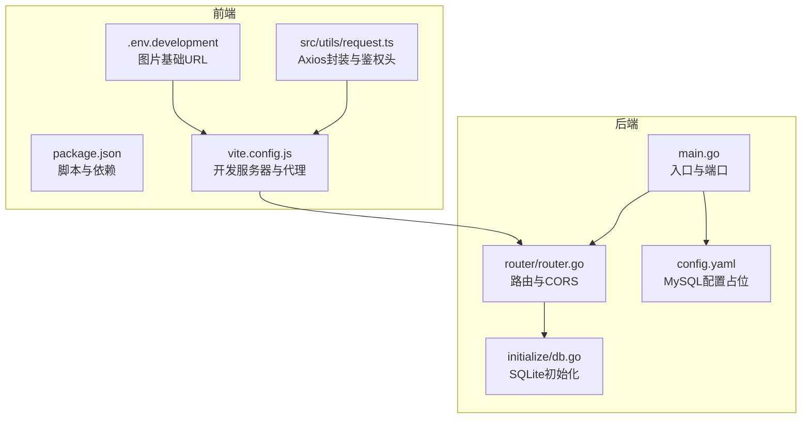
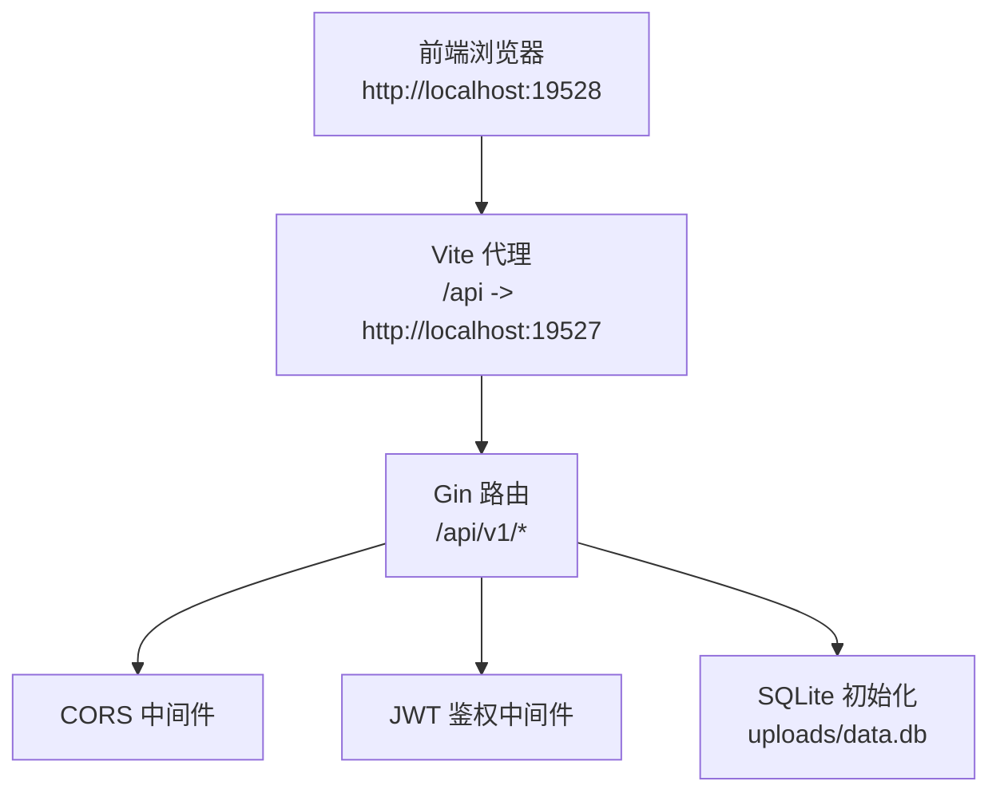
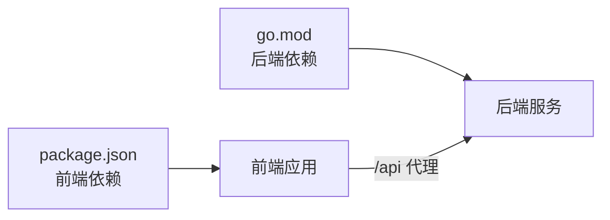

# 快速开始

<cite>
**本文引用的文件**
- [README.md](file://README.md)
- [main.go](file://main.go)
- [go.mod](file://go.mod)
- [config.yaml](file://config.yaml)
- [initialize/db.go](file://initialize/db.go)
- [router/router.go](file://router/router.go)
- [middleware/jwt.go](file://middleware/jwt.go)
- [practice_problems_web/package.json](file://practice_problems_web/package.json)
- [practice_problems_web/vite.config.js](file://practice_problems_web/vite.config.js)
- [practice_problems_web/.env.development](file://practice_problems_web/.env.development)
- [practice_problems_web/src/utils/request.ts](file://practice_problems_web/src/utils/request.ts)
</cite>

## 目录
1. [简介](#简介)
2. [项目结构](#项目结构)
3. [核心组件](#核心组件)
4. [架构总览](#架构总览)
5. [详细组件分析](#详细组件分析)
6. [依赖关系分析](#依赖关系分析)
7. [性能注意事项](#性能注意事项)
8. [故障排查指南](#故障排查指南)
9. [结论](#结论)
10. [附录](#附录)

## 简介
本指南面向开发者，帮助你在本地 10 分钟内完成项目搭建与运行。内容覆盖：
- 环境要求与验证（Go 1.18+、Node.js 16+）
- 后端服务启动流程（克隆、依赖、运行）
- 前端服务启动流程（安装依赖、开发服务器）
- 默认端口与跨域配置说明
- 常见问题排查（端口占用、依赖下载失败、数据库初始化失败）

## 项目结构
项目采用“后端 Go + 前端 Vue 3”的双模块结构，根目录包含后端入口与配置，前端位于 practice_problems_web 子目录。

图表来源
- [main.go](file://main.go#L1-L32)
- [router/router.go](file://router/router.go#L1-L127)
- [initialize/db.go](file://initialize/db.go#L1-L120)
- [config.yaml](file://config.yaml#L1-L9)
- [practice_problems_web/package.json](file://practice_problems_web/package.json#L1-L33)
- [practice_problems_web/vite.config.js](file://practice_problems_web/vite.config.js#L1-L40)
- [practice_problems_web/.env.development](file://practice_problems_web/.env.development#L1-L5)
- [practice_problems_web/src/utils/request.ts](file://practice_problems_web/src/utils/request.ts#L1-L70)

章节来源
- [README.md](file://README.md#L55-L87)
- [go.mod](file://go.mod#L1-L6)
- [practice_problems_web/package.json](file://practice_problems_web/package.json#L1-L33)

## 核心组件
- 后端入口与端口
  - 后端默认监听端口为 19527，可在入口文件中修改。
- 路由与跨域
  - 路由组前缀为 /api/v1；CORS 中间件允许任意来源与多种方法。
- 数据库初始化
  - 使用 SQLite，首次运行会在 uploads 目录创建 data.db 并初始化表结构。
- 前端开发服务器
  - 默认端口 19528；通过代理将 /api 前缀转发到后端 19527。
- 鉴权与请求封装
  - 前端 Axios 在请求头注入 Bearer Token；后端 JWT 中间件校验。

章节来源
- [main.go](file://main.go#L24-L31)
- [router/router.go](file://router/router.go#L111-L127)
- [initialize/db.go](file://initialize/db.go#L14-L120)
- [practice_problems_web/vite.config.js](file://practice_problems_web/vite.config.js#L25-L38)
- [middleware/jwt.go](file://middleware/jwt.go#L39-L101)
- [practice_problems_web/src/utils/request.ts](file://practice_problems_web/src/utils/request.ts#L1-L70)

## 架构总览
后端基于 Gin 提供 REST API，前端通过 Vite 开发服务器与后端交互，CORS 放通以支持本地联调。

图表来源
- [practice_problems_web/vite.config.js](file://practice_problems_web/vite.config.js#L25-L38)
- [router/router.go](file://router/router.go#L111-L127)
- [middleware/jwt.go](file://middleware/jwt.go#L39-L101)
- [initialize/db.go](file://initialize/db.go#L14-L120)

## 详细组件分析

### 后端启动流程（Go）
- 克隆仓库与进入目录
  - 参考：[README.md](file://README.md#L62-L75)
- 下载依赖
  - 使用 go mod tidy 下载依赖
  - 参考：[go.mod](file://go.mod#L1-L6)
- 运行主程序
  - 启动后会初始化日志、SQLite、路由，并监听 19527 端口
  - 参考：[main.go](file://main.go#L13-L31)
- 数据库初始化
  - 首次运行会在 uploads 目录创建 data.db 并执行建表
  - 参考：[initialize/db.go](file://initialize/db.go#L14-L120)

章节来源
- [README.md](file://README.md#L62-L75)
- [go.mod](file://go.mod#L1-L6)
- [main.go](file://main.go#L13-L31)
- [initialize/db.go](file://initialize/db.go#L14-L120)

### 前端启动流程（Vue 3 + Vite）
- 进入前端目录
  - 参考：[README.md](file://README.md#L77-L87)
- 安装依赖
  - 使用 npm install 安装依赖
  - 参考：[practice_problems_web/package.json](file://practice_problems_web/package.json#L1-L33)
- 启动开发服务器
  - 使用 npm run dev，默认监听 19528 端口
  - 参考：[practice_problems_web/vite.config.js](file://practice_problems_web/vite.config.js#L25-L38)
- 代理与跨域
  - Vite 代理将 /api 前缀转发到后端 19527；CORS 中间件放通任意来源
  - 参考：[router/router.go](file://router/router.go#L111-L127)
- 图片资源基础 URL
  - 前端开发环境图片基础地址指向后端 19527 端口
  - 参考：[practice_problems_web/.env.development](file://practice_problems_web/.env.development#L1-L5)

章节来源
- [README.md](file://README.md#L77-L87)
- [practice_problems_web/package.json](file://practice_problems_web/package.json#L1-L33)
- [practice_problems_web/vite.config.js](file://practice_problems_web/vite.config.js#L1-L40)
- [router/router.go](file://router/router.go#L111-L127)
- [practice_problems_web/.env.development](file://practice_problems_web/.env.development#L1-L5)

### 鉴权与请求封装
- 前端 Axios
  - 在请求头注入 Authorization: Bearer <token>
  - 响应拦截处理 401 与通用错误提示
  - 参考：[practice_problems_web/src/utils/request.ts](file://practice_problems_web/src/utils/request.ts#L1-L70)
- 后端 JWT 中间件
  - 校验 Bearer Token，支持内存白名单与过期处理
  - 参考：[middleware/jwt.go](file://middleware/jwt.go#L39-L101)

章节来源
- [practice_problems_web/src/utils/request.ts](file://practice_problems_web/src/utils/request.ts#L1-L70)
- [middleware/jwt.go](file://middleware/jwt.go#L39-L101)

## 依赖关系分析
- 后端依赖
  - Gin、JWT、Zap、SQLite 驱动等
  - 参考：[go.mod](file://go.mod#L1-L63)
- 前端依赖
  - Vue 3、Element Plus、Axios、Vite 插件等
  - 参考：[practice_problems_web/package.json](file://practice_problems_web/package.json#L1-L33)

图表来源
- [go.mod](file://go.mod#L1-L63)
- [practice_problems_web/package.json](file://practice_problems_web/package.json#L1-L33)

章节来源
- [go.mod](file://go.mod#L1-L63)
- [practice_problems_web/package.json](file://practice_problems_web/package.json#L1-L33)

## 性能注意事项
- 后端
  - SQLite 启用 WAL 模式与同步策略，提升并发写入性能
  - 参考：[initialize/db.go](file://initialize/db.go#L39-L57)
- 前端
  - Vite 开发服务器默认启用自动打开浏览器与代理，减少联调成本
  - 参考：[practice_problems_web/vite.config.js](file://practice_problems_web/vite.config.js#L25-L38)

章节来源
- [initialize/db.go](file://initialize/db.go#L39-L57)
- [practice_problems_web/vite.config.js](file://practice_problems_web/vite.config.js#L25-L38)

## 故障排查指南
- 端口占用
  - 后端默认端口 19527，前端默认端口 19528。若被占用，可在对应配置中调整：
    - 后端端口：参考入口文件中的监听端口设置
      - [main.go](file://main.go#L24-L31)
    - 前端端口：参考 Vite 配置
      - [practice_problems_web/vite.config.js](file://practice_problems_web/vite.config.js#L25-L38)
- 依赖下载失败
  - 后端依赖：确保 go.mod 正常且网络可达
    - [go.mod](file://go.mod#L1-L6)
  - 前端依赖：确保 npm install 成功，必要时清理缓存或更换镜像源
    - [practice_problems_web/package.json](file://practice_problems_web/package.json#L1-L33)
- 数据库初始化失败
  - 首次运行会在 uploads 目录创建 data.db 并初始化表结构；若失败请检查权限与磁盘空间
    - [initialize/db.go](file://initialize/db.go#L14-L120)
- 跨域问题
  - 后端已内置 CORS 放通；前端代理 /api 到 19527；如仍失败，检查代理配置与浏览器控制台
    - [router/router.go](file://router/router.go#L111-L127)
    - [practice_problems_web/vite.config.js](file://practice_problems_web/vite.config.js#L25-L38)
- 登录与鉴权异常
  - 前端需在本地存储 token 并在请求头注入 Bearer；后端 JWT 中间件校验失败会返回 401
    - [practice_problems_web/src/utils/request.ts](file://practice_problems_web/src/utils/request.ts#L1-L70)
    - [middleware/jwt.go](file://middleware/jwt.go#L39-L101)

章节来源
- [main.go](file://main.go#L24-L31)
- [practice_problems_web/vite.config.js](file://practice_problems_web/vite.config.js#L25-L38)
- [go.mod](file://go.mod#L1-L6)
- [practice_problems_web/package.json](file://practice_problems_web/package.json#L1-L33)
- [initialize/db.go](file://initialize/db.go#L14-L120)
- [router/router.go](file://router/router.go#L111-L127)
- [practice_problems_web/src/utils/request.ts](file://practice_problems_web/src/utils/request.ts#L1-L70)
- [middleware/jwt.go](file://middleware/jwt.go#L39-L101)

## 结论
按照本指南，你可以在 10 分钟内完成环境准备、后端与前端的本地运行，并理解默认端口与跨域配置。遇到问题时，优先检查端口占用、依赖下载与数据库初始化，再核对代理与鉴权配置。

## 附录
- 默认端口
  - 后端：19527
    - [main.go](file://main.go#L24-L31)
  - 前端：19528
    - [practice_problems_web/vite.config.js](file://practice_problems_web/vite.config.js#L25-L38)
- 跨域配置
  - 后端 CORS 放通任意来源与常用方法
    - [router/router.go](file://router/router.go#L111-L127)
  - 前端代理 /api 到后端 19527
    - [practice_problems_web/vite.config.js](file://practice_problems_web/vite.config.js#L25-L38)
- 环境要求
  - Go >= 1.18（项目 go.mod 指定 1.25，满足 1.18+ 要求）
    - [go.mod](file://go.mod#L1-L6)
  - Node.js >= 16
    - [README.md](file://README.md#L57-L61)