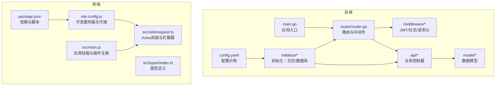
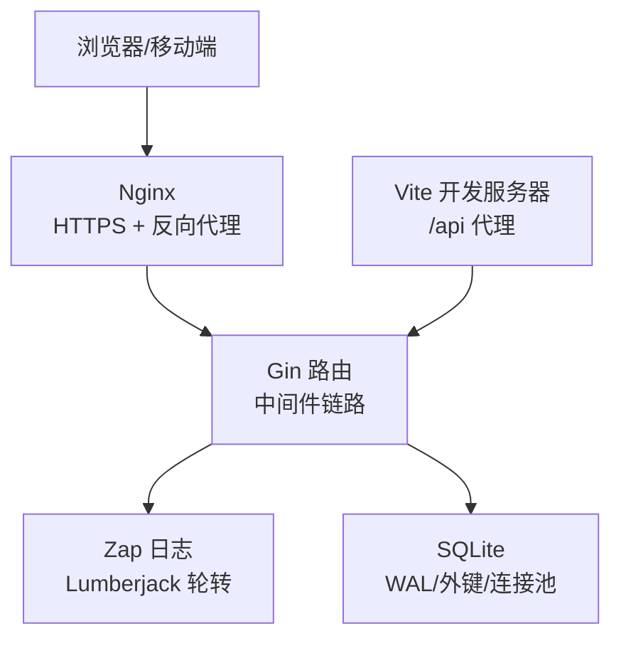
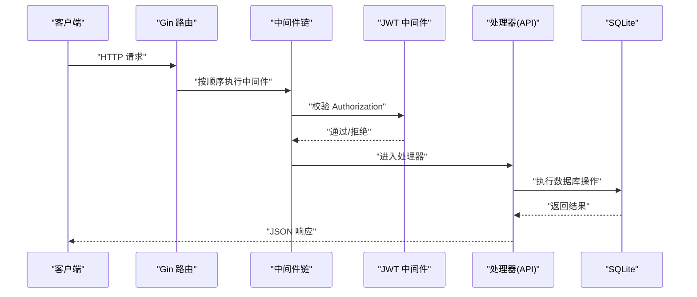
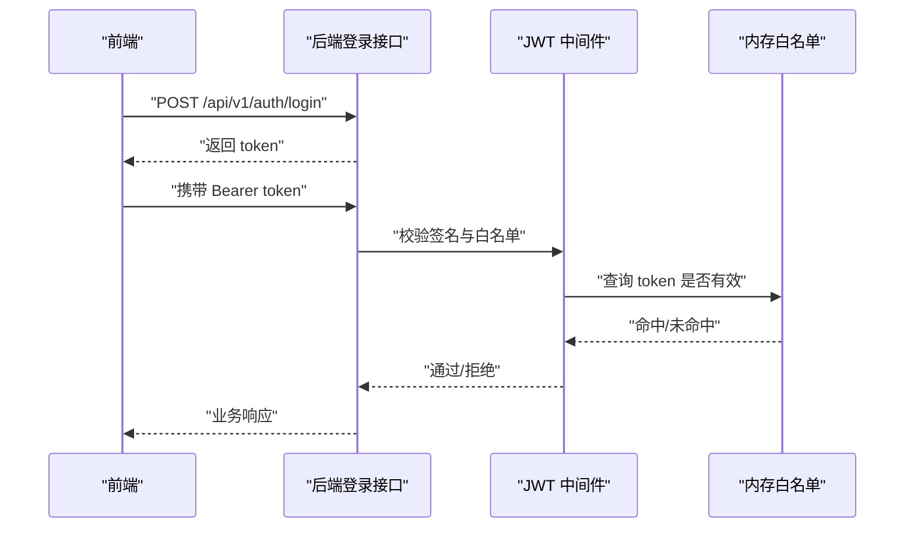
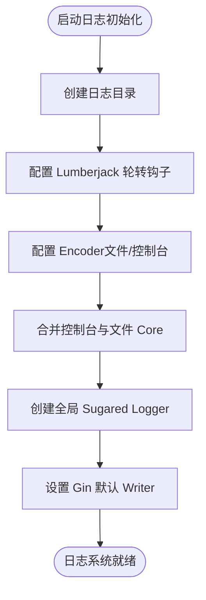
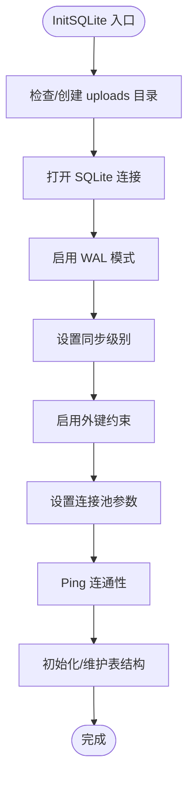
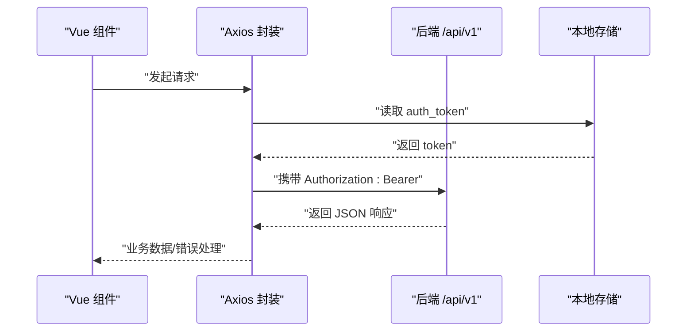
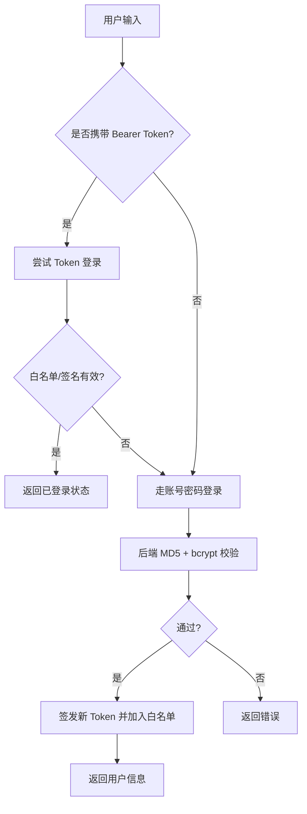
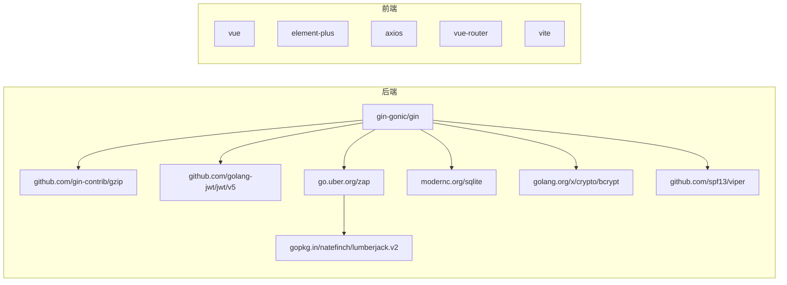
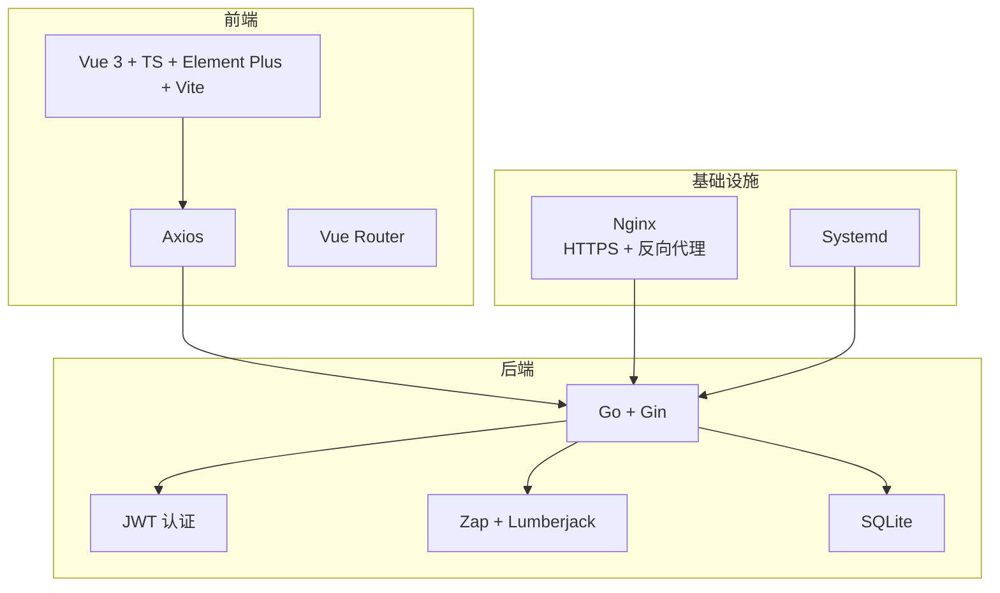

# 技术栈

<cite>
**本文引用的文件**
- [go.mod](file://go.mod)
- [README.md](file://README.md)
- [config.yaml](file://config.yaml)
- [main.go](file://main.go)
- [initialize/db.go](file://initialize/db.go)
- [initialize/logger.go](file://initialize/logger.go)
- [router/router.go](file://router/router.go)
- [middleware/jwt.go](file://middleware/jwt.go)
- [api/user.go](file://api/user.go)
- [model/user.go](file://model/user.go)
- [practice_problems_web/package.json](file://practice_problems_web/package.json)
- [practice_problems_web/vite.config.js](file://practice_problems_web/vite.config.js)
- [practice_problems_web/src/main.js](file://practice_problems_web/src/main.js)
- [practice_problems_web/src/utils/request.ts](file://practice_problems_web/src/utils/request.ts)
- [practice_problems_web/src/types/index.ts](file://practice_problems_web/src/types/index.ts)
</cite>

## 目录
1. [简介](#简介)
2. [项目结构](#项目结构)
3. [核心组件](#核心组件)
4. [架构总览](#架构总览)
5. [详细组件分析](#详细组件分析)
6. [依赖关系分析](#依赖关系分析)
7. [性能考量](#性能考量)
8. [故障排查指南](#故障排查指南)
9. [结论](#结论)
10. [附录](#附录)

## 简介
本项目采用“后端 Go + 前端 Vue 3 + SQLite + 基础设施”一体化技术栈，强调：
- 后端：高性能 HTTP 框架、无状态 JWT 认证、结构化日志与日志轮转、嵌入式 SQLite 数据库。
- 前端：Vue 3 组合式 API、TypeScript 类型安全、Vite 快速启动、Element Plus UI 组件库。
- 基础设施：Nginx 反向代理与 HTTPS、Systemd 管理服务。

## 项目结构
项目采用前后端分离与模块化组织：
- 后端按职责划分为 initialize（初始化）、middleware（中间件）、router（路由）、api（控制器）、model（数据模型）、global（全局对象）、config（配置）等目录。
- 前端使用 Vite 构建，采用 src 目录组织页面、组件、API、类型与工具。

图表来源
- [main.go](file://main.go#L1-L32)
- [router/router.go](file://router/router.go#L1-L109)
- [initialize/logger.go](file://initialize/logger.go#L1-L184)
- [initialize/db.go](file://initialize/db.go#L1-L89)
- [middleware/jwt.go](file://middleware/jwt.go#L1-L101)
- [api/user.go](file://api/user.go#L1-L95)
- [model/user.go](file://model/user.go#L1-L35)
- [practice_problems_web/package.json](file://practice_problems_web/package.json#L1-L32)
- [practice_problems_web/vite.config.js](file://practice_problems_web/vite.config.js#L1-L40)
- [practice_problems_web/src/main.js](file://practice_problems_web/src/main.js#L1-L75)
- [practice_problems_web/src/utils/request.ts](file://practice_problems_web/src/utils/request.ts#L1-L70)
- [practice_problems_web/src/types/index.ts](file://practice_problems_web/src/types/index.ts#L1-L84)

章节来源
- [README.md](file://README.md#L40-L52)
- [main.go](file://main.go#L1-L32)
- [router/router.go](file://router/router.go#L1-L109)
- [practice_problems_web/vite.config.js](file://practice_problems_web/vite.config.js#L1-L40)

## 核心组件
- 后端语言与框架
  - Go 语言：版本要求见 go.mod；项目 README 提示后端运行端口与 HTTPS 场景。
  - Gin 框架：高性能 Web 框架，配合 gzip 压缩、自定义日志中间件、跨域中间件与路由组。
- 认证与安全
  - JWT 实现无状态认证，结合内存白名单与签名验证；前端通过 Axios 请求头携带 Bearer Token。
  - 密码策略：双 MD5 + bcrypt，提升抗暴力破解能力。
- 日志与监控
  - Zap + Lumberjack：控制台彩色输出与文件轮转，统一日志格式，便于排障。
- 数据库
  - SQLite 驱动（modernc.org/sqlite）：零安装、嵌入式、WAL 模式、外键约束与连接池优化。
- 前端技术
  - Vue 3 + TypeScript：组合式 API、类型安全、组件化开发。
  - Vite：快速开发与构建，支持热更新与代理转发。
  - Element Plus：UI 组件库，提供丰富的业务组件。
  - Axios：HTTP 通信封装，统一拦截器处理鉴权与错误提示。

章节来源
- [go.mod](file://go.mod#L1-L20)
- [README.md](file://README.md#L32-L52)
- [router/router.go](file://router/router.go#L1-L109)
- [middleware/jwt.go](file://middleware/jwt.go#L1-L101)
- [api/user.go](file://api/user.go#L1-L95)
- [initialize/logger.go](file://initialize/logger.go#L1-L184)
- [initialize/db.go](file://initialize/db.go#L1-L89)
- [practice_problems_web/package.json](file://practice_problems_web/package.json#L1-L32)
- [practice_problems_web/vite.config.js](file://practice_problems_web/vite.config.js#L1-L40)
- [practice_problems_web/src/utils/request.ts](file://practice_problems_web/src/utils/request.ts#L1-L70)

## 架构总览
后端通过 Gin 路由聚合中间件（日志、跨域、JWT），API 层负责业务逻辑与数据访问；前端通过 Axios 发起 /api/v1 前缀请求，经 Nginx 反向代理到后端。数据库为 SQLite，文件位于 uploads 目录。

图表来源
- [router/router.go](file://router/router.go#L1-L109)
- [initialize/logger.go](file://initialize/logger.go#L1-L184)
- [initialize/db.go](file://initialize/db.go#L1-L89)
- [practice_problems_web/vite.config.js](file://practice_problems_web/vite.config.js#L1-L40)
- [README.md](file://README.md#L120-L149)

## 详细组件分析

### 后端：路由与中间件机制
- 路由组织
  - 使用 gin.New() 自定义中间件顺序：请求 ID、自定义日志、Recovery、跨域，然后挂载 /api/v1 路由组。
  - 公开接口（注册、登录）与需要 JWT 的接口分组管理。
- 中间件链
  - gzip：对响应进行压缩。
  - 自定义日志中间件：与全局日志统一格式。
  - 跨域中间件：允许任意来源与常用头部。
  - JWT 中间件：校验 Authorization 头部、内存白名单与签名有效性，注入用户上下文。

图表来源
- [router/router.go](file://router/router.go#L1-L109)
- [middleware/jwt.go](file://middleware/jwt.go#L1-L101)
- [initialize/logger.go](file://initialize/logger.go#L1-L184)

章节来源
- [router/router.go](file://router/router.go#L1-L109)
- [middleware/jwt.go](file://middleware/jwt.go#L1-L101)

### 后端：JWT 无状态认证
- 签发与解析
  - 使用 HS256 签名，载荷包含用户标识与过期时间；签发时设置 30 天有效期。
  - 中间件解析 Token 并校验签名；同时检查内存白名单，避免重复登录导致的绕过。
- 前端集成
  - 登录成功后将 token 写入本地存储；请求拦截器统一添加 Authorization: Bearer 头。
  - 响应拦截器处理 401（业务或协议层），统一跳转登录页。

图表来源
- [middleware/jwt.go](file://middleware/jwt.go#L1-L101)
- [api/user.go](file://api/user.go#L100-L239)
- [practice_problems_web/src/utils/request.ts](file://practice_problems_web/src/utils/request.ts#L1-L70)

章节来源
- [middleware/jwt.go](file://middleware/jwt.go#L1-L101)
- [api/user.go](file://api/user.go#L100-L239)
- [practice_problems_web/src/utils/request.ts](file://practice_problems_web/src/utils/request.ts#L1-L70)

### 后端：日志与日志轮转（Zap + Lumberjack）
- 输出策略
  - 控制台彩色输出（按级别着色），文件输出纯文本格式，统一编码器与时间格式。
  - Gin 默认 writer 同时输出到 stdout 与文件钩子，保证日志一致性。
- 轮转策略
  - 文件大小上限、备份数量、保留天数与压缩开关，满足生产环境长期稳定运行。

图表来源
- [initialize/logger.go](file://initialize/logger.go#L1-L184)

章节来源
- [initialize/logger.go](file://initialize/logger.go#L1-L184)

### 后端：SQLite 数据库驱动与嵌入式优势
- 连接与初始化
  - 使用 modernc.org/sqlite 驱动，自动创建 uploads 目录与 data.db 文件。
  - 启用 WAL 模式、同步级别与外键约束，优化并发与一致性。
  - 设置连接池参数（最大空闲、最大打开、生命周期），保障高并发稳定性。
- 表结构与维护
  - 初始化多张业务表（用户、科目、分类、知识点、题目、分享等），包含触发器与索引。
  - 启动时进行结构维护（如废弃字段清理），兼容历史版本升级。

图表来源
- [initialize/db.go](file://initialize/db.go#L1-L89)
- [initialize/db.go](file://initialize/db.go#L154-L379)

章节来源
- [initialize/db.go](file://initialize/db.go#L1-L89)
- [initialize/db.go](file://initialize/db.go#L154-L379)

### 前端：Vue 3 + TypeScript + Vite + Element Plus
- 应用挂载与插件
  - 注册路由、Element Plus、全局图标组件，统一表单回车行为与防重复提交指令。
- 构建与代理
  - Vite 开发服务器默认端口 19528，支持 /api 前缀代理；可通过开关切换本地或远程后端。
- 类型安全
  - 通过 src/types/index.ts 定义通用响应结构与业务实体类型，减少运行时错误。
- HTTP 通信
  - Axios 封装 baseURL 为 /api/v1，请求头自动附加 Bearer Token；响应拦截器统一处理 401 与错误提示。

图表来源
- [practice_problems_web/src/main.js](file://practice_problems_web/src/main.js#L1-L75)
- [practice_problems_web/vite.config.js](file://practice_problems_web/vite.config.js#L1-L40)
- [practice_problems_web/src/utils/request.ts](file://practice_problems_web/src/utils/request.ts#L1-L70)
- [practice_problems_web/src/types/index.ts](file://practice_problems_web/src/types/index.ts#L1-L84)

章节来源
- [practice_problems_web/src/main.js](file://practice_problems_web/src/main.js#L1-L75)
- [practice_problems_web/vite.config.js](file://practice_problems_web/vite.config.js#L1-L40)
- [practice_problems_web/src/utils/request.ts](file://practice_problems_web/src/utils/request.ts#L1-L70)
- [practice_problems_web/src/types/index.ts](file://practice_problems_web/src/types/index.ts#L1-L84)

### 前端：密码加密与登录流程
- 密码策略
  - 前端 MD5 -> 后端 MD5 -> bcrypt，双重保护降低明文泄露风险。
- 登录流程
  - 支持 Token 自动登录与账号密码登录；登录成功后写入本地存储并返回用户信息。

图表来源
- [api/user.go](file://api/user.go#L100-L239)
- [middleware/jwt.go](file://middleware/jwt.go#L1-L101)
- [practice_problems_web/src/utils/request.ts](file://practice_problems_web/src/utils/request.ts#L1-L70)

章节来源
- [api/user.go](file://api/user.go#L100-L239)
- [middleware/jwt.go](file://middleware/jwt.go#L1-L101)
- [practice_problems_web/src/utils/request.ts](file://practice_problems_web/src/utils/request.ts#L1-L70)

## 依赖关系分析
- 后端依赖
  - Gin：Web 框架与路由。
  - Gin 中间件：gzip、CORS、日志。
  - JWT：golang-jwt/jwt/v5。
  - 配置：spf13/viper。
  - 日志：zap + lumberjack。
  - 数据库：modernc.org/sqlite。
  - 加解密：golang.org/x/crypto/bcrypt。
- 前端依赖
  - Vue 3 + Element Plus + Vue Router。
  - Axios：HTTP 通信。
  - Vite：构建与开发服务器。

图表来源
- [go.mod](file://go.mod#L1-L20)
- [practice_problems_web/package.json](file://practice_problems_web/package.json#L1-L32)

章节来源
- [go.mod](file://go.mod#L1-L20)
- [practice_problems_web/package.json](file://practice_problems_web/package.json#L1-L32)

## 性能考量
- 后端
  - 启用 gzip 压缩，降低传输体积。
  - SQLite 启用 WAL 模式与外键约束，兼顾并发与一致性。
  - 连接池参数合理设置，避免高并发下的连接争用。
- 前端
  - Vite 开发服务器热更新与按需打包，提升开发效率。
  - Axios 统一拦截器减少重复代码与错误处理成本。

[本节为通用指导，不涉及具体文件分析]

## 故障排查指南
- 后端
  - 日志定位：查看 logs 目录与控制台输出，确认中间件链是否生效、请求是否被拒绝。
  - 数据库：确认 uploads 目录存在且 data.db 可读写，WAL 与外键开启状态。
  - JWT：检查 Authorization 头格式、白名单是否命中、签名是否一致。
- 前端
  - 代理配置：确认 vite.config.js 中 /api 代理目标与端口匹配。
  - 401 处理：检查响应拦截器是否正确识别业务 401 与协议 401，并触发登录页跳转。
  - 类型错误：核对 src/types/index.ts 与后端返回结构一致。

章节来源
- [initialize/logger.go](file://initialize/logger.go#L1-L184)
- [initialize/db.go](file://initialize/db.go#L1-L89)
- [middleware/jwt.go](file://middleware/jwt.go#L1-L101)
- [practice_problems_web/vite.config.js](file://practice_problems_web/vite.config.js#L1-L40)
- [practice_problems_web/src/utils/request.ts](file://practice_problems_web/src/utils/request.ts#L1-L70)

## 结论
本项目通过 Go + Gin + JWT + Zap + SQLite + Vue 3 + Element Plus + Vite 的组合，实现了高性能、易部署、可扩展的全栈方案。后端强调无状态认证与结构化日志，前端强调类型安全与开发体验，数据库采用嵌入式 SQLite 降低运维复杂度。整体技术栈简洁明确，适合个人知识库与刷题系统的快速落地与迭代。

[本节为总结性内容，不涉及具体文件分析]

## 附录

### 关键依赖与版本说明
- 后端
  - Gin：高性能 Web 框架，提供路由、中间件与上下文管理。
  - Gin 中间件：gzip、CORS、日志。
  - JWT：golang-jwt/jwt/v5，实现 HS256 签名与载荷解析。
  - 配置：spf13/viper，用于读取配置文件。
  - 日志：zap + lumberjack，控制台彩色输出与文件轮转。
  - 数据库：modernc.org/sqlite，纯 Go 驱动，零安装。
  - 加解密：golang.org/x/crypto/bcrypt，密码哈希。
- 前端
  - Vue 3：组合式 API，组件化开发。
  - Element Plus：UI 组件库。
  - Axios：HTTP 通信封装。
  - Vite：构建与开发服务器。
  - Vue Router：前端路由。

章节来源
- [go.mod](file://go.mod#L1-L20)
- [practice_problems_web/package.json](file://practice_problems_web/package.json#L1-L32)

### 技术栈全景图（前后端/数据库/基础设施）

图表来源
- [router/router.go](file://router/router.go#L1-L109)
- [initialize/logger.go](file://initialize/logger.go#L1-L184)
- [initialize/db.go](file://initialize/db.go#L1-L89)
- [README.md](file://README.md#L120-L149)