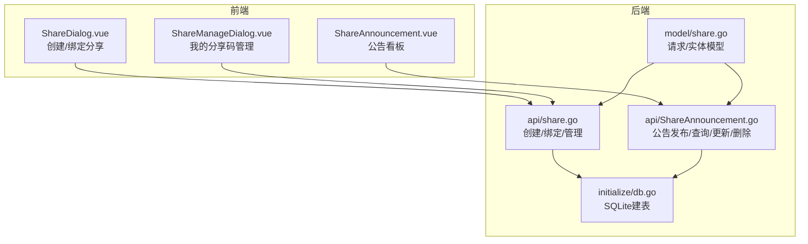
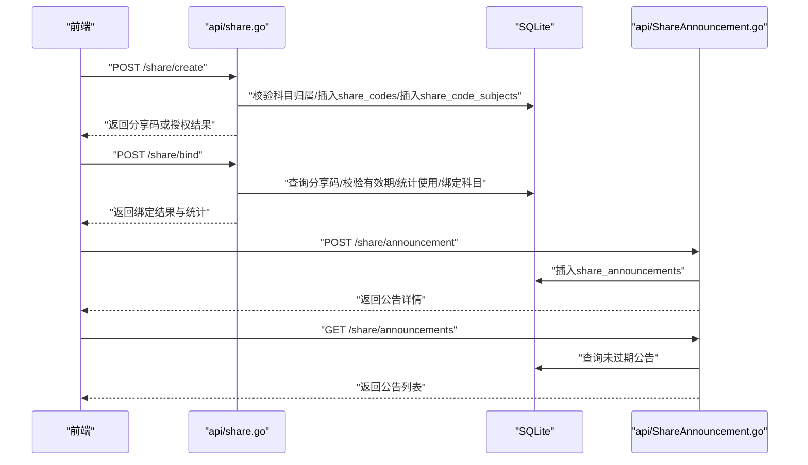
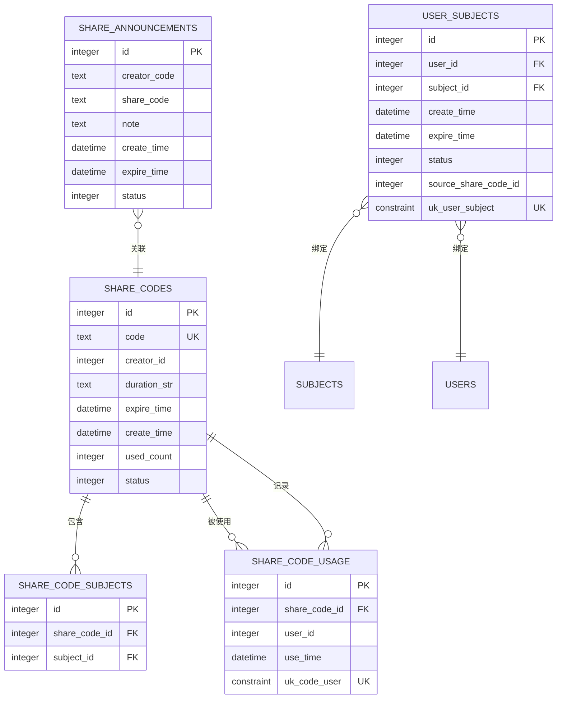
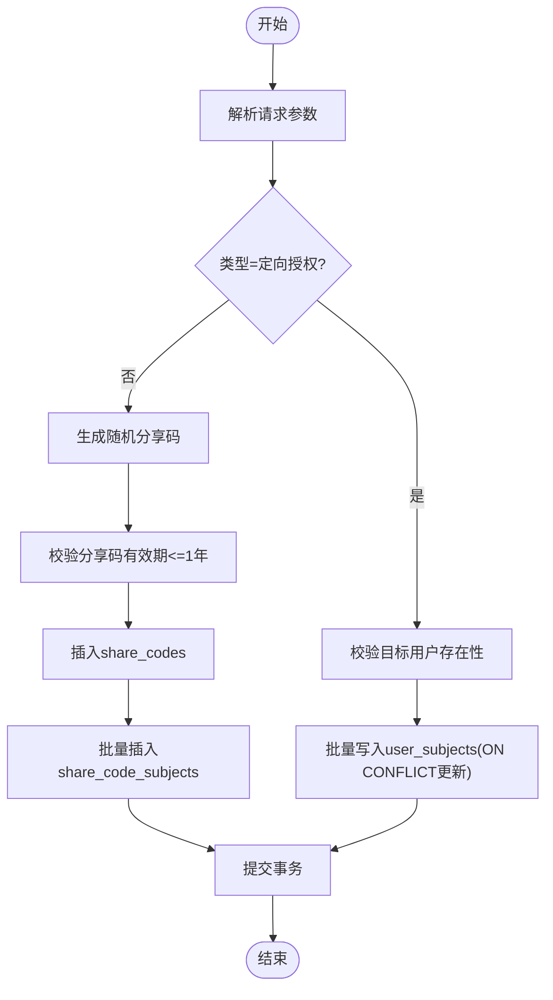
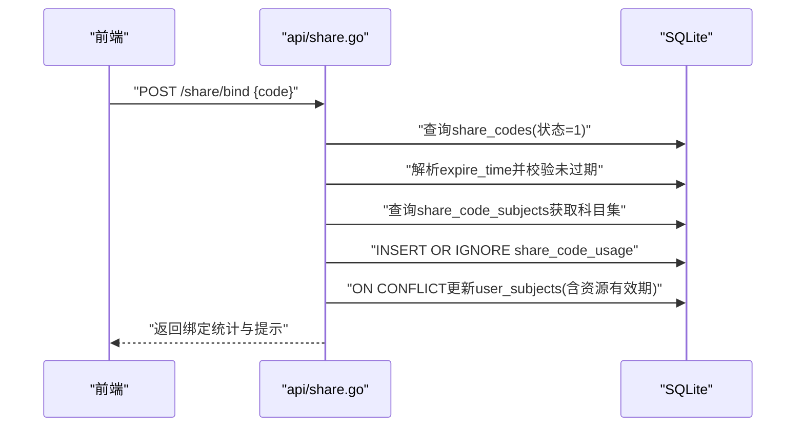
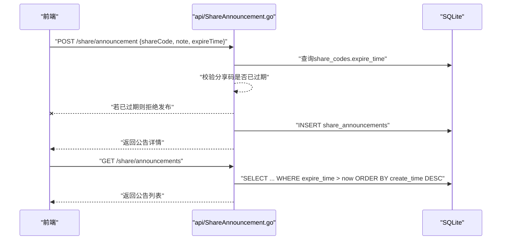
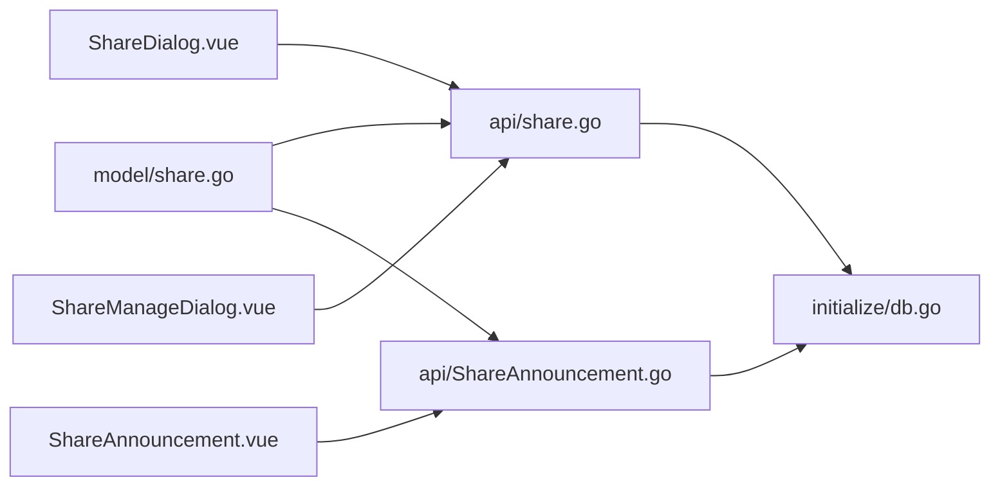

# 分享系统模型

<cite>
**本文引用的文件**
- [model/share.go](file://model/share.go)
- [api/share.go](file://api/share.go)
- [api/ShareAnnouncement.go](file://api/ShareAnnouncement.go)
- [initialize/db.go](file://initialize/db.go)
- [practice_problems_web/src/views/Home/components/ShareDialog.vue](file://practice_problems_web/src/views/Home/components/ShareDialog.vue)
- [practice_problems_web/src/views/Home/components/ShareManageDialog.vue](file://practice_problems_web/src/views/Home/components/ShareManageDialog.vue)
- [practice_problems_web/src/api/share.ts](file://practice_problems_web/src/api/share.ts)
- [practice_problems_web/src/components/ShareAnnouncement.vue](file://practice_problems_web/src/components/ShareAnnouncement.vue)
</cite>

## 更新摘要
**变更内容**
- 在“公告发布与查询（公开、过期过滤）”章节中，更新了流程说明，新增了对分享码过期状态的验证逻辑。
- 在“详细组件分析”下的“公告发布与查询”章节中，补充了发布、删除、修改公告时对关联分享码过期状态的校验机制。
- 更新了相关序列图，以反映新增的分享码过期验证步骤。

## 目录
1. [简介](#简介)
2. [项目结构](#项目结构)
3. [核心组件](#核心组件)
4. [架构总览](#架构总览)
5. [详细组件分析](#详细组件分析)
6. [依赖关系分析](#依赖关系分析)
7. [性能考量](#性能考量)
8. [故障排查指南](#故障排查指南)
9. [结论](#结论)
10. [附录](#附录)

## 简介
本文件面向分享系统的核心数据模型与流程，聚焦以下主题：
- ShareCode 结构体（分享码实体）与 ShareAnnouncement 结构体（分享公告）的字段定义与用途
- CreateShareRequest（支持多科目、资源有效期、分享码有效期）与 BindShareRequest 的设计意图与约束
- 数据库表定义：share_codes、share_announcements、share_code_subjects、share_code_usage、user_subjects
- 整体数据流与状态管理：创建、绑定、使用记录与过期控制
- 前端交互与后端接口的映射关系

## 项目结构
分享系统由后端 API 层与前端组件层协同实现：
- 后端
  - 模型层：定义请求与实体结构
  - API 层：实现分享码创建、绑定、管理与公告发布/查询/更新/删除
  - 初始化层：负责 SQLite 数据库连接与建表
- 前端
  - 分享对话框：创建分享（定向授权或生成分享码）、绑定资源
  - 管理对话框：查看我的分享码、编辑有效期、发布/修改/删除公告
  - 公告看板：展示公开的分享公告

图表来源
- [api/share.go](file://api/share.go#L50-L133)
- [api/ShareAnnouncement.go](file://api/ShareAnnouncement.go#L17-L75)
- [model/share.go](file://model/share.go#L1-L35)
- [initialize/db.go](file://initialize/db.go#L204-L268)
- [practice_problems_web/src/views/Home/components/ShareDialog.vue](file://practice_problems_web/src/views/Home/components/ShareDialog.vue#L1-L168)
- [practice_problems_web/src/views/Home/components/ShareManageDialog.vue](file://practice_problems_web/src/views/Home/components/ShareManageDialog.vue#L1-L120)
- [practice_problems_web/src/components/ShareAnnouncement.vue](file://practice_problems_web/src/components/ShareAnnouncement.vue#L1-L60)

章节来源
- [initialize/db.go](file://initialize/db.go#L154-L268)
- [api/share.go](file://api/share.go#L50-L133)
- [api/ShareAnnouncement.go](file://api/ShareAnnouncement.go#L17-L75)
- [model/share.go](file://model/share.go#L1-L35)
- [practice_problems_web/src/views/Home/components/ShareDialog.vue](file://practice_problems_web/src/views/Home/components/ShareDialog.vue#L1-L168)
- [practice_problems_web/src/views/Home/components/ShareManageDialog.vue](file://practice_problems_web/src/views/Home/components/ShareManageDialog.vue#L1-L120)
- [practice_problems_web/src/components/ShareAnnouncement.vue](file://practice_problems_web/src/components/ShareAnnouncement.vue#L1-L60)

## 核心组件
- 请求模型
  - CreateShareRequest：支持多科目、资源有效期、分享码有效期、分享类型与目标用户
  - BindShareRequest：绑定分享所需的分享码
- 实体模型
  - ShareCode：分享码主表记录，含创建者、有效期、使用次数等
  - ShareAnnouncement：分享公告记录，含创建者、关联分享码、备注、过期时间等

章节来源
- [model/share.go](file://model/share.go#L1-L35)

## 架构总览
分享系统围绕“分享码”与“资源有效期”两条主线运行：
- 分享码创建：支持定向授权（私密）与生成分享码（公开）
- 分享码绑定：用户凭码绑定科目，自动计算资源有效期并去重更新
- 公告体系：创建者可发布公告，前端展示公开公告并受过期控制
- 数据一致性：通过事务与唯一约束保障并发安全与数据完整性

图表来源
- [api/share.go](file://api/share.go#L50-L133)
- [api/share.go](file://api/share.go#L244-L406)
- [api/ShareAnnouncement.go](file://api/ShareAnnouncement.go#L17-L75)
- [api/ShareAnnouncement.go](file://api/ShareAnnouncement.go#L78-L130)

## 详细组件分析

### 数据模型与字段说明
- ShareCode（分享码主表）
  - 字段要点：唯一分享码、创建者、资源有效期字符串、分享码过期时间、创建时间、使用次数、状态
  - 作用：承载分享码生命周期与使用统计
- ShareAnnouncement（分享公告）
  - 字段要点：创建者标识、关联分享码、公告内容、创建时间、过期时间、状态
  - 作用：公开展示与传播分享信息，支持过期过滤

章节来源
- [initialize/db.go](file://initialize/db.go#L204-L229)
- [model/share.go](file://model/share.go#L18-L35)

### 请求模型设计
- CreateShareRequest
  - 多科目支持：SubjectIDs
  - 资源有效期：Duration（给用户绑定后的资源有效期）
  - 分享码有效期：CodeDuration（给分享码自身的有效期）
  - 分享类型：Type（1=定向授权；2=生成分享码）
  - 目标用户：Targets（定向授权时使用）
- BindShareRequest
  - 分享码：Code（用于绑定）

章节来源
- [model/share.go](file://model/share.go#L1-L17)

### 数据库表定义与关系
- share_codes：分享码主表
  - 关键字段：code（唯一）、creator_id、duration_str、expire_time、create_time、used_count、status
- share_code_subjects：分享码与科目关联表
  - 关键字段：share_code_id、subject_id（外键约束）
- share_code_usage：分享码使用记录
  - 关键字段：share_code_id、user_id（联合唯一）
- user_subjects：用户-科目绑定表
  - 关键字段：user_id、subject_id（唯一约束）、expire_time、status、source_share_code_id
- share_announcements：分享公告表
  - 关键字段：creator_code、share_code、note、create_time、expire_time、status

图表来源
- [initialize/db.go](file://initialize/db.go#L204-L268)

章节来源
- [initialize/db.go](file://initialize/db.go#L204-L268)

### 分享码创建流程（支持多科目、两种有效期）
- 输入：CreateShareRequest（多科目、资源有效期、分享码有效期、类型、目标用户）
- 校验：科目归属权、目标用户存在性（定向授权）
- 生成：随机分享码，校验分享码有效期不超过一年
- 写入：share_codes、share_code_subjects
- 事务：原子性保障

图表来源
- [api/share.go](file://api/share.go#L50-L133)
- [api/share.go](file://api/share.go#L177-L242)

章节来源
- [api/share.go](file://api/share.go#L50-L133)
- [api/share.go](file://api/share.go#L177-L242)

### 分享码绑定流程（去重与资源有效期）
- 输入：BindShareRequest（分享码）
- 查询：校验分享码存在且未过期
- 关联：读取包含的科目集合
- 事务：统计使用次数并累加、去重绑定 user_subjects
- 资源有效期：根据分享码的资源有效期字符串计算并写入

图表来源
- [api/share.go](file://api/share.go#L244-L406)

章节来源
- [api/share.go](file://api/share.go#L244-L406)

### 公告发布与查询（公开、过期过滤）
- 发布：CreateShareAnnouncement（校验长度与时间格式，写入 share_announcements），**新增校验关联的分享码是否已过期**
- 查询：GetShareAnnouncementList（按创建时间倒序，过滤过期公告）
- 更新/删除：仅创建者可操作，采用软删除，**新增校验关联的分享码是否已过期**

图表来源
- [api/ShareAnnouncement.go](file://api/ShareAnnouncement.go#L17-L75)
- [api/ShareAnnouncement.go](file://api/ShareAnnouncement.go#L78-L130)

章节来源
- [api/ShareAnnouncement.go](file://api/ShareAnnouncement.go#L17-L75)
- [api/ShareAnnouncement.go](file://api/ShareAnnouncement.go#L78-L130)

### 前端交互映射
- ShareDialog.vue
  - 创建分享：定向授权或生成分享码，支持资源有效期与分享码有效期配置
  - 绑定资源：输入分享码进行绑定
- ShareManageDialog.vue
  - 查看我的分享码：状态、使用次数、资源有效期、截止时间
  - 编辑：更新截止时间（限制在创建后1年内）与资源有效期
  - 发布/修改/删除公告：与后端接口一一对应
- ShareAnnouncement.vue
  - 公告看板：拉取公开公告列表，支持编辑与删除（仅创建者）

章节来源
- [practice_problems_web/src/views/Home/components/ShareDialog.vue](file://practice_problems_web/src/views/Home/components/ShareDialog.vue#L1-L168)
- [practice_problems_web/src/views/Home/components/ShareManageDialog.vue](file://practice_problems_web/src/views/Home/components/ShareManageDialog.vue#L1-L120)
- [practice_problems_web/src/components/ShareAnnouncement.vue](file://practice_problems_web/src/components/ShareAnnouncement.vue#L1-L60)
- [practice_problems_web/src/api/share.ts](file://practice_problems_web/src/api/share.ts#L1-L92)

## 依赖关系分析
- 后端模块耦合
  - api/share.go 依赖 model.CreateShareRequest/BindShareRequest 与全局 DB
  - api/ShareAnnouncement.go 依赖 model.ShareAnnouncement 与全局 DB
  - initialize/db.go 负责建表与外键/触发器初始化
- 前后端接口契约
  - share.ts 定义了后端接口签名，前端组件按此调用
- 数据一致性约束
  - share_code_usage 的联合唯一避免重复统计
  - user_subjects 的唯一约束与 ON CONFLICT 更新确保幂等绑定
  - share_codes 的 status 字段支持软删除与状态切换

图表来源
- [model/share.go](file://model/share.go#L1-L35)
- [api/share.go](file://api/share.go#L50-L133)
- [api/ShareAnnouncement.go](file://api/ShareAnnouncement.go#L17-L75)
- [initialize/db.go](file://initialize/db.go#L204-L268)
- [practice_problems_web/src/api/share.ts](file://practice_problems_web/src/api/share.ts#L1-L92)

章节来源
- [model/share.go](file://model/share.go#L1-L35)
- [api/share.go](file://api/share.go#L50-L133)
- [api/ShareAnnouncement.go](file://api/ShareAnnouncement.go#L17-L75)
- [initialize/db.go](file://initialize/db.go#L204-L268)
- [practice_problems_web/src/api/share.ts](file://practice_problems_web/src/api/share.ts#L1-L92)

## 性能考量
- 连接与存储
  - SQLite 启用 WAL 模式与同步策略，提升并发读写性能
  - 连接池参数合理设置，降低连接开销
- 查询与索引
  - share_codes、share_code_subjects、share_code_usage、user_subjects 等表具备必要字段与约束
  - 可考虑为常用查询字段建立索引（如 share_codes(code, status)、share_code_usage(share_code_id, user_id)）
- 事务边界
  - 创建与绑定均使用事务，减少脏写风险
- 前端节流
  - 公告列表按需刷新，避免频繁轮询

章节来源
- [initialize/db.go](file://initialize/db.go#L39-L83)

## 故障排查指南
- 创建分享失败
  - 参数校验：subject_ids 为空、targets 缺失或不存在
  - 分享码有效期超限：超过一年会被拒绝
- 绑定分享失败
  - 分享码不存在或已失效
  - 分享码未包含任何科目
  - 绑定过程中出现数据库错误
- 公告问题
  - 发布/更新失败：备注长度超限或时间格式错误
  - 删除失败：非创建者或公告不存在
  - **新增**：发布/更新/删除失败：关联的分享码已过期
- 常见提示
  - “请至少选择一个科目”
  - “分享码有效期不能超过 1 年”
  - “公告截止时间不能晚于分享码失效时间”
  - **新增**：“发布失败：分享码已过期，不允许发布公告”
  - **新增**：“删除失败：分享码已过期，不允许删除公告”
  - **新增**：“更新失败：分享码已过期，不允许修改公告”

章节来源
- [api/share.go](file://api/share.go#L50-L133)
- [api/share.go](file://api/share.go#L244-L406)
- [api/ShareAnnouncement.go](file://api/ShareAnnouncement.go#L17-L75)
- [api/ShareAnnouncement.go](file://api/ShareAnnouncement.go#L132-L212)

## 结论
本分享系统以“分享码 + 资源有效期”为核心，通过严谨的模型设计、完善的数据库约束与前后端协作，实现了：
- 多科目分享与定向授权
- 分享码有效期与资源有效期分离控制
- 使用统计与幂等绑定
- 公开公告的发布与过期管理
- **新增**：在公告的发布、更新、删除操作中，增加了对关联分享码过期状态的校验，确保了公告操作的时效性与数据一致性。
建议后续持续完善索引策略与监控埋点，进一步提升稳定性与可观测性。

## 附录
- 前端接口定义参考
  - [share.ts](file://practice_problems_web/src/api/share.ts#L1-L92)
- 前端组件参考
  - [ShareDialog.vue](file://practice_problems_web/src/views/Home/components/ShareDialog.vue#L1-L168)
  - [ShareManageDialog.vue](file://practice_problems_web/src/views/Home/components/ShareManageDialog.vue#L1-L120)
  - [ShareAnnouncement.vue](file://practice_problems_web/src/components/ShareAnnouncement.vue#L1-L60)