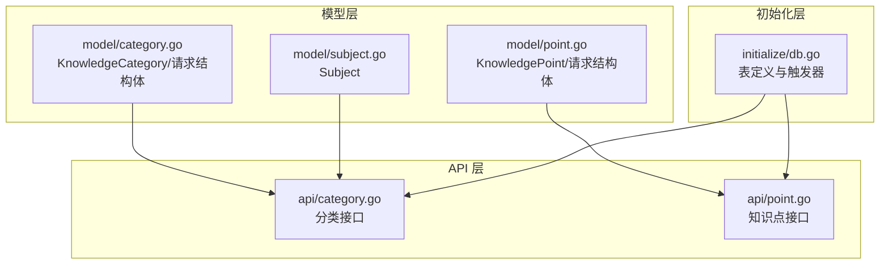
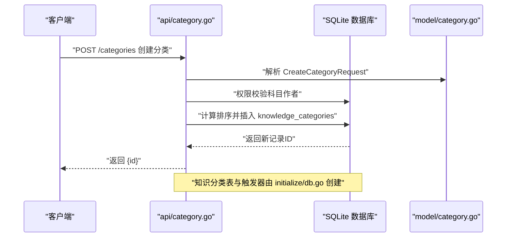
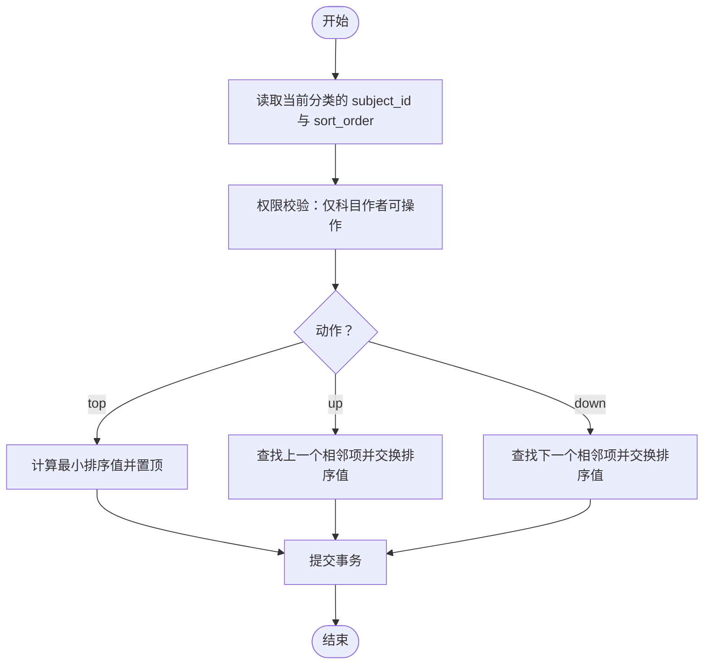
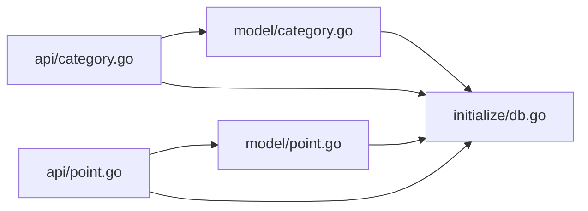

# 分类模型

<cite>
**本文引用的文件**
- [model/category.go](file://model/category.go)
- [api/category.go](file://api/category.go)
- [initialize/db.go](file://initialize/db.go)
- [model/point.go](file://model/point.go)
- [api/point.go](file://api/point.go)
- [model/subject.go](file://model/subject.go)
</cite>

## 目录
1. [简介](#简介)
2. [项目结构](#项目结构)
3. [核心组件](#核心组件)
4. [架构总览](#架构总览)
5. [详细组件分析](#详细组件分析)
6. [依赖分析](#依赖分析)
7. [性能考虑](#性能考虑)
8. [故障排查指南](#故障排查指南)
9. [结论](#结论)

## 简介
本文件聚焦于“分类”数据模型，系统性说明以下内容：
- KnowledgeCategory 结构体字段含义与用途
- CreateCategoryRequest 与 UpdateCategoryRequest 请求结构体设计
- knowledge_categories 表的数据库定义、外键约束与更新时间触发器
- 分类与科目 subjects 的一对多关系
- 分类与知识点 knowledge_points 的一对多层级关系

## 项目结构
围绕分类模型的关键文件分布如下：
- 模型层：model/category.go 定义分类实体与请求结构体
- API 层：api/category.go 提供分类的增删改查与排序接口
- 初始化层：initialize/db.go 定义 knowledge_categories 表及更新时间触发器
- 知识点模型与 API：model/point.go、api/point.go 体现分类与知识点的关系
- 科目模型：model/subject.go 体现科目与分类的关系

图表来源
- [model/category.go](file://model/category.go#L1-L26)
- [api/category.go](file://api/category.go#L1-L387)
- [initialize/db.go](file://initialize/db.go#L258-L328)
- [model/point.go](file://model/point.go#L1-L35)
- [api/point.go](file://api/point.go#L216-L361)
- [model/subject.go](file://model/subject.go#L1-L24)

章节来源
- [model/category.go](file://model/category.go#L1-L26)
- [api/category.go](file://api/category.go#L1-L387)
- [initialize/db.go](file://initialize/db.go#L258-L328)
- [model/point.go](file://model/point.go#L1-L35)
- [api/point.go](file://api/point.go#L216-L361)
- [model/subject.go](file://model/subject.go#L1-L24)

## 核心组件
- KnowledgeCategory：对应数据库 knowledge_categories 表，承载分类的标识、归属科目、名称、时间戳、排序与难度等信息
- CreateCategoryRequest：创建分类时的请求参数，要求提供 SubjectID 与 CategoryName
- UpdateCategoryRequest：更新分类时的请求参数，支持更新 CategoryName 与 Difficulty（可空）

章节来源
- [model/category.go](file://model/category.go#L1-L26)

## 架构总览
分类模型在后端由三层协作完成：
- 模型层：定义领域对象与请求结构体
- API 层：处理业务流程（权限校验、排序计算、更新时间维护）
- 初始化层：负责数据库表结构与触发器的创建

图表来源
- [api/category.go](file://api/category.go#L90-L147)
- [initialize/db.go](file://initialize/db.go#L258-L328)
- [model/category.go](file://model/category.go#L1-L26)

## 详细组件分析

### KnowledgeCategory 结构体字段说明
- ID：分类主键
- SubjectID：外键关联科目 subjects 的 id
- CategoryName：分类名称（映射数据库列 categorie_name）
- CreateTime：创建时间（默认 CURRENT_TIMESTAMP）
- UpdateTime：更新时间（默认 CURRENT_TIMESTAMP；受触发器维护）
- SortOrder：排序字段，用于控制分类在科目内的顺序
- Difficulty：难度等级（0-简单, 1-普通, 2-困难, 3-地狱）
- CreatorCode：创建者编码（模型字段，用于权限判断）

章节来源
- [model/category.go](file://model/category.go#L1-L13)

### CreateCategoryRequest 设计
- SubjectID：必填，用于指定分类所属科目
- CategoryName：必填，分类名称
- 设计要点：
  - 参数绑定使用必填校验，避免空值入库
  - 创建时会进行科目作者权限校验，仅作者可创建

章节来源
- [model/category.go](file://model/category.go#L15-L19)
- [api/category.go](file://api/category.go#L90-L147)

### UpdateCategoryRequest 设计
- CategoryName：可选，若提供则更新名称
- Difficulty：可选整数指针，若提供需在合法范围内（0-3）
- 设计要点：
  - 支持部分字段更新，若均未提供则视为“无变更”
  - 更新时统一写入 update_time（由触发器维护）

章节来源
- [model/category.go](file://model/category.go#L21-L25)
- [api/category.go](file://api/category.go#L150-L224)

### knowledge_categories 表定义与约束
- 主键：id（自增）
- 字段：
  - subject_id：NOT NULL，外键指向 subjects(id)
  - sort_order：默认 0，用于排序
  - categorie_name：NOT NULL，分类名称
  - create_time：默认 CURRENT_TIMESTAMP
  - update_time：默认 CURRENT_TIMESTAMP
  - difficulty：默认 0
- 外键约束：
  - CONSTRAINT fk_subject FOREIGN KEY (subject_id) REFERENCES subjects (id) ON DELETE NO ACTION ON UPDATE NO ACTION
- 更新时间触发器：
  - AFTER UPDATE ON knowledge_categories，自动更新 update_time

章节来源
- [initialize/db.go](file://initialize/db.go#L270-L286)

### 分类与科目 subjects 的关系
- 关系类型：一对多
- 关系依据：
  - knowledge_categories.subject_id → subjects.id
  - 外键约束：ON DELETE NO ACTION（删除科目不会级联删除分类）
- 权限控制：
  - 创建/更新/删除分类前，需校验当前用户是否为科目作者（通过 subjects.creator_code 与当前用户 user_code 比较）

章节来源
- [initialize/db.go](file://initialize/db.go#L270-L286)
- [api/category.go](file://api/category.go#L90-L147)
- [model/subject.go](file://model/subject.go#L1-L24)

### 分类与知识点 knowledge_points 的层级关系
- 关系类型：一对多
- 关系依据：
  - knowledge_points.categorie_id → knowledge_categories.id
  - 外键约束：ON DELETE NO ACTION（删除分类不会级联删除知识点）
- 知识点 API 中的权限校验也基于此关系链：
  - 通过 JOIN knowledge_categories 与 subjects，确认操作者是否为科目作者

章节来源
- [initialize/db.go](file://initialize/db.go#L288-L307)
- [api/point.go](file://api/point.go#L216-L361)
- [model/point.go](file://model/point.go#L1-L35)

### 分类排序算法（UpdateCategorySort）
- 支持动作：top、up、down
- 实现要点：
  - 读取当前分类的 subject_id 与 sort_order
  - 通过事务原子性交换排序值
  - 通过最小排序值计算新排序位置，保证全局有序
- 错误处理：
  - 若已是首位/末位，返回提示而非报错
  - 事务提交失败返回错误

图表来源
- [api/category.go](file://api/category.go#L291-L378)

章节来源
- [api/category.go](file://api/category.go#L291-L378)

### 删除分类的约束与保护
- 外键约束：
  - knowledge_categories 的 subject_id 引用 subjects，ON DELETE NO ACTION
  - knowledge_points 的 categorie_id 引用 knowledge_categories，ON DELETE NO ACTION
- 业务保护：
  - 删除分类时若存在子知识点，会捕获外键约束错误并提示“该分类下仍有知识点”，避免破坏数据完整性

章节来源
- [initialize/db.go](file://initialize/db.go#L270-L307)
- [api/category.go](file://api/category.go#L226-L283)

## 依赖分析
- 模型依赖：
  - KnowledgeCategory 依赖 subjects（外键）
  - KnowledgePoint 依赖 knowledge_categories（外键）
- API 依赖：
  - 分类 API 依赖 subjects 与 users 的作者权限校验
  - 知识点 API 依赖分类与科目关系进行权限校验
- 初始化依赖：
  - initialize/db.go 负责创建 knowledge_categories 与 knowledge_points 表，并注册更新时间触发器

图表来源
- [api/category.go](file://api/category.go#L1-L387)
- [api/point.go](file://api/point.go#L216-L361)
- [model/category.go](file://model/category.go#L1-L26)
- [model/point.go](file://model/point.go#L1-L35)
- [initialize/db.go](file://initialize/db.go#L258-L328)

章节来源
- [api/category.go](file://api/category.go#L1-L387)
- [api/point.go](file://api/point.go#L216-L361)
- [model/category.go](file://model/category.go#L1-L26)
- [model/point.go](file://model/point.go#L1-L35)
- [initialize/db.go](file://initialize/db.go#L258-L328)

## 性能考虑
- 排序字段 sort_order：
  - 通过最小排序值计算新位置，避免大规模重排
  - 查询列表按 sort_order 升序、id 降序，有利于稳定展示
- 触发器维护 update_time：
  - 减少应用层重复更新逻辑，降低出错概率
- 外键约束：
  - 保持数据一致性，但删除/移动时需注意业务保护（如分类删除前需清空知识点）

[本节为通用建议，无需列出具体文件来源]

## 故障排查指南
- 创建分类失败（403）：
  - 当前用户非科目作者，需联系作者或确认授权状态
- 更新分类失败（400）：
  - Difficulty 超出合法范围（0-3）
- 删除分类失败（500）：
  - 存在子知识点导致外键约束，需先删除知识点
- 排序异常：
  - 动作参数非法或已是首位/末位，系统返回提示

章节来源
- [api/category.go](file://api/category.go#L90-L147)
- [api/category.go](file://api/category.go#L150-L224)
- [api/category.go](file://api/category.go#L226-L283)
- [api/category.go](file://api/category.go#L291-L378)

## 结论
- KnowledgeCategory 作为知识体系的“章节/分类”抽象，通过 SubjectID 与科目建立一对多关系，并通过 SortOrder 与 Difficulty 提升管理体验
- knowledge_categories 表具备完善的外键约束与更新时间触发器，配合 API 的权限校验与排序算法，形成安全可靠的分类管理能力
- 分类与知识点构成清晰的层级关系，删除与移动遵循外键约束与业务保护，确保数据完整性