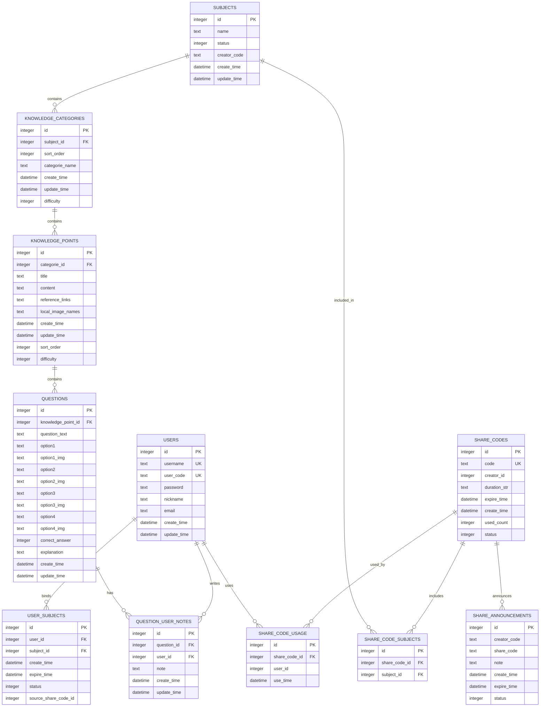
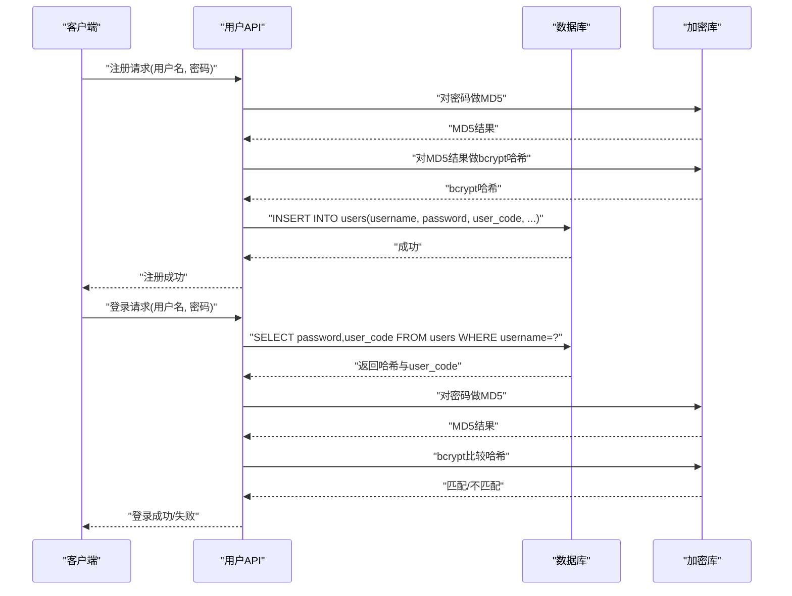
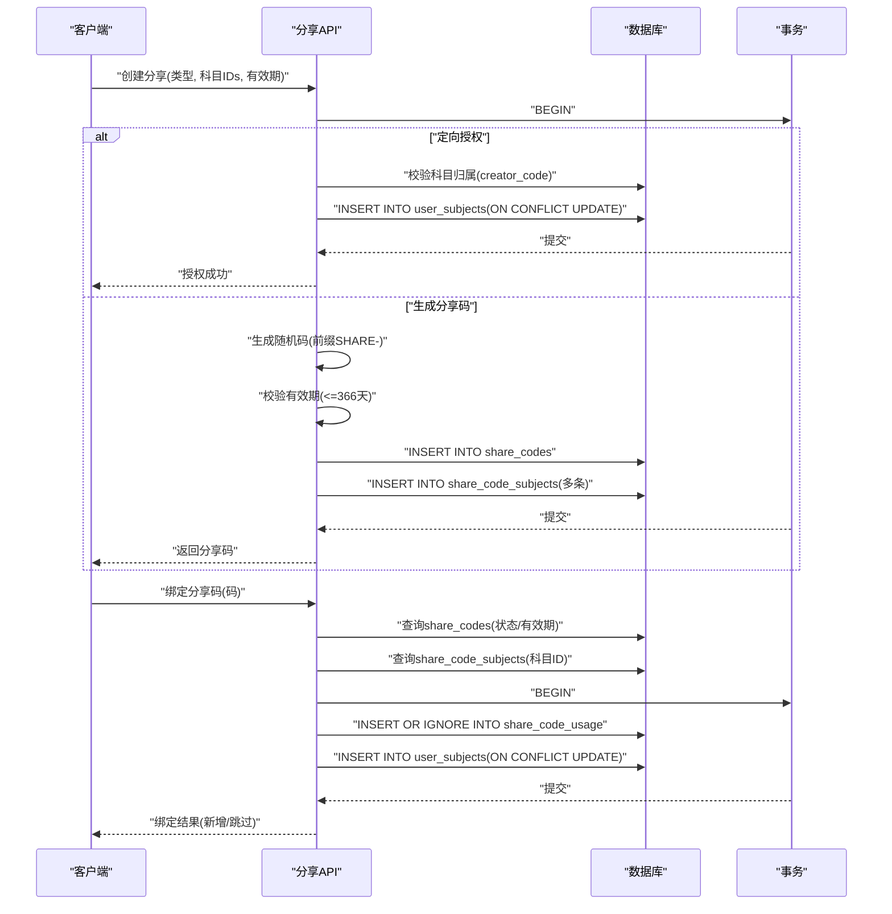
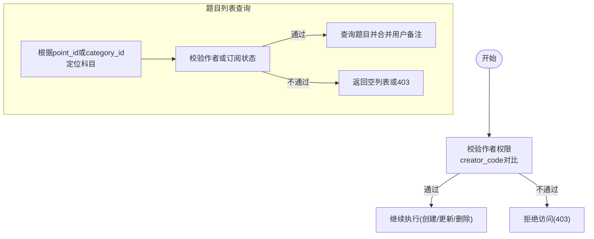
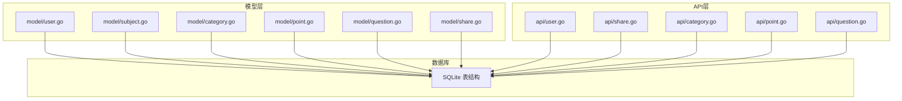

# 数据模型

<cite>
**本文引用的文件**
- [initialize/db.go](file://initialize/db.go)
- [model/subject.go](file://model/subject.go)
- [model/category.go](file://model/category.go)
- [model/point.go](file://model/point.go)
- [model/question.go](file://model/question.go)
- [model/user.go](file://model/user.go)
- [model/share.go](file://model/share.go)
- [api/user.go](file://api/user.go)
- [api/share.go](file://api/share.go)
- [api/category.go](file://api/category.go)
- [api/point.go](file://api/point.go)
- [api/question.go](file://api/question.go)
</cite>

## 目录
1. [简介](#简介)
2. [项目结构与数据模型概览](#项目结构与数据模型概览)
3. [核心实体与字段说明](#核心实体与字段说明)
4. [实体关系与外键约束](#实体关系与外键约束)
5. [数据库ER图](#数据库er图)
6. [建表语句示例](#建表语句示例)
7. [详细组件分析](#详细组件分析)
8. [依赖关系分析](#依赖关系分析)
9. [性能与约束特性](#性能与约束特性)
10. [故障排查指南](#故障排查指南)
11. [结论](#结论)

## 简介
本文件面向系统中的数据模型，系统围绕“科目—分类—知识点—题目”构建知识题库，同时提供用户体系与分享能力。本文将逐项说明各实体的字段、数据类型、约束及业务含义；解释外键关系；阐述用户密码加密策略；并基于建表脚本生成ER图与CREATE TABLE示例，帮助开发者与运维人员快速理解与维护数据库结构。

## 项目结构与数据模型概览
- 数据模型主要由以下表构成：
  - 用户表 users
  - 科目表 subjects
  - 分类表 knowledge_categories
  - 知识点表 knowledge_points
  - 题目表 questions
  - 分享码表 share_codes
  - 分享公告表 share_announcements
  - 用户-科目绑定表 user_subjects
  - 分享码-科目关联表 share_code_subjects
  - 分享码使用记录表 share_code_usage
  - 用户题目备注表 question_user_notes

- 实体间通过外键形成清晰的层级关系：
  - users 与 user_subjects：一对多（用户可绑定多个科目）
  - subjects 与 knowledge_categories：一对多（科目包含多个分类）
  - knowledge_categories 与 knowledge_points：一对多（分类包含多个知识点）
  - knowledge_points 与 questions：一对多（知识点包含多道题目）
  - share_codes 与 share_code_subjects：一对多（分享码包含多个科目）
  - share_codes 与 share_code_usage：一对多（分享码被多个用户使用）
  - share_codes 与 share_announcements：一对多（分享码产生多条公告记录）

**Section sources**
- [initialize/db.go](file://initialize/db.go#L173-L354)

## 核心实体与字段说明
本节按模型文件与数据库表一一对应的方式，给出字段定义、数据类型、约束与业务含义。

- 用户表 users
  - 字段
    - id: 整型，主键，自增
    - username: 文本，非空，唯一
    - user_code: 文本，非空，唯一（8位随机字符串）
    - password: 文本，非空（bcrypt哈希）
    - nickname: 文本，可空
    - email: 文本，可空
    - create_time: 时间戳，默认当前时间
    - update_time: 时间戳，默认当前时间（触发器自动更新）
  - 约束
    - 唯一索引：username、user_code
    - 触发器：更新时自动更新 update_time
  - 业务含义
    - 用户凭证与身份标识；user_code用于分享绑定与权限校验

**Section sources**
- [initialize/db.go](file://initialize/db.go#L173-L186)
- [model/user.go](file://model/user.go#L27-L35)
- [api/user.go](file://api/user.go#L52-L95)

- 科目表 subjects
  - 字段
    - id: 整型，主键，自增
    - name: 文本，非空
    - status: 整型，默认1（状态位）
    - creator_code: 文本，可空（创建者用户编码）
    - create_time: 时间戳，默认当前时间
    - update_time: 时间戳，默认当前时间（触发器自动更新）
  - 约束
    - 触发器：更新时自动更新 update_time
  - 业务含义
    - 知识体系的顶层分类；creator_code用于作者权限校验

**Section sources**
- [initialize/db.go](file://initialize/db.go#L191-L203)
- [model/subject.go](file://model/subject.go#L1-L11)

- 分类表 knowledge_categories
  - 字段
    - id: 整型，主键，自增
    - subject_id: 整型，非空（外键指向 subjects.id）
    - sort_order: 整型，默认0（排序）
    - categorie_name: 文本，非空（注意：模型字段名为 CategoryName，数据库列为 categorie_name）
    - create_time: 时间戳，默认当前时间
    - update_time: 时间戳，默认当前时间（触发器自动更新）
    - difficulty: 整型，默认0（难度等级）
  - 约束
    - 外键：fk_subject -> subjects(id)
    - 触发器：更新时自动更新 update_time
  - 业务含义
    - 科目的子级结构；支持排序与难度标记

**Section sources**
- [initialize/db.go](file://initialize/db.go#L272-L286)
- [model/category.go](file://model/category.go#L1-L13)

- 知识点表 knowledge_points
  - 字段
    - id: 整型，主键，自增
    - categorie_id: 整型，非空（外键指向 knowledge_categories.id）
    - title: 文本，非空
    - content: 文本，可空
    - reference_links: 文本（JSON字符串），可空
    - local_image_names: 文本（JSON字符串），可空
    - create_time: 时间戳，默认当前时间
    - update_time: 时间戳，默认当前时间（触发器自动更新）
    - sort_order: 整型，默认0（排序）
    - difficulty: 整型，默认0（难度等级）
  - 约束
    - 外键：fk_categorie -> knowledge_categories(id)
    - 触发器：更新时自动更新 update_time
  - 业务含义
    - 知识点载体；支持图片与参考链接的JSON化存储

**Section sources**
- [initialize/db.go](file://initialize/db.go#L289-L307)
- [model/point.go](file://model/point.go#L1-L16)

- 题目表 questions
  - 字段
    - id: 整型，主键，自增
    - knowledge_point_id: 整型，非空（外键指向 knowledge_points.id）
    - question_text: 文本，非空
    - option1~option4: 文本，可空
    - option1_img~option4_img: 文本，可空
    - correct_answer: 整型，非空（1~4）
    - explanation: 文本，可空
    - create_time: 时间戳，默认当前时间
    - update_time: 时间戳，默认当前时间（触发器自动更新）
  - 约束
    - 外键：fk_point -> knowledge_points(id)
    - 触发器：更新时自动更新 update_time
  - 业务含义
    - 题库主体；支持多选项与答案说明

**Section sources**
- [initialize/db.go](file://initialize/db.go#L311-L329)
- [model/question.go](file://model/question.go#L1-L24)

- 分享码表 share_codes
  - 字段
    - id: 整型，主键，自增
    - code: 文本，非空，唯一（分享码）
    - creator_id: 整型，非空（创建者用户ID）
    - duration_str: 文本，非空（资源有效期字符串，如“7d”）
    - expire_time: 时间戳，非空（分享码有效期）
    - create_time: 时间戳，默认当前时间
    - used_count: 整型，默认0（使用次数统计）
    - status: 整型，默认1（状态）
  - 约束
    - 唯一索引：code
  - 业务含义
    - 生成分享码并记录有效期与使用情况

**Section sources**
- [initialize/db.go](file://initialize/db.go#L207-L216)
- [model/share.go](file://model/share.go#L18-L26)

- 分享公告表 share_announcements
  - 字段
    - id: 整型，主键，自增
    - creator_code: 文本，非空（创建者用户编码）
    - share_code: 文本，非空（关联分享码）
    - note: 文本，可空（备注）
    - create_time: 时间戳，默认当前时间
    - expire_time: 时间戳，可空（过期时间）
    - status: 整型，默认1（状态）
  - 约束
    - 无显式外键约束（通过业务层保证一致性）
  - 业务含义
    - 记录分享行为与过期状态

**Section sources**
- [initialize/db.go](file://initialize/db.go#L221-L229)
- [model/share.go](file://model/share.go#L27-L36)

- 用户-科目绑定表 user_subjects
  - 字段
    - id: 整型，主键，自增
    - user_id: 整型，非空
    - subject_id: 整型，非空
    - create_time: 时间戳，默认当前时间
    - expire_time: 时间戳，可空（过期时间）
    - status: 整型，默认1（状态）
    - source_share_code_id: 整型，默认0（来源分享码ID）
    - 联合唯一索引：(user_id, subject_id)
    - 外键约束：fk_user -> users(id)（级联删除）、fk_subject -> subjects(id)（级联删除）
  - 业务含义
    - 用户对科目的授权与有效期管理；支持来源分享码追踪

**Section sources**
- [initialize/db.go](file://initialize/db.go#L234-L246)

- 分享码-科目关联表 share_code_subjects
  - 字段
    - id: 整型，主键，自增
    - share_code_id: 整型，非空
    - subject_id: 整型，非空
    - 外键约束：fk_main_code -> share_codes(id)（级联删除）、fk_sub_id -> subjects(id)（级联删除）
  - 业务含义
    - 分享码与多个科目的多对多关系

**Section sources**
- [initialize/db.go](file://initialize/db.go#L250-L256)

- 分享码使用记录表 share_code_usage
  - 字段
    - id: 整型，主键，自增
    - share_code_id: 整型，非空
    - user_id: 整型，非空
    - use_time: 时间戳，默认当前时间
    - 联合唯一索引：(share_code_id, user_id)
  - 业务含义
    - 统计分享码被哪些用户使用过

**Section sources**
- [initialize/db.go](file://initialize/db.go#L261-L267)

- 用户题目备注表 question_user_notes
  - 字段
    - id: 整型，主键，自增
    - question_id: 整型，非空
    - user_id: 整型，非空
    - note: 文本，可空
    - create_time: 时间戳，默认当前时间
    - update_time: 时间戳，默认当前时间（触发器自动更新）
    - 联合唯一索引：(user_id, question_id)
    - 外键约束：fk_qun_user -> users(id)（级联删除）、fk_qun_question -> questions(id)（级联删除）
  - 业务含义
    - 用户对题目的个人备注；支持Upsert更新

**Section sources**
- [initialize/db.go](file://initialize/db.go#L333-L354)

## 实体关系与外键约束
- 外键关系
  - users.id → user_subjects.user_id（级联删除）
  - subjects.id → knowledge_categories.subject_id（NO ACTION）
  - knowledge_categories.id → knowledge_points.categorie_id（NO ACTION）
  - knowledge_points.id → questions.knowledge_point_id（NO ACTION）
  - share_codes.id → share_code_subjects.share_code_id（级联删除）
  - subjects.id → share_code_subjects.subject_id（级联删除）
  - share_codes.id → share_code_usage.share_code_id（级联删除）
  - users.id → share_code_usage.user_id（无外键约束）
  - users.id → question_user_notes.user_id（级联删除）
  - questions.id → question_user_notes.question_id（级联删除）

- 约束与触发器
  - 多处表具备 update_time 自动更新触发器
  - share_codes.code 唯一
  - user_subjects(user_id, subject_id) 联合唯一
  - share_code_usage(share_code_id, user_id) 联合唯一
  - question_user_notes(user_id, question_id) 联合唯一

- 权限与校验
  - 分类/知识点/题目创建与修改均需校验作者（creator_code）与当前用户是否一致
  - 题目列表查询会结合 user_subjects 的订阅状态进行权限控制

**Section sources**
- [initialize/db.go](file://initialize/db.go#L234-L354)
- [api/category.go](file://api/category.go#L91-L147)
- [api/point.go](file://api/point.go#L135-L193)
- [api/question.go](file://api/question.go#L14-L118)

## 数据库ER图
下图为基于实际建表语句与外键约束绘制的ER图，展示各表之间的关系与约束。

**Diagram sources**
- [initialize/db.go](file://initialize/db.go#L173-L354)

## 建表语句示例
以下为基于建表脚本整理的 CREATE TABLE 示例，便于迁移与备份。

- 用户表 users
  - 字段与约束参见“用户表 users”
  - 示例：[initialize/db.go](file://initialize/db.go#L173-L186)

- 科目表 subjects
  - 字段与约束参见“科目表 subjects”
  - 示例：[initialize/db.go](file://initialize/db.go#L191-L203)

- 分类表 knowledge_categories
  - 字段与约束参见“分类表 knowledge_categories”
  - 示例：[initialize/db.go](file://initialize/db.go#L272-L286)

- 知识点表 knowledge_points
  - 字段与约束参见“知识点表 knowledge_points”
  - 示例：[initialize/db.go](file://initialize/db.go#L289-L307)

- 题目表 questions
  - 字段与约束参见“题目表 questions”
  - 示例：[initialize/db.go](file://initialize/db.go#L311-L329)

- 分享码表 share_codes
  - 字段与约束参见“分享码表 share_codes”
  - 示例：[initialize/db.go](file://initialize/db.go#L207-L216)

- 分享公告表 share_announcements
  - 字段与约束参见“分享公告表 share_announcements”
  - 示例：[initialize/db.go](file://initialize/db.go#L221-L229)

- 用户-科目绑定表 user_subjects
  - 字段与约束参见“用户-科目绑定表 user_subjects”
  - 示例：[initialize/db.go](file://initialize/db.go#L234-L246)

- 分享码-科目关联表 share_code_subjects
  - 字段与约束参见“分享码-科目关联表 share_code_subjects”
  - 示例：[initialize/db.go](file://initialize/db.go#L250-L256)

- 分享码使用记录表 share_code_usage
  - 字段与约束参见“分享码使用记录表 share_code_usage”
  - 示例：[initialize/db.go](file://initialize/db.go#L261-L267)

- 用户题目备注表 question_user_notes
  - 字段与约束参见“用户题目备注表 question_user_notes”
  - 示例：[initialize/db.go](file://initialize/db.go#L333-L354)

**Section sources**
- [initialize/db.go](file://initialize/db.go#L173-L354)

## 详细组件分析

### 用户模型与密码加密
- 字段与约束
  - users 表的 password 字段存储 bcrypt 哈希值
  - 用户注册时，后端先对前端传入的密码进行一次MD5，再进行 bcrypt 哈希存储
  - 登录与修改密码流程同样采用双MD5+bcrypt的策略进行校验与更新
- 业务流程要点
  - 注册：生成唯一 user_code，插入用户记录
  - 登录：若数据库密码为空，允许登录但提示强制改密
  - 修改密码：旧密码校验与新密码保存均采用双MD5+bcrypt

**Diagram sources**
- [api/user.go](file://api/user.go#L52-L95)
- [api/user.go](file://api/user.go#L198-L240)
- [api/user.go](file://api/user.go#L287-L319)
- [initialize/db.go](file://initialize/db.go#L173-L186)

**Section sources**
- [model/user.go](file://model/user.go#L27-L35)
- [api/user.go](file://api/user.go#L52-L95)
- [api/user.go](file://api/user.go#L198-L240)
- [api/user.go](file://api/user.go#L287-L319)

### 分享模型与分享码机制
- 分享码生成
  - 生成随机6位十六进制字符串，前缀“SHARE-”
  - 校验有效期（最大不超过366天）
  - 插入 share_codes 主表与 share_code_subjects 关联表
- 绑定资源
  - 校验分享码有效性与有效期
  - 统计使用次数（share_code_usage）
  - 将科目绑定到 user_subjects，支持去重与过期判断
- 分享公告
  - 记录分享码、创建者、过期时间与状态

**Diagram sources**
- [api/share.go](file://api/share.go#L53-L133)
- [api/share.go](file://api/share.go#L135-L175)
- [api/share.go](file://api/share.go#L177-L242)
- [api/share.go](file://api/share.go#L244-L406)
- [initialize/db.go](file://initialize/db.go#L207-L267)

**Section sources**
- [model/share.go](file://model/share.go#L18-L36)
- [api/share.go](file://api/share.go#L53-L133)
- [api/share.go](file://api/share.go#L177-L242)
- [api/share.go](file://api/share.go#L244-L406)

### 知识结构与权限校验
- 分类/知识点/题目的创建与修改均需校验作者（subject.creator_code == 当前用户user_code）
- 题目列表查询会结合 user_subjects 的订阅状态进行权限控制
- 支持排序与难度标记，便于教学组织

**Diagram sources**
- [api/category.go](file://api/category.go#L91-L147)
- [api/point.go](file://api/point.go#L135-L193)
- [api/question.go](file://api/question.go#L14-L118)

**Section sources**
- [api/category.go](file://api/category.go#L91-L147)
- [api/point.go](file://api/point.go#L135-L193)
- [api/question.go](file://api/question.go#L14-L118)

## 依赖关系分析
- 模型到数据库表映射
  - model/subject.go ↔ subjects
  - model/category.go ↔ knowledge_categories
  - model/point.go ↔ knowledge_points
  - model/question.go ↔ questions
  - model/user.go ↔ users
  - model/share.go ↔ share_codes, share_announcements
- API层对数据库的依赖
  - api/user.go 依赖 bcrypt 与 md5 进行密码处理
  - api/share.go 依赖事务与有效期计算
  - api/category.go/point.go/question.go 依赖权限校验与外键约束

**Diagram sources**
- [model/user.go](file://model/user.go#L27-L35)
- [model/subject.go](file://model/subject.go#L1-L11)
- [model/category.go](file://model/category.go#L1-L13)
- [model/point.go](file://model/point.go#L1-L16)
- [model/question.go](file://model/question.go#L1-L24)
- [model/share.go](file://model/share.go#L18-L36)
- [api/user.go](file://api/user.go#L52-L95)
- [api/share.go](file://api/share.go#L53-L133)
- [api/category.go](file://api/category.go#L91-L147)
- [api/point.go](file://api/point.go#L135-L193)
- [api/question.go](file://api/question.go#L14-L118)

**Section sources**
- [model/user.go](file://model/user.go#L27-L35)
- [model/subject.go](file://model/subject.go#L1-L11)
- [model/category.go](file://model/category.go#L1-L13)
- [model/point.go](file://model/point.go#L1-L16)
- [model/question.go](file://model/question.go#L1-L24)
- [model/share.go](file://model/share.go#L18-L36)
- [api/user.go](file://api/user.go#L52-L95)
- [api/share.go](file://api/share.go#L53-L133)
- [api/category.go](file://api/category.go#L91-L147)
- [api/point.go](file://api/point.go#L135-L193)
- [api/question.go](file://api/question.go#L14-L118)

## 性能与约束特性
- WAL模式与同步级别
  - 初始化时启用 WAL 模式与 FULL 同步，提升并发读写性能与可靠性
- 外键约束
  - 启用 PRAGMA foreign_keys=ON，确保引用完整性
- 触发器
  - 多表 update_time 自动更新，减少应用层负担
- 约束索引
  - 多处唯一索引与联合唯一索引，保障幂等性与一致性
- 事务与幂等
  - 分享绑定使用 INSERT OR IGNORE 与 ON CONFLICT，避免重复绑定与并发问题

**Section sources**
- [initialize/db.go](file://initialize/db.go#L39-L66)
- [initialize/db.go](file://initialize/db.go#L154-L165)
- [initialize/db.go](file://initialize/db.go#L183-L186)
- [initialize/db.go](file://initialize/db.go#L207-L216)
- [initialize/db.go](file://initialize/db.go#L234-L246)
- [initialize/db.go](file://initialize/db.go#L261-L267)
- [initialize/db.go](file://initialize/db.go#L333-L354)
- [api/share.go](file://api/share.go#L326-L334)

## 故障排查指南
- 密码相关
  - 注册/登录/修改密码均采用双MD5+bcrypt流程，若失败请检查前端是否正确传递MD5后的密码
  - 若出现“密码为空”，系统会提示强制改密
- 分享码相关
  - 生成分享码时若提示“有效期超过1年”，请调整有效期参数
  - 绑定分享码时若提示“无效或已失效”，请检查分享码与有效期
- 权限相关
  - 创建/修改分类/知识点/题目时若提示“无权操作”，请确认当前用户是否为科目作者
  - 题目列表查询无数据时，检查 user_subjects 的订阅状态与过期时间
- 外键约束
  - 删除分类/知识点时若提示“外键约束”，请先清理子项（题目/知识点）

**Section sources**
- [api/user.go](file://api/user.go#L198-L240)
- [api/user.go](file://api/user.go#L287-L319)
- [api/share.go](file://api/share.go#L177-L242)
- [api/share.go](file://api/share.go#L244-L406)
- [api/category.go](file://api/category.go#L226-L283)
- [api/point.go](file://api/point.go#L315-L365)
- [api/question.go](file://api/question.go#L14-L118)

## 结论
本数据模型围绕“科目—分类—知识点—题目”的层级结构设计，配合用户与分享体系，实现了知识题库的创建、授权与共享。通过严格的外键约束、触发器与事务处理，系统在保证数据一致性的同时提升了性能与可维护性。用户密码采用双MD5+bcrypt的安全策略，分享码支持有效期与使用统计，满足教学场景下的协作与授权需求。