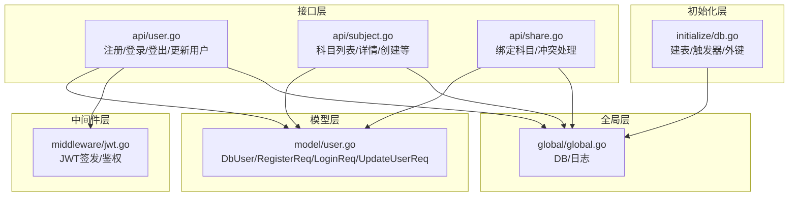
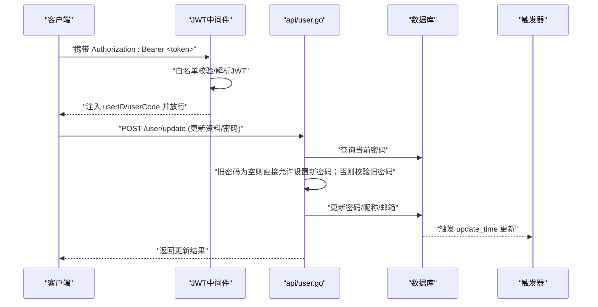
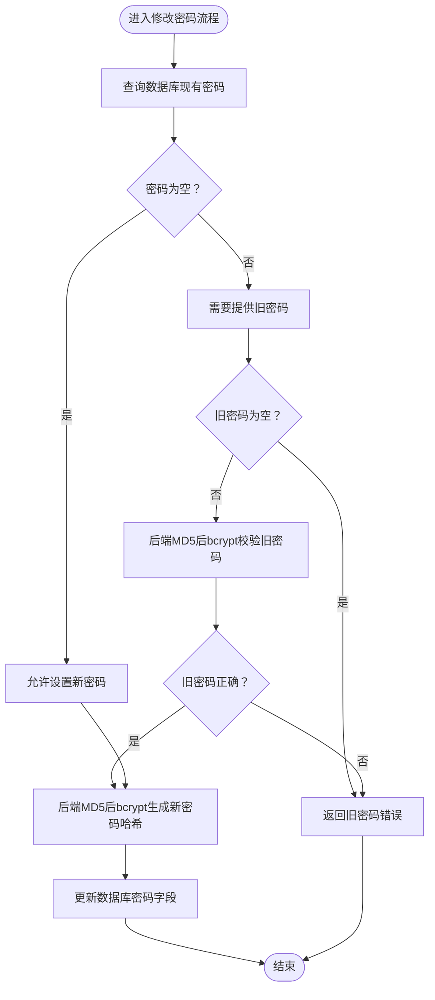
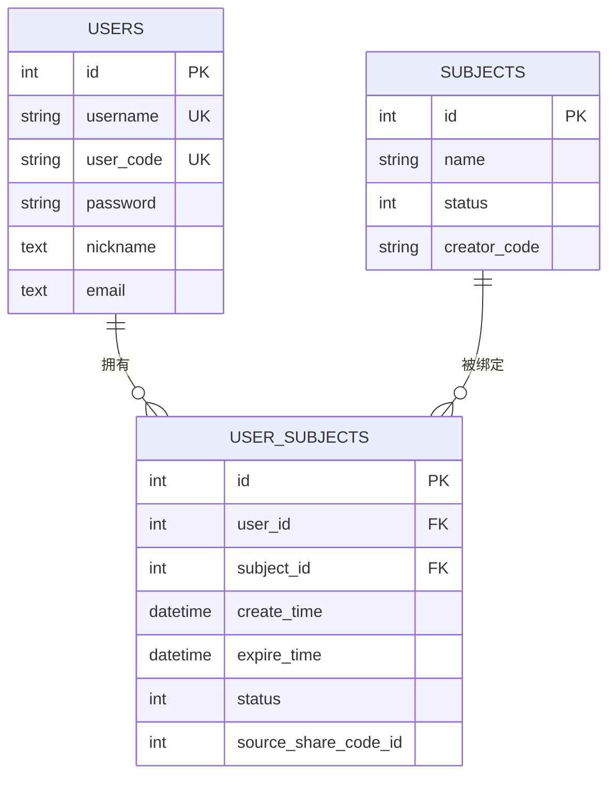
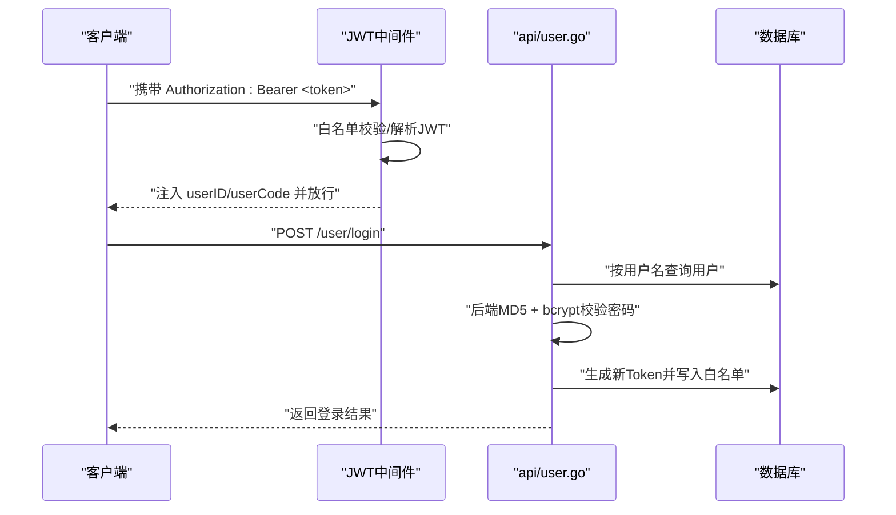
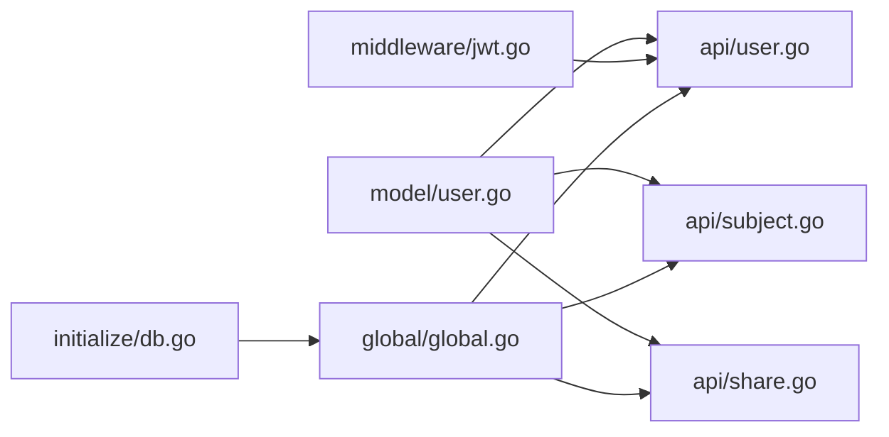

# 用户模型

<cite>
**本文引用的文件**
- [model/user.go](file://model/user.go)
- [api/user.go](file://api/user.go)
- [initialize/db.go](file://initialize/db.go)
- [middleware/jwt.go](file://middleware/jwt.go)
- [global/global.go](file://global/global.go)
- [api/subject.go](file://api/subject.go)
- [api/share.go](file://api/share.go)
</cite>

## 目录
1. [简介](#简介)
2. [项目结构](#项目结构)
3. [核心组件](#核心组件)
4. [架构总览](#架构总览)
5. [详细组件分析](#详细组件分析)
6. [依赖关系分析](#依赖关系分析)
7. [性能考量](#性能考量)
8. [故障排查指南](#故障排查指南)
9. [结论](#结论)
10. [附录](#附录)

## 简介
本文件围绕用户数据模型与相关流程进行全面说明，重点覆盖：
- DbUser 结构体字段含义与取值范围
- RegisterReq、LoginReq、UpdateUserReq 请求结构体设计及密码更新验证流程
- users 表的数据库定义（含用户名与 user_code 唯一约束、update_time 触发器）
- 用户通过 user_subjects 表与科目建立关联的机制

## 项目结构
用户相关的代码主要分布在以下模块：
- model 层：定义请求与用户实体结构体
- api 层：实现注册、登录、登出、更新用户信息/密码等接口
- initialize 层：负责数据库初始化，包含 users、user_subjects 等表的建表与触发器
- middleware 层：JWT 鉴权中间件与令牌签发
- global 层：全局 DB 连接与日志封装

图表来源
- [model/user.go](file://model/user.go#L1-L35)
- [api/user.go](file://api/user.go#L1-L342)
- [api/subject.go](file://api/subject.go#L1-L282)
- [api/share.go](file://api/share.go#L345-L380)
- [initialize/db.go](file://initialize/db.go#L154-L246)
- [middleware/jwt.go](file://middleware/jwt.go#L1-L101)
- [global/global.go](file://global/global.go#L1-L32)

章节来源
- [model/user.go](file://model/user.go#L1-L35)
- [api/user.go](file://api/user.go#L1-L342)
- [initialize/db.go](file://initialize/db.go#L154-L246)
- [middleware/jwt.go](file://middleware/jwt.go#L1-L101)
- [global/global.go](file://global/global.go#L1-L32)

## 核心组件
- DbUser：持久化用户实体，字段包括 Id、Username、Password（加密存储）、UserCode（唯一标识）、Nickname 和 Email（可空）
- RegisterReq：注册请求，包含用户名、密码、昵称、邮箱
- LoginReq：登录请求，包含用户名与密码（允许为空传）
- UpdateUserReq：更新用户请求，包含昵称、邮箱、旧密码与新密码（修改密码时必填）

章节来源
- [model/user.go](file://model/user.go#L1-L35)

## 架构总览
用户相关流程涉及鉴权中间件、接口层处理、数据库层存储与触发器，以及科目关联表。

图表来源
- [api/user.go](file://api/user.go#L261-L342)
- [initialize/db.go](file://initialize/db.go#L173-L186)
- [middleware/jwt.go](file://middleware/jwt.go#L40-L101)

## 详细组件分析

### DbUser 数据模型
- 字段说明
  - Id：自增主键
  - Username：非空且唯一
  - Password：存储经双层哈希后的密文（详见“密码安全流程”）
  - UserCode：非空且唯一，用于对外标识用户
  - Nickname：可空，使用 NullString 存储
  - Email：可空，使用 NullString 存储
- 唯一性与约束
  - users 表对 username 与 user_code 建立唯一约束
  - 提供 update_time 触发器，确保每次更新自动刷新时间戳

章节来源
- [model/user.go](file://model/user.go#L27-L35)
- [initialize/db.go](file://initialize/db.go#L173-L186)

### 请求结构体设计
- RegisterReq
  - 字段：username、password、nickname、email
  - 校验：username/password 必填
- LoginReq
  - 字段：username、password（允许为空传）
  - 用途：账号密码登录场景
- UpdateUserReq
  - 字段：nickname、email、old_password、new_password
  - 规则：若需修改密码，必须同时提供旧密码与新密码

章节来源
- [model/user.go](file://model/user.go#L6-L25)

### 密码安全与验证流程
- 注册流程
  - 后端对前端传入的明文密码先做一次 MD5，再用 bcrypt 生成哈希并入库
  - 同时生成唯一 8 位 UserCode，并写入 users 表
- 登录流程
  - 支持 Token 自动登录与账号密码登录
  - 账号密码登录时，先做后端 MD5，再与数据库中的 bcrypt 哈希比对
  - 若数据库中密码为空，允许登录但提示需要改密
- 修改密码流程
  - 若数据库密码为空：直接允许设置新密码
  - 若数据库密码存在：必须提供旧密码，旧密码同样先做后端 MD5 再与哈希比对
  - 新密码保存前同样先做后端 MD5，再 bcrypt 存储

图表来源
- [api/user.go](file://api/user.go#L277-L319)

章节来源
- [api/user.go](file://api/user.go#L52-L95)
- [api/user.go](file://api/user.go#L172-L240)
- [api/user.go](file://api/user.go#L261-L342)

### 用户与科目关联机制
- 关联表 user_subjects
  - 字段：id、user_id、subject_id、create_time、expire_time、status、source_share_code_id
  - 唯一约束：(user_id, subject_id)
  - 外键约束：user_id 引用 users(id)、subject_id 引用 subjects(id)，均启用级联删除
- 关联建立方式
  - 创建科目时，自动为创建者建立 user_id 与 subject_id 的绑定
  - 分享绑定时，使用 upsert 逻辑避免重复绑定，并更新过期时间与来源
- 关联查询
  - 科目列表与详情查询均通过 JOIN user_subjects 实现权限控制与过期判断

图表来源
- [initialize/db.go](file://initialize/db.go#L231-L246)
- [api/subject.go](file://api/subject.go#L1-L282)
- [api/share.go](file://api/share.go#L345-L380)

章节来源
- [initialize/db.go](file://initialize/db.go#L231-L246)
- [api/subject.go](file://api/subject.go#L1-L282)
- [api/share.go](file://api/share.go#L345-L380)

### 登录与鉴权流程
- 鉴权中间件
  - 从 Authorization 头解析 Bearer Token
  - 先检查内存白名单，再解析 JWT 并注入 userID/userCode
- 登录接口
  - 支持 Token 自动登录与账号密码登录
  - 登录成功后生成新 Token 并写入白名单

图表来源
- [middleware/jwt.go](file://middleware/jwt.go#L40-L101)
- [api/user.go](file://api/user.go#L100-L240)
- [global/global.go](file://global/global.go#L1-L32)

章节来源
- [middleware/jwt.go](file://middleware/jwt.go#L1-L101)
- [api/user.go](file://api/user.go#L100-L240)
- [global/global.go](file://global/global.go#L1-L32)

## 依赖关系分析
- 接口层依赖
  - api/user.go 依赖 model/user.go 的结构体定义
  - api/user.go 依赖 middleware/jwt.go 的签发与鉴权能力
  - api/user.go、api/subject.go、api/share.go 依赖 global/global.go 的 DB 连接
- 数据层依赖
  - initialize/db.go 负责建表与触发器，user_subjects 与 users、subjects 形成外键关系
- 日志与全局
  - global/global.go 提供带 RequestID 的日志封装，便于追踪

图表来源
- [model/user.go](file://model/user.go#L1-L35)
- [api/user.go](file://api/user.go#L1-L342)
- [api/subject.go](file://api/subject.go#L1-L282)
- [api/share.go](file://api/share.go#L345-L380)
- [middleware/jwt.go](file://middleware/jwt.go#L1-L101)
- [global/global.go](file://global/global.go#L1-L32)
- [initialize/db.go](file://initialize/db.go#L154-L246)

章节来源
- [model/user.go](file://model/user.go#L1-L35)
- [api/user.go](file://api/user.go#L1-L342)
- [api/subject.go](file://api/subject.go#L1-L282)
- [api/share.go](file://api/share.go#L345-L380)
- [middleware/jwt.go](file://middleware/jwt.go#L1-L101)
- [global/global.go](file://global/global.go#L1-L32)
- [initialize/db.go](file://initialize/db.go#L154-L246)

## 性能考量
- 数据库连接与 WAL 模式
  - 初始化时启用 WAL 模式与同步策略，有助于提升并发读写性能
- 触发器
  - users 表的 update_time 触发器在每次 UPDATE 时刷新时间戳，避免应用层遗漏
- 外键与索引
  - user_subjects 的联合唯一索引 (user_id, subject_id) 保证绑定唯一性，减少重复绑定成本
  - 外键约束确保数据一致性，配合级联删除简化清理逻辑

章节来源
- [initialize/db.go](file://initialize/db.go#L15-L83)
- [initialize/db.go](file://initialize/db.go#L173-L186)
- [initialize/db.go](file://initialize/db.go#L231-L246)

## 故障排查指南
- 注册失败
  - 现象：用户名可能已存在
  - 排查：确认 username 与 user_code 是否唯一；检查 DB 插入错误日志
- 登录失败
  - 现象：用户不存在、密码错误、Token 解析失败
  - 排查：核对用户名是否存在；确认密码是否经过后端 MD5 + bcrypt；检查白名单与 Token 有效性
- 修改密码失败
  - 现象：旧密码错误、查询用户失败、密码更新失败
  - 排查：确认旧密码是否提供；检查旧密码是否通过后端 MD5 + bcrypt 校验；确认新密码是否正确加密
- 科目绑定异常
  - 现象：重复绑定、过期时间未更新
  - 排查：确认 user_subjects 的唯一约束；检查 upsert 逻辑是否生效；核对 expire_time 更新条件

章节来源
- [api/user.go](file://api/user.go#L52-L95)
- [api/user.go](file://api/user.go#L172-L240)
- [api/user.go](file://api/user.go#L261-L342)
- [api/share.go](file://api/share.go#L345-L380)
- [initialize/db.go](file://initialize/db.go#L231-L246)

## 结论
本文系统梳理了用户数据模型、请求结构体设计、密码安全流程、数据库表结构与触发器，以及用户与科目通过 user_subjects 建立的关联机制。整体设计强调：
- 明确的数据模型与唯一约束
- 严格的密码安全流程（双层哈希）
- 完整的鉴权与日志追踪
- 清晰的关联表与外键约束，保障数据一致性

## 附录

### users 表定义与约束
- 字段
  - id：自增主键
  - username：非空且唯一
  - user_code：非空且唯一
  - password：存储加密后的密码
  - nickname/email：可空
  - create_time/update_time：默认当前时间
- 约束
  - 唯一约束：username、user_code
  - 触发器：update_time 在 UPDATE 后自动刷新

章节来源
- [initialize/db.go](file://initialize/db.go#L173-L186)

### user_subjects 表定义与约束
- 字段
  - id、user_id、subject_id、create_time、expire_time、status、source_share_code_id
- 约束
  - 唯一约束：(user_id, subject_id)
  - 外键约束：user_id 引用 users(id)、subject_id 引用 subjects(id)，启用级联删除

章节来源
- [initialize/db.go](file://initialize/db.go#L231-L246)