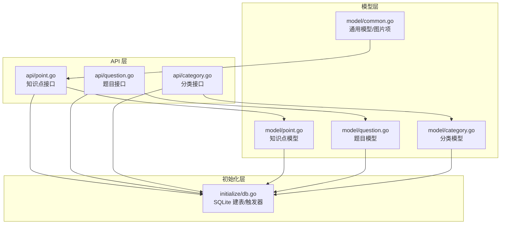
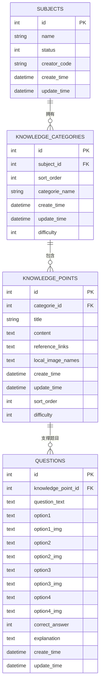
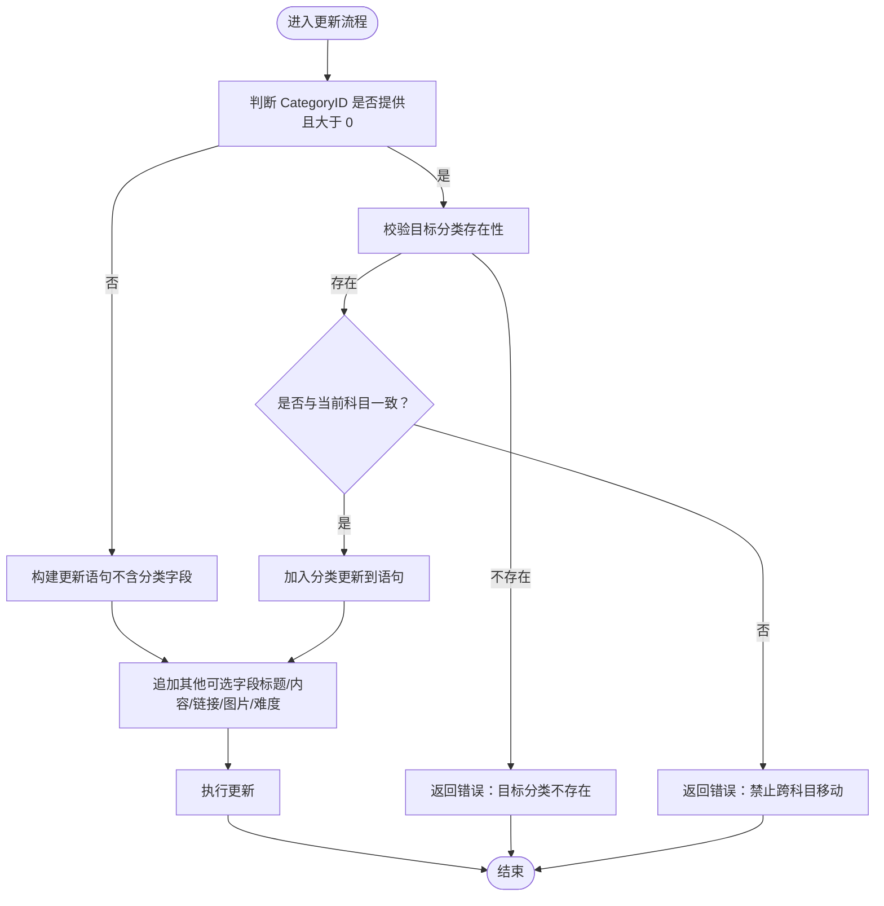
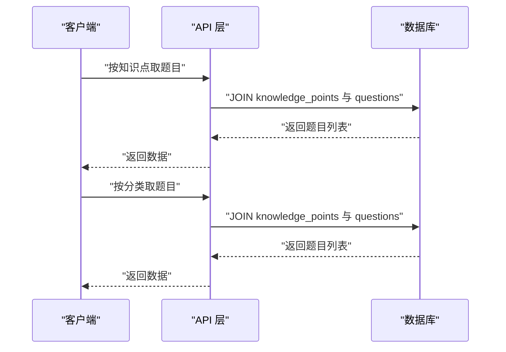
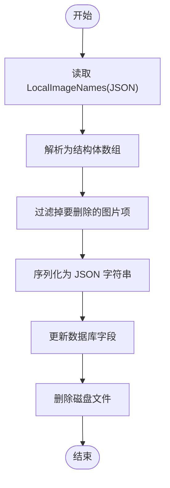
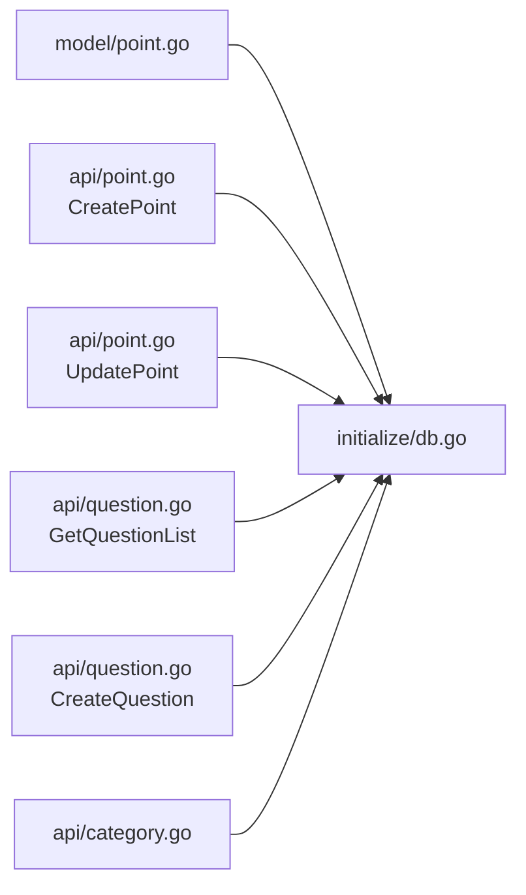

# 知识点模型

<cite>
**本文引用的文件**
- [model/point.go](file://model/point.go)
- [api/point.go](file://api/point.go)
- [initialize/db.go](file://initialize/db.go)
- [model/common.go](file://model/common.go)
- [model/question.go](file://model/question.go)
- [api/question.go](file://api/question.go)
- [model/category.go](file://model/category.go)
- [api/category.go](file://api/category.go)
</cite>

## 目录
1. [简介](#简介)
2. [项目结构](#项目结构)
3. [核心组件](#核心组件)
4. [架构总览](#架构总览)
5. [详细组件分析](#详细组件分析)
6. [依赖关系分析](#依赖关系分析)
7. [性能考量](#性能考量)
8. [故障排查指南](#故障排查指南)
9. [结论](#结论)

## 简介
本文件围绕“知识点”数据模型进行系统化说明，覆盖以下主题：
- 知识点结构体字段语义与用途
- CreatePointRequest 与 UpdatePointRequest 的设计意图
- UpdatePointRequest 中 CategoryID 指针字段的作用
- knowledge_points 表的数据库定义（含外键约束与触发器）
- 知识点在“分类—题目”之间的桥梁作用
- 知识点与图片管理的集成方式（JSON 字段与后端处理流程）

## 项目结构
本项目采用分层结构：API 层负责路由与鉴权、模型层定义数据结构、初始化层负责数据库建表与触发器、前端通过 API 交互。

图表来源
- [api/point.go](file://api/point.go#L1-L538)
- [api/question.go](file://api/question.go#L1-L425)
- [api/category.go](file://api/category.go#L1-L387)
- [model/point.go](file://model/point.go#L1-L35)
- [model/question.go](file://model/question.go#L1-L65)
- [model/category.go](file://model/category.go#L1-L26)
- [model/common.go](file://model/common.go#L1-L14)
- [initialize/db.go](file://initialize/db.go#L154-L307)

章节来源
- [initialize/db.go](file://initialize/db.go#L154-L307)

## 核心组件
- 知识点结构体 KnowledgePoint：承载知识点的元数据与内容，包含标题、正文、参考链接、本地图片集合、排序与难度等。
- 请求模型 CreatePointRequest/UpdatePointRequest：分别用于创建与更新知识点时的输入约束与可选字段控制。
- 图片项结构体 ImageItem 与 DeletePointImageRequest：用于 JSON 字段解析与图片删除的请求体。

章节来源
- [model/point.go](file://model/point.go#L1-L35)
- [model/common.go](file://model/common.go#L1-L14)

## 架构总览
知识点在系统中的角色是“分类—题目”的桥梁：分类组织知识点，题目绑定到具体知识点，从而实现“按知识点组织题目”的能力。后端通过 API 层进行权限校验与业务编排，模型层定义数据结构，初始化层负责数据库表与触发器。

图表来源
- [initialize/db.go](file://initialize/db.go#L287-L329)

## 详细组件分析

### 知识点结构体字段说明
- ID：主键，唯一标识一个知识点。
- CategoryID：外键，指向知识分类（knowledge_categories）的 id。
- Title：知识点标题。
- Content：知识点正文内容。
- ReferenceLinks：JSON 字符串，存储参考链接集合。
- LocalImageNames：JSON 字符串，存储本地图片集合（每项包含名称与 URL）。
- CreateTime/UpdateTime：创建与更新时间，由数据库触发器自动维护。
- SortOrder：排序字段，用于同分类内排序。
- Difficulty：难度等级（0-3），用于筛选与展示。

章节来源
- [model/point.go](file://model/point.go#L1-L35)
- [initialize/db.go](file://initialize/db.go#L287-L307)

### CreatePointRequest 设计
- 用途：创建新知识点时的最小必要输入。
- 字段：
  - CategoryID：必填，用于指定所属分类。
  - Title：必填，作为初始标题。
- 设计要点：
  - 仅包含创建所需的关键字段，避免冗余。
  - 通过绑定规则保证必填性。

章节来源
- [model/point.go](file://model/point.go#L18-L23)

### UpdatePointRequest 设计与 CategoryID 指针字段
- 用途：更新知识点时的灵活输入，支持部分字段更新与分类移动。
- 字段：
  - Title/Content/ReferenceLinks/LocalImageNames：可选更新。
  - Difficulty：指针字段，允许区分“显式设为 0”与“未提供”两种情况。
  - CategoryID：指针字段，当提供正值时执行分类移动；若未提供则不更新分类。
- 设计要点：
  - 指针字段用于“可选更新”的语义区分，避免将 0 视作“默认值”。
  - 分类移动时会进行目标分类存在性与科目一致性校验，防止跨科目移动。

图表来源
- [api/point.go](file://api/point.go#L238-L313)

章节来源
- [model/point.go](file://model/point.go#L24-L35)
- [api/point.go](file://api/point.go#L238-L313)

### knowledge_points 表定义（含外键与触发器）
- 主键：id
- 外键：categorie_id -> knowledge_categories(id)（级联删除策略为 NO ACTION，更新策略为 NO ACTION）
- 字段：
  - id、categorie_id、title、content、reference_links、local_image_names、create_time、update_time、sort_order、difficulty
- 触发器：
  - trg_update_points_time：在更新时自动刷新 update_time

章节来源
- [initialize/db.go](file://initialize/db.go#L287-L307)

### 知识点在分类与题目之间的桥梁作用
- 分类（knowledge_categories）：组织知识点，具备科目维度与排序。
- 知识点（knowledge_points）：承载内容与资源，作为题目的“知识来源”。
- 题目（questions）：绑定到具体知识点，形成“知识点—题目”的一对多关系。
- API 层通过 JOIN 实现“按知识点或分类取题目”，并进行权限校验。

图表来源
- [api/question.go](file://api/question.go#L118-L178)
- [initialize/db.go](file://initialize/db.go#L309-L329)

章节来源
- [api/question.go](file://api/question.go#L118-L178)
- [initialize/db.go](file://initialize/db.go#L309-L329)

### 知识点与图片管理的集成
- JSON 字段：
  - LocalImageNames：存储图片数组（每项包含名称与 URL）。
- 删除流程：
  - 读取当前 JSON 字段，解析为结构体数组。
  - 移除匹配的图片项，生成新的 JSON 并回写数据库。
  - 同步删除磁盘上的文件。

图表来源
- [api/point.go](file://api/point.go#L456-L538)
- [model/common.go](file://model/common.go#L1-L14)

章节来源
- [api/point.go](file://api/point.go#L456-L538)
- [model/common.go](file://model/common.go#L1-L14)

## 依赖关系分析
- 知识点模型依赖于数据库表结构与触发器。
- API 层依赖模型层的数据结构，并在更新时动态拼接 SQL。
- 题目与知识点之间通过外键建立强约束，确保数据一致性。
- 分类与科目之间通过外键建立强约束，保障科目维度的完整性。

图表来源
- [model/point.go](file://model/point.go#L1-L35)
- [api/point.go](file://api/point.go#L132-L313)
- [api/question.go](file://api/question.go#L118-L178)
- [api/category.go](file://api/category.go#L1-L387)
- [initialize/db.go](file://initialize/db.go#L287-L329)

章节来源
- [initialize/db.go](file://initialize/db.go#L287-L329)

## 性能考量
- 外键与触发器：
  - 外键约束启用（PRAGMA foreign_keys=ON），确保参照完整性。
  - 触发器自动维护 update_time，减少应用层重复逻辑。
- 排序与索引：
  - 知识点与分类均提供 sort_order 字段，配合 ORDER BY 提升查询效率。
  - 建议在高频查询字段上建立合适索引（如 knowledge_points.categorie_id、questions.knowledge_point_id）。
- 事务与批量更新：
  - 排序操作使用事务，保证原子性与一致性。
- JSON 字段：
  - JSON 字段适合小规模结构化数据；若图片数量较多，建议拆分为独立表以提升查询与更新性能。

章节来源
- [initialize/db.go](file://initialize/db.go#L58-L71)
- [initialize/db.go](file://initialize/db.go#L287-L307)
- [api/point.go](file://api/point.go#L372-L454)

## 故障排查指南
- 删除知识点失败（外键约束）：
  - 当前实现会在删除失败时检测外键约束错误并提示“该知识点下仍有题目，请先删除题目”。
- 更新难度非法：
  - UpdatePoint 对 Difficulty 进行范围校验（0-3），超出范围将返回错误。
- 分类移动失败：
  - 目标分类不存在或跨科目移动会被拒绝。
- 图片删除失败：
  - 若请求的文件路径在 JSON 中未找到，将返回未找到；解析 JSON 异常也会报错。

章节来源
- [api/point.go](file://api/point.go#L318-L365)
- [api/point.go](file://api/point.go#L287-L313)
- [api/point.go](file://api/point.go#L456-L538)

## 结论
- 知识点模型通过清晰的字段划分与可选更新机制，实现了“内容—资源—组织—题目的完整闭环”。
- UpdatePointRequest 的指针字段设计有效解决了“显式设为 0 与未提供”的语义歧义问题。
- 数据库层通过外键与触发器保障一致性与自动化维护，API 层通过权限校验与事务保证安全与可靠。
- 建议在高并发场景下对热点字段增加索引，并评估图片数据量增长后的表结构演进方案。