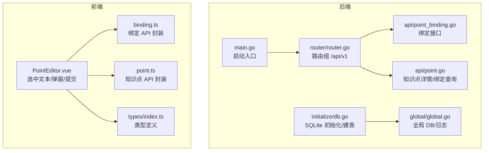
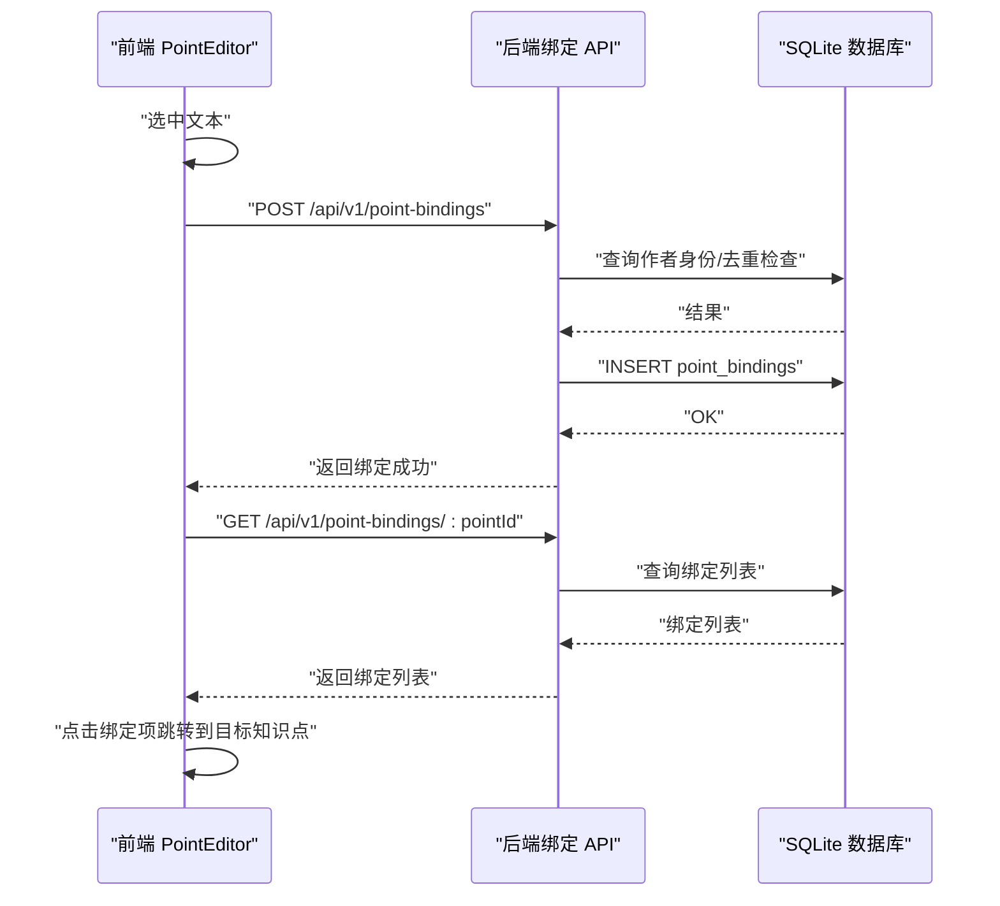
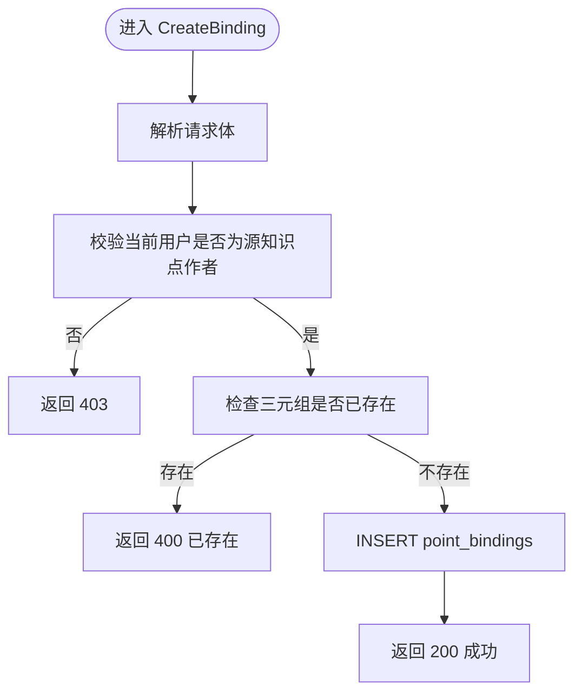
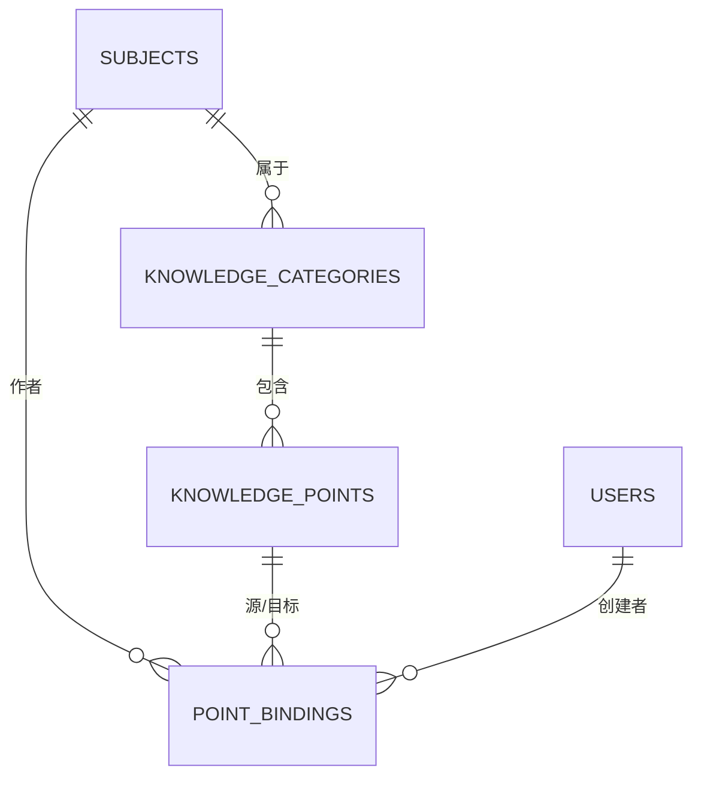
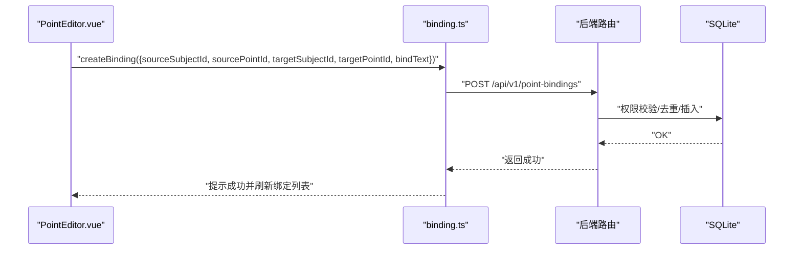
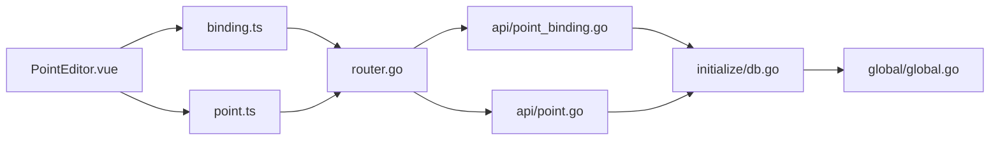

# 知识点绑定系统

<cite>
**本文引用的文件**
- [README.md](file://README.md)
- [main.go](file://main.go)
- [router/router.go](file://router/router.go)
- [initialize/db.go](file://initialize/db.go)
- [global/global.go](file://global/global.go)
- [api/point_binding.go](file://api/point_binding.go)
- [api/point.go](file://api/point.go)
- [model/point_binding.go](file://model/point_binding.go)
- [model/point.go](file://model/point.go)
- [practice_problems_web/src/api/binding.ts](file://practice_problems_web/src/api/binding.ts)
- [practice_problems_web/src/components/PointEditor.vue](file://practice_problems_web/src/components/PointEditor.vue)
- [practice_problems_web/src/api/point.ts](file://practice_problems_web/src/api/point.ts)
- [practice_problems_web/src/types/index.ts](file://practice_problems_web/src/types/index.ts)
</cite>

## 目录
1. [简介](#简介)
2. [项目结构](#项目结构)
3. [核心组件](#核心组件)
4. [架构总览](#架构总览)
5. [详细组件分析](#详细组件分析)
6. [依赖分析](#依赖分析)
7. [性能考虑](#性能考虑)
8. [故障排查指南](#故障排查指南)
9. [结论](#结论)
10. [附录](#附录)

## 简介
本文件聚焦“知识点绑定系统”，围绕后端 API、数据库表结构、前端交互与路由配置进行系统化梳理，帮助读者快速理解“从选中文本到建立知识点之间关联”的完整链路，以及前后端如何协作实现绑定的创建、查询与删除。

## 项目结构
- 后端采用 Gin 框架，路由集中于 v1 组，其中“知识点绑定”相关接口位于 /api/v1/point-bindings 与 /api/v1/binding/*。
- 数据库存储采用 SQLite，初始化脚本中包含 point_bindings 表及外键约束。
- 前端 Vue 3 通过封装的 request 工具调用后端 API，PointEditor 组件负责选中文本、弹窗选择目标知识点并发起绑定请求。

图表来源
- [main.go](file://main.go#L1-L76)
- [router/router.go](file://router/router.go#L1-L172)
- [initialize/db.go](file://initialize/db.go#L1-L120)
- [api/point_binding.go](file://api/point_binding.go#L1-L204)
- [api/point.go](file://api/point.go#L133-L168)
- [practice_problems_web/src/api/binding.ts](file://practice_problems_web/src/api/binding.ts#L1-L49)
- [practice_problems_web/src/components/PointEditor.vue](file://practice_problems_web/src/components/PointEditor.vue#L766-L838)
- [practice_problems_web/src/api/point.ts](file://practice_problems_web/src/api/point.ts#L1-L40)
- [practice_problems_web/src/types/index.ts](file://practice_problems_web/src/types/index.ts#L1-L86)

章节来源
- [README.md](file://README.md#L1-L178)
- [main.go](file://main.go#L1-L76)
- [router/router.go](file://router/router.go#L1-L172)
- [initialize/db.go](file://initialize/db.go#L662-L705)

## 核心组件
- 后端 API
  - 创建绑定：校验当前用户是否为源知识点所属科目作者；去重检查；插入 point_bindings。
  - 查询绑定：按知识点 ID 查询其所有绑定，并附带目标知识点所属分类 ID，便于前端按需加载缓存。
  - 删除绑定：校验当前用户是否为绑定所关联科目作者。
  - 辅助接口：按科目列出分类、按分类列出知识点，供前端弹窗选择目标。
- 数据模型
  - 后端模型：PointBinding、CreateBindingRequest、BindingWithDetails。
  - 前端类型：PointDetail、ApiResponse 等。
- 前端组件
  - PointEditor：选中文本高亮、弹窗选择目标、提交绑定、删除绑定、导航到目标知识点。
  - API 封装：binding.ts、point.ts。
- 数据库
  - point_bindings 表：包含源/目标科目与知识点 ID、绑定文字、创建者与时间戳，具备外键约束。

章节来源
- [api/point_binding.go](file://api/point_binding.go#L1-L204)
- [api/point.go](file://api/point.go#L133-L168)
- [model/point_binding.go](file://model/point_binding.go#L1-L32)
- [model/point.go](file://model/point.go#L1-L37)
- [practice_problems_web/src/api/binding.ts](file://practice_problems_web/src/api/binding.ts#L1-L49)
- [practice_problems_web/src/components/PointEditor.vue](file://practice_problems_web/src/components/PointEditor.vue#L766-L838)
- [initialize/db.go](file://initialize/db.go#L662-L705)

## 架构总览
后端通过 Gin 路由暴露绑定接口，前端通过封装的 request 发起请求。后端对绑定操作进行权限校验（作者身份）、重复性检查与数据库写入；前端负责选中文本、选择目标知识点并提交，同时在知识点详情页展示绑定列表并支持跳转。

图表来源
- [router/router.go](file://router/router.go#L105-L111)
- [api/point_binding.go](file://api/point_binding.go#L1-L204)
- [api/point.go](file://api/point.go#L133-L168)
- [practice_problems_web/src/components/PointEditor.vue](file://practice_problems_web/src/components/PointEditor.vue#L766-L838)

## 详细组件分析

### 后端：绑定 API
- 权限校验
  - 创建/删除绑定均通过查询科目作者码与当前用户上下文比对，确保只有作者可操作。
- 去重策略
  - 以“源知识点 ID + 目标知识点 ID + 绑定文字”三元组唯一，避免重复绑定。
- 数据写入
  - 插入 point_bindings，记录创建者 user_id。
- 查询与返回
  - GetBindingsByPoint 返回绑定列表，并附带目标知识点所属分类 ID，前端据此按需加载缓存。

图表来源
- [api/point_binding.go](file://api/point_binding.go#L1-L72)

章节来源
- [api/point_binding.go](file://api/point_binding.go#L1-L204)

### 数据模型与数据库
- 模型
  - PointBinding：绑定记录的核心字段。
  - CreateBindingRequest：创建绑定的请求体。
  - BindingWithDetails：查询返回时附加科目/知识点名称。
- 数据库表
  - point_bindings：包含外键约束 subjects、knowledge_points、users，保证引用完整性。
  - knowledge_points：知识点表，与绑定表形成一对多关系。

图表来源
- [initialize/db.go](file://initialize/db.go#L550-L592)
- [initialize/db.go](file://initialize/db.go#L662-L705)
- [model/point_binding.go](file://model/point_binding.go#L1-L32)

章节来源
- [model/point_binding.go](file://model/point_binding.go#L1-L32)
- [initialize/db.go](file://initialize/db.go#L550-L592)
- [initialize/db.go](file://initialize/db.go#L662-L705)

### 前端：PointEditor 组件
- 选中文本高亮
  - 在渲染内容时，按绑定文字长度降序替换，避免短串覆盖长串；为绑定文字包裹可点击链接。
- 弹窗选择目标
  - 打开弹窗时加载科目分类，再按分类加载知识点；禁止绑定到自身。
- 提交与删除
  - 提交时携带选中文本、源/目标知识点 ID、源科目 ID；删除时调用后端删除接口。
- 导航到目标
  - 点击绑定项触发导航事件，父组件根据目标知识点 ID 与分类 ID 跳转。

图表来源
- [practice_problems_web/src/components/PointEditor.vue](file://practice_problems_web/src/components/PointEditor.vue#L766-L838)
- [practice_problems_web/src/api/binding.ts](file://practice_problems_web/src/api/binding.ts#L1-L16)
- [router/router.go](file://router/router.go#L105-L111)
- [api/point_binding.go](file://api/point_binding.go#L1-L72)

章节来源
- [practice_problems_web/src/components/PointEditor.vue](file://practice_problems_web/src/components/PointEditor.vue#L1-L200)
- [practice_problems_web/src/components/PointEditor.vue](file://practice_problems_web/src/components/PointEditor.vue#L766-L838)
- [practice_problems_web/src/api/binding.ts](file://practice_problems_web/src/api/binding.ts#L1-L49)
- [router/router.go](file://router/router.go#L105-L111)

### 知识点详情与绑定查询
- 后端在获取知识点详情时，同时查询该知识点的所有绑定，并附带目标知识点所属分类 ID，便于前端按需加载缓存。
- 前端在渲染绑定列表时，支持点击跳转到目标知识点。

章节来源
- [api/point.go](file://api/point.go#L133-L168)
- [practice_problems_web/src/components/PointEditor.vue](file://practice_problems_web/src/components/PointEditor.vue#L1-L200)

## 依赖分析
- 组件耦合
  - 前端 PointEditor 依赖 binding.ts 与 point.ts；后端绑定 API 依赖全局 DB 连接与中间件（JWT）。
- 外部依赖
  - Gin 路由、SQLite 驱动、Element Plus UI 组件库、Vite 构建工具。
- 数据一致性
  - point_bindings 表通过外键约束与 subjects、knowledge_points、users 关联，避免脏数据。

图表来源
- [router/router.go](file://router/router.go#L1-L172)
- [api/point_binding.go](file://api/point_binding.go#L1-L204)
- [api/point.go](file://api/point.go#L133-L168)
- [initialize/db.go](file://initialize/db.go#L662-L705)
- [global/global.go](file://global/global.go#L1-L200)
- [practice_problems_web/src/api/binding.ts](file://practice_problems_web/src/api/binding.ts#L1-L49)
- [practice_problems_web/src/api/point.ts](file://practice_problems_web/src/api/point.ts#L1-L40)

章节来源
- [router/router.go](file://router/router.go#L1-L172)
- [initialize/db.go](file://initialize/db.go#L662-L705)
- [global/global.go](file://global/global.go#L1-L200)

## 性能考虑
- 数据库层
  - WAL 模式与同步级别已在初始化阶段设置，有助于提升并发读写性能与可靠性。
  - point_bindings 表具备外键约束，查询时可利用索引（由外键隐式创建）提升 JOIN 性能。
- 接口层
  - 绑定查询按 source_point_id 过滤，建议在该字段上建立索引以加速查询。
  - 去重检查使用三元组条件，建议在 point_bindings 上建立复合索引以减少重复扫描。
- 前端层
  - 绑定文字高亮按长度降序替换，避免短串覆盖长串，减少多次替换成本。
  - 按需加载目标知识点缓存，减少不必要的网络请求。

章节来源
- [initialize/db.go](file://initialize/db.go#L32-L83)
- [api/point_binding.go](file://api/point_binding.go#L45-L72)
- [api/point.go](file://api/point.go#L133-L168)
- [practice_problems_web/src/components/PointEditor.vue](file://practice_problems_web/src/components/PointEditor.vue#L400-L425)

## 故障排查指南
- 创建绑定失败
  - 检查当前用户是否为源知识点所属科目作者；确认三元组是否已存在；查看后端返回的错误码与消息。
- 删除绑定失败
  - 确认当前用户是否为绑定所关联科目作者；检查绑定 ID 是否有效。
- 查询绑定为空
  - 确认知识点 ID 是否正确；检查目标知识点所属分类 ID 是否存在；确认前端是否已按需加载缓存。
- 前端点击绑定无反应
  - 检查绑定项是否包含有效的 targetPointId；确认导航事件是否被父组件正确处理。

章节来源
- [api/point_binding.go](file://api/point_binding.go#L1-L204)
- [api/point.go](file://api/point.go#L133-L168)
- [practice_problems_web/src/components/PointEditor.vue](file://practice_problems_web/src/components/PointEditor.vue#L840-L858)

## 结论
知识点绑定系统通过严格的作者权限校验、去重检查与外键约束，确保绑定关系的准确性与一致性；前端通过直观的选中文本与弹窗选择，简化了绑定流程；后端提供完善的查询与删除接口，支撑前端的展示与交互。整体设计清晰、职责明确，适合在私有化部署场景中稳定运行。

## 附录
- 路由与接口
  - 创建绑定：POST /api/v1/point-bindings
  - 查询绑定：GET /api/v1/point-bindings/:pointId
  - 删除绑定：DELETE /api/v1/point-bindings/:id
  - 按科目获取分类：GET /api/v1/binding/subjects/:subjectId/categories
  - 按分类获取知识点：GET /api/v1/binding/categories/:categoryId/points
- 数据库表
  - point_bindings：包含 source_subject_id、source_point_id、target_subject_id、target_point_id、bind_text、user_id、create_time。
  - knowledge_points：包含 id、categorie_id、title、content、video_url、reference_links、local_image_names、create_time、update_time、sort_order、difficulty。

章节来源
- [router/router.go](file://router/router.go#L105-L111)
- [initialize/db.go](file://initialize/db.go#L662-L705)
- [api/point_binding.go](file://api/point_binding.go#L1-L204)
- [api/point.go](file://api/point.go#L133-L168)