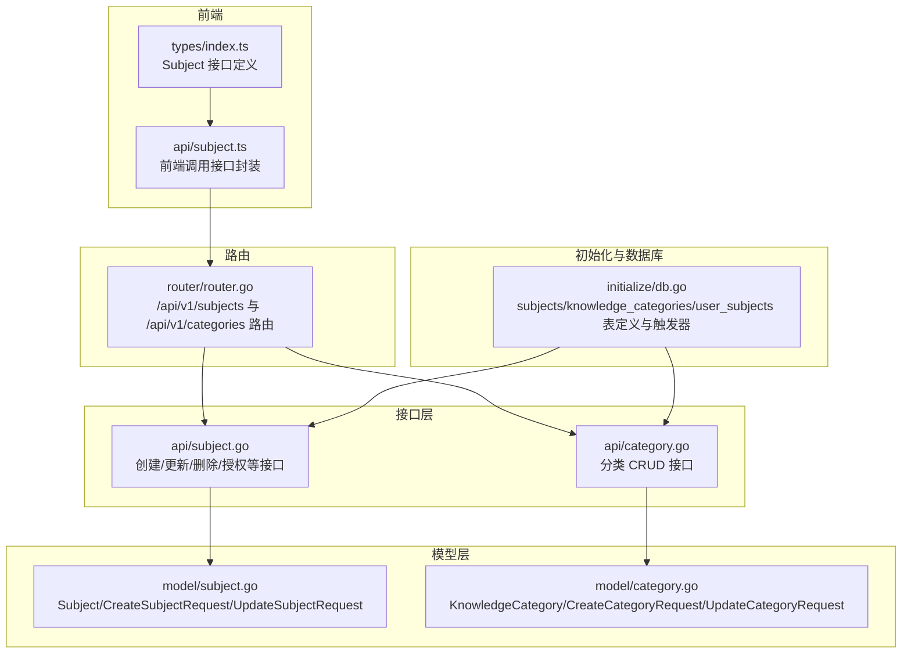
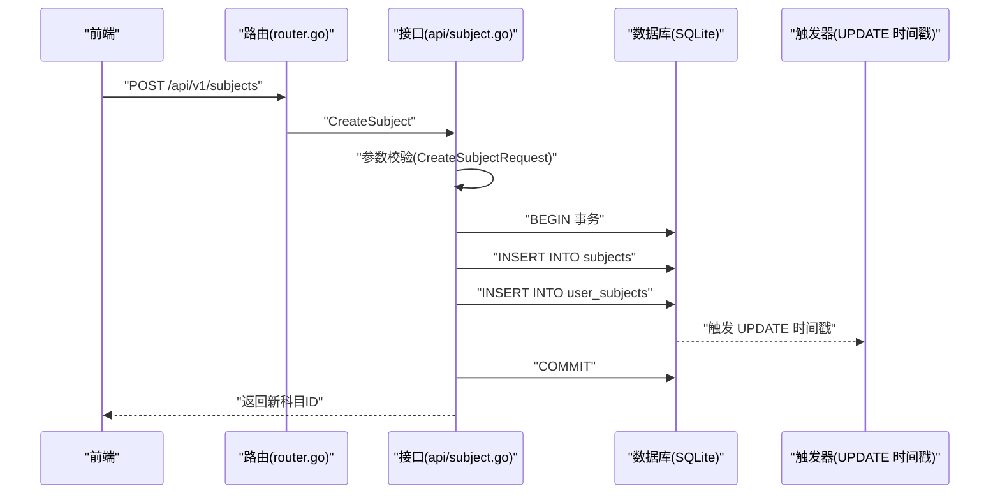
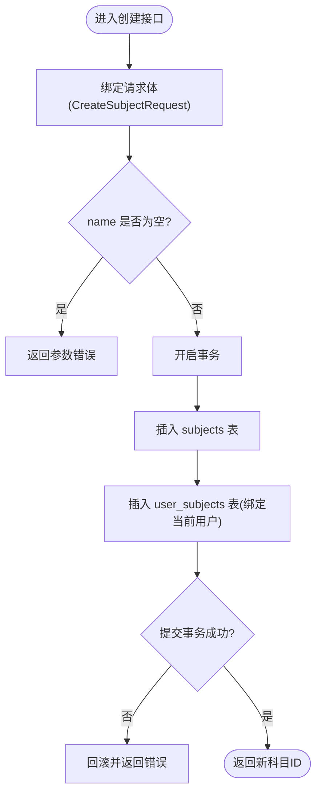
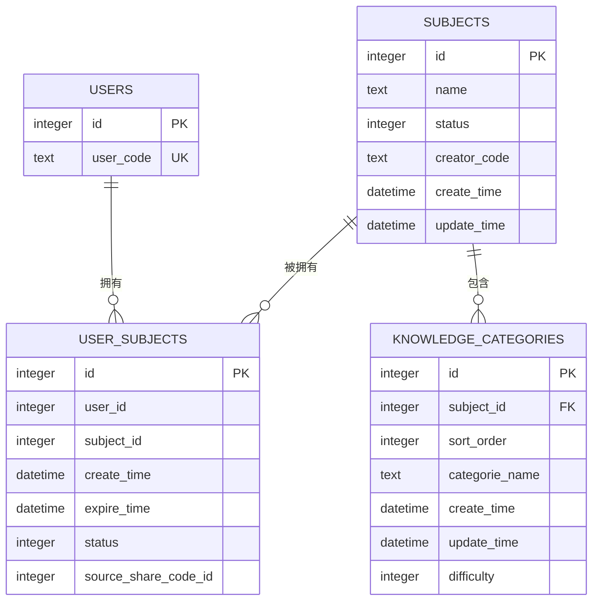
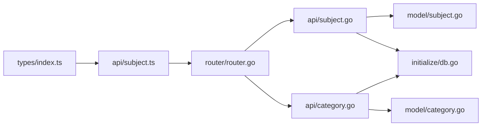

# 科目模型

<cite>
**本文引用的文件**
- [model/subject.go](file://model/subject.go)
- [api/subject.go](file://api/subject.go)
- [initialize/db.go](file://initialize/db.go)
- [model/category.go](file://model/category.go)
- [api/category.go](file://api/category.go)
- [router/router.go](file://router/router.go)
- [practice_problems_web/src/types/index.ts](file://practice_problems_web/src/types/index.ts)
- [practice_problems_web/src/api/subject.ts](file://practice_problems_web/src/api/subject.ts)
</cite>

## 目录
1. [简介](#简介)
2. [项目结构](#项目结构)
3. [核心组件](#核心组件)
4. [架构总览](#架构总览)
5. [详细组件分析](#详细组件分析)
6. [依赖分析](#依赖分析)
7. [性能考虑](#性能考虑)
8. [故障排查指南](#故障排查指南)
9. [结论](#结论)

## 简介
本文件围绕“科目”数据模型进行系统化说明，覆盖以下内容：
- Subject 结构体字段含义与用途
- CreateSubjectRequest 与 UpdateSubjectRequest 的字段与校验规则
- 基于 initialize/db.go 中 CREATE TABLE 语句的 subjects 表结构定义（含主键、唯一约束、触发器）
- 科目与分类（KnowledgeCategory）的一对多关系
- 科目与用户（user_subjects）的多对多关系及授权有效期控制

## 项目结构
与“科目模型”直接相关的后端模块与文件如下：
- 模型层：model/subject.go、model/category.go
- 接口层：api/subject.go、api/category.go
- 初始化与数据库：initialize/db.go
- 路由注册：router/router.go
- 前端类型与接口：practice_problems_web/src/types/index.ts、practice_problems_web/src/api/subject.ts

图表来源
- [model/subject.go](file://model/subject.go#L1-L24)
- [model/category.go](file://model/category.go#L1-L26)
- [api/subject.go](file://api/subject.go#L1-L508)
- [api/category.go](file://api/category.go#L55-L168)
- [initialize/db.go](file://initialize/db.go#L154-L286)
- [router/router.go](file://router/router.go#L33-L106)
- [practice_problems_web/src/types/index.ts](file://practice_problems_web/src/types/index.ts#L8-L26)
- [practice_problems_web/src/api/subject.ts](file://practice_problems_web/src/api/subject.ts#L1-L27)

章节来源
- [model/subject.go](file://model/subject.go#L1-L24)
- [initialize/db.go](file://initialize/db.go#L154-L286)
- [router/router.go](file://router/router.go#L33-L106)

## 核心组件
- Subject 结构体：描述数据库 subjects 表的实体映射，包含主键、名称、状态、时间戳、创建者编码等字段。
- CreateSubjectRequest：创建科目时的请求体结构，包含必填字段与可选字段。
- UpdateSubjectRequest：更新科目时的请求体结构，字段与创建类似但无必填限制。
- 知识分类 KnowledgeCategory：描述 knowledge_categories 表，与科目存在一对多关系。
- user_subjects 关联表：描述科目与用户的多对多关系，支持授权有效期与状态控制。

章节来源
- [model/subject.go](file://model/subject.go#L1-L24)
- [model/category.go](file://model/category.go#L1-L26)
- [initialize/db.go](file://initialize/db.go#L191-L245)

## 架构总览
科目模型在系统中的位置与交互如下：
- 路由层通过 /api/v1/subjects 暴露科目相关接口
- 接口层处理请求参数、鉴权、事务与数据库操作
- 模型层定义数据结构与请求体
- 初始化脚本负责创建表与触发器，并建立外键约束
- 前端通过 types/index.ts 定义 Subject 接口，api/subject.ts 调用后端接口

图表来源
- [router/router.go](file://router/router.go#L70-L81)
- [api/subject.go](file://api/subject.go#L134-L185)
- [initialize/db.go](file://initialize/db.go#L191-L202)

## 详细组件分析

### Subject 实体与字段说明
- 字段定义与含义
  - id：主键，自增整数
  - name：科目名称，字符串
  - status：状态，整数（启用/禁用）
  - create_time：创建时间，字符串
  - update_time：更新时间，字符串
  - creator_code：创建者编码，字符串
- 字段来源与映射
  - 与 initialize/db.go 中 subjects 表字段一一对应
  - 与前端 Subject 接口字段保持一致（前端未暴露 creatorCode）

章节来源
- [model/subject.go](file://model/subject.go#L1-L11)
- [initialize/db.go](file://initialize/db.go#L191-L198)
- [practice_problems_web/src/types/index.ts](file://practice_problems_web/src/types/index.ts#L8-L16)

### CreateSubjectRequest 与 UpdateSubjectRequest
- CreateSubjectRequest
  - 字段：name（必填）、status（可选，默认值在接口层处理）
  - 参数校验：使用框架内置校验注解，确保创建时 name 必填
- UpdateSubjectRequest
  - 字段：name、status
  - 参数校验：接口层进行 JSON 绑定校验，无必填要求

图表来源
- [api/subject.go](file://api/subject.go#L134-L185)
- [model/subject.go](file://model/subject.go#L13-L18)

章节来源
- [model/subject.go](file://model/subject.go#L13-L23)
- [api/subject.go](file://api/subject.go#L134-L185)

### subjects 表结构定义（含主键、唯一约束与触发器）
- 主键：id（INTEGER PRIMARY KEY AUTOINCREMENT）
- 字段：name、status、creator_code、create_time、update_time
- 默认值：status 默认 1；create_time/update_time 默认 CURRENT_TIMESTAMP
- 触发器：UPDATE 时自动更新 update_time
- 关联关系：知识分类 knowledge_categories 通过外键 subject_id 关联；user_subjects 通过外键 subject_id 关联

章节来源
- [initialize/db.go](file://initialize/db.go#L191-L202)

### user_subjects 关联表与多对多关系
- 关联表：user_subjects
  - 主键：id
  - 字段：user_id、subject_id、create_time、expire_time、status、source_share_code_id
  - 唯一约束：uk_user_subject（user_id, subject_id）
  - 外键约束：
    - fk_user -> users(id)（级联删除，更新不动作）
    - fk_subject -> subjects(id)（级联删除，更新不动作）
- 多对多关系
  - 一个用户可拥有多个科目（user_subjects 记录）
  - 一个科目可被多个用户拥有（user_subjects 记录）
- 授权有效期与状态
  - expire_time：为空表示永久有效；非空表示到期时间
  - status：1 表示有效，0 表示失效（解除授权）
  - 支持单条与批量更新有效期、批量解除授权

图表来源
- [initialize/db.go](file://initialize/db.go#L234-L245)
- [initialize/db.go](file://initialize/db.go#L272-L281)

章节来源
- [initialize/db.go](file://initialize/db.go#L234-L245)
- [initialize/db.go](file://initialize/db.go#L272-L281)
- [api/subject.go](file://api/subject.go#L312-L352)
- [api/subject.go](file://api/subject.go#L354-L441)
- [api/subject.go](file://api/subject.go#L443-L508)

### 知识分类（KnowledgeCategory）与科目的一对多关系
- KnowledgeCategory 字段
  - id、subject_id、categoryName、createTime、updateTime、sortOrder、difficulty、creatorCode
- 关系
  - 一个科目可包含多个分类（一对多）
  - 外键约束：fk_subject -> subjects(id)（删除/更新策略为 NO ACTION）
- 接口
  - 提供分类列表、创建、更新、删除、排序等接口
  - 创建分类时会校验当前用户是否为科目作者

章节来源
- [model/category.go](file://model/category.go#L1-L26)
- [initialize/db.go](file://initialize/db.go#L272-L281)
- [api/category.go](file://api/category.go#L55-L168)

### 前后端数据模型一致性
- 前端 Subject 接口
  - 字段：id、name、status、createTime、updateTime
  - 未暴露 creatorCode，避免前端直接使用
- 前端调用
  - 通过 api/subject.ts 封装 GET/POST/PUT/DELETE 请求
  - 返回 ApiResponse<T> 结构，data 为 Subject 或 Subject 数组

章节来源
- [practice_problems_web/src/types/index.ts](file://practice_problems_web/src/types/index.ts#L8-L26)
- [practice_problems_web/src/api/subject.ts](file://practice_problems_web/src/api/subject.ts#L1-L27)

## 依赖分析
- 模块耦合
  - api/subject.go 依赖 model/subject.go 的请求体结构
  - api/subject.go 依赖 initialize/db.go 中的表结构与触发器
  - api/category.go 依赖 model/category.go 与 initialize/db.go 中的表结构
  - router/router.go 将路由与 api 层对接
  - 前端 types/index.ts 与 api/subject.ts 依赖后端接口契约
- 外键与约束
  - user_subjects 对 users 与 subjects 的外键约束，保证数据一致性
  - uk_user_subject 唯一性约束，防止重复授权
  - knowledge_categories 对 subjects 的外键约束，限定分类归属

图表来源
- [api/subject.go](file://api/subject.go#L1-L508)
- [model/subject.go](file://model/subject.go#L1-L24)
- [initialize/db.go](file://initialize/db.go#L154-L286)
- [router/router.go](file://router/router.go#L33-L106)
- [practice_problems_web/src/types/index.ts](file://practice_problems_web/src/types/index.ts#L8-L26)
- [practice_problems_web/src/api/subject.ts](file://practice_problems_web/src/api/subject.ts#L1-L27)

章节来源
- [api/subject.go](file://api/subject.go#L1-L508)
- [model/subject.go](file://model/subject.go#L1-L24)
- [initialize/db.go](file://initialize/db.go#L154-L286)
- [router/router.go](file://router/router.go#L33-L106)
- [practice_problems_web/src/types/index.ts](file://practice_problems_web/src/types/index.ts#L8-L26)
- [practice_problems_web/src/api/subject.ts](file://practice_problems_web/src/api/subject.ts#L1-L27)

## 性能考虑
- SQLite WAL 模式与同步级别已在初始化阶段启用，有助于提升并发读写性能与可靠性
- 触发器自动维护 update_time，减少应用层重复逻辑
- user_subjects 表包含唯一约束与外键，避免冗余数据与不一致
- 建议在高频查询场景下为常用过滤字段（如 subject_id、user_id、status）建立索引以优化查询

章节来源
- [initialize/db.go](file://initialize/db.go#L1-L120)

## 故障排查指南
- 创建科目失败
  - 检查请求体是否满足 CreateSubjectRequest 校验（name 必填）
  - 查看事务执行日志，确认 INSERT INTO subjects 与 INSERT INTO user_subjects 是否成功
- 更新/删除科目失败
  - 校验当前用户是否为科目创建者（接口层会拒绝非创建者操作）
  - 检查 subjects 表 status 字段是否被置为 0（软删除）
- 授权管理异常
  - 检查 user_subjects 表 status 与 expire_time 字段是否正确更新
  - 批量更新/移除时确认传入的 ids 是否有效且存在
- 分类权限问题
  - 创建分类前需校验当前用户是否为科目作者

章节来源
- [api/subject.go](file://api/subject.go#L134-L185)
- [api/subject.go](file://api/subject.go#L187-L310)
- [api/subject.go](file://api/subject.go#L312-L352)
- [api/subject.go](file://api/subject.go#L354-L441)
- [api/subject.go](file://api/subject.go#L443-L508)
- [api/category.go](file://api/category.go#L90-L147)

## 结论
- Subject 作为核心实体，承载科目基本信息与作者标识，配合 user_subjects 实现“用户-科目”的多对多授权体系
- 知识分类 KnowledgeCategory 与科目形成清晰的一对多关系，便于构建层级化的题库结构
- initialize/db.go 中的表定义与触发器确保了数据完整性与时效性
- 前后端类型与接口契约保持一致，保障了交互的稳定性与可维护性