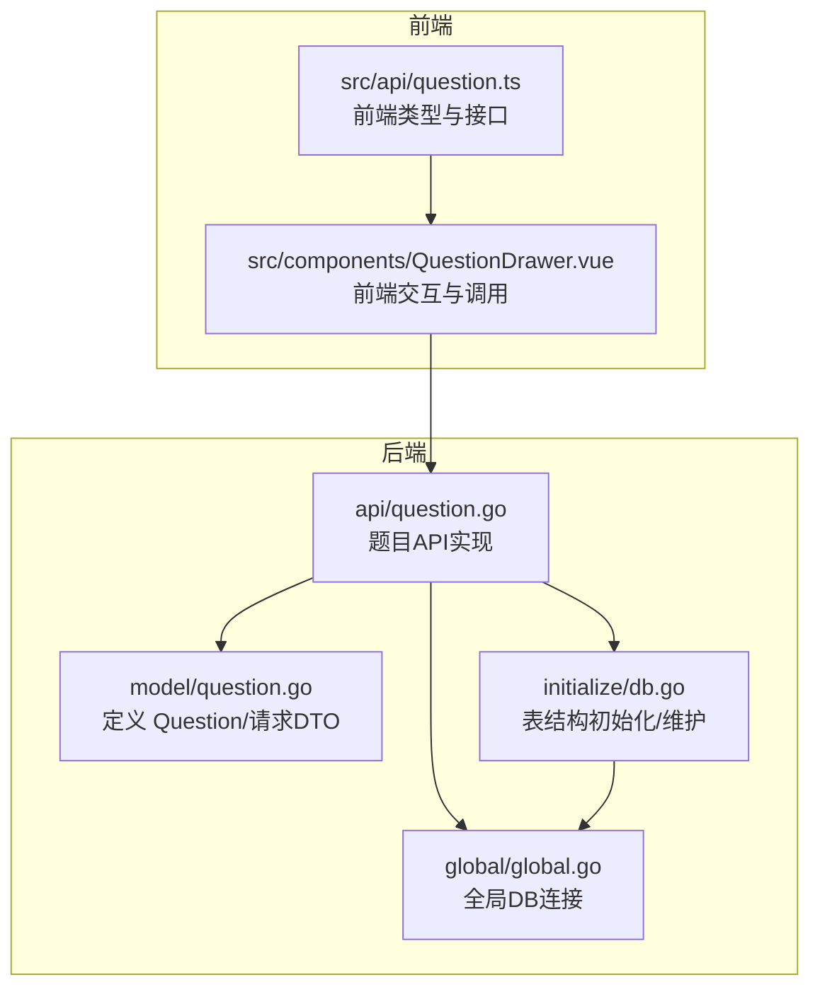
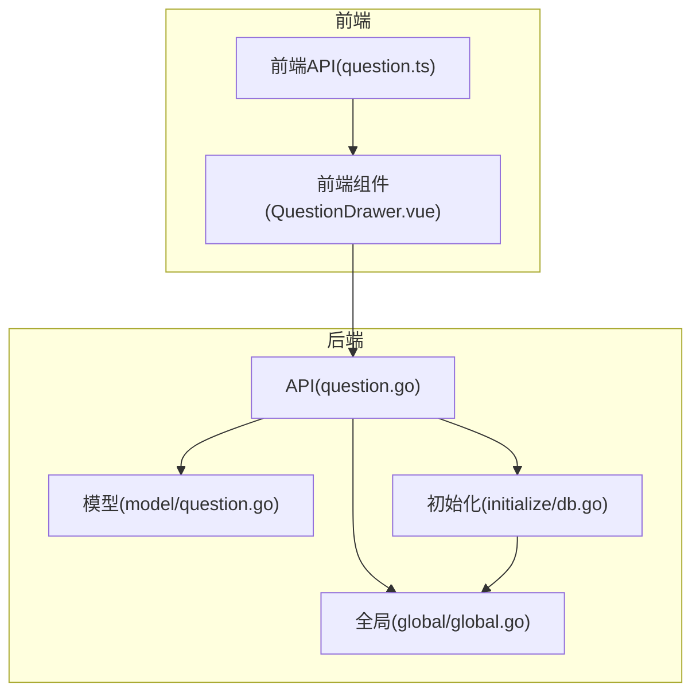
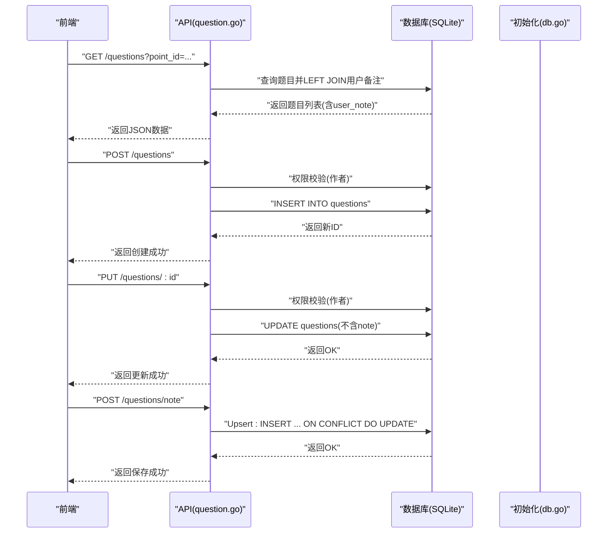
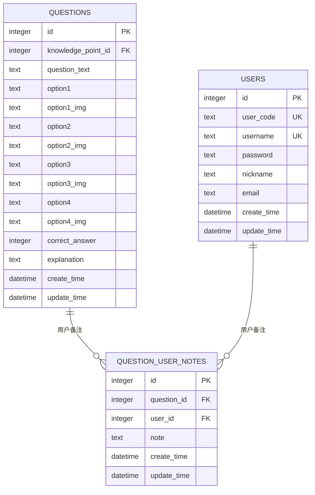
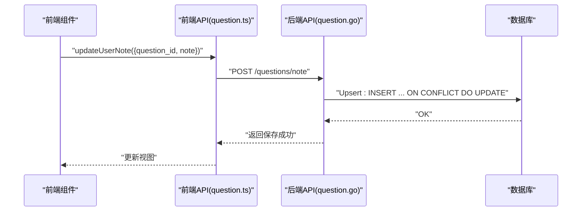
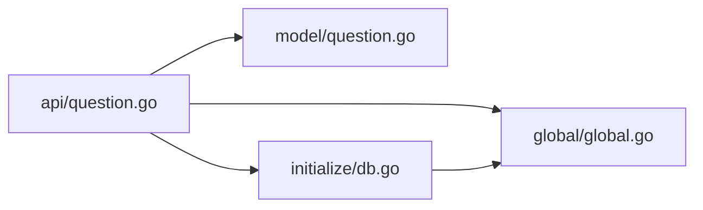

# 题目模型

<cite>
**本文引用的文件**
- [model/question.go](file://model/question.go)
- [api/question.go](file://api/question.go)
- [initialize/db.go](file://initialize/db.go)
- [global/global.go](file://global/global.go)
- [practice_problems_web/src/api/question.ts](file://practice_problems_web/src/api/question.ts)
- [practice_problems_web/src/components/QuestionDrawer.vue](file://practice_problems_web/src/components/QuestionDrawer.vue)
</cite>

## 目录
1. [简介](#简介)
2. [项目结构](#项目结构)
3. [核心组件](#核心组件)
4. [架构总览](#架构总览)
5. [详细组件分析](#详细组件分析)
6. [依赖分析](#依赖分析)
7. [性能考虑](#性能考虑)
8. [故障排除指南](#故障排除指南)
9. [结论](#结论)

## 简介
本文件系统性梳理“题目模型”的数据结构与业务流程，重点覆盖：
- Question 结构体字段含义与命名映射
- CreateQuestionRequest、UpdateQuestionRequest、UpdateNoteRequest 的用途与边界
- questions 表的数据库定义（含外键约束与触发器）
- question_user_notes 表设计（用户与题目之间的多对多备注关系）

同时结合后端 API 实现与前端交互，给出数据流与调用序列图，帮助读者快速理解模型在系统中的位置与职责。

## 项目结构
围绕“题目模型”，涉及以下模块：
- 后端模型层：定义 Question 及请求 DTO
- 后端 API 层：提供题目 CRUD 与用户备注 Upsert
- 初始化层：负责 SQLite 表结构初始化与维护（含外键与触发器）
- 全局层：提供全局 DB 连接
- 前端：定义与后端一致的类型，并调用后端接口

图表来源
- [model/question.go](file://model/question.go#L1-L65)
- [api/question.go](file://api/question.go#L1-L425)
- [initialize/db.go](file://initialize/db.go#L1-L380)
- [global/global.go](file://global/global.go#L1-L32)
- [practice_problems_web/src/api/question.ts](file://practice_problems_web/src/api/question.ts#L1-L86)
- [practice_problems_web/src/components/QuestionDrawer.vue](file://practice_problems_web/src/components/QuestionDrawer.vue#L497-L522)

章节来源
- [model/question.go](file://model/question.go#L1-L65)
- [api/question.go](file://api/question.go#L1-L425)
- [initialize/db.go](file://initialize/db.go#L1-L380)
- [global/global.go](file://global/global.go#L1-L32)
- [practice_problems_web/src/api/question.ts](file://practice_problems_web/src/api/question.ts#L1-L86)
- [practice_problems_web/src/components/QuestionDrawer.vue](file://practice_problems_web/src/components/QuestionDrawer.vue#L497-L522)

## 核心组件
- Question 结构体：承载题目实体的所有字段，包含题干、四个选项及图片、正确答案索引、解析、备注（用户私有）与时间戳。
- 请求 DTO：
  - CreateQuestionRequest：创建题目时的输入参数集合，必填字段明确。
  - UpdateQuestionRequest：更新题目时的输入参数集合，允许部分字段更新。
  - UpdateNoteRequest：更新用户对题目的个人备注，支持清空备注。
- API 方法：
  - GetQuestionList：按知识点或分类查询题目，同时关联查询用户对该题的备注。
  - CreateQuestion：创建题目并进行作者权限校验。
  - UpdateQuestion：更新题目并进行作者权限校验。
  - UpdateUserNote：用户对题目的备注 Upsert（存在则更新，不存在则插入）。
  - DeleteQuestion：删除题目并进行作者权限校验。
- 数据库表：
  - questions：题目主表，含外键指向知识点。
  - question_user_notes：用户-题目备注表，实现用户与题目之间的多对多备注关系。

章节来源
- [model/question.go](file://model/question.go#L1-L65)
- [api/question.go](file://api/question.go#L1-L425)
- [initialize/db.go](file://initialize/db.go#L154-L379)

## 架构总览
下图展示“题目模型”在系统中的角色与交互：

图表来源
- [api/question.go](file://api/question.go#L1-L425)
- [model/question.go](file://model/question.go#L1-L65)
- [initialize/db.go](file://initialize/db.go#L1-L380)
- [global/global.go](file://global/global.go#L1-L32)
- [practice_problems_web/src/api/question.ts](file://practice_problems_web/src/api/question.ts#L1-L86)
- [practice_problems_web/src/components/QuestionDrawer.vue](file://practice_problems_web/src/components/QuestionDrawer.vue#L497-L522)

## 详细组件分析

### Question 结构体字段说明
- ID：自增主键
- KnowledgePointID：外键，指向知识点表
- QuestionText：题干文本
- Option1/Option2/Option3/Option4：四个选项文本
- Option1Img/Option2Img/Option3Img/Option4Img：对应选项的图片地址
- CorrectAnswer：正确答案索引（1/2/3/4）
- Explanation：解析
- Note：用户对该题的个性化备注（通过单独表持久化，不在主表）
- CreateTime/UpdateTime：创建与更新时间戳

章节来源
- [model/question.go](file://model/question.go#L1-L24)

### 请求 DTO 与用途
- CreateQuestionRequest
  - 用途：创建题目时的输入参数集合
  - 必填字段：知识要点 ID、题干、正确答案
  - 可选字段：四个选项及其图片、解析
- UpdateQuestionRequest
  - 用途：更新题目时的输入参数集合
  - 允许部分字段更新（题干、选项、图片、正确答案、解析）
  - 注意：不再更新主表 note 字段，用户备注独立存储
- UpdateNoteRequest
  - 用途：更新用户对题目的个人备注
  - 字段：question_id（必填）、note（允许为空，表示清空备注）

章节来源
- [model/question.go](file://model/question.go#L26-L65)

### API 流程与权限控制
- GetQuestionList
  - 功能：按知识点或分类查询题目，并关联查询用户对该题的备注
  - 关键点：LEFT JOIN 用户备注表；当无备注时返回空字符串
- CreateQuestion
  - 功能：创建题目
  - 权限：仅科目作者可创建
- UpdateQuestion
  - 功能：更新题目
  - 权限：仅科目作者可更新
  - 注意：不再更新主表 note 字段
- UpdateUserNote
  - 功能：用户对题目的备注 Upsert
  - 机制：SQLite ON CONFLICT DO UPDATE
- DeleteQuestion
  - 功能：删除题目
  - 权限：仅科目作者可删除

图表来源
- [api/question.go](file://api/question.go#L1-L425)
- [initialize/db.go](file://initialize/db.go#L154-L379)

章节来源
- [api/question.go](file://api/question.go#L1-L425)

### 数据库定义与约束
- questions 表
  - 主键：id
  - 外键：knowledge_point_id -> knowledge_points(id)
  - 时间戳：create_time、update_time
  - 触发器：更新时自动更新 update_time
- question_user_notes 表
  - 主键：id
  - 联合唯一：(user_id, question_id)
  - 外键：user_id -> users(id)、question_id -> questions(id)
  - 时间戳：create_time、update_time
  - 触发器：更新时自动更新 update_time
- 初始化与维护
  - 启用外键约束
  - 初始化各表结构
  - 维护阶段：检测并移除废弃的主表 note 字段

图表来源
- [initialize/db.go](file://initialize/db.go#L154-L379)

章节来源
- [initialize/db.go](file://initialize/db.go#L154-L379)

### 前后端类型与调用关系
- 前端类型
  - QuestionItem：与后端 Question 结构一致（含 note 字段）
  - CreateQuestionParams：与后端 CreateQuestionRequest 一致
  - updateUserNote：调用后端 /questions/note
- 前端交互
  - 编辑备注时调用 updateUserNote
  - 列表页渲染时显示 user_note 字段

图表来源
- [practice_problems_web/src/api/question.ts](file://practice_problems_web/src/api/question.ts#L1-L86)
- [practice_problems_web/src/components/QuestionDrawer.vue](file://practice_problems_web/src/components/QuestionDrawer.vue#L497-L522)
- [api/question.go](file://api/question.go#L327-L376)

章节来源
- [practice_problems_web/src/api/question.ts](file://practice_problems_web/src/api/question.ts#L1-L86)
- [practice_problems_web/src/components/QuestionDrawer.vue](file://practice_problems_web/src/components/QuestionDrawer.vue#L497-L522)
- [api/question.go](file://api/question.go#L327-L376)

## 依赖分析
- 模块耦合
  - API 层依赖模型层（结构体与请求 DTO）
  - API 层依赖初始化层（建表与维护）
  - API 层依赖全局 DB 连接
- 外部依赖
  - SQLite 驱动（modernc.org/sqlite）
  - Gin Web 框架
  - Zap 日志库
- 关键约束
  - 外键：questions.knowledge_point_id -> knowledge_points.id
  - 多对多：question_user_notes(user_id, question_id) 唯一键
  - 外键：question_user_notes.user_id -> users.id、question_user_notes.question_id -> questions.id

图表来源
- [api/question.go](file://api/question.go#L1-L425)
- [model/question.go](file://model/question.go#L1-L65)
- [initialize/db.go](file://initialize/db.go#L1-L380)
- [global/global.go](file://global/global.go#L1-L32)

章节来源
- [api/question.go](file://api/question.go#L1-L425)
- [model/question.go](file://model/question.go#L1-L65)
- [initialize/db.go](file://initialize/db.go#L1-L380)
- [global/global.go](file://global/global.go#L1-L32)

## 性能考虑
- WAL 模式与同步策略：初始化时启用 WAL 并设置同步级别，有助于提升并发读写性能
- 连接池：设置最大空闲与最大打开连接数，延长连接生命周期
- 触发器：统一使用触发器更新 update_time，避免应用层重复逻辑
- 查询优化：GetQuestionList 使用 LEFT JOIN 获取用户备注，避免 N+1 查询

章节来源
- [initialize/db.go](file://initialize/db.go#L14-L83)
- [api/question.go](file://api/question.go#L118-L178)

## 故障排除指南
- 无法创建/更新/删除题目
  - 检查权限：仅科目作者可操作
  - 检查日志：查看后端日志输出
- 无法保存用户备注
  - 检查请求参数：question_id 必填，note 可为空
  - 检查数据库：确认 question_user_notes 表存在且外键约束正常
- 题目列表备注为空
  - 确认前端调用 /questions?point_id 或 ?category_id
  - 确认后端 LEFT JOIN 用户备注表逻辑

章节来源
- [api/question.go](file://api/question.go#L1-L425)
- [initialize/db.go](file://initialize/db.go#L154-L379)

## 结论
- Question 结构体清晰地描述了题目的全部属性，配合请求 DTO 明确了创建与更新的边界
- questions 表通过外键与触发器保证数据一致性与时间戳自动更新
- question_user_notes 表实现了用户与题目之间的多对多备注关系，满足个性化学习需求
- 前后端类型保持一致，API 调用链路清晰，便于扩展与维护