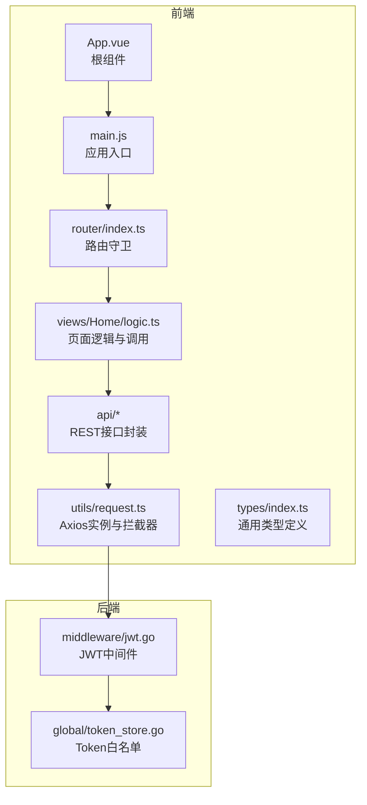
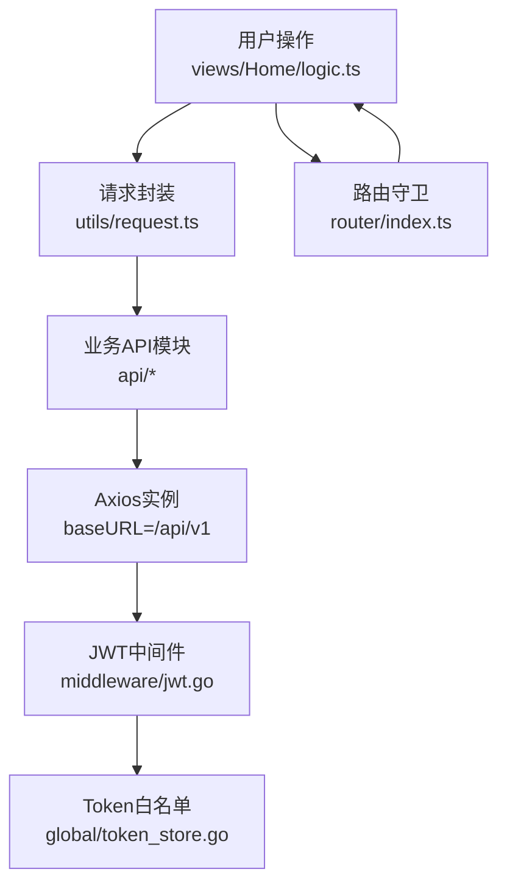
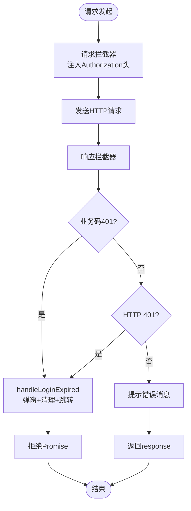
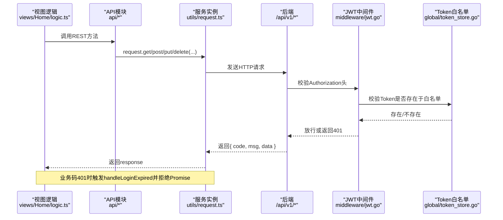
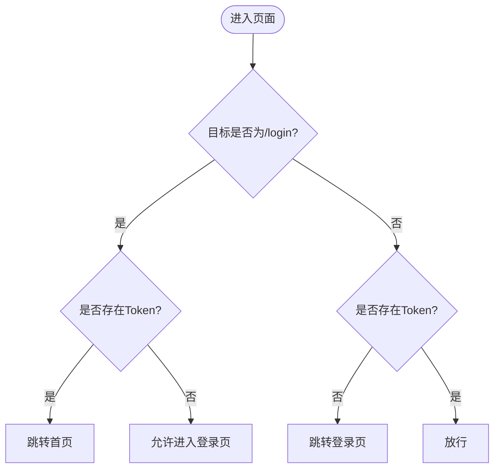
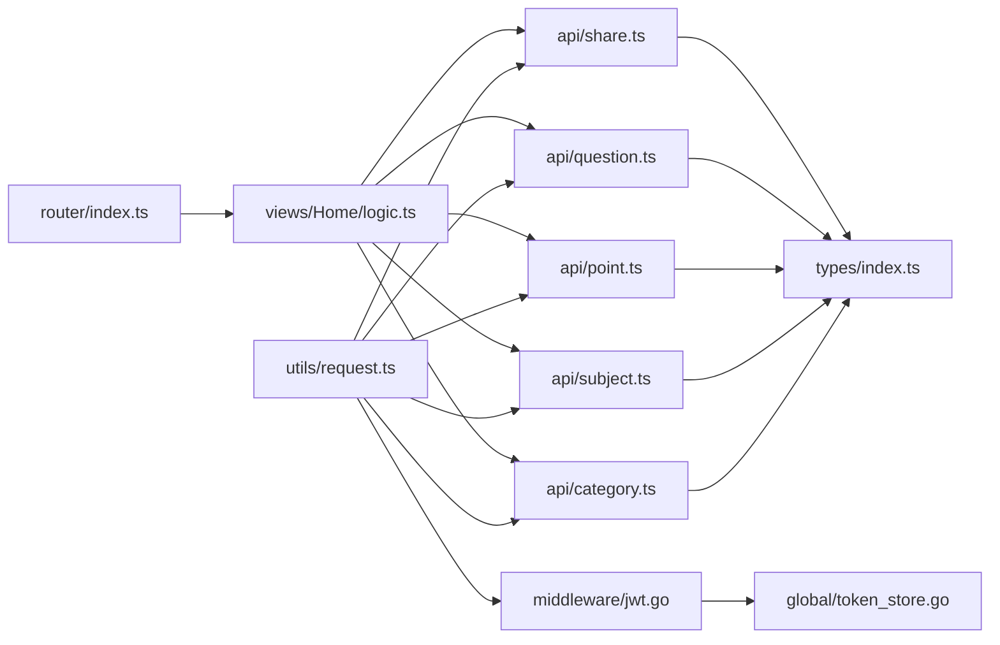

# API通信机制

<cite>
**本文引用的文件**
- [request.ts](file://practice_problems_web/src/utils/request.ts)
- [category.ts](file://practice_problems_web/src/api/category.ts)
- [subject.ts](file://practice_problems_web/src/api/subject.ts)
- [point.ts](file://practice_problems_web/src/api/point.ts)
- [question.ts](file://practice_problems_web/src/api/question.ts)
- [share.ts](file://practice_problems_web/src/api/share.ts)
- [index.ts](file://practice_problems_web/src/router/index.ts)
- [index.ts](file://practice_problems_web/src/views/Home/logic.ts)
- [index.ts](file://practice_problems_web/src/main.js)
- [index.ts](file://practice_problems_web/src/App.vue)
- [index.ts](file://practice_problems_web/src/types/index.ts)
- [jwt.go](file://middleware/jwt.go)
- [token_store.go](file://global/token_store.go)
</cite>

## 目录
1. [简介](#简介)
2. [项目结构](#项目结构)
3. [核心组件](#核心组件)
4. [架构总览](#架构总览)
5. [详细组件分析](#详细组件分析)
6. [依赖关系分析](#依赖关系分析)
7. [性能考量](#性能考量)
8. [故障排查指南](#故障排查指南)
9. [结论](#结论)
10. [附录](#附录)

## 简介
本文件系统性梳理前端API通信体系，覆盖从请求封装到接口调用的完整链路。重点包括：
- Axios实例在request.ts中的配置与拦截器策略：baseURL统一指向/api/v1，请求头自动注入JWT令牌，响应拦截器统一处理401过期跳转与错误提示。
- 对业务码401与HTTP状态码401的双重判断机制，以及handleLoginExpired函数的安全弹窗与强制跳转流程。
- 各API模块（如category.ts、subject.ts、point.ts、question.ts、share.ts）如何基于service实例导出标准化REST方法，并遵循统一的错误处理规范。
- 结合router/index.ts中的路由守卫，说明未登录访问时如何被拦截并重定向至登录页，形成完整的认证闭环。
- 提供API调用时序图，展示从用户操作到后端响应的全过程。

## 项目结构
前端位于practice_problems_web/src目录，采用按功能域划分的组织方式：
- utils：通用工具，包含Axios实例封装与拦截器
- api：各业务模块API方法集合
- router：路由与导航守卫
- views：页面逻辑与组件
- types：前后端通用类型定义
- main.js：应用入口，注册路由与UI库

图表来源
- [request.ts](file://practice_problems_web/src/utils/request.ts#L1-L70)
- [category.ts](file://practice_problems_web/src/api/category.ts#L1-L40)
- [subject.ts](file://practice_problems_web/src/api/subject.ts#L1-L27)
- [point.ts](file://practice_problems_web/src/api/point.ts#L1-L60)
- [question.ts](file://practice_problems_web/src/api/question.ts#L1-L86)
- [share.ts](file://practice_problems_web/src/api/share.ts#L1-L92)
- [index.ts](file://practice_problems_web/src/router/index.ts#L1-L52)
- [index.ts](file://practice_problems_web/src/views/Home/logic.ts#L1-L448)
- [index.ts](file://practice_problems_web/src/main.js#L1-L75)
- [index.ts](file://practice_problems_web/src/App.vue#L1-L26)
- [index.ts](file://practice_problems_web/src/types/index.ts#L1-L84)
- [jwt.go](file://middleware/jwt.go#L1-L101)
- [token_store.go](file://global/token_store.go#L1-L50)

章节来源
- [index.ts](file://practice_problems_web/src/main.js#L1-L75)
- [index.ts](file://practice_problems_web/src/App.vue#L1-L26)

## 核心组件
- Axios实例与拦截器（request.ts）
  - baseURL统一为/api/v1，确保与后端路由前缀一致
  - 请求拦截器：从localStorage读取auth_token，若存在则在Authorization头注入Bearer令牌
  - 响应拦截器：
    - 业务层401：当响应体中的业务码为401时，触发handleLoginExpired并拒绝Promise
    - 协议层401：当HTTP状态码为401时，同样触发handleLoginExpired
    - 其他错误：统一提示错误消息
  - handleLoginExpired：避免重复弹窗，弹出“重新登录”确认框，清理本地存储并强制跳转至/login
- API模块（api/*）
  - 基于request实例导出标准化REST方法，统一返回{ data: ApiResponse<T> }结构
  - 严格遵循类型定义（types/index.ts），保证前后端契约一致
- 路由守卫（router/index.ts）
  - 未登录访问非登录页时强制跳转至/login
  - 已登录访问登录页时自动跳转至首页，避免重复登录
- 页面逻辑（views/Home/logic.ts）
  - 统一调用各API模块方法，处理业务成功/失败提示
  - 在用户信息缺失时主动跳转登录页

章节来源
- [request.ts](file://practice_problems_web/src/utils/request.ts#L1-L70)
- [category.ts](file://practice_problems_web/src/api/category.ts#L1-L40)
- [subject.ts](file://practice_problems_web/src/api/subject.ts#L1-L27)
- [point.ts](file://practice_problems_web/src/api/point.ts#L1-L60)
- [question.ts](file://practice_problems_web/src/api/question.ts#L1-L86)
- [share.ts](file://practice_problems_web/src/api/share.ts#L1-L92)
- [index.ts](file://practice_problems_web/src/router/index.ts#L1-L52)
- [index.ts](file://practice_problems_web/src/views/Home/logic.ts#L1-L448)
- [index.ts](file://practice_problems_web/src/types/index.ts#L1-L84)

## 架构总览
前端通过Axios实例集中管理HTTP请求，拦截器负责认证与错误处理；各业务API模块提供标准化REST方法；路由守卫保障未登录访问拦截；后端JWT中间件与Token白名单共同维护会话有效性。

图表来源
- [request.ts](file://practice_problems_web/src/utils/request.ts#L1-L70)
- [category.ts](file://practice_problems_web/src/api/category.ts#L1-L40)
- [subject.ts](file://practice_problems_web/src/api/subject.ts#L1-L27)
- [point.ts](file://practice_problems_web/src/api/point.ts#L1-L60)
- [question.ts](file://practice_problems_web/src/api/question.ts#L1-L86)
- [share.ts](file://practice_problems_web/src/api/share.ts#L1-L92)
- [index.ts](file://practice_problems_web/src/router/index.ts#L1-L52)
- [jwt.go](file://middleware/jwt.go#L1-L101)
- [token_store.go](file://global/token_store.go#L1-L50)

## 详细组件分析

### 请求封装与拦截器（request.ts）
- Axios实例配置
  - baseURL设置为/api/v1，确保所有API调用与后端路由前缀一致
  - 超时时间5秒，避免长时间阻塞
- 请求拦截器
  - 从localStorage读取auth_token，若存在则在Authorization头注入Bearer令牌
  - 便于后端JWT中间件识别与校验
- 响应拦截器
  - 业务码401：读取response.data.code，若为401，调用handleLoginExpired并拒绝Promise
  - 协议层401：当error.response.status为401，同样调用handleLoginExpired
  - 其他错误：统一提示错误消息
- handleLoginExpired
  - 避免重复弹窗：检测是否已有弹窗DOM
  - 弹出确认框，回调中清理localStorage中的auth_token与user_info
  - 强制刷新并跳转至/login，确保前端状态清空
- 返回策略
  - 业务码401场景下仍返回response，保证调用方能拿到完整响应结构

图表来源
- [request.ts](file://practice_problems_web/src/utils/request.ts#L1-L70)

章节来源
- [request.ts](file://practice_problems_web/src/utils/request.ts#L1-L70)

### API模块标准化（api/*）
- 统一基址与类型
  - 各模块以常量API_PATH定义资源路径，基于request实例发起GET/POST/PUT/DELETE
  - 返回类型统一为{ data: ApiResponse<T> }，T为具体业务数据类型
- 典型模块示例
  - category.ts：提供getCategories、createCategory、updateCategory、deleteCategory、sortCategories、updateCategorySort等方法
  - subject.ts：提供getSubjects、createSubject、updateSubject、deleteSubject
  - point.ts：提供getPoints、getPointDetail、createPoint、updatePoint、deletePoint、updatePointSort、deletePointImage、uploadImage
  - question.ts：提供getQuestions、createQuestion、updateQuestion、deleteQuestion、getQuestionsByCategory、updateUserNote
  - share.ts：提供分享与公告相关的一系列接口
- 错误处理规范
  - 调用方在业务层根据res.data.code进行分支处理
  - 若出现401，交由拦截器统一处理并跳转登录

图表来源
- [category.ts](file://practice_problems_web/src/api/category.ts#L1-L40)
- [subject.ts](file://practice_problems_web/src/api/subject.ts#L1-L27)
- [point.ts](file://practice_problems_web/src/api/point.ts#L1-L60)
- [question.ts](file://practice_problems_web/src/api/question.ts#L1-L86)
- [share.ts](file://practice_problems_web/src/api/share.ts#L1-L92)
- [request.ts](file://practice_problems_web/src/utils/request.ts#L1-L70)
- [jwt.go](file://middleware/jwt.go#L1-L101)
- [token_store.go](file://global/token_store.go#L1-L50)

章节来源
- [category.ts](file://practice_problems_web/src/api/category.ts#L1-L40)
- [subject.ts](file://practice_problems_web/src/api/subject.ts#L1-L27)
- [point.ts](file://practice_problems_web/src/api/point.ts#L1-L60)
- [question.ts](file://practice_problems_web/src/api/question.ts#L1-L86)
- [share.ts](file://practice_problems_web/src/api/share.ts#L1-L92)
- [index.ts](file://practice_problems_web/src/types/index.ts#L1-L84)

### 路由守卫与认证闭环（router/index.ts）
- 登录页访问
  - 若已持有Token且访问/login，直接跳转首页
  - 若未持有Token且访问/login，允许进入
- 非登录页访问
  - 若未持有Token，强制跳转至/login
  - 若持有Token，放行
- 与拦截器配合
  - 前端拦截器负责业务码401与HTTP 401的统一处理
  - 路由守卫负责未登录访问的拦截与重定向
  - 形成“前端拦截器+路由守卫”的双层认证闭环

图表来源
- [index.ts](file://practice_problems_web/src/router/index.ts#L1-L52)

章节来源
- [index.ts](file://practice_problems_web/src/router/index.ts#L1-L52)

### 页面逻辑与调用链（views/Home/logic.ts）
- 初始化与恢复
  - 从localStorage读取user_info，若不存在则跳转/login
  - 自动恢复上次选中的科目/分类/知识点，提升用户体验
- API调用
  - 统一调用api/*模块方法，如getSubjects、getCategories、getPoints、getPointDetail
  - 根据res.data.code判断业务结果，成功时更新本地状态，失败时提示错误
- 用户操作
  - CRUD操作完成后刷新列表，必要时同步当前详情
  - 退出登录时清理localStorage并跳转登录页

章节来源
- [index.ts](file://practice_problems_web/src/views/Home/logic.ts#L1-L448)

## 依赖关系分析
- 前端依赖
  - utils/request.ts依赖Element Plus的消息与弹窗组件，用于统一错误提示与登录过期弹窗
  - api/*模块依赖utils/request.ts与types/index.ts，确保类型安全与统一返回结构
  - router/index.ts依赖localStorage进行Token判定
  - views/Home/logic.ts依赖各API模块与Element Plus组件
- 后端依赖
  - middleware/jwt.go依赖global/token_store.go进行Token白名单校验
  - middleware/jwt.go返回统一的业务码401结构，与前端拦截器约定一致

图表来源
- [request.ts](file://practice_problems_web/src/utils/request.ts#L1-L70)
- [category.ts](file://practice_problems_web/src/api/category.ts#L1-L40)
- [subject.ts](file://practice_problems_web/src/api/subject.ts#L1-L27)
- [point.ts](file://practice_problems_web/src/api/point.ts#L1-L60)
- [question.ts](file://practice_problems_web/src/api/question.ts#L1-L86)
- [share.ts](file://practice_problems_web/src/api/share.ts#L1-L92)
- [index.ts](file://practice_problems_web/src/router/index.ts#L1-L52)
- [index.ts](file://practice_problems_web/src/views/Home/logic.ts#L1-L448)
- [index.ts](file://practice_problems_web/src/types/index.ts#L1-L84)
- [jwt.go](file://middleware/jwt.go#L1-L101)
- [token_store.go](file://global/token_store.go#L1-L50)

章节来源
- [request.ts](file://practice_problems_web/src/utils/request.ts#L1-L70)
- [jwt.go](file://middleware/jwt.go#L1-L101)
- [token_store.go](file://global/token_store.go#L1-L50)

## 性能考量
- 请求超时：Axios实例设置了5秒超时，有助于避免长时间阻塞
- 上传优化：图片上传使用FormData，明确Content-Type，减少不必要的序列化开销
- 重复弹窗防护：handleLoginExpired检测弹窗DOM，避免重复弹窗造成UI抖动
- 路由守卫快速判定：基于localStorage的Token存在性判断，避免无效网络请求

## 故障排查指南
- 401业务码导致登录过期
  - 现象：弹出“重新登录”提示并跳转登录页
  - 处理：确认后端返回的业务码401是否正确；检查前端拦截器是否读取res.data.code
- HTTP 401协议层
  - 现象：拦截器捕获HTTP 401并触发登录过期流程
  - 处理：检查Authorization头是否正确注入；确认后端JWT中间件是否生效
- 未登录访问被拦截
  - 现象：访问非登录页被强制跳转登录页
  - 处理：确认localStorage中auth_token是否存在；检查路由守卫逻辑
- 错误提示不一致
  - 现象：提示消息不符合预期
  - 处理：检查后端返回的msg字段；确认拦截器中错误消息拼装逻辑

章节来源
- [request.ts](file://practice_problems_web/src/utils/request.ts#L1-L70)
- [index.ts](file://practice_problems_web/src/router/index.ts#L1-L52)

## 结论
该前端API通信体系通过Axios实例集中管理请求与拦截器，实现了统一的认证与错误处理；各API模块遵循标准化REST方法与类型契约，保证了前后端一致性；路由守卫与拦截器共同构成认证闭环。整体设计清晰、职责分离明确，具备良好的扩展性与可维护性。

## 附录
- 应用入口与全局配置
  - main.js中注册router与ElementPlus，确保路由与UI组件可用
  - App.vue设置语言为中文，统一国际化配置
- 类型定义
  - types/index.ts提供通用响应结构与业务实体类型，确保前后端契约一致

章节来源
- [index.ts](file://practice_problems_web/src/main.js#L1-L75)
- [index.ts](file://practice_problems_web/src/App.vue#L1-L26)
- [index.ts](file://practice_problems_web/src/types/index.ts#L1-L84)