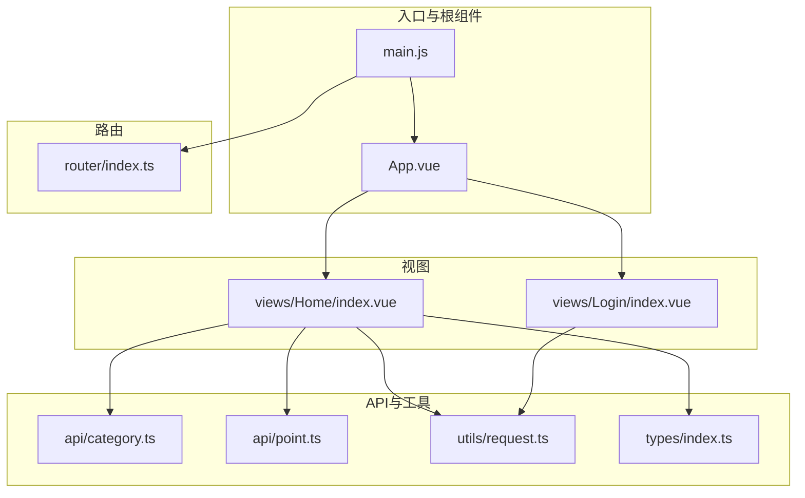
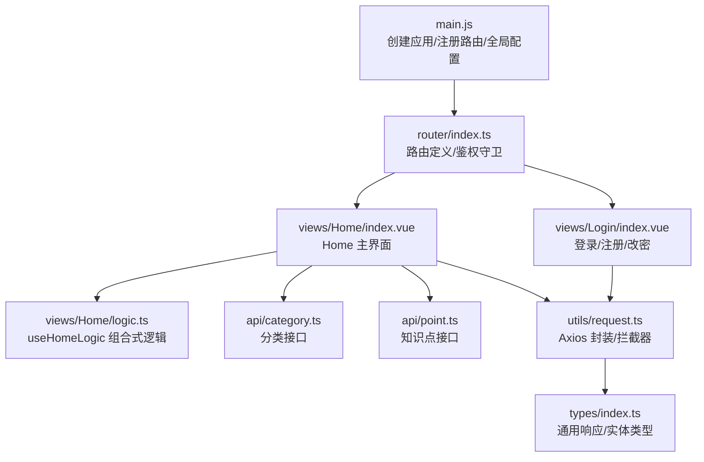
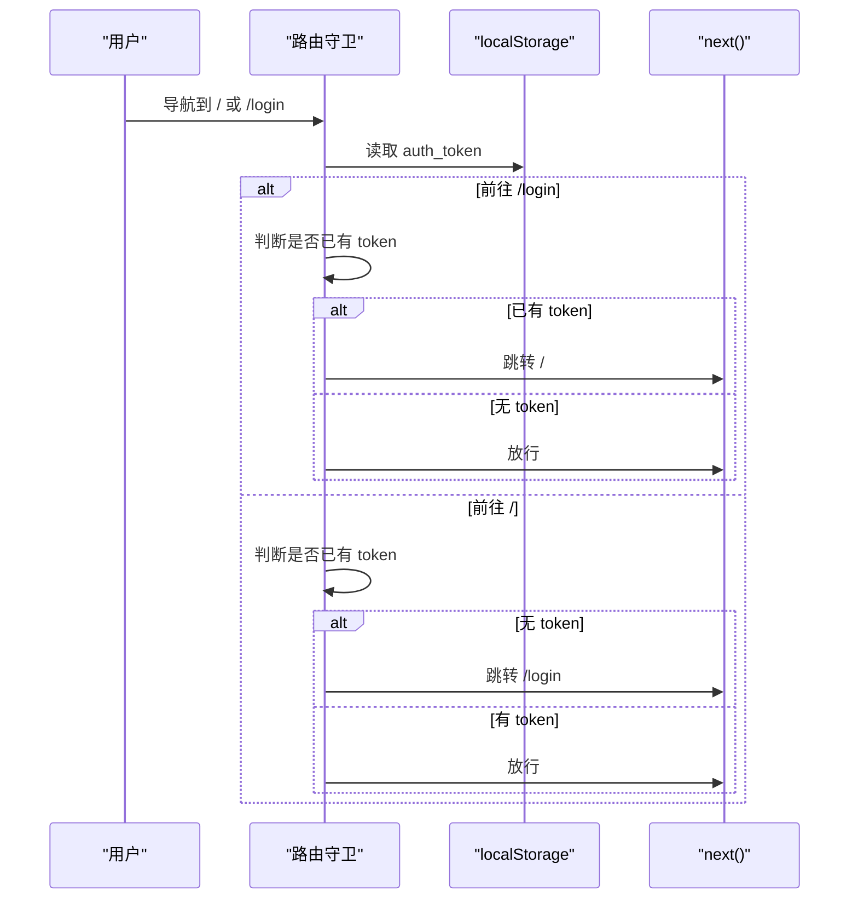
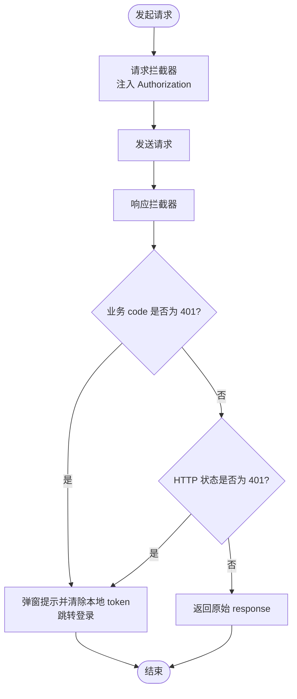
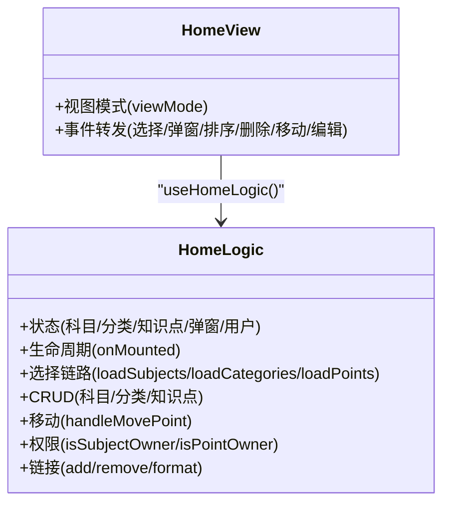
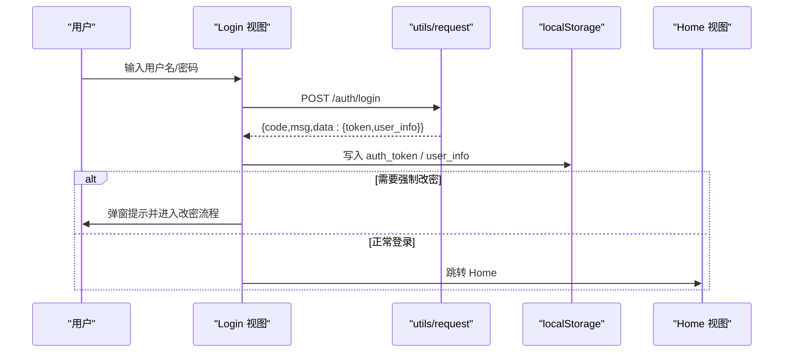
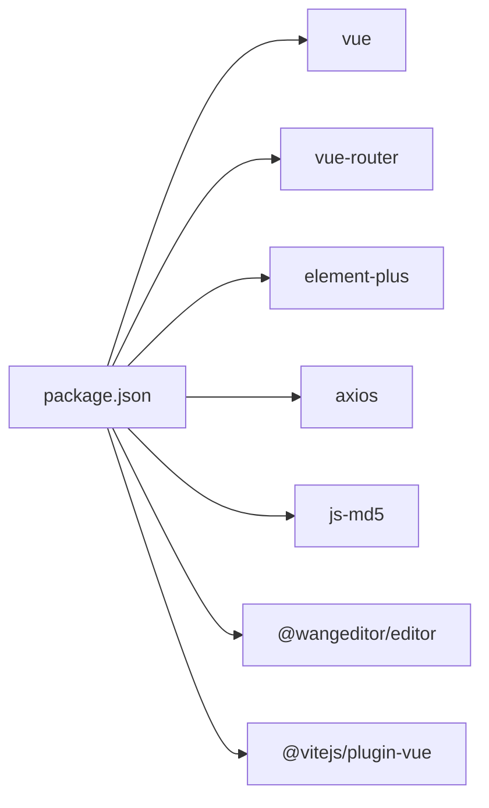

# 前端架构

<cite>
**本文引用的文件**
- [main.js](file://practice_problems_web/src/main.js)
- [App.vue](file://practice_problems_web/src/App.vue)
- [router/index.ts](file://practice_problems_web/src/router/index.ts)
- [views/Home/index.vue](file://practice_problems_web/src/views/Home/index.vue)
- [views/Home/logic.ts](file://practice_problems_web/src/views/Home/logic.ts)
- [views/Home/components/CategorySidebar.vue](file://practice_problems_web/src/views/Home/components/CategorySidebar.vue)
- [views/Home/components/PointSidebar.vue](file://practice_problems_web/src/views/Home/components/PointSidebar.vue)
- [views/Home/components/DetailPanel.vue](file://practice_problems_web/src/views/Home/components/DetailPanel.vue)
- [views/Login/index.vue](file://practice_problems_web/src/views/Login/index.vue)
- [utils/request.ts](file://practice_problems_web/src/utils/request.ts)
- [api/category.ts](file://practice_problems_web/src/api/category.ts)
- [api/point.ts](file://practice_problems_web/src/api/point.ts)
- [types/index.ts](file://practice_problems_web/src/types/index.ts)
- [package.json](file://practice_problems_web/package.json)
</cite>

## 目录
1. [引言](#引言)
2. [项目结构](#项目结构)
3. [核心组件](#核心组件)
4. [架构总览](#架构总览)
5. [详细组件分析](#详细组件分析)
6. [依赖分析](#依赖分析)
7. [性能考虑](#性能考虑)
8. [故障排查指南](#故障排查指南)
9. [结论](#结论)
10. [附录](#附录)

## 引言
本文件面向前端开发者与产品/测试人员，系统性梳理基于 Vue 3 与 Element Plus 的前端架构。重点覆盖：
- 入口文件如何初始化应用、挂载路由与全局配置
- 根组件 App.vue 的结构与国际化配置
- 路由配置与导航守卫，以及与视图组件的映射关系
- 请求封装与拦截器、错误处理与登录状态失效处理
- API 模块如何组织 RESTful 接口调用并与后端服务通信
- Home 模块的组件拆分与职责划分，以及 Composition API 的逻辑复用
- 组件树结构与前端数据流，展示用户操作如何触发 API 调用并更新 UI

## 项目结构
前端位于 practice_problems_web/src 目录，采用按功能域组织的结构：
- 入口与根组件：main.js、App.vue
- 路由：router/index.ts
- 视图层：views/Home、views/Login
- API 封装：api/*.ts
- 工具库：utils/request.ts
- 类型定义：types/index.ts
- 依赖：package.json

图表来源
- [main.js](file://practice_problems_web/src/main.js#L1-L75)
- [App.vue](file://practice_problems_web/src/App.vue#L1-L26)
- [router/index.ts](file://practice_problems_web/src/router/index.ts#L1-L52)
- [views/Home/index.vue](file://practice_problems_web/src/views/Home/index.vue#L1-L159)
- [views/Login/index.vue](file://practice_problems_web/src/views/Login/index.vue#L1-L477)
- [api/category.ts](file://practice_problems_web/src/api/category.ts#L1-L40)
- [api/point.ts](file://practice_problems_web/src/api/point.ts#L1-L60)
- [utils/request.ts](file://practice_problems_web/src/utils/request.ts#L1-L70)
- [types/index.ts](file://practice_problems_web/src/types/index.ts#L1-L84)

章节来源
- [main.js](file://practice_problems_web/src/main.js#L1-L75)
- [App.vue](file://practice_problems_web/src/App.vue#L1-L26)
- [router/index.ts](file://practice_problems_web/src/router/index.ts#L1-L52)
- [package.json](file://practice_problems_web/package.json#L1-L33)

## 核心组件
- 应用入口与全局配置：在入口文件中创建应用实例、注册路由、注册 Element Plus、注册图标、全局防重复提交指令、阻止表单回车刷新等。
- 根组件：通过 Element Plus 的 ConfigProvider 将语言环境设置为中文，并通过 router-view 渲染当前路由视图。
- 路由：定义首页与登录页两条路由，使用动态导入；设置全局前置守卫进行鉴权。
- 请求封装：基于 Axios 创建实例，设置 base URL 与超时；统一注入 Authorization 头；统一处理 401 与业务 401；统一错误提示与登录过期流程。
- API 模块：围绕分类与知识点的 CRUD 与排序等接口进行封装，统一返回类型与参数类型。
- Home 视图：通过组合式逻辑 useHomeLogic 抽象状态与交互，组件负责渲染与事件转发。
- Login 视图：登录/注册/强制改密流程，使用统一请求封装与本地存储。

章节来源
- [main.js](file://practice_problems_web/src/main.js#L1-L75)
- [App.vue](file://practice_problems_web/src/App.vue#L1-L26)
- [router/index.ts](file://practice_problems_web/src/router/index.ts#L1-L52)
- [utils/request.ts](file://practice_problems_web/src/utils/request.ts#L1-L70)
- [api/category.ts](file://practice_problems_web/src/api/category.ts#L1-L40)
- [api/point.ts](file://practice_problems_web/src/api/point.ts#L1-L60)
- [views/Home/logic.ts](file://practice_problems_web/src/views/Home/logic.ts#L1-L448)
- [views/Home/index.vue](file://practice_problems_web/src/views/Home/index.vue#L1-L159)
- [views/Login/index.vue](file://practice_problems_web/src/views/Login/index.vue#L1-L477)

## 架构总览
前端采用“入口 -> 路由 -> 视图 -> API/工具”的分层架构：
- 入口负责应用初始化与全局配置
- 路由负责页面切换与鉴权
- 视图负责 UI 与交互，通过组合式逻辑集中状态与副作用
- API/工具负责网络请求与类型约束

图表来源
- [main.js](file://practice_problems_web/src/main.js#L1-L75)
- [router/index.ts](file://practice_problems_web/src/router/index.ts#L1-L52)
- [views/Home/index.vue](file://practice_problems_web/src/views/Home/index.vue#L1-L159)
- [views/Home/logic.ts](file://practice_problems_web/src/views/Home/logic.ts#L1-L448)
- [api/category.ts](file://practice_problems_web/src/api/category.ts#L1-L40)
- [api/point.ts](file://practice_problems_web/src/api/point.ts#L1-L60)
- [utils/request.ts](file://practice_problems_web/src/utils/request.ts#L1-L70)
- [types/index.ts](file://practice_problems_web/src/types/index.ts#L1-L84)

## 详细组件分析

### 入口与根组件
- 入口文件创建应用实例，注册路由与 Element Plus，注册图标组件，注册全局防重复提交指令，阻止表单回车刷新，最后挂载到 DOM。
- 根组件通过 Element Plus 的 ConfigProvider 将语言设置为中文，并通过 router-view 渲染当前路由视图。

章节来源
- [main.js](file://practice_problems_web/src/main.js#L1-L75)
- [App.vue](file://practice_problems_web/src/App.vue#L1-L26)

### 路由与导航守卫
- 定义首页与登录页两条路由，均使用动态导入以优化首屏体积。
- 全局前置守卫：
  - 若前往登录页且已有 Token，则跳转首页
  - 若前往非登录页且无 Token，则跳转登录页
- 该守卫保证未登录用户无法访问首页，已登录用户无法重复访问登录页。

图表来源
- [router/index.ts](file://practice_problems_web/src/router/index.ts#L1-L52)

章节来源
- [router/index.ts](file://practice_problems_web/src/router/index.ts#L1-L52)

### 请求封装与拦截器
- 基础配置：baseURL 设为 /api/v1，超时 5000ms
- 请求拦截：从 localStorage 读取 token，注入 Authorization 头
- 响应拦截：
  - 业务 401（HTTP 200 但 data.code=401）：弹窗提示并强制跳转登录
  - HTTP 401：弹窗提示并强制跳转登录
  - 其他错误：统一提示错误消息
- 返回值：保留完整 response 对象，便于上层继续读取 data.data

图表来源
- [utils/request.ts](file://practice_problems_web/src/utils/request.ts#L1-L70)

章节来源
- [utils/request.ts](file://practice_problems_web/src/utils/request.ts#L1-L70)

### API 模块与后端通信
- 分类 API：提供列表、创建、更新、删除、排序等方法，参数与返回类型在 types 中定义
- 知识点 API：提供列表、详情、创建、更新、删除、排序、图片删除、上传等方法
- 统一通过 utils/request 发起请求，自动携带 token，遵循统一响应结构

章节来源
- [api/category.ts](file://practice_problems_web/src/api/category.ts#L1-L40)
- [api/point.ts](file://practice_problems_web/src/api/point.ts#L1-L60)
- [types/index.ts](file://practice_problems_web/src/types/index.ts#L1-L84)

### Home 视图与组合式逻辑
- 视图组件负责布局与事件转发，组合式逻辑 useHomeLogic 负责：
  - 状态：科目/分类/知识点列表与当前选中项、弹窗状态、用户信息
  - 生命周期：onMounted 从本地恢复用户与视图模式，加载科目
  - 选择链路：科目 -> 分类 -> 知识点，自动恢复上次选择
  - CRUD：科目、分类、知识点的增删改与排序
  - 移动知识点：跨分类移动并同步 UI
  - 用户资料：修改个人资料并同步本地存储
  - 权限：根据视图模式与创作者标识判断是否可编辑
  - 链接管理：添加/删除参考链接，格式化 URL
- 组件树：HeaderSection、CategorySidebar、PointSidebar、DetailPanel

图表来源
- [views/Home/index.vue](file://practice_problems_web/src/views/Home/index.vue#L1-L159)
- [views/Home/logic.ts](file://practice_problems_web/src/views/Home/logic.ts#L1-L448)

章节来源
- [views/Home/index.vue](file://practice_problems_web/src/views/Home/index.vue#L1-L159)
- [views/Home/logic.ts](file://practice_problems_web/src/views/Home/logic.ts#L1-L448)

### 组件拆分与职责划分
- CategorySidebar：展示分类列表、难度标签、排序工具、编辑/删除弹窗；根据视图模式与权限决定可操作性
- PointSidebar：展示知识点列表、难度标签、排序工具、新增/编辑/删除弹窗、移动弹窗、练习抽屉；根据视图模式与权限决定可操作性
- DetailPanel：展示知识点详情、参考资料链接、编辑器与图片管理、练习抽屉、重命名弹窗；根据视图模式与权限决定可操作性
- HeaderSection：顶部导航、用户信息、主题切换、登出等

章节来源
- [views/Home/components/CategorySidebar.vue](file://practice_problems_web/src/views/Home/components/CategorySidebar.vue#L1-L269)
- [views/Home/components/PointSidebar.vue](file://practice_problems_web/src/views/Home/components/PointSidebar.vue#L1-L310)
- [views/Home/components/DetailPanel.vue](file://practice_problems_web/src/views/Home/components/DetailPanel.vue#L1-L268)

### 登录流程与用户状态
- 登录/注册/强制改密：使用统一请求封装，MD5 加密密码，成功后写入 token 与用户信息，必要时弹窗强制改密
- 首次进入 Home：若本地无用户信息则跳转登录

图表来源
- [views/Login/index.vue](file://practice_problems_web/src/views/Login/index.vue#L1-L477)
- [utils/request.ts](file://practice_problems_web/src/utils/request.ts#L1-L70)

章节来源
- [views/Login/index.vue](file://practice_problems_web/src/views/Login/index.vue#L1-L477)

## 依赖分析
- 运行时依赖：Vue 3、Vue Router、Element Plus、Axios、js-md5、@wangeditor/editor 等
- 开发依赖：Vite、@vitejs/plugin-vue
- 组件间耦合：
  - Home 视图与组合式逻辑解耦，通过事件与状态暴露给子组件
  - 子组件之间通过事件向上冒泡，由 Home 视图统一处理
  - API 层与工具层低耦合，便于替换与扩展

图表来源
- [package.json](file://practice_problems_web/package.json#L1-L33)

章节来源
- [package.json](file://practice_problems_web/package.json#L1-L33)

## 性能考虑
- 路由懒加载：使用动态导入减少首屏体积
- 组件懒加载：子组件按需加载，降低初始渲染压力
- 本地持久化：使用 localStorage 缓存用户信息与视图模式，减少重复请求
- 防重复提交指令：避免用户连续点击导致重复请求
- 滚动条与布局：组件内使用自定义滚动条与毛玻璃效果，注意在低端设备上的渲染开销

## 故障排查指南
- 登录过期
  - 现象：出现“登录状态已过期”提示并跳转登录
  - 处理：拦截器自动清理本地 token 与用户信息，强制刷新页面
- 网络错误
  - 现象：统一错误提示
  - 处理：检查 baseURL 与后端接口一致性，确认网络连通性
- 401 业务异常
  - 现象：业务 code=401
  - 处理：拦截器处理并跳转登录，确认后端返回结构
- 本地存储异常
  - 现象：恢复状态失败或显示异常
  - 处理：清理 localStorage 对应键值，重新登录

章节来源
- [utils/request.ts](file://practice_problems_web/src/utils/request.ts#L1-L70)

## 结论
本前端架构以 Vue 3 为核心，结合 Element Plus 与组合式 API，实现了清晰的分层与职责分离。通过统一的请求封装与路由守卫，保障了安全性与用户体验。Home 模块的组件拆分与组合式逻辑复用，使得状态管理与交互逻辑更加集中与可维护。建议在后续迭代中持续完善类型约束与错误边界，提升可测试性与可扩展性。

## 附录
- 组件树结构（简化）
  - App.vue
    - router-view
      - Home/index.vue
        - HeaderSection
        - CategorySidebar
        - PointSidebar
        - DetailPanel
      - Login/index.vue

章节来源
- [App.vue](file://practice_problems_web/src/App.vue#L1-L26)
- [views/Home/index.vue](file://practice_problems_web/src/views/Home/index.vue#L1-L159)
- [views/Login/index.vue](file://practice_problems_web/src/views/Login/index.vue#L1-L477)