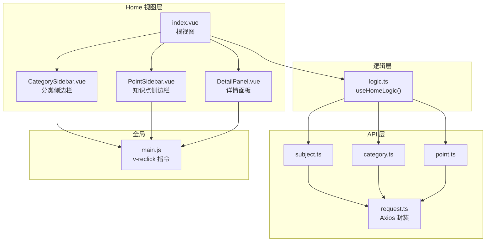
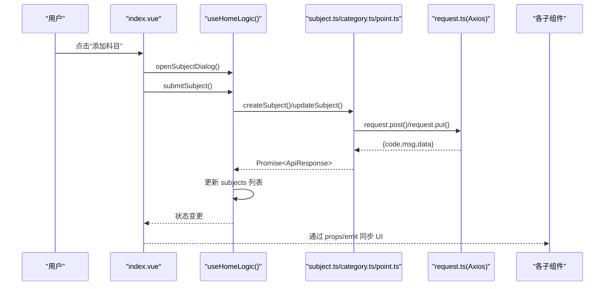
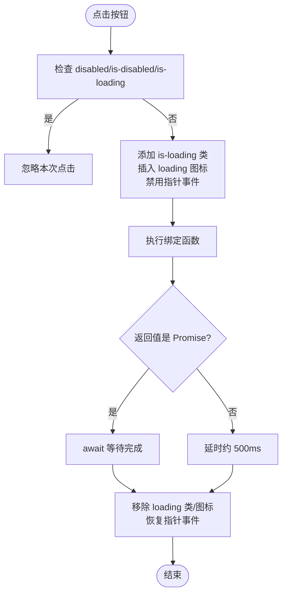
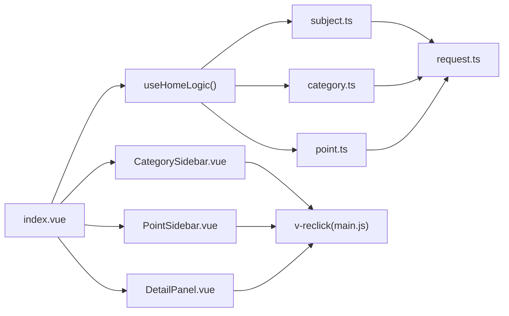

# 状态与逻辑管理

<cite>
**本文引用的文件**
- [logic.ts](file://practice_problems_web/src/views/Home/logic.ts)
- [index.vue](file://practice_problems_web/src/views/Home/index.vue)
- [main.js](file://practice_problems_web/src/main.js)
- [CategorySidebar.vue](file://practice_problems_web/src/views/Home/components/CategorySidebar.vue)
- [PointSidebar.vue](file://practice_problems_web/src/views/Home/components/PointSidebar.vue)
- [DetailPanel.vue](file://practice_problems_web/src/views/Home/components/DetailPanel.vue)
- [subject.ts](file://practice_problems_web/src/api/subject.ts)
- [category.ts](file://practice_problems_web/src/api/category.ts)
- [point.ts](file://practice_problems_web/src/api/point.ts)
- [request.ts](file://practice_problems_web/src/utils/request.ts)
- [index.ts](file://practice_problems_web/src/types/index.ts)
</cite>

## 目录
1. [引言](#引言)
2. [项目结构](#项目结构)
3. [核心组件](#核心组件)
4. [架构总览](#架构总览)
5. [详细组件分析](#详细组件分析)
6. [依赖关系分析](#依赖关系分析)
7. [性能考量](#性能考量)
8. [故障排查指南](#故障排查指南)
9. [结论](#结论)

## 引言
本文件围绕前端 Home 模块的状态与逻辑管理进行深入剖析，重点说明：
- Composition API 在 logic.ts 中的应用方式与职责边界
- Home 模块如何通过逻辑复用将科目、分类、知识点的增删改查封装为独立函数，并在 index.vue 中通过 import 引入使用
- 响应式状态（如 currentSubject、selectedCategory）的定义与更新策略，以及如何通过 watch 或 computed 实现跨组件状态同步
- 自定义指令 v-reclick 在 main.js 中的实现，统一处理按钮加载状态与防抖逻辑
- 逻辑层与 UI 层的解耦设计，展示如何通过函数调用而非事件总线实现组件间通信
- 状态流转示意，说明用户操作如何触发逻辑层方法，进而驱动 API 调用与 UI 更新

## 项目结构
Home 模块采用“视图 + 逻辑组合”的组织方式：
- 视图层：index.vue 作为根视图，承载三个侧边栏与右侧详情面板
- 逻辑层：logic.ts 导出 useHomeLogic，集中管理数据状态、交互事件、CRUD 与辅助计算
- API 层：subject.ts、category.ts、point.ts 对应后端接口；request.ts 统一封装请求与拦截器
- 自定义指令：main.js 注册 v-reclick，统一按钮加载与防抖

图表来源
- [index.vue](file://practice_problems_web/src/views/Home/index.vue#L1-L159)
- [logic.ts](file://practice_problems_web/src/views/Home/logic.ts#L1-L448)
- [subject.ts](file://practice_problems_web/src/api/subject.ts#L1-L27)
- [category.ts](file://practice_problems_web/src/api/category.ts#L1-L40)
- [point.ts](file://practice_problems_web/src/api/point.ts#L1-L60)
- [request.ts](file://practice_problems_web/src/utils/request.ts#L1-L70)
- [main.js](file://practice_problems_web/src/main.js#L1-L75)

章节来源
- [index.vue](file://practice_problems_web/src/views/Home/index.vue#L1-L159)
- [logic.ts](file://practice_problems_web/src/views/Home/logic.ts#L1-L448)

## 核心组件
- useHomeLogic：导出所有响应式状态与方法，包括数据列表、当前选中项、弹窗状态、CRUD 行为、权限计算与辅助函数
- index.vue：通过 setup 语法糖引入 useHomeLogic，解构出状态与方法，作为父容器向子组件传递 props 与事件
- 自定义指令 v-reclick：在 main.js 中注册，统一处理按钮点击时的 loading 状态与防重复提交

章节来源
- [logic.ts](file://practice_problems_web/src/views/Home/logic.ts#L1-L448)
- [index.vue](file://practice_problems_web/src/views/Home/index.vue#L116-L159)
- [main.js](file://practice_problems_web/src/main.js#L27-L72)

## 架构总览
Home 模块遵循“逻辑复用 + 组合式 API”的设计原则：
- 逻辑集中在 useHomeLogic，按领域拆分：科目、分类、知识点、用户资料、权限计算
- 视图层仅负责渲染与事件转发，不直接访问 API
- 通过 props 与 emits 在父子组件之间传递状态与回调，避免事件总线耦合

图表来源
- [index.vue](file://practice_problems_web/src/views/Home/index.vue#L1-L159)
- [logic.ts](file://practice_problems_web/src/views/Home/logic.ts#L177-L207)
- [subject.ts](file://practice_problems_web/src/api/subject.ts#L1-L27)
- [request.ts](file://practice_problems_web/src/utils/request.ts#L1-L70)

## 详细组件分析

### 1) 逻辑层：useHomeLogic 的职责与实现
- 响应式状态
  - 列表与当前项：subjects、currentSubject；categories、currentCategory；points、currentPoint
  - 弹窗与表单：subjectDialog、subjectForm；categoryDialog、categoryForm；createPointDialog、createPointForm；editTitleDialog；profileDialog、profileForm
  - 抽屉与用户信息：drawerVisible、categoryPracticeVisible、userInfo
- 生命周期与初始化
  - onMounted 从本地存储恢复用户信息与上次选中项，随后加载科目树
- 核心流程
  - 加载链路：loadSubjects -> loadCategories -> loadPoints（支持自动恢复）
  - 选择行为：handleSelectSubject/Category/Point 更新当前项并持久化到 localStorage
  - CRUD 封装：科目/分类/知识点的增删改查均在逻辑层完成，失败时统一提示
  - 排序与移动：handleSortCategory、handleSortPoint、handleMovePoint
  - 权限与计算：computed(isSubjectOwner/isPointOwner/subjectWatermarkText/parsedLinks)
  - 用户资料：submitProfileUpdate 通过通用 request 工具更新用户信息并同步本地缓存
- 与 UI 的解耦
  - 逻辑层不直接操作 DOM，通过返回的状态与方法供 index.vue 解构使用
  - 子组件通过 props 接收状态，通过 emits 发送事件，实现单向数据流

章节来源
- [logic.ts](file://practice_problems_web/src/views/Home/logic.ts#L1-L448)
- [index.ts](file://practice_problems_web/src/types/index.ts#L1-L84)

### 2) 视图层：index.vue 的状态注入与事件桥接
- 引入 useHomeLogic 并解构出全部状态与方法
- 将状态与方法以 props 形式传递给 CategorySidebar、PointSidebar、DetailPanel
- 通过 emits 将子组件事件转换为逻辑层方法调用，实现“函数式通信”

章节来源
- [index.vue](file://practice_problems_web/src/views/Home/index.vue#L116-L159)

### 3) 侧边栏组件：CategorySidebar.vue
- 交互事件
  - 选择分类：@click="$emit('select', cat)"
  - 打开/提交分类对话框：@click="$emit('open-dialog', cat)" / @click="$emit('submit')"
  - 删除与排序：@click="$emit('delete', cat)" / @click="$emit('sort', cat, dir)"
- 权限控制：根据 viewMode 与当前科目作者判定是否可编辑
- 与自定义指令：按钮使用 v-reclick 统一处理加载与防抖

章节来源
- [CategorySidebar.vue](file://practice_problems_web/src/views/Home/components/CategorySidebar.vue#L1-L101)

### 4) 侧边栏组件：PointSidebar.vue
- 交互事件
  - 选择知识点：@click="$emit('select', p.id)"
  - 新增/提交/删除/排序：open-create-dialog/submit-create/delete/sort
  - 移动知识点：openMoveDialog -> submitMove -> emit('move-point', {pointId,targetCategoryId})
  - 打开练习抽屉：@click="$emit('open-practice')"
- 权限控制：同上
- 与自定义指令：新增/提交按钮使用 v-reclick

章节来源
- [PointSidebar.vue](file://practice_problems_web/src/views/Home/components/PointSidebar.vue#L1-L193)

### 5) 详情面板：DetailPanel.vue
- 交互事件
  - 删除知识点：@click="$emit('delete')"
  - 打开练习抽屉：@click="$emit('update:drawerVisible', true)"
  - 修改标题：open-edit-title / submit-edit-title
  - 链接管理：add-link/remove-link/format-url
- 权限控制：根据 isSubjectOwner/isPointOwner 判断是否可编辑
- 与自定义指令：修改标题对话框按钮使用 v-reclick

章节来源
- [DetailPanel.vue](file://practice_problems_web/src/views/Home/components/DetailPanel.vue#L1-L158)

### 6) 自定义指令：v-reclick（main.js）
- 功能要点
  - 点击时添加 is-loading 类、插入 loading 图标、禁用指针事件
  - 若绑定值为函数，则执行该函数；若为异步函数则等待 Promise 完成，否则延时约 500ms 以保证视觉反馈
  - finally 中恢复按钮状态，移除 loading 图标并启用指针事件
  - 若按钮处于 disabled 或 is-disabled/is-loading 状态，直接忽略
- 使用场景
  - CategorySidebar.vue、PointSidebar.vue、DetailPanel.vue 中的“确定/保存/删除”等按钮

图表来源
- [main.js](file://practice_problems_web/src/main.js#L27-L72)

章节来源
- [main.js](file://practice_problems_web/src/main.js#L27-L72)

### 7) API 层与请求封装：request.ts
- Axios 实例配置 baseURL 与超时
- 请求拦截：自动附加 Authorization: Bearer token
- 响应拦截：统一处理 401（含业务 401），弹窗提示并跳转登录；其他错误统一提示
- 与逻辑层配合：logic.ts 中的 API 调用均通过 request.ts 返回的 Axios 实例完成

章节来源
- [request.ts](file://practice_problems_web/src/utils/request.ts#L1-L70)
- [subject.ts](file://practice_problems_web/src/api/subject.ts#L1-L27)
- [category.ts](file://practice_problems_web/src/api/category.ts#L1-L40)
- [point.ts](file://practice_problems_web/src/api/point.ts#L1-L60)

### 8) 响应式状态与跨组件同步
- 状态定义
  - currentSubject/currentCategory/currentPoint：当前选中项，作为跨组件共享的核心状态
  - subjects/categories/points：列表状态，用于渲染与选择
- 更新策略
  - 选择行为：handleSelectSubject/Category/Point 更新当前项并持久化到 localStorage
  - CRUD 行为：提交成功后重新加载列表，确保 UI 与服务端一致
  - 权限计算：computed(isSubjectOwner/isPointOwner/subjectWatermarkText/parsedLinks) 基于 userInfo 与当前项动态计算
- 同步方式
  - 通过 props 下发状态，通过 emits 上抛事件，由父组件调用逻辑层方法更新状态，形成单向数据流
  - 未使用事件总线，避免跨层级耦合

章节来源
- [logic.ts](file://practice_problems_web/src/views/Home/logic.ts#L145-L216)
- [index.vue](file://practice_problems_web/src/views/Home/index.vue#L1-L159)

## 依赖关系分析
- 逻辑层依赖
  - API 层：subject.ts、category.ts、point.ts
  - 类型定义：index.ts
  - 请求封装：request.ts
- 视图层依赖
  - 逻辑层：useHomeLogic
  - 子组件：CategorySidebar、PointSidebar、DetailPanel
  - 全局指令：v-reclick

图表来源
- [index.vue](file://practice_problems_web/src/views/Home/index.vue#L1-L159)
- [logic.ts](file://practice_problems_web/src/views/Home/logic.ts#L1-L448)
- [subject.ts](file://practice_problems_web/src/api/subject.ts#L1-L27)
- [category.ts](file://practice_problems_web/src/api/category.ts#L1-L40)
- [point.ts](file://practice_problems_web/src/api/point.ts#L1-L60)
- [request.ts](file://practice_problems_web/src/utils/request.ts#L1-L70)
- [main.js](file://practice_problems_web/src/main.js#L27-L72)

章节来源
- [index.vue](file://practice_problems_web/src/views/Home/index.vue#L1-L159)
- [logic.ts](file://practice_problems_web/src/views/Home/logic.ts#L1-L448)

## 性能考量
- 请求去抖与防重复提交
  - v-reclick 指令在按钮点击时设置 loading 状态并阻止后续事件，避免重复提交
- 列表刷新策略
  - CRUD 成功后统一重新加载列表，确保一致性，减少复杂状态同步成本
- 计算属性优化
  - computed 仅在依赖变化时重新计算，降低渲染开销
- 本地存储恢复
  - onMounted 从 localStorage 恢复用户与选中项，减少首次请求

[本节为通用指导，无需列出具体文件来源]

## 故障排查指南
- 登录过期
  - 响应拦截器检测到 401（业务或协议）时弹窗提示并跳转登录
  - 建议：确认本地 token 是否存在且未过期
- 按钮无反应
  - 检查按钮是否处于 disabled/is-disabled/is-loading 状态
  - 确认 v-reclick 指令是否正确绑定函数
- 列表未更新
  - 确认 CRUD 成功后是否调用了 loadSubjects/loadCategories/loadPoints
  - 确认逻辑层返回的 API 响应 code 为 200
- 详情未同步
  - 确认提交标题修改后是否同时更新了 currentPoint 的 title/difficulty
  - 确认移动知识点后 currentPoint 是否被清空或刷新

章节来源
- [request.ts](file://practice_problems_web/src/utils/request.ts#L24-L67)
- [main.js](file://practice_problems_web/src/main.js#L27-L72)
- [logic.ts](file://practice_problems_web/src/views/Home/logic.ts#L273-L317)

## 结论
本模块通过 Composition API 将 Home 的状态与逻辑高度内聚于 useHomeLogic，实现了：
- 领域清晰的 CRUD 封装与自动恢复机制
- 基于 props/emits 的函数式通信，避免事件总线耦合
- 自定义指令统一处理按钮加载与防抖，提升用户体验
- 计算属性与本地存储恢复保障状态一致性与易用性

建议后续可进一步：
- 将部分通用逻辑抽象为可复用的 Composable，提升可测试性
- 对高频请求增加缓存策略，减少不必要的网络往返
- 在子组件中对 props 进行更严格的类型约束与默认值处理