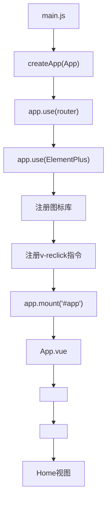
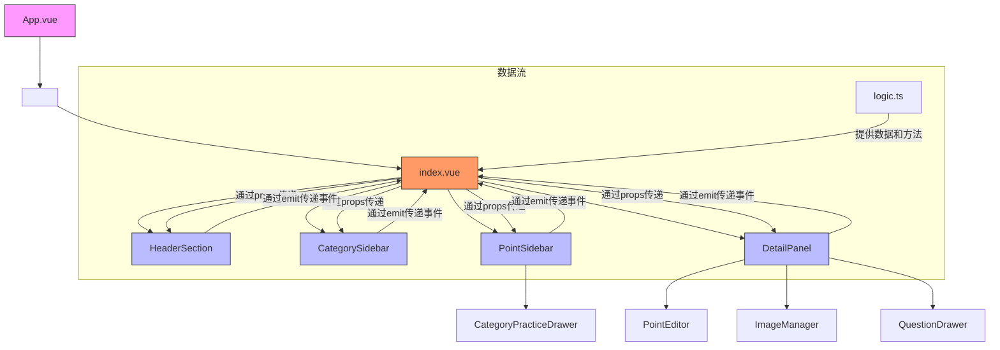

# 组件结构

<cite>
**本文档引用的文件**   
- [App.vue](file://practice_problems_web/src/App.vue)
- [main.js](file://practice_problems_web/src/main.js)
- [index.vue](file://practice_problems_web/src/views/Home/index.vue)
- [style.css](file://practice_problems_web/src/views/Home/style.css)
- [logic.ts](file://practice_problems_web/src/views/Home/logic.ts)
- [CategorySidebar.vue](file://practice_problems_web/src/views/Home/components/CategorySidebar.vue)
- [PointSidebar.vue](file://practice_problems_web/src/views/Home/components/PointSidebar.vue)
- [DetailPanel.vue](file://practice_problems_web/src/views/Home/components/DetailPanel.vue)
- [HeaderSection.vue](file://practice_problems_web/src/views/Home/components/HeaderSection.vue)
- [ShareDialog.vue](file://practice_problems_web/src/views/Home/components/ShareDialog.vue)
- [ShareManageDialog.vue](file://practice_problems_web/src/views/Home/components/ShareManageDialog.vue)
- [SubjectUserManager.vue](file://practice_problems_web/src/views/Home/components/SubjectUserManager.vue)
- [CategoryPracticeDrawer.vue](file://practice_problems_web/src/components/CategoryPracticeDrawer.vue)
- [PointEditor.vue](file://practice_problems_web/src/components/PointEditor.vue)
- [ImageManager.vue](file://practice_problems_web/src/components/ImageManager.vue)
- [QuestionDrawer.vue](file://practice_problems_web/src/components/QuestionDrawer.vue)
- [ShareAnnouncement.vue](file://practice_problems_web/src/components/ShareAnnouncement.vue)
- [router/index.ts](file://practice_problems_web/src/router/index.ts)
</cite>

## 更新摘要
**变更内容**   
- 更新了“知识点侧边栏 (PointSidebar.vue)”部分，详细说明了新增的“移动”功能及其交互逻辑。
- 更新了“知识点编辑器 (PointEditor.vue)”部分，描述了语音合成功能的修复机制。
- 在“Home视图组件结构”中补充了`logic.ts`文件中`handleMovePoint`函数的实现逻辑。
- 更新了“组件嵌套关系与数据流”部分，以反映新增的`move-point`事件和`handleMovePoint`处理函数。

## 目录
1. [项目结构概览](#项目结构概览)
2. [根组件与应用初始化](#根组件与应用初始化)
3. [Home视图组件结构](#home视图组件结构)
4. [组件嵌套关系与数据流](#组件嵌套关系与数据流)
5. [功能模块封装逻辑](#功能模块封装逻辑)
6. [全局样式与应用体验](#全局样式与应用体验)

## 项目结构概览

本项目是一个基于Vue 3的前端应用，其核心组件位于`practice_problems_web/src`目录下。项目采用模块化设计，主要结构包括：
- `api`：定义与后端交互的API接口
- `components`：存放可复用的通用组件
- `router`：配置应用的路由系统
- `types`：定义TypeScript类型
- `utils`：提供工具函数
- `views`：包含页面级视图组件，其中`Home`视图是应用的核心

`Home`视图采用三层组件结构，由外层容器、中间侧边栏和内层内容编辑区构成，实现了清晰的职责划分。

**Section sources**
- [App.vue](file://practice_problems_web/src/App.vue)
- [main.js](file://practice_problems_web/src/main.js)
- [index.vue](file://practice_problems_web/src/views/Home/index.vue)

## 根组件与应用初始化

### App.vue 根组件

`App.vue`作为整个Vue应用的根组件，承担着全局配置和路由视图渲染的核心职责。其主要功能包括：

1.  **Element Plus中文环境配置**：通过`<el-config-provider>`组件，将`zhCn`中文语言包注入到整个应用中，确保所有Element Plus组件的默认文本（如日期选择器、分页器等）显示为中文。

2.  **路由视图渲染**：使用`<router-view />`作为占位符，根据当前的URL路径动态渲染对应的视图组件。当用户访问`/`时，渲染`Home`视图；访问`/login`时，渲染`Login`视图。

3.  **全局样式设置**：通过CSS样式禁用了页面的默认滚动条，实现了全屏应用体验，确保内容在固定视口内展示。

**Section sources**
- [App.vue](file://practice_problems_web/src/App.vue#L1-L26)

### main.js 应用初始化

`main.js`是Vue应用的入口文件，负责创建Vue实例并进行全局配置：

1.  **Vue应用创建**：使用`createApp(App)`创建Vue应用实例。
2.  **路由注册**：通过`app.use(router)`将路由实例注册到应用中，这是实现页面跳转和视图切换的基础。
3.  **Element Plus注册**：通过`app.use(ElementPlus)`全局注册Element Plus组件库。
4.  **图标库注册**：动态导入`@element-plus/icons-vue`中的所有图标，并通过`app.component()`将它们注册为全局组件，使得在任何模板中都可以直接使用`<el-icon>`标签。
5.  **防重复提交指令**：定义并注册了全局自定义指令`v-reclick`。该指令在按钮被点击时，会自动添加`loading`状态和禁用效果，防止用户在请求完成前重复点击，提升了用户体验和系统稳定性。

**Diagram sources**
- [main.js](file://practice_problems_web/src/main.js#L1-L75)
- [App.vue](file://practice_problems_web/src/App.vue#L1-L26)

## Home视图组件结构

`Home`视图是应用的核心工作区，其结构清晰地分为三层，每一层都承担着明确的职责。

### 外层容器 (index.vue)

`index.vue`是`Home`视图的顶层容器，负责整体布局和状态管理。它通过`<script setup>`语法引入了`useHomeLogic`组合式函数，该函数集中管理了所有业务数据（如`subjects`, `categories`, `points`）和交互逻辑（如`handleSelectSubject`, `submitCategory`）。

该组件通过`<template>`将UI划分为三个主要区域：
1.  **HeaderSection**：顶部导航栏，负责展示品牌信息、科目选择和用户操作。
2.  **CategorySidebar**：左侧分类侧边栏，用于展示和管理科目下的分类。
3.  **PointSidebar**：中间知识点侧边栏，用于展示和管理分类下的知识点。
4.  **DetailPanel**：右侧详情面板，用于展示和编辑选中知识点的详细内容。

**Section sources**
- [index.vue](file://practice_problems_web/src/views/Home/index.vue#L1-L159)
- [logic.ts](file://practice_problems_web/src/views/Home/logic.ts#L1-L448)

### 中间层侧边栏

#### 分类侧边栏 (CategorySidebar.vue)

`CategorySidebar.vue`负责管理一个科目下的所有分类。它接收`currentSubject`、`categories`等props，并通过`emit`向父组件传递事件（如`select`, `open-dialog`）。

- **功能**：展示分类列表，支持通过点击选择分类、通过按钮添加/编辑/删除分类、以及通过上下箭头调整分类顺序。
- **权限控制**：通过`hasPermission`计算属性，根据`viewMode`和用户身份动态控制操作按钮的显示。
- **样式**：采用悬浮毛玻璃设计，提升视觉层次感。

#### 知识点侧边栏 (PointSidebar.vue)

`PointSidebar.vue`负责管理一个分类下的所有知识点。它与`CategorySidebar.vue`结构相似，但功能更丰富。

- **功能**：展示知识点列表，支持选择、创建、删除、排序等操作。
- **新增功能**：增加了“刷题”按钮和“移动”按钮，允许用户将知识点移动到其他分类。点击“移动”按钮会打开一个弹窗，用户可以在弹窗中选择目标分类，然后确认移动。
- **子组件**：内嵌了`CategoryPracticeDrawer`抽屉组件，用于实现刷题功能。
- **权限控制**：通过`hasPermission`计算属性，根据`viewMode`和用户身份动态控制操作按钮的显示。
- **数据流**：该组件通过`allCategories` prop接收所有分类的列表，用于构建移动弹窗中的下拉选项。当用户确认移动时，会通过`emit('move-point', {pointId, targetCategoryId})`事件将移动请求发送给父组件。

**Section sources**
- [CategorySidebar.vue](file://practice_problems_web/src/views/Home/components/CategorySidebar.vue#L1-L269)
- [PointSidebar.vue](file://practice_problems_web/src/views/Home/components/PointSidebar.vue#L1-L310)

### 内层内容编辑区

#### 详情面板 (DetailPanel.vue)

`DetailPanel.vue`是内容展示和编辑的核心区域。

- **功能**：当用户在侧边栏选择一个知识点时，该组件会显示该知识点的标题、参考资料链接和详细内容。
- **子组件**：
    - `PointEditor`：富文本编辑器，用于编辑知识点的详细内容。
    - `ImageManager`：图片管理器，用于关联和管理知识点的图片资源。
    - `QuestionDrawer`：抽屉组件，用于练习和管理与该知识点相关的题目。
- **权限控制**：根据`hasPermission`决定是否显示“删除”和“练习”等操作按钮。

**Section sources**
- [DetailPanel.vue](file://practice_problems_web/src/views/Home/components/DetailPanel.vue#L1-L268)

## 组件嵌套关系与数据流

下图展示了`Home`视图中主要组件的嵌套关系和数据流。

**Diagram sources**
- [index.vue](file://practice_problems_web/src/views/Home/index.vue#L1-L159)
- [HeaderSection.vue](file://practice_problems_web/src/views/Home/components/HeaderSection.vue#L1-L624)
- [CategorySidebar.vue](file://practice_problems_web/src/views/Home/components/CategorySidebar.vue#L1-L269)
- [PointSidebar.vue](file://practice_problems_web/src/views/Home/components/PointSidebar.vue#L1-L310)
- [DetailPanel.vue](file://practice_problems_web/src/views/Home/components/DetailPanel.vue#L1-L268)

## 功能模块封装逻辑

### HeaderSection 组件

`HeaderSection`封装了顶部导航栏的所有功能，包括：
- **品牌展示**：显示应用Logo和名称。
- **模式切换**：提供“阅读”、“编辑”、“开发”三种模式，通过`viewMode`控制不同视图的交互权限。
- **科目管理**：以滚动标签的形式展示所有科目，支持选择、添加、编辑和删除。
- **分享与绑定**：集成`ShareDialog`组件，实现资源的分享和绑定功能。
- **用户信息**：显示用户头像和信息，提供修改资料和退出登录的功能。

### ShareDialog 组件

`ShareDialog`是一个功能复杂的弹窗组件，封装了“分享”和“绑定”两大核心功能。
- **分享**：允许用户选择科目，设置资源有效期和分享码有效期，然后生成分享码或直接授权给指定用户。
- **绑定**：提供输入框，让用户输入分享码来绑定资源。

### 其他管理组件

- `ShareManageDialog`：用于管理用户自己创建的分享码，可以查看、编辑、删除和发布公告。
- `SubjectUserManager`：用于管理被授权用户的权限，可以查看、批量修改截止时间和移除权限。

**Section sources**
- [HeaderSection.vue](file://practice_problems_web/src/views/Home/components/HeaderSection.vue#L1-L624)
- [ShareDialog.vue](file://practice_problems_web/src/views/Home/components/ShareDialog.vue#L1-L352)
- [ShareManageDialog.vue](file://practice_problems_web/src/views/Home/components/ShareManageDialog.vue#L1-L704)
- [SubjectUserManager.vue](file://practice_problems_web/src/views/Home/components/SubjectUserManager.vue#L1-L318)

## 全局样式与应用体验

项目的全局样式设计旨在提供一个现代化、沉浸式的全屏应用体验。

1.  **禁用页面滚动**：在`App.vue`和`style.css`中，通过设置`html, body, #app`的`overflow: hidden`，彻底禁用了浏览器的默认滚动条，确保应用内容在固定视口内展示。

2.  **全屏布局**：`index.vue`的`.app-wrapper`和`.main-body`使用`flex`布局，`height: 100vh`确保了组件能撑满整个屏幕。

3.  **视觉设计**：
    - **渐变背景**：应用整体采用紫色渐变背景，营造专业和科技感。
    - **毛玻璃效果**：侧边栏组件使用`backdrop-filter: blur(16px)`实现毛玻璃效果，增加层次感和现代感。
    - **悬浮卡片**：关键组件（如侧边栏、详情面板）采用阴影和圆角设计，使其看起来像悬浮在背景之上。

4.  **水印**：在`.main-body`上添加了全局水印“知识来源于分享”，既增加了品牌感，又不影响用户操作（通过`pointer-events: none`实现）。

**Section sources**
- [App.vue](file://practice_problems_web/src/App.vue#L1-L26)
- [style.css](file://practice_problems_web/src/views/Home/style.css#L1-L286)