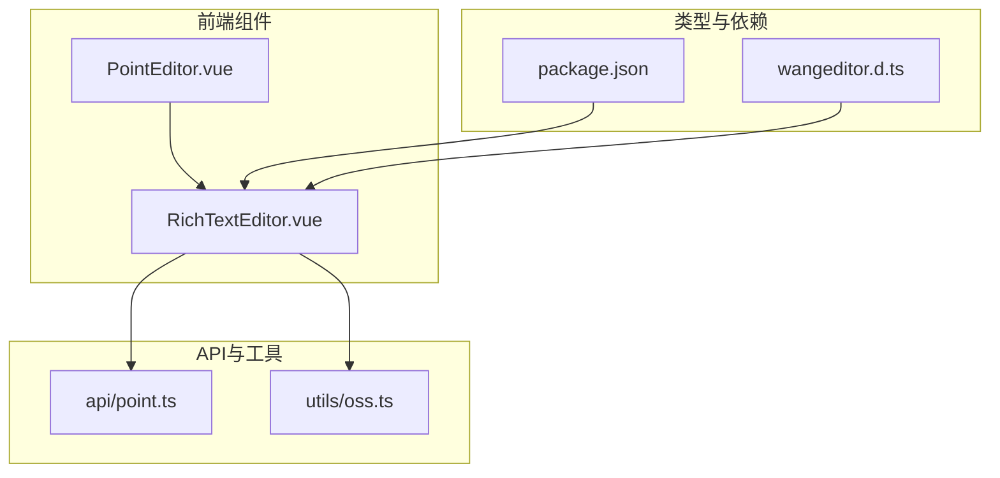
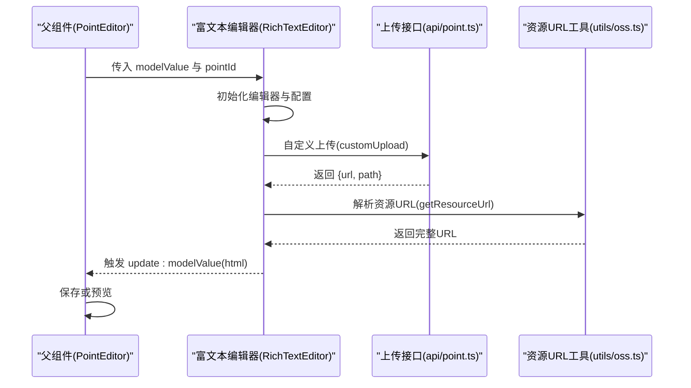
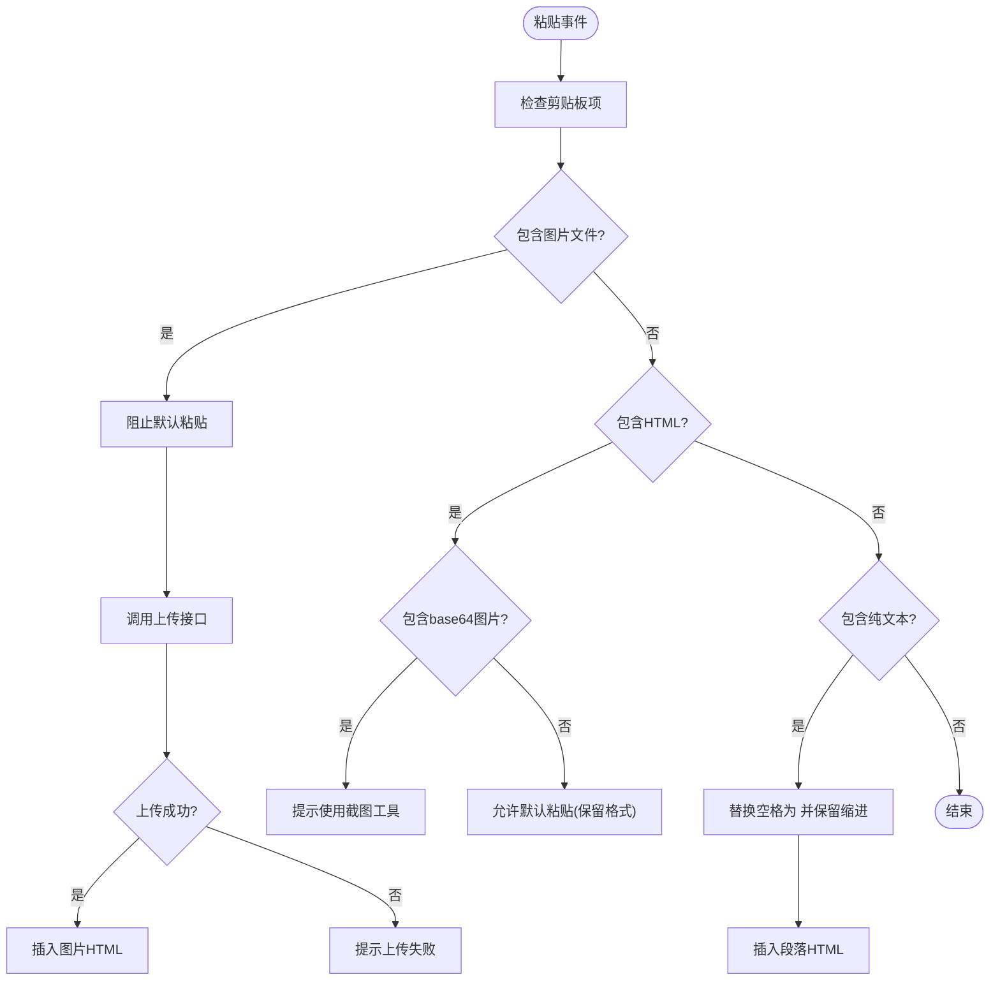
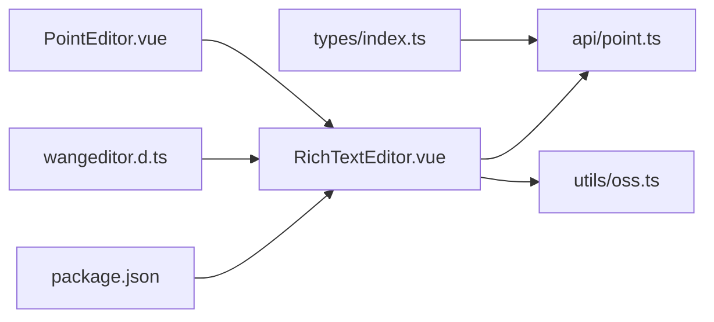

# 富文本编辑器组件

<cite>
**本文引用的文件**
- [RichTextEditor.vue](file://practice_problems_web/src/components/RichTextEditor.vue)
- [wangeditor.d.ts](file://practice_problems_web/src/types/wangeditor.d.ts)
- [package.json](file://practice_problems_web/package.json)
- [point.ts](file://practice_problems_web/src/api/point.ts)
- [oss.ts](file://practice_problems_web/src/utils/oss.ts)
- [PointEditor.vue](file://practice_problems_web/src/components/PointEditor.vue)
- [index.ts](file://practice_problems_web/src/types/index.ts)
</cite>

## 目录
1. [简介](#简介)
2. [项目结构](#项目结构)
3. [核心组件](#核心组件)
4. [架构总览](#架构总览)
5. [组件详细分析](#组件详细分析)
6. [依赖关系分析](#依赖关系分析)
7. [性能与可用性考量](#性能与可用性考量)
8. [故障排查指南](#故障排查指南)
9. [结论](#结论)
10. [附录](#附录)

## 简介
本文件系统化梳理前端富文本编辑器组件的设计与实现，重点围绕基于 Vue 3 与 WangEditor 5 的富文本编辑器组件，涵盖其配置、粘贴处理、图片上传、自定义分割线插入、与父组件交互以及与后端 API 的对接方式。文档同时给出可视化架构图、流程图与最佳实践建议，帮助开发者快速理解与维护该组件。

## 项目结构
富文本编辑器相关代码位于前端工程 practice_problems_web 下，关键文件如下：
- 组件层：components/RichTextEditor.vue
- 类型声明：types/wangeditor.d.ts
- 依赖声明：package.json
- API 层：api/point.ts（含图片上传）
- 工具层：utils/oss.ts（资源 URL 拼接）
- 集成示例：components/PointEditor.vue（父组件使用）

图表来源
- [RichTextEditor.vue](file://practice_problems_web/src/components/RichTextEditor.vue#L1-L266)
- [PointEditor.vue](file://practice_problems_web/src/components/PointEditor.vue#L219-L241)
- [wangeditor.d.ts](file://practice_problems_web/src/types/wangeditor.d.ts#L1-L2)
- [package.json](file://practice_problems_web/package.json#L1-L35)
- [point.ts](file://practice_problems_web/src/api/point.ts#L46-L60)
- [oss.ts](file://practice_problems_web/src/utils/oss.ts#L41-L63)

章节来源
- [RichTextEditor.vue](file://practice_problems_web/src/components/RichTextEditor.vue#L1-L266)
- [PointEditor.vue](file://practice_problems_web/src/components/PointEditor.vue#L219-L241)
- [wangeditor.d.ts](file://practice_problems_web/src/types/wangeditor.d.ts#L1-L2)
- [package.json](file://practice_problems_web/package.json#L1-L35)
- [point.ts](file://practice_problems_web/src/api/point.ts#L46-L60)
- [oss.ts](file://practice_problems_web/src/utils/oss.ts#L41-L63)

## 核心组件
- 富文本编辑器组件：提供工具栏、编辑区域、粘贴处理、图片上传、自定义分割线插入与生命周期清理。
- 父组件集成：在知识点编辑器中作为子组件使用，双向绑定内容并通过暴露方法插入分割线。

章节来源
- [RichTextEditor.vue](file://practice_problems_web/src/components/RichTextEditor.vue#L1-L266)
- [PointEditor.vue](file://practice_problems_web/src/components/PointEditor.vue#L219-L241)

## 架构总览
富文本编辑器通过 WangEditor 的 Editor 与 Toolbar 组件承载，结合 Element Plus 提供的消息反馈与样式覆盖，完成编辑体验与上传流程。

图表来源
- [PointEditor.vue](file://practice_problems_web/src/components/PointEditor.vue#L219-L241)
- [RichTextEditor.vue](file://practice_problems_web/src/components/RichTextEditor.vue#L54-L95)
- [point.ts](file://practice_problems_web/src/api/point.ts#L46-L60)
- [oss.ts](file://practice_problems_web/src/utils/oss.ts#L41-L63)

## 组件详细分析

### 组件结构与职责
- 模板：包含工具栏与编辑容器，使用 v-model 双向绑定 HTML 内容。
- 配置：编辑器默认配置包含占位符、粘贴策略、语言选择、图片上传回调。
- 生命周期：onCreated 时记录编辑器实例并设置初始 HTML；onBeforeUnmount 销毁编辑器。
- 事件：onChange 回调同步本地状态并向上触发 update:modelValue。

章节来源
- [RichTextEditor.vue](file://practice_problems_web/src/components/RichTextEditor.vue#L1-L102)
- [RichTextEditor.vue](file://practice_problems_web/src/components/RichTextEditor.vue#L182-L186)

### 粘贴处理与格式保留
- 粘贴策略：完全保留原始 HTML 与样式，禁用过滤；对纯文本粘贴保留空格与缩进。
- 图片优先：若剪贴板包含图片文件，优先上传并插入；若包含 base64 图片，提示改用截图工具。
- 延迟接管：在编辑器容器就绪后延迟注册 paste 事件，避免与编辑器内置粘贴冲突。

图表来源
- [RichTextEditor.vue](file://practice_problems_web/src/components/RichTextEditor.vue#L103-L179)

章节来源
- [RichTextEditor.vue](file://practice_problems_web/src/components/RichTextEditor.vue#L103-L179)

### 图片上传与资源 URL
- 自定义上传：通过编辑器配置的 uploadImage.customUpload 回调，调用上传接口并返回 {url, path}。
- URL 解析：使用 OSS 工具函数将服务端返回的相对路径转换为完整 URL（支持 OSS 与本地回退）。
- 错误处理：捕获异常并提示“图片上传失败”。

章节来源
- [RichTextEditor.vue](file://practice_problems_web/src/components/RichTextEditor.vue#L81-L94)
- [point.ts](file://practice_problems_web/src/api/point.ts#L46-L60)
- [oss.ts](file://practice_problems_web/src/utils/oss.ts#L41-L63)

### 自定义分割线插入
- 功能：在光标处插入带样式的分割线，并清理空段落，提升排版一致性。
- 交互：父组件通过 defineExpose 暴露出 insertCustomDivider 方法，由父组件按钮触发。

章节来源
- [RichTextEditor.vue](file://practice_problems_web/src/components/RichTextEditor.vue#L188-L222)
- [PointEditor.vue](file://practice_problems_web/src/components/PointEditor.vue#L935-L942)

### 与父组件的交互
- 双向绑定：父组件通过 v-model 接收子组件发出的 update:modelValue，实现内容同步。
- 暴露方法：父组件可调用子组件暴露的方法（如插入分割线）。
- 数据来源：父组件将当前知识点 ID 传递给子组件，用于上传时携带 pointId。

章节来源
- [PointEditor.vue](file://practice_problems_web/src/components/PointEditor.vue#L219-L241)
- [RichTextEditor.vue](file://practice_problems_web/src/components/RichTextEditor.vue#L224-L229)

### 类型与依赖
- WangEditor 类型声明：通过模块声明引入样式，保证 TS 类型与打包正确。
- 依赖版本：package.json 中明确依赖 @wangeditor/editor 与 @wangeditor/editor-for-vue。

章节来源
- [wangeditor.d.ts](file://practice_problems_web/src/types/wangeditor.d.ts#L1-L2)
- [package.json](file://practice_problems_web/package.json#L1-L35)

## 依赖关系分析
- 组件依赖：RichTextEditor 依赖 @wangeditor/editor-for-vue、Element Plus 消息组件、本地 OSS 工具与上传接口。
- 父组件依赖：PointEditor 依赖 RichTextEditor 子组件，负责内容展示与保存。
- 类型依赖：PointDetail 与 ApiResponse 等类型定义支撑前后端数据契约。

图表来源
- [package.json](file://practice_problems_web/package.json#L1-L35)
- [wangeditor.d.ts](file://practice_problems_web/src/types/wangeditor.d.ts#L1-L2)
- [RichTextEditor.vue](file://practice_problems_web/src/components/RichTextEditor.vue#L1-L266)
- [PointEditor.vue](file://practice_problems_web/src/components/PointEditor.vue#L219-L241)
- [point.ts](file://practice_problems_web/src/api/point.ts#L1-L60)
- [oss.ts](file://practice_problems_web/src/utils/oss.ts#L1-L63)
- [index.ts](file://practice_problems_web/src/types/index.ts#L41-L86)

章节来源
- [package.json](file://practice_problems_web/package.json#L1-L35)
- [wangeditor.d.ts](file://practice_problems_web/src/types/wangeditor.d.ts#L1-L2)
- [RichTextEditor.vue](file://practice_problems_web/src/components/RichTextEditor.vue#L1-L266)
- [PointEditor.vue](file://practice_problems_web/src/components/PointEditor.vue#L219-L241)
- [point.ts](file://practice_problems_web/src/api/point.ts#L1-L60)
- [oss.ts](file://practice_problems_web/src/utils/oss.ts#L1-L63)
- [index.ts](file://practice_problems_web/src/types/index.ts#L41-L86)

## 性能与可用性考量
- 粘贴处理优化：仅在必要时阻止默认粘贴，避免影响编辑器正常行为；对 base64 图片进行提示，减少无效上传。
- 图片上传：采用异步上传并在消息提示中控制持续时间，避免阻塞用户操作。
- DOM 操作：插入 HTML 时尽量使用编辑器提供的安全方法，避免直接拼接导致的安全问题。
- 样式覆盖：通过深度选择器覆盖编辑器容器样式，确保整体视觉一致。

[本节为通用指导，无需列出具体文件来源]

## 故障排查指南
- 无法粘贴图片
  - 检查浏览器剪贴板权限与图片来源（截图工具 vs base64）。
  - 若提示 base64 图片，请改用截图工具直接粘贴。
- 上传失败
  - 确认上传接口返回码与数据结构符合预期。
  - 检查 OSS 配置与资源路径拼接逻辑。
- 内容不同步
  - 确认父组件正确接收 update:modelValue 并更新内部状态。
  - 检查 watch 对外部 modelValue 的监听是否生效。
- 编辑器未销毁
  - 确保在组件卸载时调用销毁方法，避免内存泄漏。

章节来源
- [RichTextEditor.vue](file://practice_problems_web/src/components/RichTextEditor.vue#L103-L179)
- [RichTextEditor.vue](file://practice_problems_web/src/components/RichTextEditor.vue#L230-L235)
- [point.ts](file://practice_problems_web/src/api/point.ts#L46-L60)
- [oss.ts](file://practice_problems_web/src/utils/oss.ts#L41-L63)

## 结论
该富文本编辑器组件以 WangEditor 为基础，结合自定义粘贴处理、图片上传与资源 URL 解析，提供了良好的编辑体验与可扩展性。通过父组件集成与方法暴露，实现了与业务场景的无缝衔接。建议在后续迭代中进一步完善错误日志上报、上传进度反馈与更多格式化能力。

[本节为总结性内容，无需列出具体文件来源]

## 附录
- 关键实现路径参考
  - 粘贴处理与图片上传：[RichTextEditor.vue](file://practice_problems_web/src/components/RichTextEditor.vue#L103-L179)
  - 自定义上传配置：[RichTextEditor.vue](file://practice_problems_web/src/components/RichTextEditor.vue#L81-L94)
  - 上传接口定义：[point.ts](file://practice_problems_web/src/api/point.ts#L46-L60)
  - 资源 URL 解析：[oss.ts](file://practice_problems_web/src/utils/oss.ts#L41-L63)
  - 父组件使用示例：[PointEditor.vue](file://practice_problems_web/src/components/PointEditor.vue#L219-L241)
  - 类型声明与依赖：[wangeditor.d.ts](file://practice_problems_web/src/types/wangeditor.d.ts#L1-L2)、[package.json](file://practice_problems_web/package.json#L1-L35)