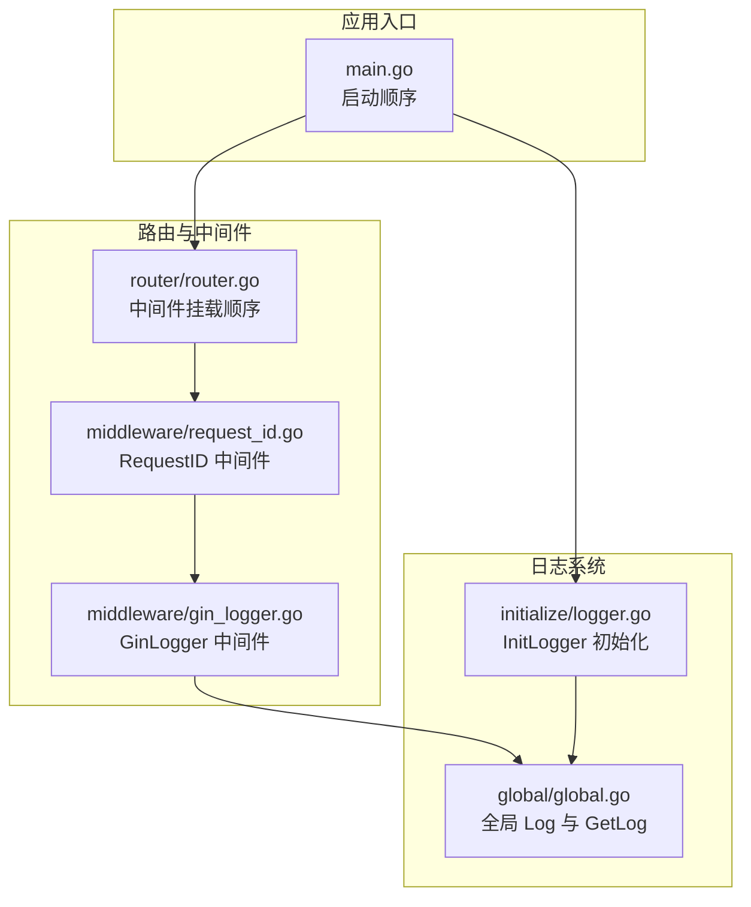
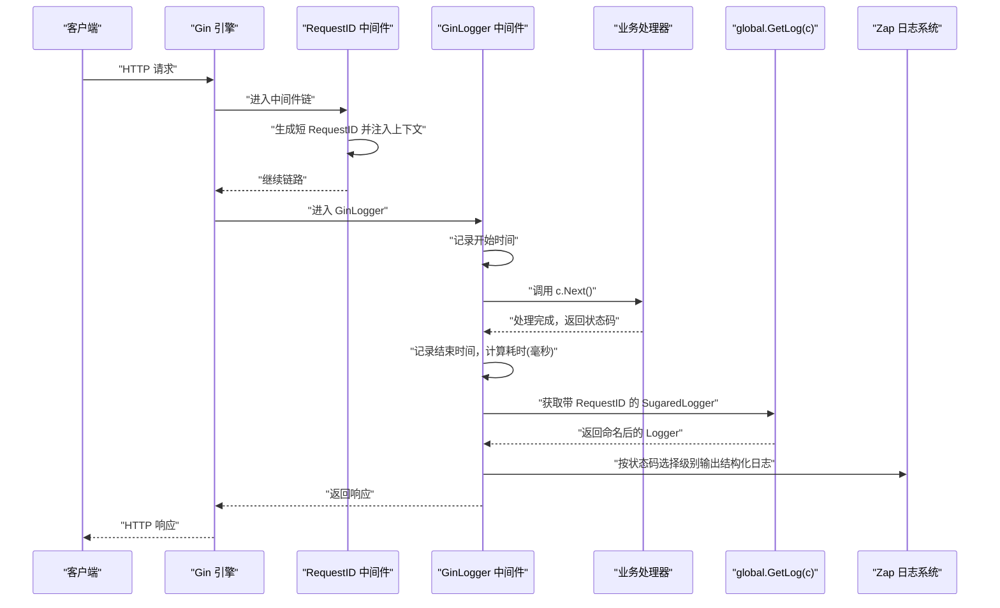
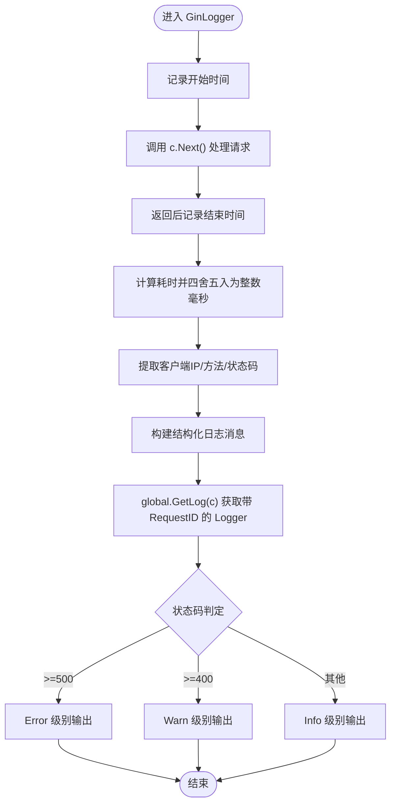

# Gin日志中间件

<cite>
**本文引用的文件列表**
- [middleware/gin_logger.go](file://middleware/gin_logger.go)
- [initialize/logger.go](file://initialize/logger.go)
- [global/global.go](file://global/global.go)
- [middleware/request_id.go](file://middleware/request_id.go)
- [router/router.go](file://router/router.go)
- [main.go](file://main.go)
</cite>

## 目录
1. [简介](#简介)
2. [项目结构](#项目结构)
3. [核心组件](#核心组件)
4. [架构总览](#架构总览)
5. [详细组件分析](#详细组件分析)
6. [依赖关系分析](#依赖关系分析)
7. [性能考量](#性能考量)
8. [故障排查指南](#故障排查指南)
9. [结论](#结论)
10. [附录](#附录)

## 简介
本文件深入解析 middleware/gin_logger.go 中的 GinLogger 中间件工作流程，涵盖请求前后时间戳采集、耗时计算与四舍五入到整数毫秒、从 gin.Context 提取客户端 IP、请求方法与状态码、构建结构化日志消息、通过 global.GetLog(c) 获取绑定请求 ID 的 Zap 日志实例、按状态码动态选择日志级别的策略，以及 initialize/logger.go 中 InitLogger 的双输出配置（控制台与文件）、lumberjack 日志轮转机制与性能优化参数。同时给出日志输出示例与基于日志进行性能分析与错误追踪的实践建议。

## 项目结构
围绕 GinLogger 中间件的关键文件组织如下：
- 中间件层：middleware/gin_logger.go、middleware/request_id.go
- 全局共享：global/global.go（全局 SugaredLogger 与 GetLog）
- 初始化：initialize/logger.go（Zap 初始化、双输出、lumberjack 轮转）
- 路由注册：router/router.go（中间件顺序与挂载）
- 应用入口：main.go（初始化顺序）

图表来源
- [main.go](file://main.go#L1-L32)
- [router/router.go](file://router/router.go#L11-L29)
- [middleware/request_id.go](file://middleware/request_id.go#L10-L27)
- [middleware/gin_logger.go](file://middleware/gin_logger.go#L12-L60)
- [initialize/logger.go](file://initialize/logger.go#L69-L183)
- [global/global.go](file://global/global.go#L11-L31)

章节来源
- [main.go](file://main.go#L13-L21)
- [router/router.go](file://router/router.go#L11-L29)
- [initialize/logger.go](file://initialize/logger.go#L69-L183)
- [global/global.go](file://global/global.go#L11-L31)

## 核心组件
- GinLogger 中间件：在请求处理前后记录时间戳，计算耗时并四舍五入为整数毫秒；从上下文提取客户端 IP、请求方法、状态码；构造结构化日志消息；按状态码选择日志级别；通过 GetLog(c) 获取带 RequestID 的日志实例输出。
- RequestID 中间件：为每个请求生成短请求 ID 并注入上下文，供 GinLogger 与业务日志关联。
- 初始化日志：InitLogger 构建双输出（控制台与文件），启用 lumberjack 轮转，设置编码器与颜色，将 Gin 默认输出也接入同一日志源。
- GetLog：从 gin.Context 取出 RequestID，返回命名后的 SugaredLogger，实现日志与请求的强关联。

章节来源
- [middleware/gin_logger.go](file://middleware/gin_logger.go#L12-L60)
- [middleware/request_id.go](file://middleware/request_id.go#L10-L27)
- [initialize/logger.go](file://initialize/logger.go#L69-L183)
- [global/global.go](file://global/global.go#L16-L31)

## 架构总览
下图展示 GinLogger 在请求生命周期中的调用链与数据流，以及与全局日志系统的交互。

图表来源
- [middleware/request_id.go](file://middleware/request_id.go#L10-L27)
- [middleware/gin_logger.go](file://middleware/gin_logger.go#L12-L60)
- [global/global.go](file://global/global.go#L16-L31)
- [initialize/logger.go](file://initialize/logger.go#L171-L183)

## 详细组件分析

### GinLogger 中间件工作流程
- 请求前后时间戳与耗时计算
  - 请求进入时记录开始时间；调用 c.Next() 处理下游；返回后记录结束时间并计算耗时。
  - 将纳秒级耗时转换为毫秒浮点数，再通过“加 0.5 再取整”的方式四舍五入为整数毫秒，作为 costInt。
- 关键信息提取
  - 从 gin.Context 提取客户端 IP、请求方法、状态码；若存在查询参数则拼接到路径。
- 结构化日志消息构建
  - 使用固定格式包含状态码、耗时（整数毫秒）、客户端 IP、方法与路径。
- 日志级别动态策略
  - 状态码 ≥ 500：Error
  - 状态码 ≥ 400：Warn
  - 其他：Info
- 请求 ID 绑定日志实例
  - 通过 global.GetLog(c) 获取带 RequestID 的 SugaredLogger，实现日志与请求的强关联。

图表来源
- [middleware/gin_logger.go](file://middleware/gin_logger.go#L12-L60)
- [global/global.go](file://global/global.go#L16-L31)

章节来源
- [middleware/gin_logger.go](file://middleware/gin_logger.go#L12-L60)

### RequestID 中间件与日志关联
- RequestID 中间件在链路首部生成短请求 ID（截取 UUID 前 8 位并去除横杠），注入上下文并在响应头中回传。
- GinLogger 通过 global.GetLog(c) 从上下文中取出 RequestID，使用 SugaredLogger.Named(RequestID) 返回一个命名后的日志实例，使该请求的所有日志都带有统一的请求标识，便于串联分析。

章节来源
- [middleware/request_id.go](file://middleware/request_id.go#L10-L27)
- [global/global.go](file://global/global.go#L16-L31)

### 初始化日志系统（InitLogger）
- 输出目标
  - 控制台输出：彩色编码，时间、级别、名称、调用者位置均带颜色。
  - 文件输出：纯文本编码，使用 lumberjack 实现日志轮转。
- 编码器与颜色
  - 控制台编码器启用颜色，文件编码器保持纯净。
  - 自定义 ColorMessageCore 对消息内容按级别上色，提升可读性。
- lumberjack 轮转参数
  - 最大文件大小：50MB
  - 保留备份数量：200
  - 保留天数：180
  - 压缩开关：开启
- Gin 默认输出
  - 将 gin.DefaultWriter 与 gin.DefaultErrorWriter 指向同一 MultiWriter（控制台 + 文件钩子），保证 Gin 内部日志与业务日志一致。

章节来源
- [initialize/logger.go](file://initialize/logger.go#L69-L183)

### 日志输出示例
以下为不同状态码下的典型输出风格（示例仅描述格式与含义，非真实日志内容）：
- 成功请求（状态码 2xx）
  - 示例格式：[200] [12ms] [127.0.0.1] GET /api/v1/users
  - 日志级别：Info
- 客户端错误（状态码 4xx）
  - 示例格式：[404] [5ms] [127.0.0.1] POST /api/v1/auth/login
  - 日志级别：Warn
- 服务器错误（状态码 5xx）
  - 示例格式：[500] [45ms] [127.0.0.1] GET /api/v1/questions
  - 日志级别：Error

说明
- 整数毫秒值来自“纳秒耗时 → 毫秒浮点数 → 四舍五入取整”的过程。
- RequestID 会作为日志实例的命名空间，便于跨模块聚合与检索。

章节来源
- [middleware/gin_logger.go](file://middleware/gin_logger.go#L34-L47)
- [initialize/logger.go](file://initialize/logger.go#L171-L179)

## 依赖关系分析
- 中间件依赖
  - GinLogger 依赖 gin.Context 的 ClientIP、Request、Writer.Status 等能力。
  - GinLogger 依赖 global.GetLog(c) 获取带 RequestID 的 SugaredLogger。
- 初始化依赖
  - InitLogger 构建全局 SugaredLogger，并将其赋值到 global.Log。
  - Gin 默认输出被设置为 MultiWriter，确保 Gin 内部日志与业务日志统一。
- 路由与中间件顺序
  - RequestID 必须在 GinLogger 之前执行，否则 GinLogger 无法从上下文获取 RequestID。
  - GinLogger 位于 RequestID 之后，Recovery 之前，确保日志在错误恢复前输出。

图表来源
- [middleware/request_id.go](file://middleware/request_id.go#L10-L27)
- [middleware/gin_logger.go](file://middleware/gin_logger.go#L12-L60)
- [global/global.go](file://global/global.go#L16-L31)
- [initialize/logger.go](file://initialize/logger.go#L171-L179)

章节来源
- [router/router.go](file://router/router.go#L11-L29)
- [middleware/gin_logger.go](file://middleware/gin_logger.go#L12-L60)
- [global/global.go](file://global/global.go#L16-L31)
- [initialize/logger.go](file://initialize/logger.go#L171-L179)

## 性能考量
- 耗时计算
  - 使用纳秒到毫秒的转换与四舍五入，避免浮点误差累积，且成本极低。
- 日志级别
  - 将 4xx 显示为 Warn、5xx 显示为 Error，有助于快速定位问题类型，减少 Info 级别噪声。
- 输出性能
  - InitLogger 采用 tee 同时输出到控制台与文件，lumberjack 轮转避免磁盘膨胀；压缩开关降低存储占用。
- Gin 默认输出
  - 将 Gin 内部日志也接入同一日志系统，避免分散管理，统一性能与可观测性。

章节来源
- [middleware/gin_logger.go](file://middleware/gin_logger.go#L22-L47)
- [initialize/logger.go](file://initialize/logger.go#L77-L83)
- [initialize/logger.go](file://initialize/logger.go#L171-L179)

## 故障排查指南
- 无 RequestID 日志
  - 现象：日志中缺少请求标识。
  - 排查：确认 RequestID 中间件在 GinLogger 之前挂载；检查中间件顺序是否被修改。
  - 参考：[router/router.go](file://router/router.go#L16-L23)
- 日志级别不符合预期
  - 现象：4xx/5xx 未按 Warn/Error 输出。
  - 排查：确认状态码是否正确设置；检查 GinLogger 的状态码判断分支。
  - 参考：[middleware/gin_logger.go](file://middleware/gin_logger.go#L52-L58)
- 日志轮转未生效
  - 现象：日志文件过大或未轮转。
  - 排查：确认 lumberjack 参数（最大文件大小、备份数量、保留天数、压缩）；检查日志目录权限。
  - 参考：[initialize/logger.go](file://initialize/logger.go#L77-L83)
- 控制台颜色异常
  - 现象：终端不支持颜色或颜色显示异常。
  - 排查：确认终端类型与颜色编码；必要时调整 ColorMessageCore 的颜色策略。
  - 参考：[initialize/logger.go](file://initialize/logger.go#L43-L65)
- Gin 内部日志未输出
  - 现象：Gin 内部日志（如路由匹配、panic 恢复）未见。
  - 排查：确认 gin.DefaultWriter 与 gin.DefaultErrorWriter 已指向 MultiWriter。
  - 参考：[initialize/logger.go](file://initialize/logger.go#L176-L178)

章节来源
- [router/router.go](file://router/router.go#L16-L23)
- [middleware/gin_logger.go](file://middleware/gin_logger.go#L52-L58)
- [initialize/logger.go](file://initialize/logger.go#L77-L83)
- [initialize/logger.go](file://initialize/logger.go#L176-L178)

## 结论
GinLogger 中间件通过简洁高效的实现，将请求耗时、客户端信息与状态码统一格式化输出，并借助 RequestID 与全局日志系统实现请求级日志关联。配合 InitLogger 的双输出与 lumberjack 轮转，既满足开发调试的彩色可视化需求，又兼顾生产环境的稳定与可维护性。按状态码动态选择日志级别，有助于快速识别问题类型，提升排障效率。

## 附录
- 如何基于日志进行性能分析
  - 使用状态码与耗时字段筛选慢请求：关注高耗时的 2xx 请求，定位热点接口与异常波动。
  - 结合 RequestID 聚合一次请求的完整链路日志，定位瓶颈环节（鉴权、数据库、外部依赖）。
- 如何基于日志进行错误追踪
  - 优先关注 5xx 错误日志，结合堆栈与上下文信息定位根因。
  - 4xx 错误多为客户端输入或权限问题，可通过日志中的路径与参数辅助复现。
- 日志输出一致性
  - 通过 InitLogger 将 Gin 默认输出与业务日志统一，避免日志分散与丢失。