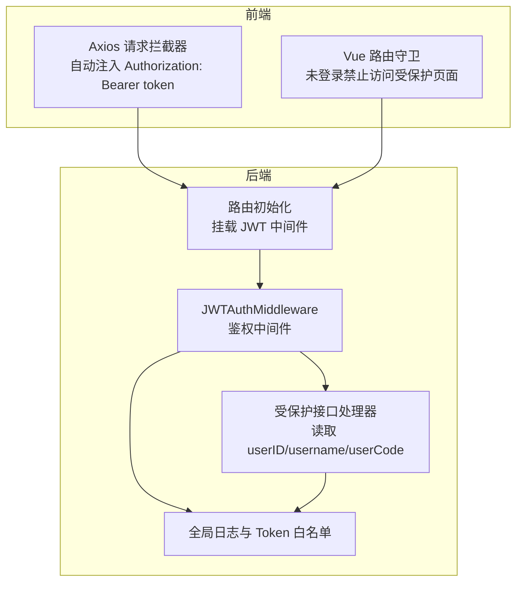
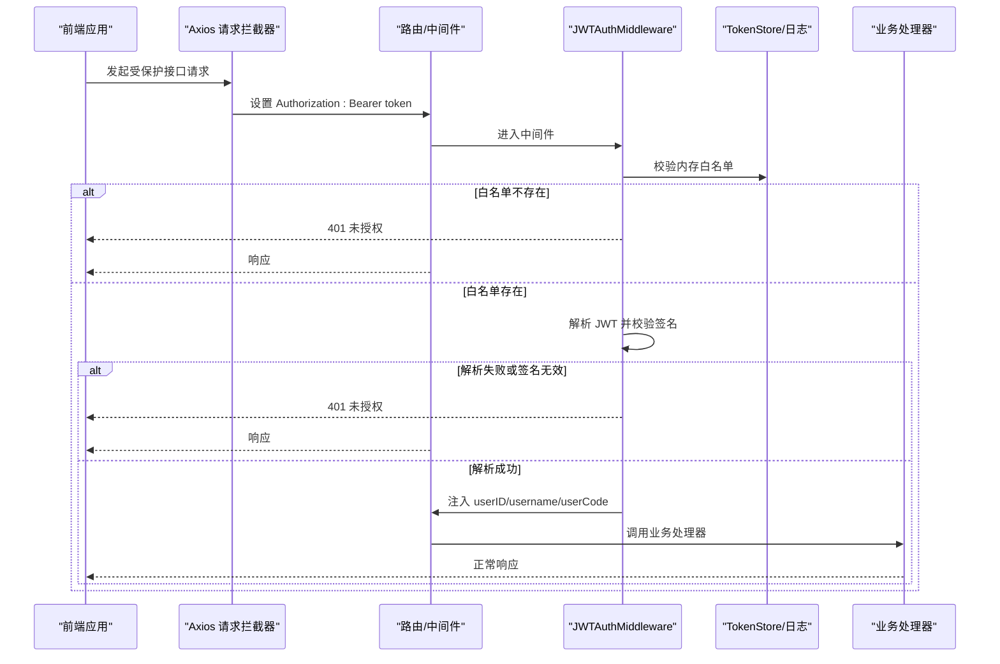
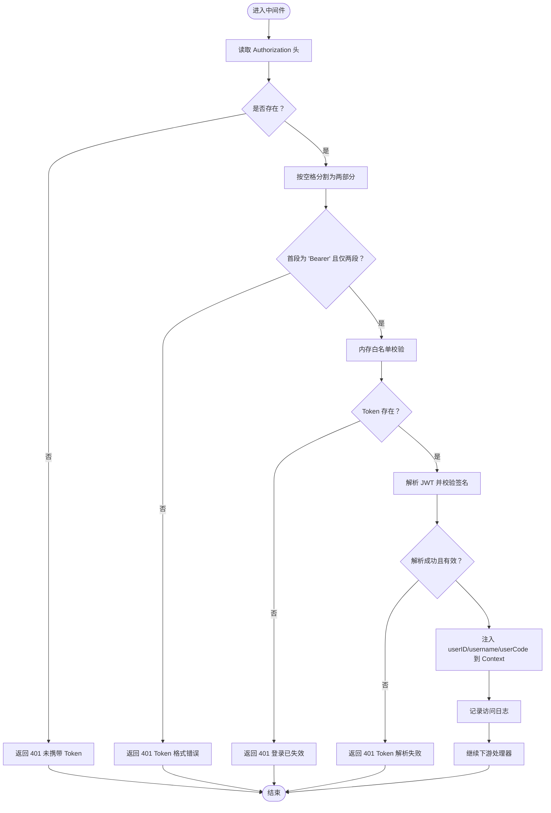
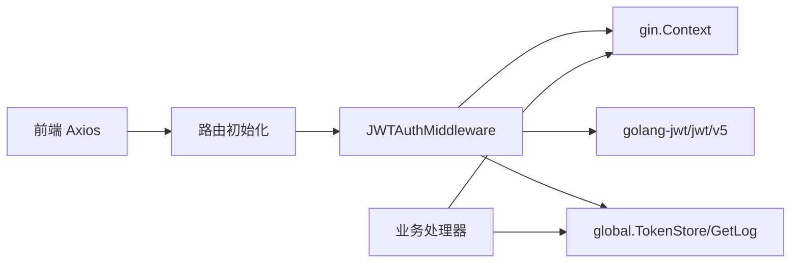

# JWT认证中间件

<cite>
**本文引用的文件**
- [middleware/jwt.go](file://middleware/jwt.go)
- [global/token_store.go](file://global/token_store.go)
- [global/global.go](file://global/global.go)
- [api/user.go](file://api/user.go)
- [router/router.go](file://router/router.go)
- [practice_problems_web/src/utils/request.ts](file://practice_problems_web/src/utils/request.ts)
- [practice_problems_web/src/views/Login/index.vue](file://practice_problems_web/src/views/Login/index.vue)
</cite>

## 目录
1. [简介](#简介)
2. [项目结构](#项目结构)
3. [核心组件](#核心组件)
4. [架构总览](#架构总览)
5. [详细组件分析](#详细组件分析)
6. [依赖关系分析](#依赖关系分析)
7. [性能考量](#性能考量)
8. [故障排查指南](#故障排查指南)
9. [结论](#结论)
10. [附录](#附录)

## 简介
本文件围绕 middleware/jwt.go 中的 JWTAuthMiddleware 认证中间件，系统性解析其认证流程与双重验证机制。内容涵盖：
- 如何从 Authorization 请求头提取 Token 并校验“Bearer ”前缀格式
- 双重验证：内存白名单校验与 JWT 签名验证
- MyClaims 结构体中的用户声明字段及注入到 gin.Context 的过程
- Token 过期、签名无效、缺失等异常的日志与响应策略
- global/token_store.go 的内存存储机制与线程安全
- Token 生成、携带与调试的完整示例
- 安全性边界与潜在风险讨论

## 项目结构
本项目采用按职责分层的组织方式：路由层、API 层、中间件层、全局共享模块与前端请求封装。JWT 认证中间件挂载在路由组上，对受保护接口生效；前端通过 Axios 请求拦截器统一注入 Authorization 头。

图表来源
- [router/router.go](file://router/router.go#L33-L60)
- [middleware/jwt.go](file://middleware/jwt.go#L39-L100)
- [practice_problems_web/src/utils/request.ts](file://practice_problems_web/src/utils/request.ts#L10-L22)

章节来源
- [router/router.go](file://router/router.go#L33-L60)

## 核心组件
- JWTAuthMiddleware：Gin 中间件，负责从请求头提取并校验 Token，执行双重验证，注入用户上下文信息。
- MyClaims：自定义 JWT 载荷结构，包含用户标识与注册声明。
- global.TokenStore：基于内存的 Token 白名单存储，支持并发安全的读写。
- global.GetLog：带 RequestID 的日志工具，便于链路追踪。
- 前端请求拦截器：统一为每个请求添加 Authorization: Bearer token。

章节来源
- [middleware/jwt.go](file://middleware/jwt.go#L13-L37)
- [middleware/jwt.go](file://middleware/jwt.go#L39-L100)
- [global/token_store.go](file://global/token_store.go#L1-L50)
- [global/global.go](file://global/global.go#L16-L31)
- [practice_problems_web/src/utils/request.ts](file://practice_problems_web/src/utils/request.ts#L10-L22)

## 架构总览
JWT 认证流程在后端由中间件完成，前端通过拦截器自动附加 Token。中间件在进入业务处理前执行两阶段校验：内存白名单校验与 JWT 签名解析校验。通过 gin.Context 注入 userID、username、userCode，供后续处理器使用。

图表来源
- [middleware/jwt.go](file://middleware/jwt.go#L39-L100)
- [global/token_store.go](file://global/token_store.go#L16-L30)
- [practice_problems_web/src/utils/request.ts](file://practice_problems_web/src/utils/request.ts#L10-L22)

## 详细组件分析

### JWTAuthMiddleware 认证流程
- 请求头提取与格式校验
  - 从 Authorization 头读取值，若为空直接返回 401。
  - 使用空格分割，要求首段为“Bearer”，否则返回 401。
- 内存白名单二次校验
  - 调用 global.VerifyToken(tokenString) 检查 Token 是否存在于内存白名单。
  - 若不存在，记录警告日志并返回 401。
- JWT 签名验证
  - 使用 jwt.ParseWithClaims 结合自定义 MyClaims 与签名密钥进行解析。
  - 若解析失败或 token 无效，记录警告日志并返回 401。
- 上下文注入
  - 成功后从 MyClaims 中取出 userID、username，并从白名单中取得 userCode，注入 gin.Context。
  - 记录 Debug 级别的访问日志（包含 userCode、请求方法与路径）。
- 放行
  - 通过 c.Next() 继续后续处理器。

图表来源
- [middleware/jwt.go](file://middleware/jwt.go#L39-L100)

章节来源
- [middleware/jwt.go](file://middleware/jwt.go#L39-L100)

### MyClaims 结构体与声明字段
- 字段说明
  - userID：整型用户标识，用于后续业务逻辑定位用户。
  - username：字符串用户名，便于日志与展示。
  - userCode：字符串用户编码，来自内存白名单映射，用于快速反查用户。
  - RegisteredClaims：标准注册声明，包含签发时间、过期时间等。
- 生成与解析
  - 生成：GenerateToken 构造 MyClaims 并签名，设置过期时间与签发者。
  - 解析：jwt.ParseWithClaims 使用相同密钥解析，得到 MyClaims。

章节来源
- [middleware/jwt.go](file://middleware/jwt.go#L13-L37)
- [middleware/jwt.go](file://middleware/jwt.go#L39-L100)

### 内存白名单存储机制与线程安全
- 存储结构
  - TokenStore 为一个包含 sync.RWMutex 与 map[string]string 的匿名结构体。
  - Key 为 Token 字符串，Value 为 userCode。
- 并发控制
  - 读多写少场景：VerifyToken 使用 RLock/RUnlock 提升读性能。
  - 写操作（SaveToken/RemoveToken/ClearUserTokens）使用 Lock/Unlock 保证互斥。
- 生命周期管理
  - 登录成功后 SaveToken 将新 Token 与 userCode 关联。
  - 退出登录时 RemoveToken 从白名单移除对应 Token。
  - 可选 ClearUserTokens 实现“单点登录”效果，踢掉某用户的全部 Token。

章节来源
- [global/token_store.go](file://global/token_store.go#L1-L50)

### 日志与响应策略
- 日志
  - 使用 global.GetLog(c) 输出带 RequestID 的日志，便于链路追踪。
  - 对四种失败场景分别输出不同级别的日志：无 Token、格式错误、失效/已登出、解析错误。
- 响应
  - 所有失败均返回 401 未授权，携带统一的 code 与 msg 字段。
  - 成功时仅注入上下文，不改变响应体。

章节来源
- [middleware/jwt.go](file://middleware/jwt.go#L39-L100)
- [global/global.go](file://global/global.go#L16-L31)

### 前端 Token 携带与调试
- 请求拦截器
  - 在请求发送前从 localStorage 读取 auth_token，若存在则设置 Authorization: Bearer token。
- 登录流程
  - 登录成功后将 token 与用户信息持久化到 localStorage。
- 退出登录
  - 清除 localStorage 中的 token 与用户信息。
- 路由守卫
  - 非登录页且无 token 时重定向至登录页。
- 调试建议
  - 打开浏览器开发者工具 Network 面板，确认请求头 Authorization 是否正确。
  - 在 Console 中检查 localStorage 是否包含 auth_token。
  - 观察后端日志中是否有对应请求的鉴权日志。

章节来源
- [practice_problems_web/src/utils/request.ts](file://practice_problems_web/src/utils/request.ts#L10-L22)
- [practice_problems_web/src/views/Login/index.vue](file://practice_problems_web/src/views/Login/index.vue#L153-L197)

## 依赖关系分析
- 中间件依赖
  - gin：Gin 框架的上下文与中间件机制。
  - golang-jwt/jwt/v5：JWT 解析与签名验证。
  - global：日志与 Token 白名单。
- API 依赖
  - 业务处理器通过 c.Get("userID"/"username"/"userCode") 获取用户上下文。
- 路由依赖
  - 在受保护的 v1 组上挂载 JWTAuthMiddleware，使该组内所有接口均需认证。
- 前端依赖
  - axios：统一请求拦截与响应处理。
  - element-plus：消息提示与弹窗交互。

图表来源
- [middleware/jwt.go](file://middleware/jwt.go#L39-L100)
- [router/router.go](file://router/router.go#L33-L60)
- [practice_problems_web/src/utils/request.ts](file://practice_problems_web/src/utils/request.ts#L10-L22)

章节来源
- [router/router.go](file://router/router.go#L33-L60)
- [middleware/jwt.go](file://middleware/jwt.go#L39-L100)

## 性能考量
- 内存白名单读写
  - VerifyToken 使用 RWMutex 读锁，适合高并发读场景；写操作使用互斥锁，避免频繁写导致阻塞。
- JWT 解析
  - 解析成本主要取决于签名算法与密钥长度；当前使用 HS256，解析开销较小。
- 日志级别
  - 访问日志使用 Debug 级别，避免生产环境日志刷屏；如需生产观察，可在中间件中调整为 Info 级别。
- 建议
  - 对高频接口可考虑缓存最近活跃用户信息，减少数据库查询。
  - 合理设置 Token 过期时间，平衡安全与用户体验。

[本节为通用建议，不直接分析具体文件]

## 故障排查指南
- 常见问题与定位
  - 401 未携带 Token：检查前端是否正确设置 Authorization 头。
  - 401 Token 格式错误：确认 Authorization 头格式为“Bearer xxx”。
  - 401 登录已失效：确认 Token 是否仍在白名单中（退出登录会移除）。
  - 401 Token 解析失败：检查签名密钥是否一致、Token 是否被篡改或过期。
- 日志定位
  - 查看中间件输出的鉴权失败原因与请求路径、方法。
  - 使用 RequestID 定位同一请求链路下的所有日志。
- 前端调试
  - 检查 localStorage 中 auth_token 是否存在。
  - 确认请求头 Authorization 是否随请求发送。
  - 观察响应拦截器对 401 的处理与页面跳转行为。

章节来源
- [middleware/jwt.go](file://middleware/jwt.go#L39-L100)
- [global/global.go](file://global/global.go#L16-L31)
- [practice_problems_web/src/utils/request.ts](file://practice_problems_web/src/utils/request.ts#L41-L67)

## 结论
JWTAuthMiddleware 通过“内存白名单 + JWT 签名验证”的双重机制，在保证安全的同时兼顾性能与易用性。配合前端统一的请求拦截与路由守卫，形成闭环的认证体验。实际部署中应注意密钥管理、Token 过期策略与日志级别，以满足生产环境的安全与可观测性需求。

[本节为总结，不直接分析具体文件]

## 附录

### Token 生成、携带与调试步骤
- 生成与登录
  - 登录成功后服务端返回 token 与用户信息，前端将其保存到 localStorage。
- 携带
  - 请求拦截器自动为每个请求添加 Authorization: Bearer token。
- 调试
  - 浏览器 Network 面板查看请求头 Authorization。
  - Console 检查 localStorage 中的 auth_token。
  - 观察后端日志中对应请求的鉴权日志。

章节来源
- [api/user.go](file://api/user.go#L215-L240)
- [practice_problems_web/src/utils/request.ts](file://practice_problems_web/src/utils/request.ts#L10-L22)
- [practice_problems_web/src/views/Login/index.vue](file://practice_problems_web/src/views/Login/index.vue#L153-L197)

### 安全性边界与潜在风险
- 边界
  - 内存白名单仅在进程内有效，无法跨实例共享；重启后白名单清空。
  - HS256 依赖共享密钥，密钥泄露将影响所有 Token 的有效性。
- 风险
  - Token 泄露：若 localStorage 被 XSS 攻击，Token 可能被窃取。
  - 会话劫持：若 Token 在传输过程中被截获，攻击者可冒用身份。
  - 缺失撤销：仅依赖白名单无法撤销已发放但未过期的 Token（可通过短期 Token+刷新机制缓解）。
- 建议
  - 使用 HTTPS 传输，限制 Cookie SameSite 与 HttpOnly（如采用 Cookie 方案）。
  - 缩短 Token 有效期，启用刷新 Token 机制。
  - 加强前端安全防护（CSP、XSS 防护）。
  - 对关键操作增加二次校验（如短信验证码）。

[本节为通用建议，不直接分析具体文件]