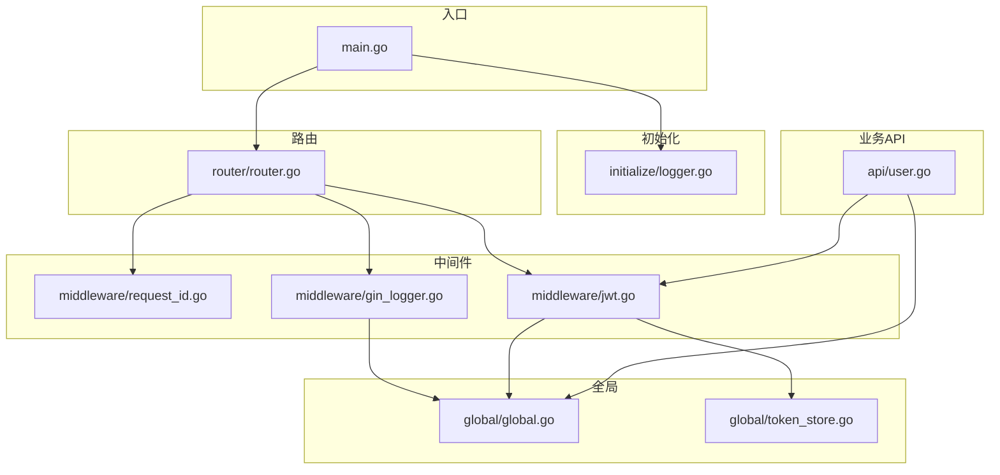
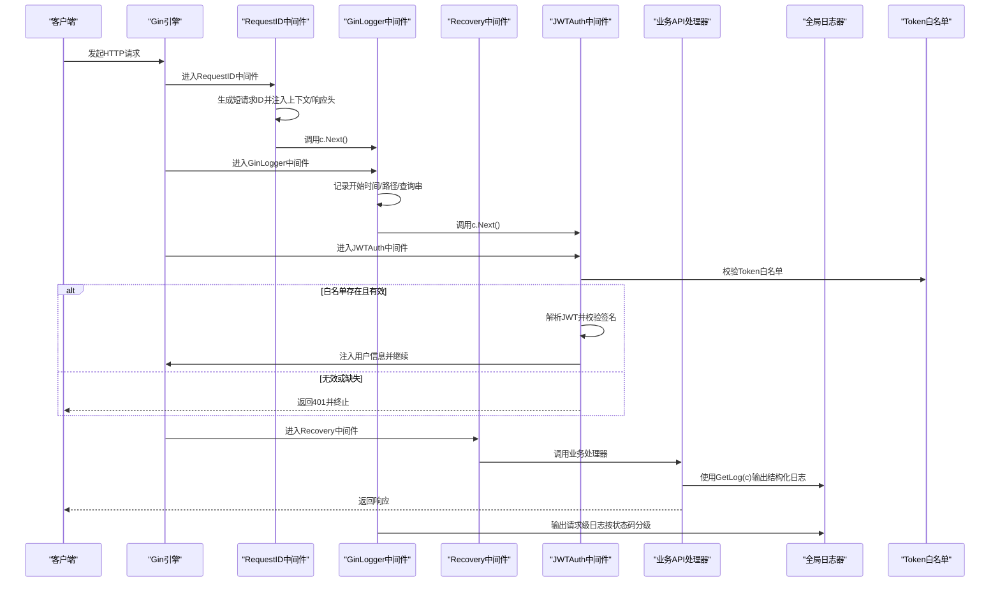
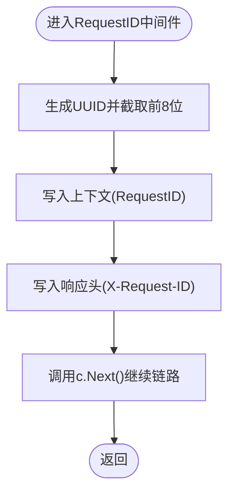
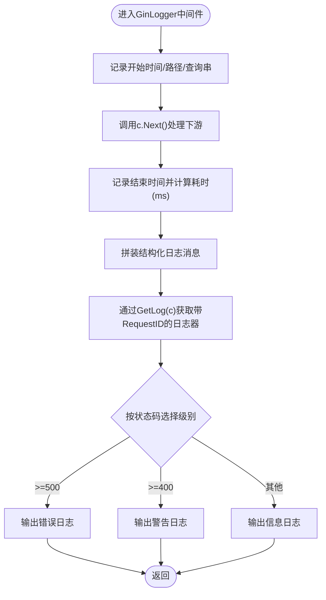
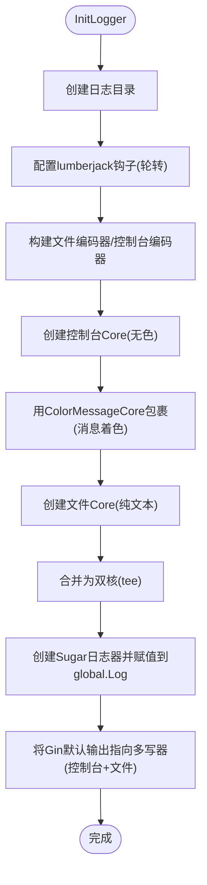
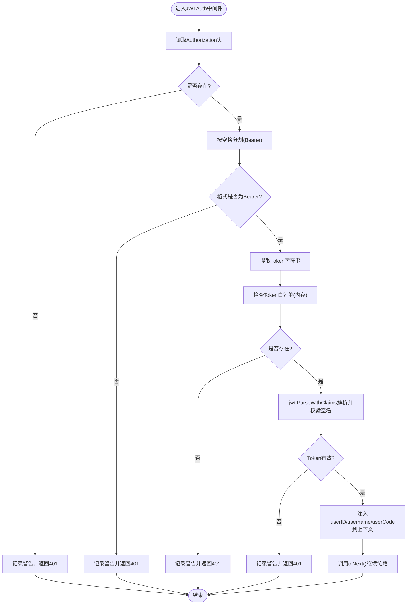
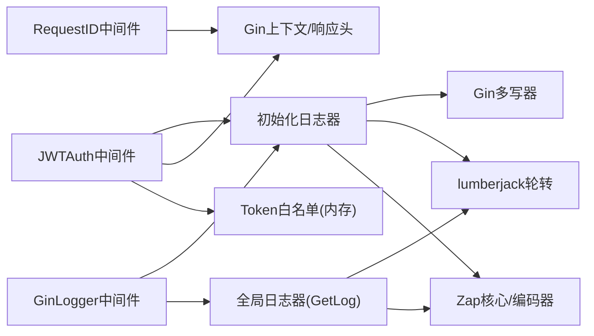

# 中间件体系

<cite>
**本文引用的文件**
- [main.go](file://main.go)
- [initialize/logger.go](file://initialize/logger.go)
- [global/global.go](file://global/global.go)
- [global/token_store.go](file://global/token_store.go)
- [router/router.go](file://router/router.go)
- [middleware/request_id.go](file://middleware/request_id.go)
- [middleware/gin_logger.go](file://middleware/gin_logger.go)
- [middleware/jwt.go](file://middleware/jwt.go)
- [api/user.go](file://api/user.go)
</cite>

## 目录
1. [引言](#引言)
2. [项目结构](#项目结构)
3. [核心组件](#核心组件)
4. [架构总览](#架构总览)
5. [详细组件分析](#详细组件分析)
6. [依赖关系分析](#依赖关系分析)
7. [性能考量](#性能考量)
8. [故障排查指南](#故障排查指南)
9. [结论](#结论)

## 引言
本文件深入剖析本项目的中间件体系，围绕三大核心中间件展开：
- 请求追踪中间件：为每个请求生成唯一短ID（X-Request-ID），并注入上下文与响应头，支撑全链路追踪。
- 日志中间件：基于Zap的日志中间件，统一采集请求方法、路径、状态码、耗时等信息，并按状态码分级输出至控制台与文件。
- JWT鉴权中间件：从Authorization头提取Token，校验签名与白名单有效性，解析自定义Claims并将用户信息注入上下文。

同时，文档阐明中间件在请求处理链中的执行顺序（RequestID → GinLogger → JWTAuth → Recovery），并给出日志输出示例与请求追踪ID的传递验证方法。

## 项目结构
项目采用“按职责分层+按功能模块划分”的组织方式，中间件位于middleware目录，日志初始化位于initialize，全局共享对象（如日志器、Token白名单）位于global，路由注册位于router，业务API位于api。

图表来源
- [main.go](file://main.go#L1-L59)
- [initialize/logger.go](file://initialize/logger.go#L1-L184)
- [global/global.go](file://global/global.go#L1-L32)
- [global/token_store.go](file://global/token_store.go#L1-L50)
- [router/router.go](file://router/router.go#L1-L127)
- [middleware/request_id.go](file://middleware/request_id.go#L1-L28)
- [middleware/gin_logger.go](file://middleware/gin_logger.go#L1-L61)
- [middleware/jwt.go](file://middleware/jwt.go#L1-L101)
- [api/user.go](file://api/user.go#L1-L285)

章节来源
- [main.go](file://main.go#L1-L59)
- [router/router.go](file://router/router.go#L1-L127)

## 核心组件
- RequestID中间件：生成短请求ID，注入上下文与响应头，供后续日志与审计使用。
- GinLogger中间件：采集请求元数据，计算耗时，按状态码分级输出日志，并通过全局GetLog按RequestID命名日志器。
- JWTAuth中间件：校验Authorization头格式与Token白名单，解析JWT并注入用户信息，异常时返回401并终止链路。

章节来源
- [middleware/request_id.go](file://middleware/request_id.go#L1-L28)
- [middleware/gin_logger.go](file://middleware/gin_logger.go#L1-L61)
- [middleware/jwt.go](file://middleware/jwt.go#L1-L101)
- [global/global.go](file://global/global.go#L1-L32)

## 架构总览
下图展示了请求在中间件链中的执行顺序与关键交互点，以及与全局日志器、Token白名单的协作关系。

图表来源
- [router/router.go](file://router/router.go#L11-L33)
- [middleware/request_id.go](file://middleware/request_id.go#L1-L28)
- [middleware/gin_logger.go](file://middleware/gin_logger.go#L1-L61)
- [middleware/jwt.go](file://middleware/jwt.go#L1-L101)
- [global/global.go](file://global/global.go#L1-L32)
- [global/token_store.go](file://global/token_store.go#L1-L50)

## 详细组件分析

### RequestID中间件：唯一请求ID生成与注入
- 生成策略：使用UUID生成完整ID，截取前8位并去除横杠，形成短ID，便于日志与追踪。
- 注入位置：将RequestID放入上下文键值对，同时写入响应头X-Request-ID，便于跨服务传递。
- 执行时机：作为路由链的第一个中间件，确保后续日志中间件能够读取到RequestID。

图表来源
- [middleware/request_id.go](file://middleware/request_id.go#L1-L28)

章节来源
- [middleware/request_id.go](file://middleware/request_id.go#L1-L28)
- [router/router.go](file://router/router.go#L16-L18)

### GinLogger中间件：Zap日志集成与结构化输出
- 采集信息：开始时间、路径（含RawQuery）、客户端IP、HTTP方法、状态码、耗时（毫秒，四舍五入整数）。
- 输出策略：根据状态码分级（>=500为错误、>=400为警告、否则为信息），统一通过全局GetLog(c)输出。
- 全局关联：GetLog(c)会按RequestID命名日志器，使业务日志与请求日志在同一上下文中呈现，便于串联。

图表来源
- [middleware/gin_logger.go](file://middleware/gin_logger.go#L1-L61)
- [global/global.go](file://global/global.go#L16-L32)

章节来源
- [middleware/gin_logger.go](file://middleware/gin_logger.go#L1-L61)
- [global/global.go](file://global/global.go#L16-L32)

### 初始化日志器：Zap双核配置与性能优化
- 双核输出：控制台Core与文件Core通过tee组合，既保证终端可观测性，又持久化到文件。
- 彩色编码：自定义ColorMessageCore对消息内容按级别染色；控制台编码器额外对时间、级别、调用者等进行美化。
- 轮转策略：使用lumberjack进行日志轮转（最大文件大小、保留数量、保留天数、压缩开关）。
- 性能参数：原子级别控制、调用者信息启用、默认编码器配置等。

图表来源
- [initialize/logger.go](file://initialize/logger.go#L1-L184)

章节来源
- [initialize/logger.go](file://initialize/logger.go#L1-L184)

### JWTAuth中间件：认证流程与异常处理
- 输入校验：Authorization头必须存在且格式为“Bearer TOKEN”。
- 白名单校验：在进入签名解析前，先检查Token是否存在于全局白名单（内存Map），避免已登出/失效Token继续解析。
- 签名解析：使用jwt.ParseWithClaims解析Token并校验签名。
- 上下文注入：解析成功后将用户ID、用户名、用户编码注入上下文，供后续处理器使用。
- 异常处理：无Token、格式错误、白名单不存在、解析失败或签名无效均返回401并终止链路。

图表来源
- [middleware/jwt.go](file://middleware/jwt.go#L1-L101)
- [global/token_store.go](file://global/token_store.go#L1-L50)

章节来源
- [middleware/jwt.go](file://middleware/jwt.go#L1-L101)
- [global/token_store.go](file://global/token_store.go#L1-L50)

### 路由与中间件装配：执行顺序与作用范围
- RequestID中间件置于首位，确保后续日志中间件可用。
- GinLogger中间件替代默认Logger，统一请求级日志风格。
- Recovery中间件置于日志之后，防止panic导致日志丢失。
- JWTAuth中间件挂载在受保护的路由组上，仅对需要鉴权的接口生效。

章节来源
- [router/router.go](file://router/router.go#L11-L33)

### 业务侧日志与请求追踪：GetLog(c)的命名机制
- GetLog(c)会从上下文中读取RequestID，若存在则以该ID为名称创建命名日志器，使业务日志与请求日志同属一个上下文，便于串联。
- 在业务API中，可通过GetLog(c)输出结构化日志，包含请求ID、用户信息等。

章节来源
- [global/global.go](file://global/global.go#L16-L32)
- [api/user.go](file://api/user.go#L100-L170)

## 依赖关系分析
- RequestID中间件依赖Gin上下文与响应Writer，无外部依赖。
- GinLogger中间件依赖全局日志器与Gin上下文，通过GetLog(c)按RequestID命名日志器。
- JWTAuth中间件依赖全局Token白名单、Gin上下文、JWT库，解析后注入用户信息。
- 初始化日志器依赖Zap、lumberjack、Gin Writer多写器，配置双核输出与轮转。

图表来源
- [middleware/request_id.go](file://middleware/request_id.go#L1-L28)
- [middleware/gin_logger.go](file://middleware/gin_logger.go#L1-L61)
- [middleware/jwt.go](file://middleware/jwt.go#L1-L101)
- [global/global.go](file://global/global.go#L1-L32)
- [global/token_store.go](file://global/token_store.go#L1-L50)
- [initialize/logger.go](file://initialize/logger.go#L1-L184)

章节来源
- [router/router.go](file://router/router.go#L11-L33)
- [initialize/logger.go](file://initialize/logger.go#L1-L184)
- [global/global.go](file://global/global.go#L1-L32)
- [global/token_store.go](file://global/token_store.go#L1-L50)
- [middleware/request_id.go](file://middleware/request_id.go#L1-L28)
- [middleware/gin_logger.go](file://middleware/gin_logger.go#L1-L61)
- [middleware/jwt.go](file://middleware/jwt.go#L1-L101)

## 性能考量
- 日志输出：双核tee输出，控制台Core经ColorMessageCore包裹，文件Core保持纯文本，兼顾可读性与性能。
- 轮转策略：合理设置最大文件大小、保留数量与天数，避免磁盘占用过高。
- 请求耗时：GinLogger对耗时进行毫秒级统计与四舍五入，减少日志噪声。
- 中间件顺序：将RequestID置于首位，避免后续中间件因缺少RequestID而回退到全局日志器。

[本节为通用建议，不直接分析具体文件]

## 故障排查指南
- 请求追踪ID缺失
  - 确认RequestID中间件已在路由装配中置于首位。
  - 检查响应头是否包含X-Request-ID。
- 日志中未显示请求ID
  - 确认业务侧使用GetLog(c)而非全局Log。
  - 检查GetLog(c)是否能从上下文读取到RequestID。
- 401频繁出现
  - 检查Authorization头格式是否为“Bearer TOKEN”。
  - 确认Token存在于白名单（内存），退出登录会移除Token。
  - 核对签名密钥一致，避免解析失败。
- 日志未落盘
  - 检查日志目录是否存在，lumberjack配置是否正确。
  - 确认Gin默认输出已指向多写器（控制台+文件）。

章节来源
- [router/router.go](file://router/router.go#L11-L33)
- [middleware/request_id.go](file://middleware/request_id.go#L1-L28)
- [middleware/gin_logger.go](file://middleware/gin_logger.go#L1-L61)
- [middleware/jwt.go](file://middleware/jwt.go#L1-L101)
- [global/global.go](file://global/global.go#L16-L32)
- [global/token_store.go](file://global/token_store.go#L1-L50)
- [initialize/logger.go](file://initialize/logger.go#L1-L184)

## 结论
本项目的中间件体系通过RequestID、GinLogger与JWTAuth三者的协同，实现了从请求追踪、日志统一到安全鉴权的完整闭环。RequestID中间件确保全链路可追踪；GinLogger中间件以Zap为核心，提供结构化、分级、可读性强的日志输出；JWTAuth中间件在签名校验前引入白名单校验，兼顾安全性与可运维性。配合初始化日志器的双核输出与轮转策略，整体具备良好的可观测性与稳定性。