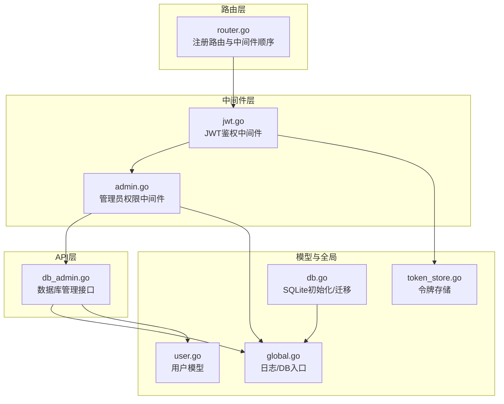
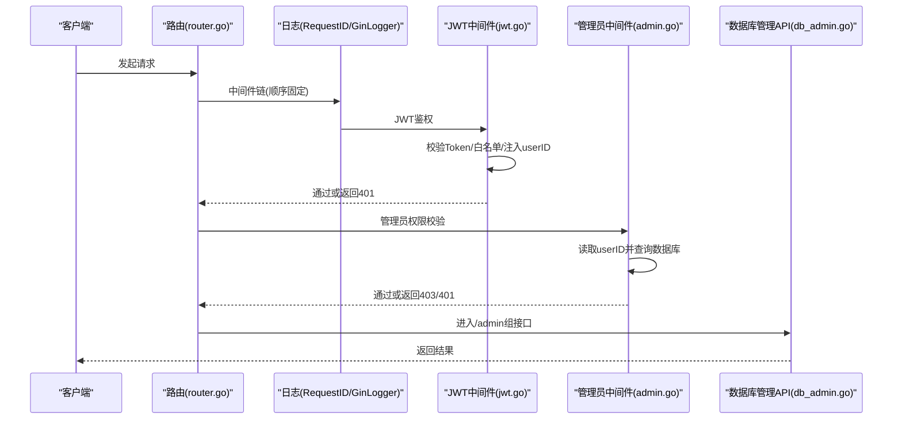
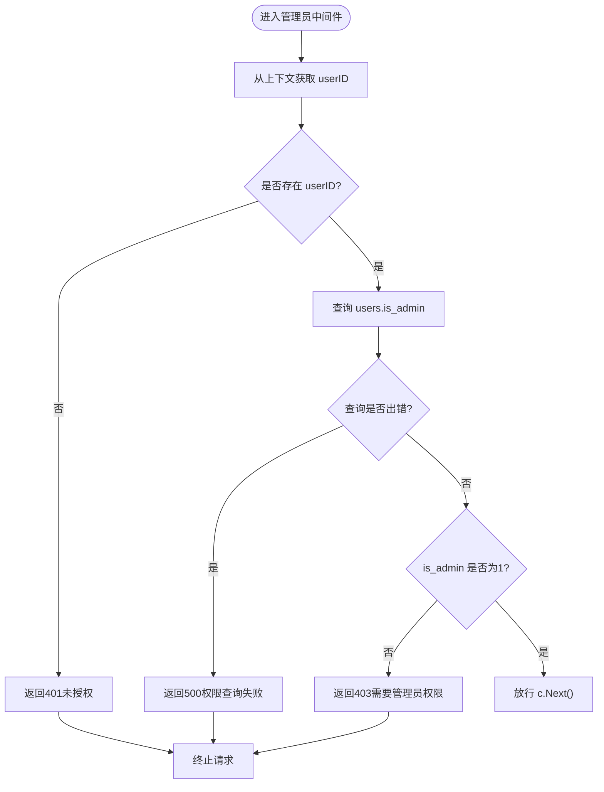
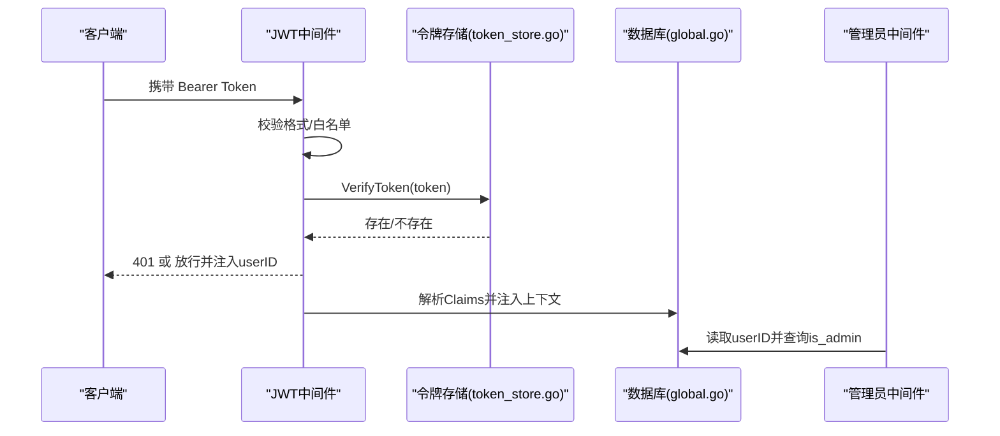
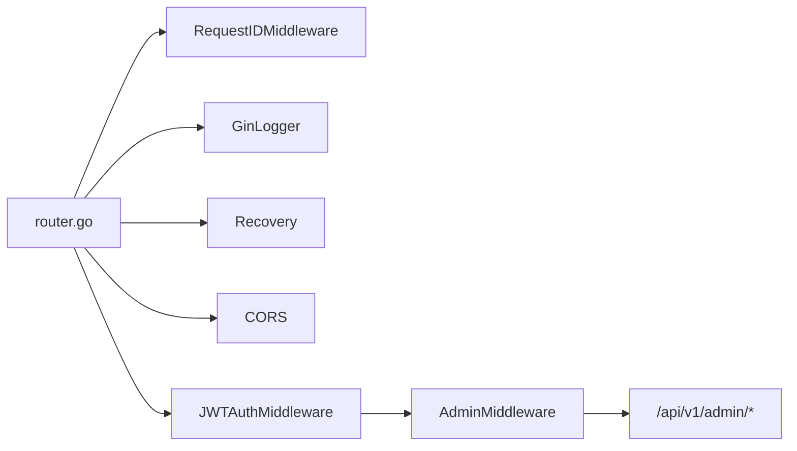
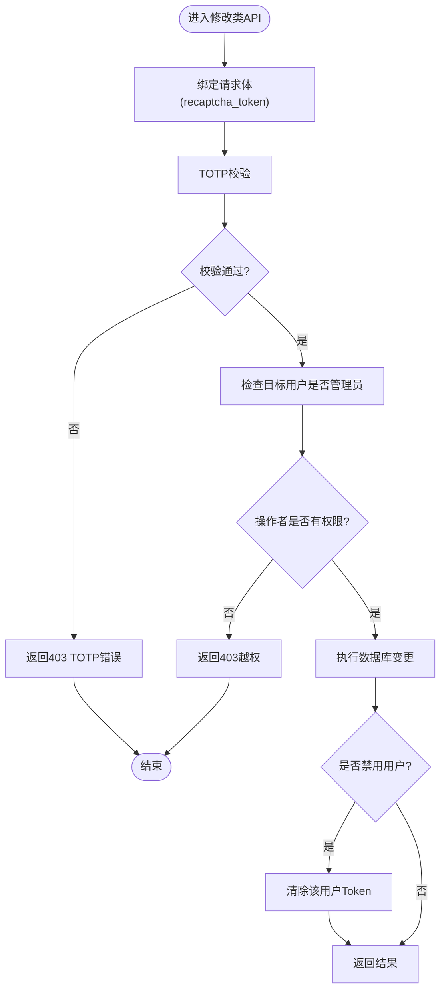
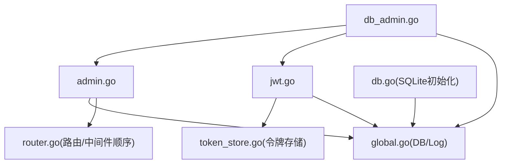

# 管理员中间件

<cite>
**本文引用的文件**
- [admin.go](file://middleware/admin.go)
- [jwt.go](file://middleware/jwt.go)
- [router.go](file://router/router.go)
- [global.go](file://global/global.go)
- [token_store.go](file://global/token_store.go)
- [db_admin.go](file://api/db_admin.go)
- [user.go](file://model/user.go)
- [db.go](file://initialize/db.go)
</cite>

## 目录
1. [简介](#简介)
2. [项目结构](#项目结构)
3. [核心组件](#核心组件)
4. [架构总览](#架构总览)
5. [详细组件分析](#详细组件分析)
6. [依赖关系分析](#依赖关系分析)
7. [性能考量](#性能考量)
8. [故障排查指南](#故障排查指南)
9. [结论](#结论)

## 简介
本文件聚焦“管理员中间件”的设计与实现，解释其在 Gin 路由中的作用、与 JWT 中间件的协作关系、以及对数据库管理接口的权限控制机制。文档同时梳理了全局日志、令牌存储、路由挂载顺序等关键要素，帮助读者快速理解并安全地扩展管理员能力。

## 项目结构
管理员中间件位于中间件层，配合 JWT 中间件共同完成“登录+管理员”双重鉴权；数据库管理接口位于 API 层，受管理员中间件保护；全局模块提供日志与令牌存储，路由层负责中间件挂载顺序与接口分组。

图表来源
- [router.go](file://router/router.go#L1-L172)
- [jwt.go](file://middleware/jwt.go#L1-L101)
- [admin.go](file://middleware/admin.go#L1-L54)
- [db_admin.go](file://api/db_admin.go#L1-L120)
- [global.go](file://global/global.go#L1-L79)
- [token_store.go](file://global/token_store.go#L1-L50)
- [db.go](file://initialize/db.go#L1-L120)

章节来源
- [router.go](file://router/router.go#L1-L172)

## 核心组件
- 管理员中间件：在 JWT 成功后，校验当前用户是否为管理员，仅允许管理员访问“/api/v1/admin/*”下的数据库管理接口。
- JWT 中间件：负责 Token 校验、白名单校验、上下文注入（userID、userCode 等）。
- 路由层：明确中间件顺序（RequestID → 自定义日志 → Recovery → CORS → JWT → Admin），并为管理员接口单独分组。
- 全局模块：提供统一日志入口（带 RequestID）、数据库连接入口、令牌存储与校验。
- 数据库管理 API：在修改类接口上额外进行 TOTP 校验与管理员权限边界控制。

章节来源
- [admin.go](file://middleware/admin.go#L1-L54)
- [jwt.go](file://middleware/jwt.go#L1-L101)
- [router.go](file://router/router.go#L1-L172)
- [global.go](file://global/global.go#L1-L79)
- [token_store.go](file://global/token_store.go#L1-L50)
- [db_admin.go](file://api/db_admin.go#L1-L120)

## 架构总览
管理员中间件的职责链如下：
- 请求进入后，先经 RequestID 与自定义日志中间件，再进入 Recovery 与 CORS。
- JWT 中间件校验 Token 并将 userID 等注入上下文。
- 管理员中间件读取上下文中的 userID，查询数据库判断是否为管理员。
- 若通过，继续进入管理员接口组；若失败，返回相应状态码并终止。

图表来源
- [router.go](file://router/router.go#L1-L172)
- [jwt.go](file://middleware/jwt.go#L1-L101)
- [admin.go](file://middleware/admin.go#L1-L54)
- [db_admin.go](file://api/db_admin.go#L1-L120)

## 详细组件分析

### 管理员中间件（admin.go）
- 设计要点
  - 依赖 JWT 中间件已注入 userID。
  - 通过查询 users.is_admin 判断管理员身份。
  - 严格区分“未登录”（401）与“非管理员”（403）两类错误。
- 错误处理
  - 未找到 userID：返回 401。
  - 查询数据库失败：返回 500。
  - 非管理员：返回 403。
- 性能与健壮性
  - 单次查询 is_admin，复杂度 O(1)。
  - 依赖全局 DB 连接，需确保初始化完成。
- 与路由的关系
  - 仅在 /api/v1/admin/* 分组中挂载，保证只保护数据库管理接口。

图表来源
- [admin.go](file://middleware/admin.go#L1-L54)

章节来源
- [admin.go](file://middleware/admin.go#L1-L54)

### JWT 中间件（jwt.go）
- 设计要点
  - 校验 Authorization 头格式与内容。
  - 使用内存白名单校验 Token 是否仍有效（支持登出踢人）。
  - 解析自定义 Claims，注入 userID、username、userCode。
- 与管理员中间件的协作
  - 管理员中间件依赖 JWT 中间件注入的 userID。
  - 白名单机制确保“已登出”的 Token 无法绕过管理员校验。
- 与令牌存储的关系
  - 依赖全局 TokenStore 的 VerifyToken/SaveToken/RemoveToken/ClearUserTokens。

图表来源
- [jwt.go](file://middleware/jwt.go#L1-L101)
- [token_store.go](file://global/token_store.go#L1-L50)
- [global.go](file://global/global.go#L1-L79)
- [admin.go](file://middleware/admin.go#L1-L54)

章节来源
- [jwt.go](file://middleware/jwt.go#L1-L101)
- [token_store.go](file://global/token_store.go#L1-L50)

### 路由与中间件顺序（router.go）
- 中间件顺序至关重要
  - RequestID → 自定义日志 → Recovery → CORS → JWT → Admin
- 管理员接口分组
  - /api/v1/admin/* 下的接口均受管理员中间件保护。
- 修改类接口的特殊处理
  - 修改类接口不在中间件中统一挂载 reCAPTCHA，而是在 API 内部校验 recaptcha_token 字段，避免提前消耗请求体。

图表来源
- [router.go](file://router/router.go#L1-L172)

章节来源
- [router.go](file://router/router.go#L1-L172)

### 数据库管理接口与管理员边界（db_admin.go）
- 查询类接口
  - 无需 reCAPTCHA，仅受管理员中间件保护。
- 修改类接口
  - 额外要求 TOTP 验证，确保高危操作的人工确认。
  - 对 users 表的管理员修改进行边界控制：
    - 仅超级管理员（ID 最小的 is_admin=1 用户）可修改其他管理员信息。
    - 普通管理员不可修改管理员信息。
- 用户状态变更的即时生效
  - 当将用户 status 设为禁用时，立即清除该用户的 Token，实现“禁用即踢”。

图表来源
- [db_admin.go](file://api/db_admin.go#L1-L120)
- [db_admin.go](file://api/db_admin.go#L400-L520)

章节来源
- [db_admin.go](file://api/db_admin.go#L1-L120)
- [db_admin.go](file://api/db_admin.go#L400-L520)

### 用户模型与数据库初始化（user.go, db.go）
- 用户模型
  - DbUser 中包含 is_admin 字段，用于管理员判定。
- 数据库初始化
  - users 表包含 is_admin 字段，初始值为 0。
  - 启动时维护数据库结构，确保字段存在并具备默认值。

章节来源
- [user.go](file://model/user.go#L1-L39)
- [db.go](file://initialize/db.go#L416-L460)
- [db.go](file://initialize/db.go#L153-L210)

## 依赖关系分析
- 管理员中间件依赖
  - 上下文注入：来自 JWT 中间件（userID）。
  - 数据库：查询 users.is_admin。
  - 日志：统一日志入口，便于审计。
- JWT 中间件依赖
  - 令牌存储：内存白名单校验。
  - 日志：统一日志入口。
- 路由层依赖
  - 明确中间件顺序，确保 JWT 在 Admin 之前。
  - 管理员接口分组，避免误伤公开接口。
- 数据库管理 API 依赖
  - 管理员中间件保护。
  - TOTP 校验与管理员边界控制。
  - 用户状态变更时的 Token 清理。

图表来源
- [admin.go](file://middleware/admin.go#L1-L54)
- [jwt.go](file://middleware/jwt.go#L1-L101)
- [router.go](file://router/router.go#L1-L172)
- [global.go](file://global/global.go#L1-L79)
- [token_store.go](file://global/token_store.go#L1-L50)
- [db_admin.go](file://api/db_admin.go#L1-L120)
- [db.go](file://initialize/db.go#L1-L120)

章节来源
- [admin.go](file://middleware/admin.go#L1-L54)
- [jwt.go](file://middleware/jwt.go#L1-L101)
- [router.go](file://router/router.go#L1-L172)
- [global.go](file://global/global.go#L1-L79)
- [token_store.go](file://global/token_store.go#L1-L50)
- [db_admin.go](file://api/db_admin.go#L1-L120)
- [db.go](file://initialize/db.go#L1-L120)

## 性能考量
- 管理员中间件每次请求仅一次数据库查询，复杂度 O(1)，对性能影响极低。
- JWT 中间件依赖内存白名单校验，避免频繁 IO。
- 路由层中间件顺序合理，避免重复日志与异常处理成本。
- 数据库管理接口的批量操作建议在 API 层使用事务，减少多次往返。

## 故障排查指南
- 401 未授权
  - 可能原因：未携带合法 Bearer Token、Token 已失效或已被踢下线。
  - 排查步骤：确认 Authorization 头格式、检查白名单、确认登录状态。
- 403 需要管理员权限
  - 可能原因：当前用户不是管理员（is_admin != 1）。
  - 排查步骤：确认用户 is_admin 值、确认是否为超级管理员。
- 500 权限查询失败
  - 可能原因：数据库连接异常或查询错误。
  - 排查步骤：检查 global.DB 初始化、数据库可用性、日志输出。
- 修改类接口 403 TOTP 错误
  - 可能原因：recaptcha_token 缺失或校验失败。
  - 排查步骤：确认前端传入 token、检查 TOTP 绑定状态。

章节来源
- [admin.go](file://middleware/admin.go#L1-L54)
- [jwt.go](file://middleware/jwt.go#L1-L101)
- [db_admin.go](file://api/db_admin.go#L340-L420)
- [global.go](file://global/global.go#L1-L79)

## 结论
管理员中间件通过“JWT 注入 userID + 数据库 is_admin 校验”的双层保障，确保仅管理员可访问数据库管理接口。结合路由层严格的中间件顺序、API 层的 TOTP 校验与管理员边界控制，形成从接入层到业务层的完整安全闭环。建议在新增管理员接口时，遵循现有顺序与分组策略，并在修改类接口中保留 TOTP 校验与 Token 清理逻辑，以降低风险。