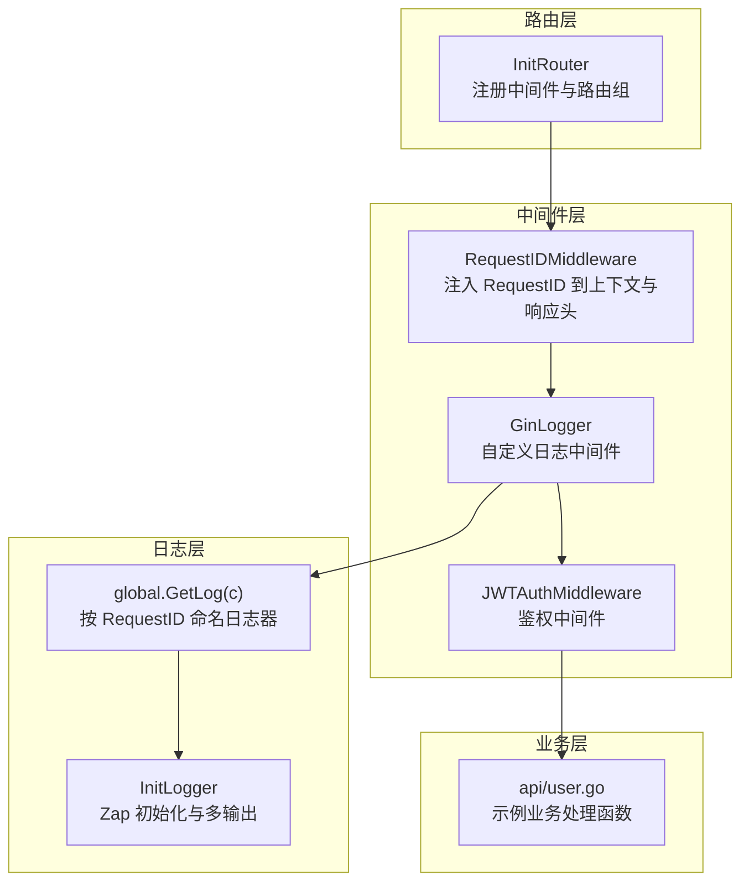
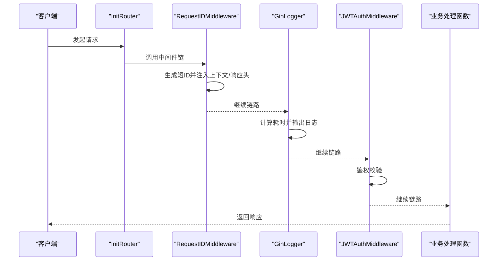
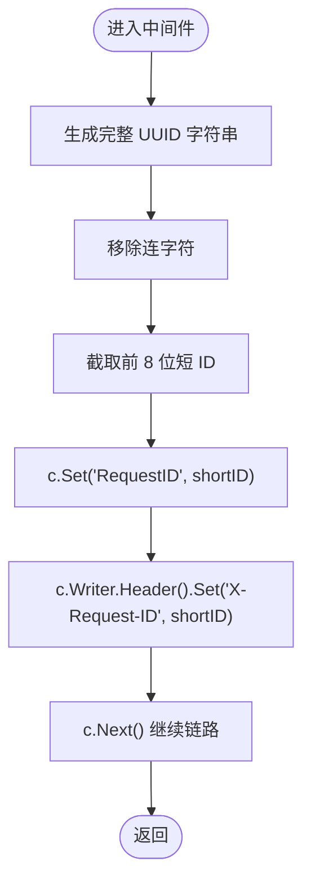
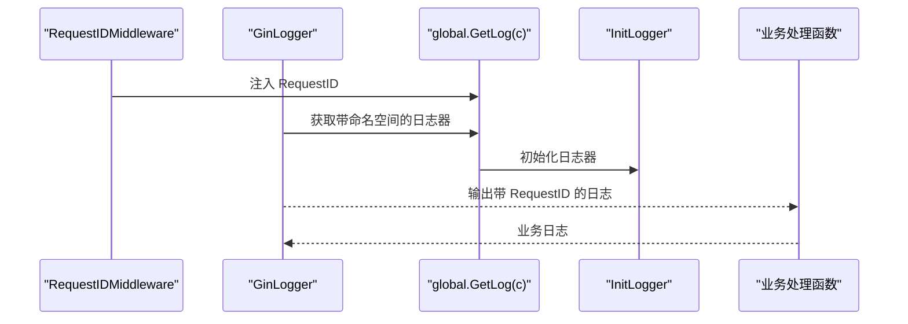
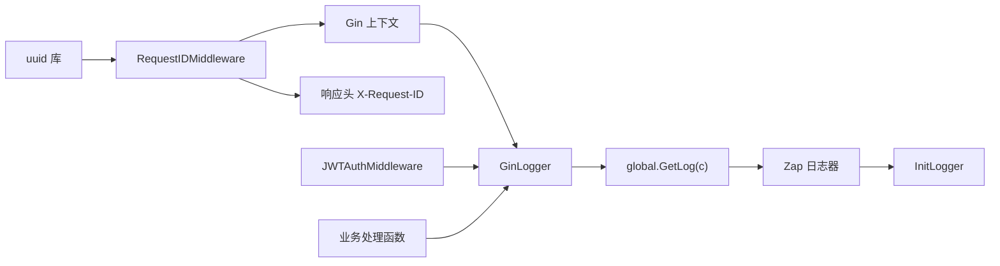

# 请求ID中间件

<cite>
**本文引用的文件**
- [middleware/request_id.go](file://middleware/request_id.go)
- [router/router.go](file://router/router.go)
- [middleware/jwt.go](file://middleware/jwt.go)
- [middleware/gin_logger.go](file://middleware/gin_logger.go)
- [global/global.go](file://global/global.go)
- [initialize/logger.go](file://initialize/logger.go)
- [api/user.go](file://api/user.go)
</cite>

## 目录
1. [简介](#简介)
2. [项目结构](#项目结构)
3. [核心组件](#核心组件)
4. [架构总览](#架构总览)
5. [详细组件分析](#详细组件分析)
6. [依赖关系分析](#依赖关系分析)
7. [性能考量](#性能考量)
8. [故障排查指南](#故障排查指南)
9. [结论](#结论)
10. [附录](#附录)

## 简介
本文件聚焦于 middleware/request_id.go 中的 RequestIDMiddleware 实现机制，系统性解析其如何利用 uuid 库生成全局唯一标识，如何通过字符串处理将 UUID 规范化为短 ID，以及如何通过 Gin 上下文与响应头实现跨服务链路追踪。文档还结合路由注册顺序说明该中间件在请求处理链中的执行时机（位于 JWTAuth 之前），并通过日志与业务示例展示其在日志关联、问题排查与性能监控中的价值，并给出 8 位短 ID 的权衡考量与验证方法。

## 项目结构
- 中间件层：包含请求 ID 注入、JWT 鉴权、自定义日志等中间件。
- 路由层：统一注册中间件与业务路由，明确中间件执行顺序。
- 日志层：全局日志初始化与按请求 ID 命名的日志器获取逻辑。
- 业务层：示例 API 展示如何在处理函数中使用 RequestID。



图表来源
- [router/router.go](file://router/router.go#L11-L30)
- [middleware/request_id.go](file://middleware/request_id.go#L10-L27)
- [middleware/gin_logger.go](file://middleware/gin_logger.go#L12-L60)
- [middleware/jwt.go](file://middleware/jwt.go#L40-L100)
- [global/global.go](file://global/global.go#L16-L31)
- [initialize/logger.go](file://initialize/logger.go#L69-L183)
- [api/user.go](file://api/user.go#L100-L170)

章节来源
- [router/router.go](file://router/router.go#L11-L30)
- [middleware/request_id.go](file://middleware/request_id.go#L10-L27)
- [middleware/gin_logger.go](file://middleware/gin_logger.go#L12-L60)
- [middleware/jwt.go](file://middleware/jwt.go#L40-L100)
- [global/global.go](file://global/global.go#L16-L31)
- [initialize/logger.go](file://initialize/logger.go#L69-L183)
- [api/user.go](file://api/user.go#L100-L170)

## 核心组件
- RequestIDMiddleware：生成短请求 ID，注入到 Gin 上下文与响应头，供后续中间件与业务函数使用。
- GinLogger：在处理完成后输出请求日志，使用全局日志器并按 RequestID 命名。
- global.GetLog(c)：从 Gin 上下文中提取 RequestID，动态命名日志器，实现日志关联。
- InitLogger：初始化 Zap 日志器，配置控制台与文件输出，支持彩色输出与日志轮转。
- JWTAuthMiddleware：鉴权中间件，位于 RequestID 之后，确保在鉴权前已有 RequestID 可用。

章节来源
- [middleware/request_id.go](file://middleware/request_id.go#L10-L27)
- [middleware/gin_logger.go](file://middleware/gin_logger.go#L12-L60)
- [global/global.go](file://global/global.go#L16-L31)
- [initialize/logger.go](file://initialize/logger.go#L69-L183)
- [middleware/jwt.go](file://middleware/jwt.go#L40-L100)

## 架构总览
RequestIDMiddleware 在路由注册阶段最先执行，确保后续所有中间件（包括 GinLogger 与 JWTAuth）都能获取到 RequestID。GinLogger 通过 global.GetLog(c) 获取带命名空间的日志器，从而在日志中体现同一请求的完整链路。JWTAuth 在鉴权通过后继续链路，业务处理函数也可从上下文中读取 RequestID 以实现日志与审计的一致性。



图表来源
- [router/router.go](file://router/router.go#L11-L30)
- [middleware/request_id.go](file://middleware/request_id.go#L10-L27)
- [middleware/gin_logger.go](file://middleware/gin_logger.go#L12-L60)
- [middleware/jwt.go](file://middleware/jwt.go#L40-L100)

## 详细组件分析

### RequestIDMiddleware 实现机制
- 生成全局唯一标识：使用 uuid 库生成完整 UUID 字符串。
- 规范化与截断：移除 UUID 中的连字符，截取前 8 位作为短 ID，兼顾可读性与唯一性。
- 注入上下文与响应头：
  - 通过 Gin 上下文键值对注入 RequestID，供后续中间件与处理函数使用。
  - 通过响应头写入 X-Request-ID，便于跨服务调用时进行链路追踪。
- 执行时机：在路由注册阶段最先挂载，确保在 JWTAuth 之前完成注入，使鉴权与业务处理均能使用 RequestID。



图表来源
- [middleware/request_id.go](file://middleware/request_id.go#L10-L27)

章节来源
- [middleware/request_id.go](file://middleware/request_id.go#L10-L27)

### 路由注册与执行顺序
- RequestIDMiddleware 在路由初始化时最先注册，保证后续中间件（GinLogger、JWTAuth）均可获取 RequestID。
- JWTAuthMiddleware 在鉴权组内挂载，位于 RequestID 之后，确保鉴权前已有 RequestID 可用。

```mermaid
sequenceDiagram
participant RT as "InitRouter"
participant RID as "RequestIDMiddleware"
participant GL as "GinLogger"
participant JWT as "JWTAuthMiddleware"
RT->>RID : 注册中间件
RT->>GL : 注册中间件
RT->>JWT : 在鉴权组内注册
Note over RID,GL,JWT : RequestID 先于 JWT 执行
```

图表来源
- [router/router.go](file://router/router.go#L11-L30)
- [middleware/jwt.go](file://middleware/jwt.go#L40-L100)

章节来源
- [router/router.go](file://router/router.go#L11-L30)
- [middleware/jwt.go](file://middleware/jwt.go#L40-L100)

### 日志关联与链路追踪
- GinLogger 通过 global.GetLog(c) 获取带 RequestID 的日志器，实现同一请求的所有日志在同一命名空间下输出，便于关联。
- InitLogger 初始化 Zap 日志器，支持控制台与文件双输出，彩色日志与日志轮转，满足生产环境需求。
- 业务处理函数可通过日志器输出带 RequestID 的日志，形成完整的链路记录。



图表来源
- [middleware/request_id.go](file://middleware/request_id.go#L10-L27)
- [middleware/gin_logger.go](file://middleware/gin_logger.go#L12-L60)
- [global/global.go](file://global/global.go#L16-L31)
- [initialize/logger.go](file://initialize/logger.go#L69-L183)
- [api/user.go](file://api/user.go#L100-L170)

章节来源
- [middleware/gin_logger.go](file://middleware/gin_logger.go#L12-L60)
- [global/global.go](file://global/global.go#L16-L31)
- [initialize/logger.go](file://initialize/logger.go#L69-L183)
- [api/user.go](file://api/user.go#L100-L170)

### 跨服务调用与响应头验证
- 响应头 X-Request-ID：RequestIDMiddleware 将短 ID 写入响应头，便于上游服务或监控系统识别与追踪。
- 验证方法：在客户端或下游服务发起请求时，可读取响应头 X-Request-ID，确保与上游请求的 RequestID 一致，从而建立跨服务链路。

章节来源
- [middleware/request_id.go](file://middleware/request_id.go#L10-L27)

### 8 位短 ID 的权衡考量
- 唯一性：UUID 本身具备全局唯一性，截断为 8 位后仍具有极高唯一概率，适合日常业务场景。
- 可读性：短 ID 更易阅读与分享，降低日志与调试成本。
- 冲突风险：在极端高并发或异常场景下，短 ID 存在碰撞风险；但结合 UUID 基础与短截断策略，碰撞概率极低，足以覆盖大多数业务需求。
- 替代方案：若业务对唯一性要求极高，可考虑保留更长位数或采用其他唯一策略，但需权衡日志可读性与存储/传输成本。

章节来源
- [middleware/request_id.go](file://middleware/request_id.go#L10-L27)

## 依赖关系分析
- RequestIDMiddleware 依赖 Gin 上下文与响应头写入能力，以及 uuid 库生成唯一标识。
- GinLogger 依赖 global.GetLog(c) 获取带 RequestID 的日志器，从而实现日志关联。
- global.GetLog(c) 依赖 Gin 上下文键值对 RequestID，以及 Zap 日志器的命名能力。
- InitLogger 提供日志器初始化与多输出配置，支撑全局日志体系。
- JWTAuthMiddleware 依赖 RequestID 已注入，确保鉴权日志与业务日志具有一致的请求标识。



图表来源
- [middleware/request_id.go](file://middleware/request_id.go#L10-L27)
- [middleware/gin_logger.go](file://middleware/gin_logger.go#L12-L60)
- [global/global.go](file://global/global.go#L16-L31)
- [initialize/logger.go](file://initialize/logger.go#L69-L183)
- [middleware/jwt.go](file://middleware/jwt.go#L40-L100)

章节来源
- [middleware/request_id.go](file://middleware/request_id.go#L10-L27)
- [middleware/gin_logger.go](file://middleware/gin_logger.go#L12-L60)
- [global/global.go](file://global/global.go#L16-L31)
- [initialize/logger.go](file://initialize/logger.go#L69-L183)
- [middleware/jwt.go](file://middleware/jwt.go#L40-L100)

## 性能考量
- 中间件开销：UUID 生成与字符串处理均为常量级开销，对整体性能影响可忽略。
- 日志输出：Zap 为高性能日志库，配合多输出与轮转，满足生产环境吞吐需求。
- 鉴权前置：RequestID 在 JWT 之前执行，避免鉴权失败时缺少请求标识的问题，减少无效日志与重试成本。

[本节为通用性能讨论，不直接分析具体文件]

## 故障排查指南
- 未看到 X-Request-ID 响应头：检查 RequestIDMiddleware 是否在路由注册阶段最先挂载，确认未被其他中间件覆盖或清空响应头。
- 日志中未出现 RequestID：确认 GinLogger 是否正确调用 global.GetLog(c)，并检查 InitLogger 是否已初始化。
- 鉴权失败但缺少 RequestID：确认 RequestIDMiddleware 在 JWTAuth 之前执行，避免鉴权中断导致上下文缺失。
- 业务函数无法获取 RequestID：检查业务处理函数是否正确从 Gin 上下文中读取 RequestID 键值。

章节来源
- [router/router.go](file://router/router.go#L11-L30)
- [middleware/request_id.go](file://middleware/request_id.go#L10-L27)
- [middleware/gin_logger.go](file://middleware/gin_logger.go#L12-L60)
- [global/global.go](file://global/global.go#L16-L31)
- [initialize/logger.go](file://initialize/logger.go#L69-L183)
- [middleware/jwt.go](file://middleware/jwt.go#L40-L100)

## 结论
RequestIDMiddleware 通过简单高效的 UUID 生成与短 ID 截断策略，实现了请求级别的全局唯一标识注入。其在路由注册阶段的优先执行，确保了后续中间件与业务处理函数均可获得一致的 RequestID，从而显著提升了日志关联、问题排查与性能监控的效率。结合响应头 X-Request-ID，该中间件为跨服务链路追踪提供了基础保障。8 位短 ID 在可读性与唯一性之间取得良好平衡，适用于大多数业务场景。

[本节为总结性内容，不直接分析具体文件]

## 附录
- 实际请求中 X-Request-ID 头的验证方法：
  - 使用任意 HTTP 客户端（如 curl、浏览器开发者工具、Postman）发起请求，查看响应头中是否存在 X-Request-ID。
  - 在下游服务或监控系统中，读取该响应头并与上游日志中的 RequestID 进行比对，确认链路一致性。
- 业务示例参考：
  - 示例业务处理函数展示了如何在处理流程中输出带 RequestID 的日志，便于验证中间件效果。

章节来源
- [middleware/request_id.go](file://middleware/request_id.go#L10-L27)
- [api/user.go](file://api/user.go#L100-L170)