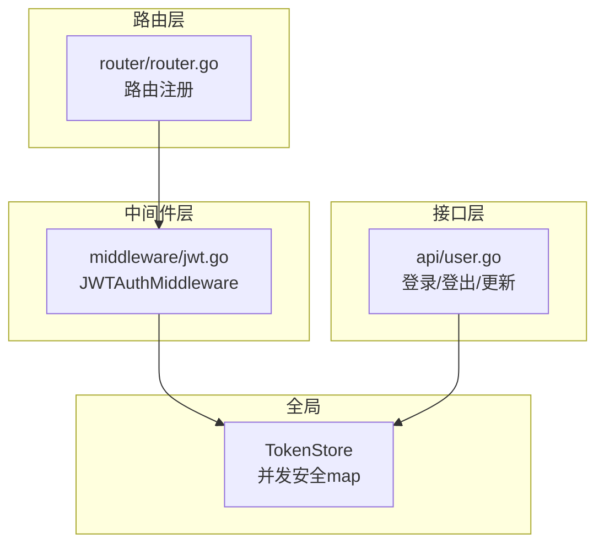
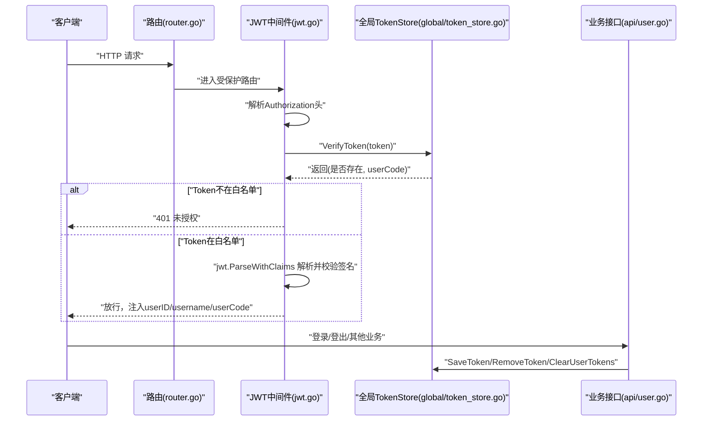
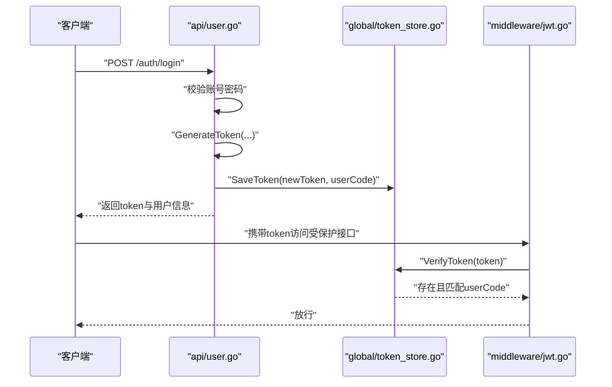
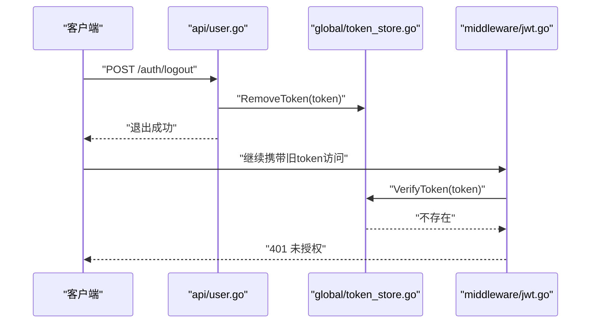
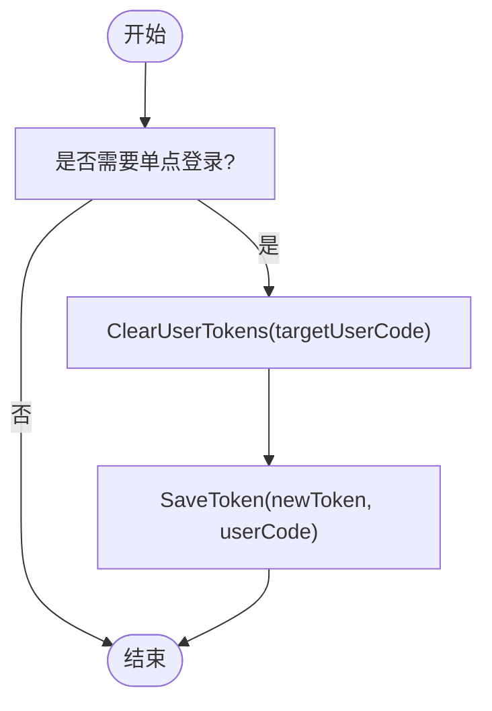
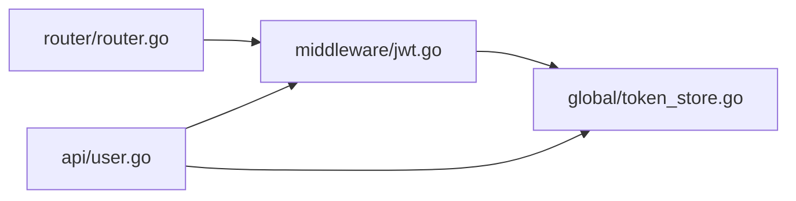

# Token黑名单管理

<cite>
**本文引用的文件列表**
- [global/token_store.go](file://global/token_store.go)
- [api/user.go](file://api/user.go)
- [middleware/jwt.go](file://middleware/jwt.go)
- [router/router.go](file://router/router.go)
</cite>

## 目录
1. [引言](#引言)
2. [项目结构](#项目结构)
3. [核心组件](#核心组件)
4. [架构总览](#架构总览)
5. [详细组件分析](#详细组件分析)
6. [依赖关系分析](#依赖关系分析)
7. [性能考量](#性能考量)
8. [故障排查指南](#故障排查指南)
9. [结论](#结论)
10. [附录](#附录)

## 引言
本文件围绕 TokenStore 结构体在 JWT 认证体系中的关键作用展开，系统阐述其通过嵌入读写锁实现并发安全的内存级 Token 白名单（有效 Token 集合）管理机制，以及如何借助 SaveToken、VerifyToken、RemoveToken、ClearUserTokens 四个核心函数支撑登录、鉴权、登出与单点登录等场景。同时，结合代码实际调用路径，解释该方案如何弥补 JWT 无法主动失效的缺陷，并讨论其在分布式环境下的局限性与可行的扩展思路。

## 项目结构
本项目采用典型的分层组织方式：
- global 层：全局共享状态与工具，包含 TokenStore 及其操作函数
- api 层：业务接口，负责登录、登出、用户信息维护等
- middleware 层：鉴权中间件，负责拦截请求并校验 Token
- router 层：路由注册，将中间件挂载到受保护的接口组

图表来源
- [global/token_store.go](file://global/token_store.go#L1-L50)
- [api/user.go](file://api/user.go#L100-L259)
- [middleware/jwt.go](file://middleware/jwt.go#L40-L99)
- [router/router.go](file://router/router.go#L33-L50)

章节来源
- [router/router.go](file://router/router.go#L33-L50)

## 核心组件
- TokenStore：全局并发安全的 Token 白名单，键为 Token 字符串，值为 UserCode，便于快速判定 Token 是否有效并回查用户标识。
- SaveToken：登录成功后将新 Token 写入白名单，使其进入“有效”集合。
- VerifyToken：鉴权中间件在每次请求时调用，判断 Token 是否存在于白名单，从而实现“主动失效”能力。
- RemoveToken：用户登出时删除对应 Token，使其立即失效。
- ClearUserTokens：按用户维度批量踢出其所有 Token，用于实现单点登录等高级场景。

章节来源
- [global/token_store.go](file://global/token_store.go#L1-L50)

## 架构总览
下图展示了从客户端发起请求到服务端完成鉴权的整体流程，重点标注了 TokenStore 的参与点与调用时机。

图表来源
- [middleware/jwt.go](file://middleware/jwt.go#L40-L99)
- [global/token_store.go](file://global/token_store.go#L16-L49)
- [api/user.go](file://api/user.go#L100-L259)
- [router/router.go](file://router/router.go#L33-L50)

## 详细组件分析

### TokenStore 并发安全设计
- 数据结构：以匿名结构体嵌入读写锁与 map[string]string 实现并发安全的 Token 白名单。
- 读多写少场景：读取使用 RLock/RUnlock，写入使用 Lock/Unlock，保证高并发下的读性能与一致性。
- 关键点：通过将 UserCode 作为值，可在 VerifyToken 成功时直接获得 userCode，减少二次查询成本。

章节来源
- [global/token_store.go](file://global/token_store.go#L1-L15)

### SaveToken：登录时写入白名单
- 触发时机：账号密码登录成功后，生成新 Token 并调用 SaveToken 写入白名单。
- 作用：使新 Token 立即进入“有效”集合，后续请求可通过 VerifyToken 校验。
- 注意：若需实现单点登录，应在 SaveToken 前先调用 ClearUserTokens 清除该用户的旧 Token。

章节来源
- [api/user.go](file://api/user.go#L215-L239)
- [global/token_store.go](file://global/token_store.go#L16-L21)

### VerifyToken：中间件鉴权核心
- 触发时机：JWTAuthMiddleware 在每次请求进入受保护路由时调用。
- 逻辑：先查白名单，不在则直接拒绝；在白名单后再进行 JWT 签名解析与有效性校验。
- 返回值：返回是否存在与 userCode，供中间件注入上下文使用。

章节来源
- [middleware/jwt.go](file://middleware/jwt.go#L40-L99)
- [global/token_store.go](file://global/token_store.go#L23-L30)

### RemoveToken：登出时移除 Token
- 触发时机：用户调用登出接口时，从白名单中删除对应 Token。
- 效果：该 Token 即刻失效，后续请求将被中间件拒绝。

章节来源
- [api/user.go](file://api/user.go#L245-L259)
- [global/token_store.go](file://global/token_store.go#L32-L37)

### ClearUserTokens：单点登录支持
- 触发时机：在 SaveToken 前调用，清空目标用户的所有 Token。
- 效果：实现“仅保留当前会话”的单点登录行为，避免多设备同时在线。

章节来源
- [global/token_store.go](file://global/token_store.go#L39-L49)

### 登录流程（含白名单写入）

图表来源
- [api/user.go](file://api/user.go#L175-L239)
- [global/token_store.go](file://global/token_store.go#L16-L21)
- [middleware/jwt.go](file://middleware/jwt.go#L40-L99)

### 登出流程（移除白名单）

图表来源
- [api/user.go](file://api/user.go#L245-L259)
- [global/token_store.go](file://global/token_store.go#L32-L37)
- [middleware/jwt.go](file://middleware/jwt.go#L40-L99)

### 单点登录流程（清空旧Token）

图表来源
- [global/token_store.go](file://global/token_store.go#L39-L49)
- [api/user.go](file://api/user.go#L215-L239)

## 依赖关系分析
- 路由层将 JWTAuthMiddleware 挂载到受保护的接口组，确保所有子接口均经过鉴权。
- 中间件依赖全局 TokenStore 的 VerifyToken 进行白名单校验。
- 业务层在登录成功后写入白名单，在登出时移除白名单，在需要单点登录时先清空再写入。

图表来源
- [router/router.go](file://router/router.go#L33-L50)
- [middleware/jwt.go](file://middleware/jwt.go#L40-L99)
- [global/token_store.go](file://global/token_store.go#L1-L50)
- [api/user.go](file://api/user.go#L100-L259)

章节来源
- [router/router.go](file://router/router.go#L33-L50)

## 性能考量
- 读写锁优化：读多写少的白名单场景下，RLock/RUnlock 提升并发读性能；写入路径加锁，避免竞争。
- 查询复杂度：map[string]string 的查找为平均 O(1)，满足高频鉴权需求。
- 内存占用：Token 数量与活跃用户数线性相关，建议关注 Token 过期策略与清理机制，避免无限增长。
- 并发安全：所有写操作均通过互斥锁保护，读操作通过读锁保护，整体并发安全可靠。

章节来源
- [global/token_store.go](file://global/token_store.go#L1-L15)

## 故障排查指南
- 401 未授权（白名单缺失）
  - 现象：中间件在 VerifyToken 返回不存在，直接拒绝请求。
  - 排查：确认登录流程是否调用了 SaveToken；确认登出流程是否调用了 RemoveToken；确认 ClearUserTokens 是否在单点登录场景下被正确调用。
- Token 已过期但仍可用
  - 现象：JWT 已过期但白名单仍存在。
  - 排查：中间件在 VerifyToken 之后还会进行 jwt.ParseWithClaims 校验，若签名解析失败或过期，会被拒绝。若仍能访问，检查是否绕过了中间件或白名单未生效。
- 登出无效
  - 现象：调用登出接口后，Token 仍可访问。
  - 排查：确认 RemoveToken 是否被调用；确认中间件是否正确执行 VerifyToken；确认客户端是否携带了正确的 Authorization 头。
- 单点登录未生效
  - 现象：新登录后旧 Token 仍可使用。
  - 排查：确认在 SaveToken 前调用了 ClearUserTokens；确认 ClearUserTokens 的目标 userCode 正确；确认白名单写入顺序。

章节来源
- [middleware/jwt.go](file://middleware/jwt.go#L40-L99)
- [api/user.go](file://api/user.go#L100-L259)
- [global/token_store.go](file://global/token_store.go#L16-L49)

## 结论
TokenStore 通过一个并发安全的内存白名单，将 JWT 的被动“到期失效”升级为主动“可撤销失效”，显著增强了系统的安全与灵活性。登录写入、中间件校验、登出移除、按用户批量清理构成了完整的生命周期闭环。在单机部署下，该方案简单高效；在分布式环境下，需考虑跨节点同步与一致性问题，推荐引入 Redis 等共享存储作为扩展方案。

## 附录

### 分布式扩展建议（基于现有代码结构）
- 使用 Redis 替代内存白名单
  - 优点：天然支持多实例共享，具备持久化与集群能力，适合水平扩展。
  - 方案要点：
    - 将 SaveToken 映射为 Redis set 或 hash 写入，键为 token，值为 userCode。
    - 将 VerifyToken 映射为 Redis get，命中即视为有效。
    - 将 RemoveToken 映射为 Redis del。
    - 将 ClearUserTokens 映射为遍历并删除该用户的所有 token。
  - 注意：Redis 写入需考虑网络延迟与失败重试；读写一致性可通过 TTL 与原子操作保障。
- 与现有代码的对接
  - 保持函数签名一致（SaveToken、VerifyToken、RemoveToken、ClearUserTokens），替换底层存储即可平滑迁移。
  - 对外接口与中间件逻辑无需改动，仅替换全局存储实现。