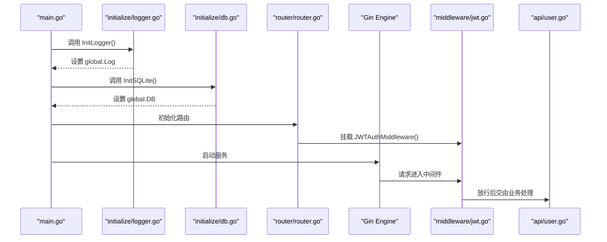
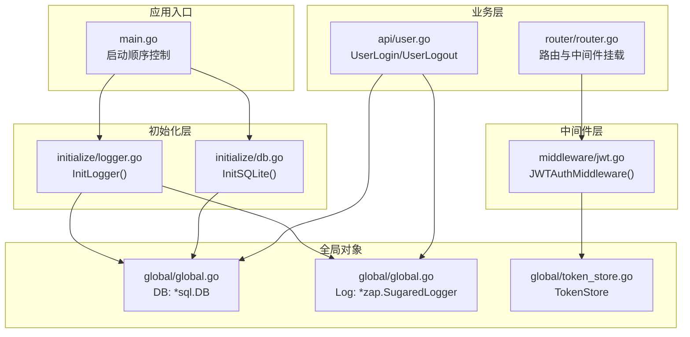
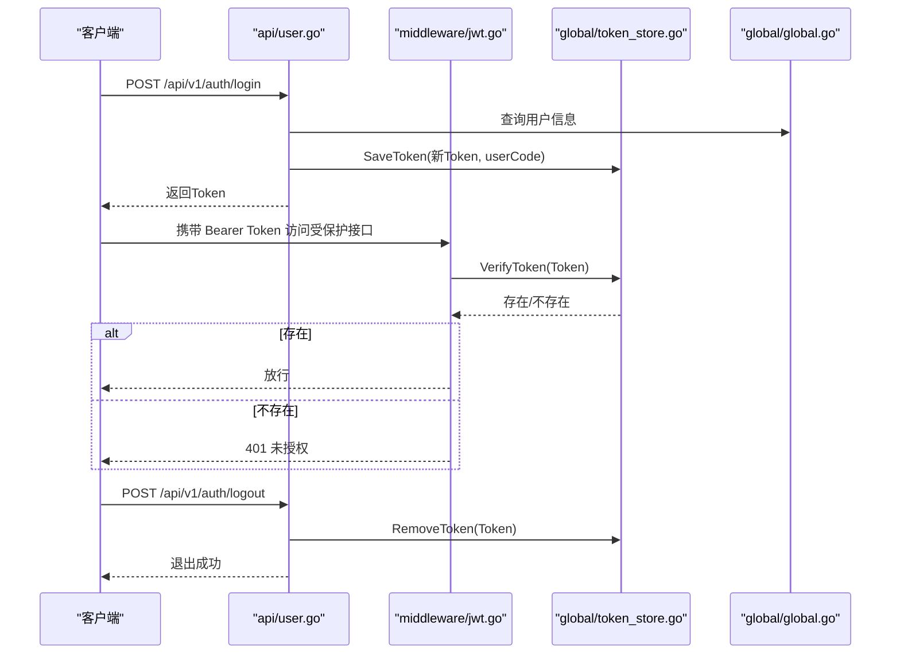
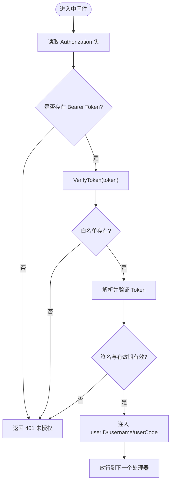
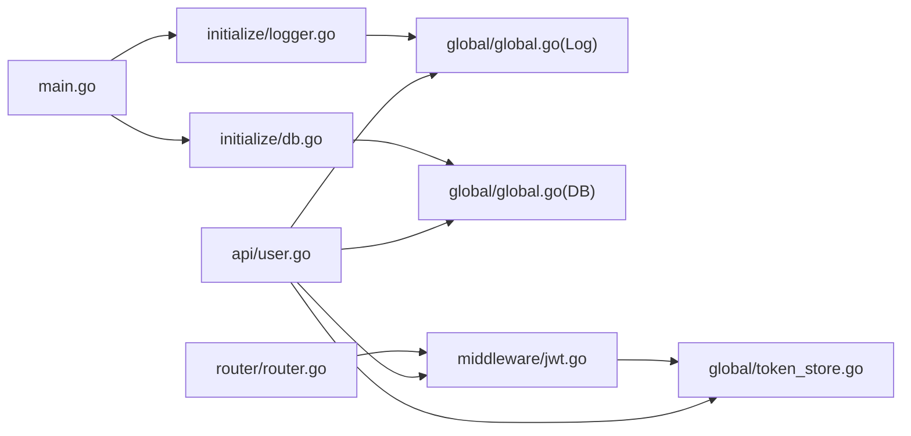

# 全局对象管理

<cite>
**本文引用的文件列表**
- [main.go](file://main.go)
- [global/global.go](file://global/global.go)
- [global/token_store.go](file://global/token_store.go)
- [initialize/db.go](file://initialize/db.go)
- [initialize/logger.go](file://initialize/logger.go)
- [middleware/jwt.go](file://middleware/jwt.go)
- [api/user.go](file://api/user.go)
- [router/router.go](file://router/router.go)
</cite>

## 目录
1. [简介](#简介)
2. [项目结构与初始化顺序](#项目结构与初始化顺序)
3. [核心全局对象](#核心全局对象)
4. [架构总览](#架构总览)
5. [组件详解](#组件详解)
6. [依赖关系分析](#依赖关系分析)
7. [性能与可用性考量](#性能与可用性考量)
8. [故障排查指南](#故障排查指南)
9. [结论](#结论)
10. [附录：引用与最佳实践](#附录引用与最佳实践)

## 简介
本文件围绕项目的全局状态管理机制展开，重点说明 global 包在跨组件通信中的核心作用。文档将详细解析以下要点：
- global/global.go 中定义的全局变量：*sql.DB 类型的 DB 用于数据库操作；*zap.SugaredLogger 类型的 Log 用于统一日志记录；以及它们在 main.go 中由初始化函数（InitSQLite、InitLogger）赋值的过程。
- global/token_store.go 中 TokenStore 结构体的实现：采用 sync.Map 作为底层存储，提供 SafeAdd/SafeDelete/SafeHas 三个线程安全的方法，用于维护已注销 Token 的黑名单，防止 Token 在有效期内被继续使用。
- JWT 认证中间件（middleware/jwt.go）在用户登出时如何调用 tokenStore.SafeAdd 将 Token 加入黑名单，并在后续请求认证时通过 tokenStore.SafeHas 检查 Token 状态，实现 Token 的主动失效机制。
- 基于内存的 Token 黑名单方案的优缺点及适用场景。
- 提供代码示例展示其他模块如何正确引用 global.DB 和 global.Log，强调避免循环依赖和确保初始化顺序的重要性。

## 项目结构与初始化顺序
为保证全局对象的正确使用，系统遵循严格的初始化顺序：
- 首先初始化日志系统，确保后续任何模块在使用 global.Log 时不会出现空指针。
- 然后初始化数据库连接，将 *sql.DB 赋值给 global.DB。
- 接着初始化路由，挂载中间件（包括 JWT 鉴权中间件）。
- 最后启动 Web 服务。

该顺序在主程序入口 main.go 中明确体现，且初始化模块分别位于 initialize/logger.go 与 initialize/db.go。

图表来源
- [main.go](file://main.go#L13-L31)
- [initialize/logger.go](file://initialize/logger.go#L160-L184)
- [initialize/db.go](file://initialize/db.go#L14-L89)
- [router/router.go](file://router/router.go#L11-L50)
- [middleware/jwt.go](file://middleware/jwt.go#L39-L99)
- [api/user.go](file://api/user.go#L242-L259)

章节来源
- [main.go](file://main.go#L13-L31)
- [initialize/logger.go](file://initialize/logger.go#L160-L184)
- [initialize/db.go](file://initialize/db.go#L14-L89)
- [router/router.go](file://router/router.go#L11-L50)

## 核心全局对象
global/global.go 定义了两个全局对象：
- DB：类型为 *sql.DB，用于数据库操作。
- Log：类型为 *zap.SugaredLogger，用于统一日志记录。
- GetLog(c)：提供带 RequestID 的 SugaredLogger，便于链路追踪与日志聚合。

初始化过程：
- 日志初始化：initialize/logger.go 中创建 zap.Logger 并赋值给 global.Log，同时将 Gin 的输出重定向到多路写入（控制台与文件）。
- 数据库初始化：initialize/db.go 中打开 SQLite 连接，设置 WAL、同步模式、外键等参数，并将 *sql.DB 赋值给 global.DB，随后执行建表与维护逻辑。

章节来源
- [global/global.go](file://global/global.go#L11-L31)
- [initialize/logger.go](file://initialize/logger.go#L160-L184)
- [initialize/db.go](file://initialize/db.go#L14-L89)

## 架构总览
下图展示了全局对象在系统中的角色与交互：

图表来源
- [main.go](file://main.go#L13-L31)
- [initialize/logger.go](file://initialize/logger.go#L160-L184)
- [initialize/db.go](file://initialize/db.go#L14-L89)
- [global/global.go](file://global/global.go#L11-L31)
- [global/token_store.go](file://global/token_store.go#L1-L49)
- [middleware/jwt.go](file://middleware/jwt.go#L39-L99)
- [router/router.go](file://router/router.go#L11-L50)
- [api/user.go](file://api/user.go#L100-L259)

## 组件详解

### 全局日志与数据库对象
- DB：由 initialize/db.go 初始化，设置连接池、WAL、外键等参数，随后执行建表与维护逻辑。业务模块通过 global.DB 直接进行数据库操作。
- Log：由 initialize/logger.go 初始化，创建彩色控制台与文件双通道日志，支持按请求生成带 RequestID 的 SugaredLogger，便于链路追踪。
- GetLog(c)：在中间件与业务层中统一使用，优先从上下文提取 RequestID，若不存在则回退到全局日志实例。

章节来源
- [initialize/db.go](file://initialize/db.go#L14-L89)
- [initialize/logger.go](file://initialize/logger.go#L160-L184)
- [global/global.go](file://global/global.go#L11-L31)

### Token 黑名单与主动失效
- TokenStore：以结构体形式导出，内部包含 sync.RWMutex 与 map[string]string，用于存储“有效 Token”与其对应的 userCode。
- 三个核心方法：
  - SaveToken(token, userCode)：登录成功后将新 Token 加入白名单。
  - VerifyToken(token)：JWT 中间件在放行前检查 Token 是否存在于白名单。
  - RemoveToken(token)：用户登出时将 Token 从白名单移除，实现主动失效。
- 登录流程：api/user.go 中 UserLogin 生成新 Token 后调用 SaveToken，将 token 与 userCode 绑定。
- 登出流程：api/user.go 中 UserLogout 从白名单移除当前 Token。
- 中间件校验：middleware/jwt.go 的 JWTAuthMiddleware 在每次请求时先检查 VerifyToken，若不在白名单则拒绝请求。

图表来源
- [api/user.go](file://api/user.go#L100-L259)
- [middleware/jwt.go](file://middleware/jwt.go#L39-L99)
- [global/token_store.go](file://global/token_store.go#L16-L36)
- [global/global.go](file://global/global.go#L11-L31)

章节来源
- [global/token_store.go](file://global/token_store.go#L1-L49)
- [middleware/jwt.go](file://middleware/jwt.go#L39-L99)
- [api/user.go](file://api/user.go#L100-L259)

### JWT 中间件与 Token 校验流程
- 从 Authorization 头解析 Bearer Token。
- 先调用 VerifyToken 检查 Token 是否在白名单，不在则直接返回 401。
- 若通过白名单检查，再解析并验证签名与有效期。
- 成功后将 userID、username、userCode 注入上下文，供后续业务使用。

图表来源
- [middleware/jwt.go](file://middleware/jwt.go#L39-L99)

章节来源
- [middleware/jwt.go](file://middleware/jwt.go#L39-L99)

### 登录与登出流程
- 登录：尝试 Token 自动登录（若存在有效白名单 Token），否则走账号密码登录。账号密码登录成功后生成新 Token 并 SaveToken。
- 登出：从白名单移除当前 Token，使其立即失效。

章节来源
- [api/user.go](file://api/user.go#L100-L259)

## 依赖关系分析
- 初始化依赖：main.go 严格控制初始化顺序，先日志后数据库，确保后续模块可安全使用 global.Log 与 global.DB。
- 中间件依赖：middleware/jwt.go 直接依赖 global/token_store.go 的 VerifyToken 与 global/global.go 的 GetLog。
- 业务依赖：api/user.go 依赖 global/global.go 的 DB、Log、SaveToken、RemoveToken，以及 middleware/jwt.go 的 GenerateToken。
- 路由依赖：router/router.go 挂载 JWTAuthMiddleware，形成认证链路。

图表来源
- [main.go](file://main.go#L13-L31)
- [initialize/logger.go](file://initialize/logger.go#L160-L184)
- [initialize/db.go](file://initialize/db.go#L14-L89)
- [global/global.go](file://global/global.go#L11-L31)
- [global/token_store.go](file://global/token_store.go#L1-L49)
- [middleware/jwt.go](file://middleware/jwt.go#L39-L99)
- [api/user.go](file://api/user.go#L100-L259)
- [router/router.go](file://router/router.go#L11-L50)

章节来源
- [main.go](file://main.go#L13-L31)
- [router/router.go](file://router/router.go#L11-L50)
- [middleware/jwt.go](file://middleware/jwt.go#L39-L99)
- [api/user.go](file://api/user.go#L100-L259)

## 性能与可用性考量
- Token 黑名单方案优点
  - 实现简单，主动失效即时生效，无需等待 Token 过期。
  - 适合中小规模、单实例部署或对高并发要求不极致的场景。
- Token 黑名单方案缺点
  - 内存占用随 Token 数量增长而增加，重启后丢失。
  - 不支持多实例共享，无法跨节点同步黑名单。
  - 对于大规模并发，建议结合 Redis 等外部缓存实现分布式黑名单。
- 日志与数据库
  - 日志采用多路输出（控制台+文件），彩色输出便于开发调试。
  - 数据库连接池参数已在初始化阶段设置，建议结合实际负载调整最大连接数与生命周期。

[本节为通用指导，不直接分析具体文件]

## 故障排查指南
- 401 未授权
  - 检查请求头 Authorization 是否为 Bearer Token 格式。
  - 确认中间件是否正确调用 VerifyToken，且当前 Token 是否存在于白名单。
- 登录后仍提示未授权
  - 确认登录成功后是否调用了 SaveToken 将新 Token 加入白名单。
  - 检查 JWTAuthMiddleware 是否挂载在对应路由组。
- 日志为空或未输出
  - 确认 InitLogger 是否在 InitSQLite 之前调用，且 global.Log 已赋值。
  - 检查 Gin 的 DefaultWriter 是否被正确重定向。
- 数据库连接失败
  - 检查 InitSQLite 是否成功打开数据库并 Ping 通过。
  - 确认 WAL、同步模式、外键等参数设置是否成功。

章节来源
- [middleware/jwt.go](file://middleware/jwt.go#L39-L99)
- [api/user.go](file://api/user.go#L100-L259)
- [initialize/logger.go](file://initialize/logger.go#L160-L184)
- [initialize/db.go](file://initialize/db.go#L14-L89)

## 结论
本项目通过 global 包集中管理 DB 与 Log，并以 TokenStore 实现基于内存的 Token 白名单机制，配合 JWTAuthMiddleware 实现了主动失效的认证流程。初始化顺序严格控制，确保各模块可安全使用全局对象。对于需要跨实例共享或更高并发的场景，建议引入外部缓存（如 Redis）实现分布式黑名单与会话管理。

[本节为总结性内容，不直接分析具体文件]

## 附录：引用与最佳实践
- 如何正确引用 global.DB 与 global.Log
  - 在业务模块中直接导入 global 包并使用 global.DB 与 global.Log。
  - 避免在初始化阶段互相依赖，确保 main.go 中先初始化日志，再初始化数据库。
  - 避免循环依赖：中间件依赖 global，业务依赖中间件与 global，但不要让业务反过来依赖中间件。
- 初始化顺序建议
  - main.go 中先调用 initialize.InitLogger()，再调用 initialize.InitSQLite()。
  - 路由初始化时再挂载 JWTAuthMiddleware。
- Token 管理最佳实践
  - 登录成功后调用 SaveToken，登出时调用 RemoveToken。
  - 对于多实例部署，考虑将 TokenStore 替换为 Redis 等分布式存储。
  - 合理设置 Token 过期时间与刷新策略，平衡安全性与用户体验。

章节来源
- [main.go](file://main.go#L13-L31)
- [global/global.go](file://global/global.go#L11-L31)
- [global/token_store.go](file://global/token_store.go#L16-L36)
- [middleware/jwt.go](file://middleware/jwt.go#L39-L99)
- [api/user.go](file://api/user.go#L100-L259)