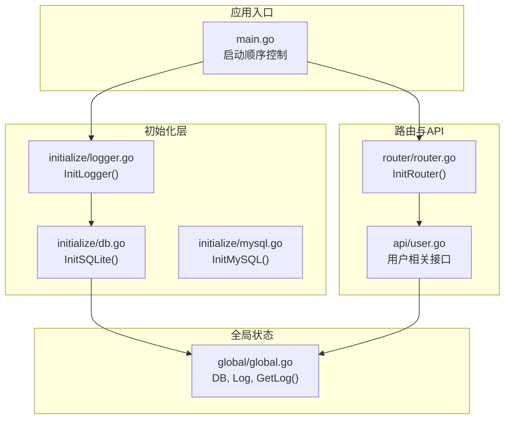
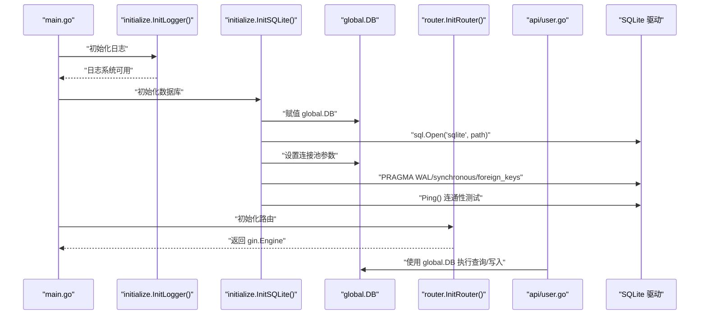
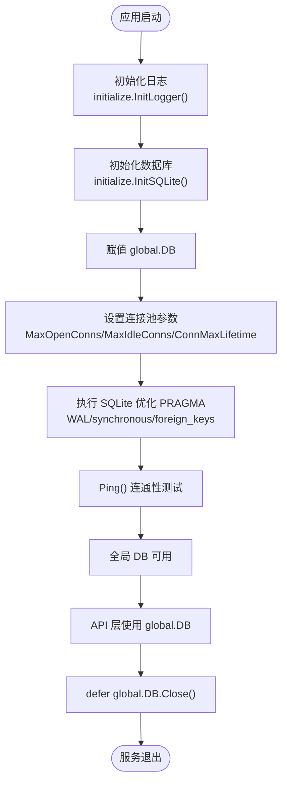
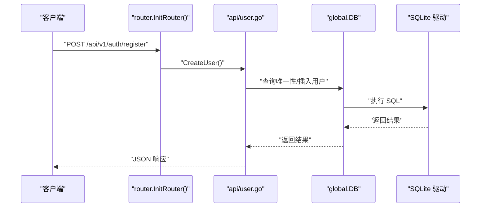
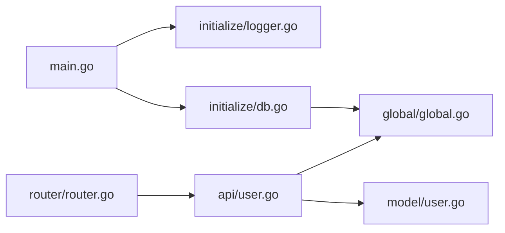

# 数据库连接管理

<cite>
**本文引用的文件列表**
- [global/global.go](file://global/global.go)
- [initialize/db.go](file://initialize/db.go)
- [initialize/mysql.go](file://initialize/mysql.go)
- [initialize/logger.go](file://initialize/logger.go)
- [main.go](file://main.go)
- [router/router.go](file://router/router.go)
- [api/user.go](file://api/user.go)
- [model/user.go](file://model/user.go)
</cite>

## 目录
1. [简介](#简介)
2. [项目结构](#项目结构)
3. [核心组件](#核心组件)
4. [架构总览](#架构总览)
5. [详细组件分析](#详细组件分析)
6. [依赖关系分析](#依赖关系分析)
7. [性能考量](#性能考量)
8. [故障排查指南](#故障排查指南)
9. [结论](#结论)

## 简介
本文件聚焦于项目中全局数据库连接变量 global.DB 的定义与初始化流程，解释其在 global/global.go 中以 *sql.DB 类型声明为全局单例，如何在 main.go 中通过 initialize/db.go 的 InitSQLite 函数完成实例化，并由 initialize/mysql.go 提供 MySQL 驱动配置与连接池设置的占位实现。同时阐述该全局 DB 实例在整个项目中的作用：在 model 层进行 CRUD 操作、在 API 层执行业务逻辑时的数据访问支撑；并给出在 api/user.go 等模块中安全使用 global.DB 的示例路径与注意事项，强调初始化顺序的重要性（main.go 中初始化完成后方可使用）。最后分析使用全局 DB 连接的优缺点与连接池管理策略。

## 项目结构
项目采用按功能模块划分的组织方式：
- global：存放全局变量与工具方法（含全局 DB 单例）
- initialize：存放初始化逻辑（日志、数据库、MySQL 占位）
- api：HTTP 接口层（用户、题库、分享等）
- model：数据模型与请求/响应结构
- router：路由注册与中间件装配
- main：应用入口，负责初始化顺序与服务启动

图表来源
- [main.go](file://main.go#L13-L31)
- [initialize/logger.go](file://initialize/logger.go#L169-L183)
- [initialize/db.go](file://initialize/db.go#L14-L89)
- [global/global.go](file://global/global.go#L11-L31)
- [router/router.go](file://router/router.go#L11-L109)
- [api/user.go](file://api/user.go#L35-L95)

章节来源
- [main.go](file://main.go#L13-L31)
- [initialize/logger.go](file://initialize/logger.go#L169-L183)
- [initialize/db.go](file://initialize/db.go#L14-L89)
- [global/global.go](file://global/global.go#L11-L31)
- [router/router.go](file://router/router.go#L11-L109)
- [api/user.go](file://api/user.go#L35-L95)

## 核心组件
- 全局数据库连接：global.DB 是 *sql.DB 类型的全局单例，贯穿 API 与模型层使用。
- 初始化流程：main.go 中按顺序调用 initialize.InitLogger()、initialize.InitSQLite()，并在 main 结束时 defer global.DB.Close()。
- 驱动与连接池：initialize/db.go 使用 modernc.org/sqlite 驱动，设置 WAL、synchronous、foreign_keys 等 SQLite 优化参数，并配置连接池最大空闲、最大打开数与生命周期。
- 日志系统：initialize/logger.go 初始化 zap 日志，配合 global.GetLog(c) 支持 RequestID 命名日志输出。
- API 使用：api/user.go 展示了在注册、登录、修改密码等场景下直接使用 global.DB 执行查询与写入。

章节来源
- [global/global.go](file://global/global.go#L11-L31)
- [initialize/db.go](file://initialize/db.go#L14-L89)
- [initialize/logger.go](file://initialize/logger.go#L169-L183)
- [api/user.go](file://api/user.go#L35-L95)
- [main.go](file://main.go#L13-L31)

## 架构总览
下面的序列图展示了从应用启动到首次使用全局 DB 的关键调用链路，以及 API 层如何在业务逻辑中安全地使用 global.DB。

图表来源
- [main.go](file://main.go#L13-L31)
- [initialize/db.go](file://initialize/db.go#L14-L89)
- [router/router.go](file://router/router.go#L11-L109)
- [api/user.go](file://api/user.go#L35-L95)

## 详细组件分析

### global.DB 的定义与初始化流程
- 定义位置：global/global.go 中声明 var DB *sql.DB，作为全局单例。
- 初始化入口：main.go 的 main() 函数中，先初始化日志，再调用 initialize.InitSQLite() 完成 global.DB 的赋值与连接池配置。
- 关闭时机：main() 中 defer global.DB.Close()，确保服务退出时释放连接。

图表来源
- [main.go](file://main.go#L13-L31)
- [initialize/db.go](file://initialize/db.go#L14-L89)
- [global/global.go](file://global/global.go#L11-L14)

章节来源
- [global/global.go](file://global/global.go#L11-L14)
- [initialize/db.go](file://initialize/db.go#L14-L89)
- [main.go](file://main.go#L13-L31)

### 初始化顺序与安全性
- 初始化顺序要求：必须先调用 initialize.InitLogger()，再调用 initialize.InitSQLite()，最后初始化路由与启动服务。
- 使用前提：只有在 main() 中初始化完成之后，API 层才可安全使用 global.DB；在 main() 之前使用会导致 panic 或未知行为。
- 关闭策略：main() 中 defer global.DB.Close()，避免资源泄漏。

章节来源
- [main.go](file://main.go#L13-L31)
- [initialize/logger.go](file://initialize/logger.go#L169-L183)
- [initialize/db.go](file://initialize/db.go#L14-L89)

### 初始化细节：SQLite 驱动与连接池
- 驱动引入：initialize/db.go 引入 modernc.org/sqlite 驱动，使用 sql.Open("sqlite", path) 打开数据库。
- SQLite 优化：
  - 开启 WAL 模式以提升并发读写性能
  - 设置 synchronous=FULL 保证数据安全
  - 启用 foreign_keys=ON 以启用外键约束
- 连接池配置：
  - 最大空闲连接：5
  - 最大打开连接：100
  - 连接最大生命周期：1 小时
- 健康检查：InitSQLite() 中执行 Ping()，失败则终止进程，确保服务启动前连接有效。
- 表结构初始化：InitSQLite() 内部调用 initSQLiteTables() 与 maintainingDatabaseTables()，完成建表与结构维护。

章节来源
- [initialize/db.go](file://initialize/db.go#L14-L89)
- [initialize/db.go](file://initialize/db.go#L154-L379)

### MySQL 驱动配置与占位实现
- initialize/mysql.go 提供 InitMySQL() 占位实现，注释中展示了如何基于配置构建 DSN 并设置连接池参数，最终将连接赋值给 global.DB。
- 当前主流程使用 SQLite，MySQL 初始化逻辑可作为扩展参考。

章节来源
- [initialize/mysql.go](file://initialize/mysql.go#L1-L33)

### 日志系统与全局日志封装
- initialize/logger.go 初始化 zap 日志，支持彩色控制台输出与滚动日志文件。
- global/global.go 提供 GetLog(c) 方法，结合 Gin 的 RequestID 中间件，为每次请求生成带 RequestID 的命名日志上下文，便于追踪。

章节来源
- [initialize/logger.go](file://initialize/logger.go#L169-L183)
- [global/global.go](file://global/global.go#L16-L31)

### API 层使用 global.DB 的实践
- 注册用户：api/user.go 中 CreateUser() 通过 global.DB 执行插入与查询唯一性校验。
- 登录流程：UserLogin() 分支处理 Token 自动登录与账号密码登录，均通过 global.DB 查询用户信息。
- 修改密码：UpdateUser() 中对旧密码校验与新密码更新均使用 global.DB。
- 以上示例均在 main() 初始化完成后使用 global.DB，确保线程安全与连接可用。

图表来源
- [router/router.go](file://router/router.go#L33-L41)
- [api/user.go](file://api/user.go#L35-L95)
- [global/global.go](file://global/global.go#L11-L14)

章节来源
- [api/user.go](file://api/user.go#L35-L95)
- [router/router.go](file://router/router.go#L33-L41)
- [global/global.go](file://global/global.go#L11-L14)

## 依赖关系分析
- main.go 依赖 initialize/logger.go 与 initialize/db.go，负责初始化顺序与服务启动。
- global/global.go 提供 DB 与日志封装。
- router/router.go 依赖 api 包，形成 HTTP 请求到业务处理的链路。
- api/user.go 直接依赖 global/global.go 与 model/user.go，执行数据库操作。
- initialize/db.go 依赖 global/global.go 与 sqlite 驱动，负责 DB 初始化与连接池配置。

图表来源
- [main.go](file://main.go#L13-L31)
- [initialize/db.go](file://initialize/db.go#L14-L89)
- [global/global.go](file://global/global.go#L11-L31)
- [router/router.go](file://router/router.go#L11-L109)
- [api/user.go](file://api/user.go#L1-L30)
- [model/user.go](file://model/user.go#L1-L35)

章节来源
- [main.go](file://main.go#L13-L31)
- [initialize/db.go](file://initialize/db.go#L14-L89)
- [global/global.go](file://global/global.go#L11-L31)
- [router/router.go](file://router/router.go#L11-L109)
- [api/user.go](file://api/user.go#L1-L30)
- [model/user.go](file://model/user.go#L1-L35)

## 性能考量
- 连接池参数：
  - MaxOpenConns=100：限制最大并发连接数，避免过度占用资源。
  - MaxIdleConns=5：维持少量空闲连接，降低频繁创建销毁成本。
  - ConnMaxLifetime=1h：定期回收连接，缓解长时间连接导致的资源泄露或状态异常。
- SQLite 优化：
  - WAL 模式：显著提升并发读写能力。
  - synchronous=FULL：在性能与可靠性之间取得平衡。
  - foreign_keys=ON：保障数据一致性。
- 建议：
  - 在高并发场景下，结合业务峰值评估 MaxOpenConns 与 MaxIdleConns。
  - 定期监控数据库文件大小与磁盘 IO，必要时调整 WAL 与同步策略。
  - 对热点查询建立合适索引，减少锁竞争。

章节来源
- [initialize/db.go](file://initialize/db.go#L66-L71)
- [initialize/db.go](file://initialize/db.go#L39-L65)

## 故障排查指南
- 初始化失败：
  - 若 InitSQLite() 打开数据库或 Ping() 失败，会直接终止进程。检查数据库目录权限、路径与驱动是否正确引入。
- 连接池问题：
  - 若出现“连接过多”或“连接超时”，检查 MaxOpenConns 与 ConnMaxLifetime 是否合理，确认是否存在未关闭的事务或长连接。
- 日志定位：
  - 使用 global.GetLog(c) 输出带 RequestID 的日志，结合 initialize/logger.go 的彩色输出快速定位问题。
- API 使用错误：
  - 在 main() 初始化完成前使用 global.DB 会导致 panic。确保调用链遵循 main() 中的初始化顺序。

章节来源
- [initialize/db.go](file://initialize/db.go#L32-L89)
- [initialize/logger.go](file://initialize/logger.go#L169-L183)
- [main.go](file://main.go#L13-L31)

## 结论
本项目通过 global/global.go 定义全局 *sql.DB 单例，借助 main.go 的严格初始化顺序与 initialize/db.go 的 SQLite 驱动与连接池配置，实现了稳定、高效的数据库访问基础。API 层（如 api/user.go）直接使用 global.DB 执行业务逻辑，简化了依赖传递，提升了开发效率。但需注意初始化顺序与潜在的紧耦合风险；在高并发场景下，应结合业务特征调整连接池参数与 SQLite 优化策略，确保系统稳定性与性能表现。