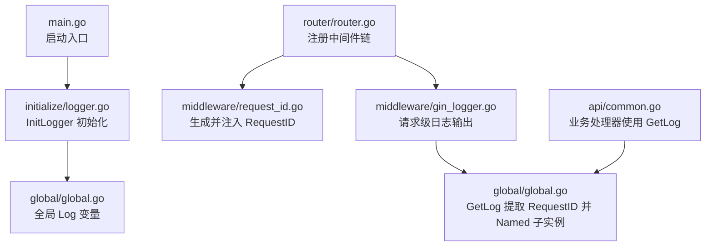
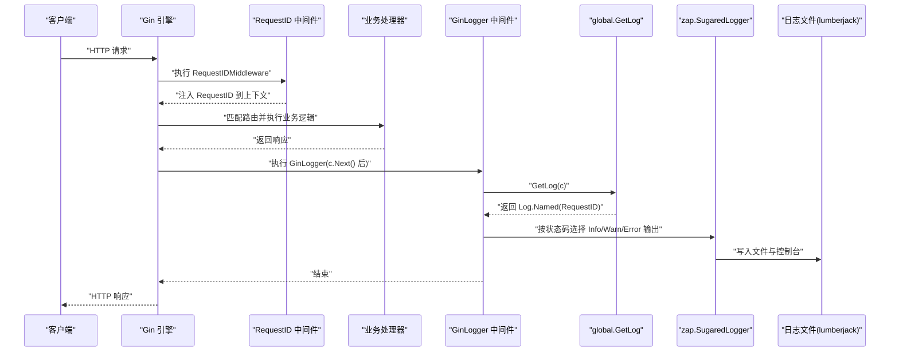
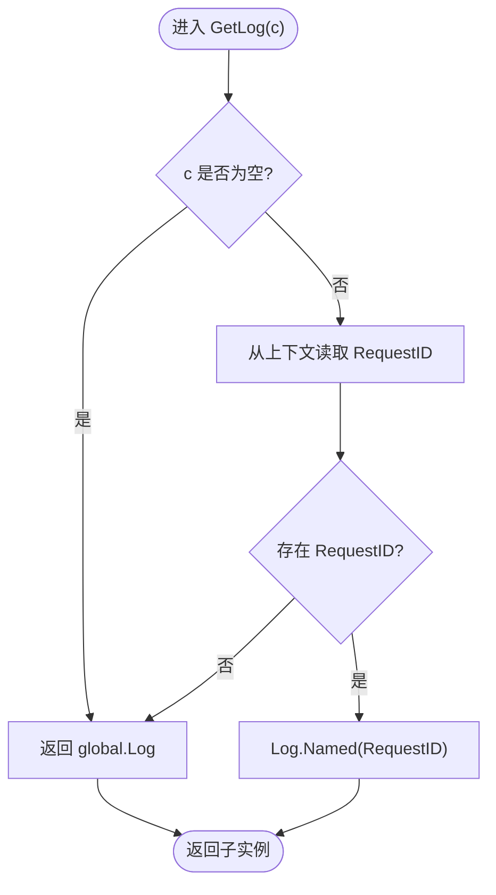
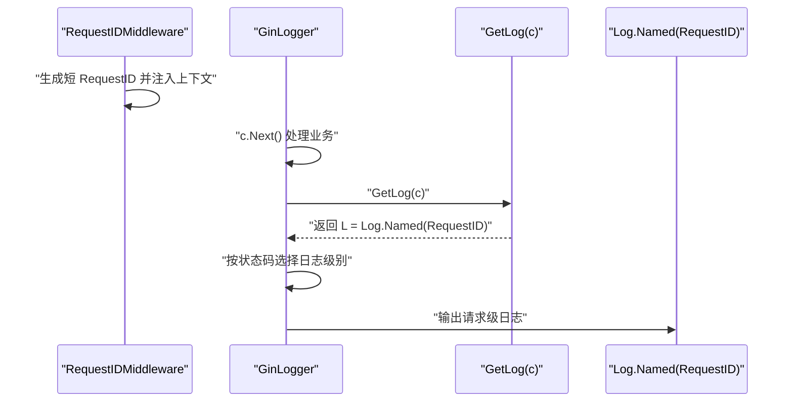
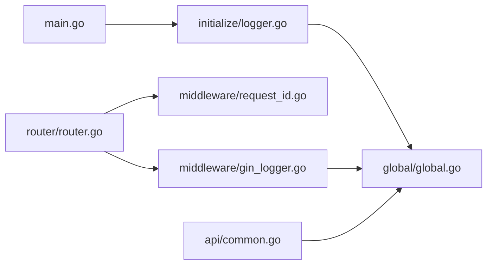

# 日志实例管理

<cite>
**本文引用的文件**
- [main.go](file://main.go)
- [global/global.go](file://global/global.go)
- [initialize/logger.go](file://initialize/logger.go)
- [middleware/gin_logger.go](file://middleware/gin_logger.go)
- [middleware/request_id.go](file://middleware/request_id.go)
- [router/router.go](file://router/router.go)
- [api/common.go](file://api/common.go)
</cite>

## 目录
1. [简介](#简介)
2. [项目结构](#项目结构)
3. [核心组件](#核心组件)
4. [架构总览](#架构总览)
5. [详细组件分析](#详细组件分析)
6. [依赖关系分析](#依赖关系分析)
7. [性能考量](#性能考量)
8. [故障排查指南](#故障排查指南)
9. [结论](#结论)

## 简介
本文件围绕全局日志变量 global.Log 的设计与使用机制展开，系统性阐述以下要点：
- global.Log 在 global/global.go 中以 *zap.SugaredLogger 类型声明，并在 initialize/logger.go 中通过 InitLogger 完成初始化，包括输出格式、级别、文件滚动与 Gin 输出重定向。
- GetLog(c *gin.Context) 函数如何从 Gin 上下文提取 RequestID，并使用 Named 方法创建带请求标识的日志子实例，从而实现每条日志具备可追踪性。
- 中间件链中 GinLogger 的调用流程，以及 RequestIDMiddleware 如何在链首注入 RequestID，保证 GetLog 能正确提取并命名日志实例。
- 实际日志输出示例（按场景分类），展示不同级别与格式的输出形态。
- 线程安全、性能开销与高并发下的最佳实践。

## 项目结构
日志系统由“入口初始化”“全局变量”“中间件链”“业务层使用”四部分协同组成：
- 入口初始化：main.go 调用 initialize.InitLogger 完成日志器构建与全局注册。
- 全局变量：global/global.go 提供全局日志变量与 GetLog 辅助函数。
- 中间件链：router/router.go 注册 RequestIDMiddleware 与 GinLogger，前者生成并注入 RequestID，后者在请求生命周期末尾输出请求级日志并使用 GetLog。
- 业务层使用：api/common.go 等业务处理器通过 GetLog(c) 获取带 RequestID 的 SugaredLogger，进行 Info/Warn/Error 等分级日志记录。

图表来源
- [main.go](file://main.go#L1-L32)
- [initialize/logger.go](file://initialize/logger.go#L69-L183)
- [global/global.go](file://global/global.go#L11-L31)
- [router/router.go](file://router/router.go#L11-L30)
- [middleware/request_id.go](file://middleware/request_id.go#L10-L27)
- [middleware/gin_logger.go](file://middleware/gin_logger.go#L11-L60)
- [api/common.go](file://api/common.go#L80-L174)

章节来源
- [main.go](file://main.go#L1-L32)
- [router/router.go](file://router/router.go#L11-L30)

## 核心组件
- 全局日志变量
  - 类型：*zap.SugaredLogger
  - 位置：global/global.go
  - 作用：作为应用级日志入口，所有业务与中间件通过 GetLog 获取带上下文标识的子实例。
- GetLog(c *gin.Context)
  - 逻辑：若 c 为空或上下文无 RequestID，则返回全局 Log；否则使用 Named(RequestID) 返回子实例，使日志中携带请求标识，便于跨模块串联。
- 初始化流程
  - initialize/logger.go
    - 构建文件与控制台双通道编码器，分别负责纯文本文件与带颜色控制台输出。
    - 使用 lumberjack 实现日志滚动（大小、保留份数、保留天数、压缩）。
    - 将 Gin 默认输出重定向到多写入器（同时输出到控制台与文件），保证请求日志与业务日志风格一致。
    - 设置原子级别，默认 Info。
- 中间件链
  - RequestIDMiddleware：在链首生成短请求 ID 并注入上下文，同时设置响应头 X-Request-ID。
  - GinLogger：在请求处理完成后计算耗时、状态码等，按状态码选择日志级别，调用 GetLog 获取带 RequestID 的日志实例并输出。

章节来源
- [global/global.go](file://global/global.go#L11-L31)
- [initialize/logger.go](file://initialize/logger.go#L69-L183)
- [middleware/request_id.go](file://middleware/request_id.go#L10-L27)
- [middleware/gin_logger.go](file://middleware/gin_logger.go#L11-L60)
- [router/router.go](file://router/router.go#L11-L30)

## 架构总览
下面的序列图展示了从请求进入至日志输出的关键调用链，体现 RequestID 注入、日志命名与请求级日志输出的协作关系。

图表来源
- [router/router.go](file://router/router.go#L11-L30)
- [middleware/request_id.go](file://middleware/request_id.go#L10-L27)
- [middleware/gin_logger.go](file://middleware/gin_logger.go#L11-L60)
- [global/global.go](file://global/global.go#L16-L31)
- [initialize/logger.go](file://initialize/logger.go#L169-L183)

## 详细组件分析

### 全局日志变量与初始化
- 初始化要点
  - 编码器配置：分别定义文件与控制台编码器，统一时间、级别、名称、调用者等键名与格式。
  - 彩色控制台：通过自定义 Core 在 Write 阶段对消息内容加色，避免在名称或字段上加色导致格式错乱。
  - 多路输出：使用 tee 组合控制台与文件 Core，同时输出到 stdout 与 lumberjack 文件钩子。
  - Gin 输出重定向：将 gin.DefaultWriter 与 gin.DefaultErrorWriter 指向多写入器，使框架内置日志与业务日志风格一致。
  - 原子级别：默认 Info，可在运行时动态调整。
- 关键行为
  - 构造完成后，将 SugaredLogger 赋值给 global.Log，供全局使用。
  - 启动时输出若干测试日志，验证彩色输出与文件写入正常。

章节来源
- [initialize/logger.go](file://initialize/logger.go#L69-L183)

### GetLog(c *gin.Context) 的实现逻辑
- 输入为空或无 RequestID：直接返回全局 Log。
- 存在 RequestID：使用 Named(RequestID) 返回子实例，使日志中包含请求标识，便于跨模块串联与检索。
- 设计要点
  - 使用 Named 而非 With，确保请求标识出现在日志中间位置，且不自行添加方括号，交由初始化阶段统一格式化。
  - 该函数本身不涉及 IO，仅返回 SugaredLogger 指针，线程安全由 zap 内部保证。

图表来源
- [global/global.go](file://global/global.go#L16-L31)

章节来源
- [global/global.go](file://global/global.go#L16-L31)

### 中间件链：RequestIDMiddleware 与 GinLogger
- RequestIDMiddleware
  - 生成短请求 ID（截取 UUID 前 8 位并去横杠），注入上下文并设置响应头 X-Request-ID，确保下游可观测。
- GinLogger
  - 在 c.Next() 后计算耗时、状态码、客户端 IP、方法与路径，组装消息模板。
  - 根据状态码选择 Info/Warn/Error 级别，调用 GetLog(c) 获取带 RequestID 的日志实例并输出。
  - 由于 Gin 输出已重定向到多写入器，请求日志与业务日志风格一致。

图表来源
- [middleware/request_id.go](file://middleware/request_id.go#L10-L27)
- [middleware/gin_logger.go](file://middleware/gin_logger.go#L11-L60)
- [global/global.go](file://global/global.go#L16-L31)

章节来源
- [middleware/request_id.go](file://middleware/request_id.go#L10-L27)
- [middleware/gin_logger.go](file://middleware/gin_logger.go#L11-L60)
- [router/router.go](file://router/router.go#L11-L30)

### 业务层使用示例
- 错误场景：查询失败
  - 使用 global.GetLog(c).Errorf(...) 记录错误原因与上下文信息，便于定位问题。
- 权限拒绝场景：越权操作
  - 使用 global.GetLog(c).Warnf(...) 记录拒绝原因与用户标识，便于审计与风控。
- 成功场景：上传图片成功
  - 使用 global.GetLog(c).Infof(...) 记录关键操作结果，便于运营与监控。

章节来源
- [api/common.go](file://api/common.go#L80-L174)

## 依赖关系分析
- 模块耦合
  - global/global.go 仅依赖 zap 与 gin，职责单一，耦合度低。
  - initialize/logger.go 依赖 zap、zapcore、lumberjack 与 gin，承担初始化与配置职责。
  - middleware/gin_logger.go 依赖 global.GetLog 与 gin，负责请求级日志输出。
  - middleware/request_id.go 依赖 gin 与 uuid，负责请求标识生成与注入。
  - router/router.go 依赖 middleware 与 gin，负责中间件装配顺序。
  - api/common.go 依赖 global.GetLog 与 gin，负责业务日志输出。
- 关键依赖链
  - main.go -> initialize/logger.go -> global/global.go
  - router/router.go -> middleware/request_id.go -> middleware/gin_logger.go -> global/global.go
  - api/common.go -> global/global.go

图表来源
- [main.go](file://main.go#L1-L32)
- [initialize/logger.go](file://initialize/logger.go#L69-L183)
- [global/global.go](file://global/global.go#L11-L31)
- [router/router.go](file://router/router.go#L11-L30)
- [middleware/request_id.go](file://middleware/request_id.go#L10-L27)
- [middleware/gin_logger.go](file://middleware/gin_logger.go#L11-L60)
- [api/common.go](file://api/common.go#L80-L174)

章节来源
- [main.go](file://main.go#L1-L32)
- [router/router.go](file://router/router.go#L11-L30)

## 性能考量
- 线程安全
  - zap.SugaredLogger 是并发安全的，GetLog 仅返回指针，不引入额外锁竞争。
- I/O 开销
  - 控制台输出：彩色处理在 Write 阶段进行，属于轻量字符串拼接，对性能影响可忽略。
  - 文件输出：lumberjack 滚动策略（大小、保留份数、保留天数、压缩）在高并发下仍保持稳定。
- 级别控制
  - 通过原子级别动态调整，可在生产中临时降级为 Warn/错误级别以降低 I/O 压力。
- Gin 输出重定向
  - 将 gin.DefaultWriter 与 gin.DefaultErrorWriter 指向多写入器，避免重复 I/O，统一输出风格。

[本节为通用性能讨论，不直接分析具体文件，故无章节来源]

## 故障排查指南
- 日志未输出或格式异常
  - 检查 initialize/logger.go 中 InitLogger 是否在 main.go 最早阶段调用。
  - 确认 gin.DefaultWriter 已被重定向到多写入器。
- 请求级日志缺少 RequestID
  - 检查 router/router.go 中是否先注册 RequestIDMiddleware，再注册 GinLogger。
  - 确认中间件顺序未被覆盖或移除。
- 请求级日志级别不正确
  - 检查 middleware/gin_logger.go 中按状态码选择级别的逻辑是否符合预期。
- 文件未生成或滚动异常
  - 检查 initialize/logger.go 中 lumberjack 配置（目录、大小、保留份数、保留天数、压缩）。
- 业务日志未带 RequestID
  - 确认业务层调用 global.GetLog(c) 时传入了有效的 gin.Context。
  - 检查上下文中是否存在 "RequestID" 键。

章节来源
- [initialize/logger.go](file://initialize/logger.go#L69-L183)
- [router/router.go](file://router/router.go#L11-L30)
- [middleware/gin_logger.go](file://middleware/gin_logger.go#L11-L60)
- [global/global.go](file://global/global.go#L16-L31)

## 结论
该日志系统通过“入口初始化 + 全局变量 + 中间件链 + 业务层使用”的分层设计，实现了：
- 统一的彩色控制台输出与纯文本文件输出；
- 基于 RequestID 的可追踪日志子实例；
- 请求级日志与业务日志风格一致；
- 在高并发环境下具备良好的线程安全与性能表现。
建议在生产环境中：
- 将默认级别调整为 Info 或更高；
- 根据业务流量调整 lumberjack 滚动参数；
- 在关键路径使用 Warn/Error 级别记录异常与边界条件；
- 通过 X-Request-ID 与日志中的 RequestID 实现端到端追踪。