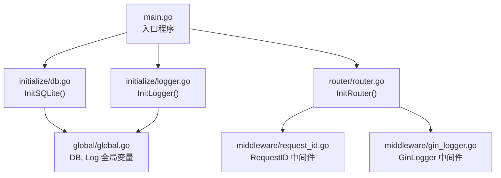
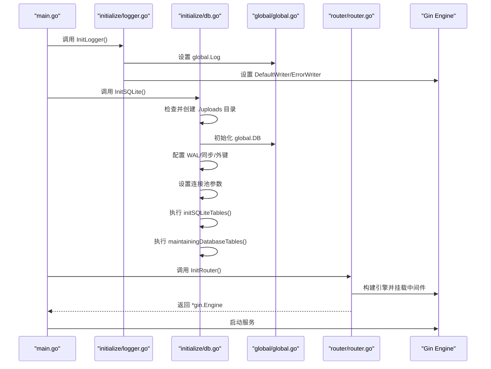
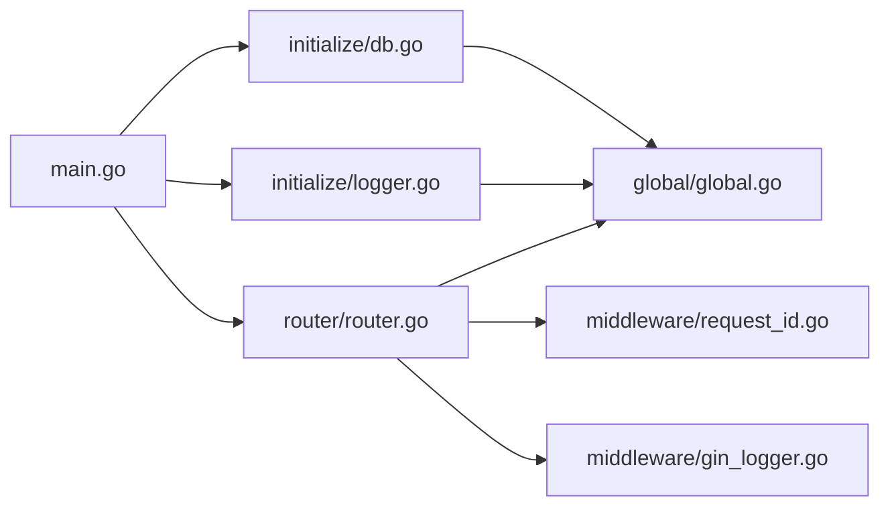

# 初始化流程

<cite>
**本文引用的文件**
- [main.go](file://main.go)
- [initialize/logger.go](file://initialize/logger.go)
- [initialize/db.go](file://initialize/db.go)
- [initialize/mysql.go](file://initialize/mysql.go)
- [config/config.go](file://config/config.go)
- [global/global.go](file://global/global.go)
- [router/router.go](file://router/router.go)
- [middleware/gin_logger.go](file://middleware/gin_logger.go)
- [middleware/request_id.go](file://middleware/request_id.go)
</cite>

## 目录
1. [简介](#简介)
2. [项目结构](#项目结构)
3. [核心组件](#核心组件)
4. [架构总览](#架构总览)
5. [详细组件分析](#详细组件分析)
6. [依赖分析](#依赖分析)
7. [性能考虑](#性能考虑)
8. [故障排查指南](#故障排查指南)
9. [结论](#结论)

## 简介
本文件系统化阐述本项目的程序启动与初始化流程，围绕 main 函数的执行顺序，依次解析 InitLogger()、InitSQLite()、InitRouter() 三大初始化步骤的执行顺序与依赖关系；深入说明 initialize/logger.go 中 InitLogger 如何创建支持彩色控制台输出与文件写入的 Zap 日志实例并通过 global.Log 进行全局管理；详解 initialize/db.go 中 InitSQLite 的完整流程：检查并创建 ./uploads 目录、使用 sql.Open 连接 SQLite 数据库、配置 WAL 模式与同步策略、启用外键约束、设置连接池参数、执行 initSQLiteTables 与 maintainingDatabaseTables 完成建表与数据维护；解释 initialize/mysql.go 中 initSQLiteTables 的建表 SQL 定义；阐明 config/config.go 中配置结构体的定义与加载机制；最后绘制初始化时序图，清晰展示各组件的初始化顺序、关键配置项及其对系统稳定性的影响。

## 项目结构
项目采用按功能模块划分的组织方式：
- 入口层：main.go
- 初始化层：initialize/logger.go、initialize/db.go、initialize/mysql.go
- 配置层：config/config.go
- 全局共享：global/global.go
- 路由与中间件：router/router.go、middleware/gin_logger.go、middleware/request_id.go

图表来源
- [main.go](file://main.go#L13-L32)
- [initialize/logger.go](file://initialize/logger.go#L68-L183)
- [initialize/db.go](file://initialize/db.go#L14-L89)
- [router/router.go](file://router/router.go#L11-L109)
- [middleware/request_id.go](file://middleware/request_id.go#L10-L27)
- [middleware/gin_logger.go](file://middleware/gin_logger.go#L11-L60)
- [global/global.go](file://global/global.go#L11-L31)

章节来源
- [main.go](file://main.go#L13-L32)
- [initialize/logger.go](file://initialize/logger.go#L68-L183)
- [initialize/db.go](file://initialize/db.go#L14-L89)
- [router/router.go](file://router/router.go#L11-L109)
- [middleware/request_id.go](file://middleware/request_id.go#L10-L27)
- [middleware/gin_logger.go](file://middleware/gin_logger.go#L11-L60)
- [global/global.go](file://global/global.go#L11-L31)

## 核心组件
- main.go：定义程序入口，严格规定初始化顺序：先日志、再数据库、再路由，最后启动服务。
- initialize/logger.go：构建彩色控制台与文件落盘的日志实例，统一注入 Gin 的默认输出，提供带 RequestID 的命名日志能力。
- initialize/db.go：负责 SQLite 初始化，包括目录准备、连接建立、WAL/同步/外键配置、连接池设置、建表与维护。
- initialize/mysql.go：保留 MySQL 初始化占位实现，便于未来切换或兼容。
- config/config.go：定义配置结构体，为后续配置加载提供类型基础。
- global/global.go：集中存放全局 DB 与 Log 实例，提供带 RequestID 的日志获取方法。
- router/router.go：构建 Gin 路由，挂载中间件链路，暴露业务接口。
- middleware/gin_logger.go、middleware/request_id.go：提供统一日志中间件与请求 ID 注入。

章节来源
- [main.go](file://main.go#L13-L32)
- [initialize/logger.go](file://initialize/logger.go#L68-L183)
- [initialize/db.go](file://initialize/db.go#L14-L89)
- [initialize/mysql.go](file://initialize/mysql.go#L1-L34)
- [config/config.go](file://config/config.go#L1-L16)
- [global/global.go](file://global/global.go#L11-L31)
- [router/router.go](file://router/router.go#L11-L109)
- [middleware/gin_logger.go](file://middleware/gin_logger.go#L11-L60)
- [middleware/request_id.go](file://middleware/request_id.go#L10-L27)

## 架构总览
下图展示了从 main.go 启动到路由可用的关键初始化顺序与依赖关系：

图表来源
- [main.go](file://main.go#L13-L32)
- [initialize/logger.go](file://initialize/logger.go#L68-L183)
- [initialize/db.go](file://initialize/db.go#L14-L89)
- [global/global.go](file://global/global.go#L11-L31)
- [router/router.go](file://router/router.go#L11-L109)

## 详细组件分析

### 初始化顺序与依赖关系
- 执行顺序
  - main.go 中明确先调用 InitLogger()，再调用 InitSQLite()，随后初始化路由 InitRouter()，最后启动服务。
- 依赖关系
  - 日志初始化依赖全局 Log；数据库初始化依赖全局 DB；路由初始化依赖全局 DB 与日志；Gin 的日志中间件依赖全局 Log 与 RequestID 中间件。
- 关键点
  - main.go 中对 InitSQLite() 的调用处显式关闭数据库连接，保证进程退出时资源回收。
  - Gin 的默认输出被同时写入控制台与日志文件，确保开发调试与生产落盘一致。

章节来源
- [main.go](file://main.go#L13-L32)
- [initialize/logger.go](file://initialize/logger.go#L171-L183)
- [initialize/db.go](file://initialize/db.go#L14-L20)
- [global/global.go](file://global/global.go#L11-L31)
- [router/router.go](file://router/router.go#L11-L109)

### 日志初始化：initialize/logger.go
- 功能要点
  - 创建日志目录与日志文件，使用 lumberjack 进行滚动归档。
  - 定义控制台编码器与文件编码器，分别输出彩色控制台与纯文本文件。
  - 自定义 ColorMessageCore，按日志级别对消息内容着色，增强可读性。
  - 组合 tee 输出到控制台与文件，创建 zap 日志实例并赋值给 global.Log。
  - 将 Gin 的默认输出同时写入控制台与日志文件，使请求日志与业务日志风格一致。
  - 提供 GetLog(c) 基于 RequestID 的命名日志能力，便于链路追踪。
- 影响
  - 统一日志格式与输出位置，提升可观测性与排障效率。
  - 彩色输出便于快速识别错误与警告级别信息。

章节来源
- [initialize/logger.go](file://initialize/logger.go#L68-L183)
- [global/global.go](file://global/global.go#L16-L31)
- [middleware/gin_logger.go](file://middleware/gin_logger.go#L11-L60)
- [middleware/request_id.go](file://middleware/request_id.go#L10-L27)

### 数据库初始化：initialize/db.go
- 目录与连接
  - 检查并创建 ./uploads 目录，避免后续 SQLite 文件无法写入。
  - 使用 sql.Open 连接 SQLite 数据库，驱动来自 modernc.org/sqlite。
- 性能与一致性配置
  - 启用 WAL 模式以提升并发读写性能。
  - 设置同步模式为 FULL，平衡可靠性与性能。
  - 启用外键约束，保障参照完整性。
- 连接池参数
  - 最大空闲连接数、最大打开连接数、连接最大生命周期，确保资源可控与高并发场景稳定。
- 健康检查
  - Ping 成功后记录日志，失败则直接终止进程，避免后续业务异常。
- 建表与维护
  - initSQLiteTables：启用外键后批量执行建表 SQL，覆盖用户、科目、分类、知识点、题目、分享码、关联表与触发器等。
  - maintainingDatabaseTables：检测并删除废弃字段（如 questions 表中的 note 字段），兼容不同 SQLite 版本差异。
- 影响
  - WAL 与同步策略直接影响并发与数据安全；连接池参数影响吞吐与内存占用；建表与维护确保数据库结构稳定演进。

章节来源
- [initialize/db.go](file://initialize/db.go#L14-L89)
- [initialize/db.go](file://initialize/db.go#L90-L152)
- [initialize/db.go](file://initialize/db.go#L154-L380)

### 建表 SQL 定义：initialize/db.go 中 initSQLiteTables
- 覆盖范围
  - 基础表：users、subjects
  - 业务表：share_codes、share_announcements
  - 关联表：user_subjects、share_code_subjects、share_code_usage
  - 题库结构表：knowledge_categories、knowledge_points、questions
  - 用户题目备注表：question_user_notes
- 特性
  - 外键约束与级联行为明确，触发器自动维护更新时间字段。
  - 联合唯一索引与字段默认值设计，兼顾业务约束与易用性。
- 影响
  - 为后续业务接口提供稳定的底层数据结构支撑。

章节来源
- [initialize/db.go](file://initialize/db.go#L154-L380)

### 配置结构体定义与加载机制：config/config.go
- 结构体定义
  - MySQLConfig：包含主机、端口、用户名、密码、数据库名、最大空闲连接数、最大打开连接数等字段。
  - ServerConfig：包含 MySQL 子配置。
- 加载机制
  - 项目中引入 viper 依赖，但当前 main.go 中的配置加载逻辑为注释状态；config.go 提供了结构体定义，便于后续通过 viper 解析 config.yaml 并映射到全局配置对象。
- 影响
  - 为未来切换数据库或动态调整参数提供基础；当前主流程使用 SQLite，MySQL 初始化仍为占位。

章节来源
- [config/config.go](file://config/config.go#L1-L16)
- [main.go](file://main.go#L34-L46)

### 路由与中间件：router/router.go、middleware/gin_logger.go、middleware/request_id.go
- 路由初始化
  - 使用 gin.New() 构建引擎，禁用默认 Logger 与 Recovery，改用自定义中间件链路。
  - 挂载顺序：RequestID 中间件（首个）、GinLogger 中间件、Recovery、跨域中间件。
  - 静态资源映射至 ./uploads，便于图片等资源访问。
- 中间件
  - RequestIDMiddleware：生成短请求 ID，注入上下文与响应头，便于日志关联。
  - GinLogger：计算耗时、拼接请求摘要、按状态码选择日志级别，统一输出到 global.Log。
- 影响
  - 请求链路统一、可观测性强；日志风格与业务日志一致，便于问题定位。

章节来源
- [router/router.go](file://router/router.go#L11-L109)
- [middleware/request_id.go](file://middleware/request_id.go#L10-L27)
- [middleware/gin_logger.go](file://middleware/gin_logger.go#L11-L60)
- [global/global.go](file://global/global.go#L16-L31)

## 依赖分析
- 组件耦合
  - main.go 对 initialize/logger.go、initialize/db.go、router/router.go 存在强依赖，顺序固定。
  - initialize/db.go 与 global/global.go 通过全局变量耦合；initialize/logger.go 与 global/global.go 亦通过全局变量耦合。
  - router/router.go 依赖 global.DB 与 global.Log；中间件依赖 gin 与 global。
- 外部依赖
  - 日志：zap、lumberjack
  - 路由：gin、gin-contrib/gzip
  - 数据库：modernc.org/sqlite
  - 配置：spf13/viper
- 循环依赖
  - 当前文件未见循环导入；全局变量在各自包内声明，避免循环引用。

图表来源
- [main.go](file://main.go#L13-L32)
- [initialize/logger.go](file://initialize/logger.go#L68-L183)
- [initialize/db.go](file://initialize/db.go#L14-L89)
- [router/router.go](file://router/router.go#L11-L109)
- [middleware/request_id.go](file://middleware/request_id.go#L10-L27)
- [middleware/gin_logger.go](file://middleware/gin_logger.go#L11-L60)
- [global/global.go](file://global/global.go#L11-L31)

章节来源
- [main.go](file://main.go#L13-L32)
- [initialize/logger.go](file://initialize/logger.go#L68-L183)
- [initialize/db.go](file://initialize/db.go#L14-L89)
- [router/router.go](file://router/router.go#L11-L109)
- [middleware/request_id.go](file://middleware/request_id.go#L10-L27)
- [middleware/gin_logger.go](file://middleware/gin_logger.go#L11-L60)
- [global/global.go](file://global/global.go#L11-L31)

## 性能考虑
- WAL 模式
  - 通过 PRAGMA journal_mode=WAL 提升并发读写性能，适合多读少写的题库场景。
- 同步策略
  - synchronous=FULL 在可靠性与性能之间取得平衡，建议在生产环境保持该设置。
- 连接池
  - 合理设置最大空闲与最大打开连接数，避免连接泄漏与资源争用。
- 日志滚动
  - lumberjack 的大小、备份数与保留天数需结合磁盘容量与日志量评估，避免磁盘打满。
- Gin 中间件
  - gzip 压缩与日志中间件会带来额外 CPU 开销，建议在高并发场景评估开启与否。

[本节为通用指导，不直接分析具体文件]

## 故障排查指南
- 启动阶段
  - 若日志初始化失败：检查日志目录权限与路径；确认 lumberjack 配置合理。
  - 若数据库初始化失败：检查 ./uploads 是否可写；确认 SQLite 驱动可用；查看 WAL/同步/外键配置是否被拒绝。
- 运行阶段
  - 若请求日志缺失：确认 Gin 的 DefaultWriter 已被替换为 tee 输出；检查 RequestID 中间件是否在首位。
  - 若建表失败：核对 initSQLiteTables 中的 SQL 语法与外键约束；关注 maintainingDatabaseTables 对旧字段的处理。
- 常见错误定位
  - 使用 global.GetLog(c) 获取带 RequestID 的日志，结合 X-Request-ID 快速定位请求链路。

章节来源
- [initialize/logger.go](file://initialize/logger.go#L171-L183)
- [initialize/db.go](file://initialize/db.go#L32-L89)
- [initialize/db.go](file://initialize/db.go#L154-L380)
- [middleware/gin_logger.go](file://middleware/gin_logger.go#L11-L60)
- [middleware/request_id.go](file://middleware/request_id.go#L10-L27)
- [global/global.go](file://global/global.go#L16-L31)

## 结论
本项目的初始化流程遵循“先日志、后数据库、再路由”的顺序，确保日志贯穿全链路、数据库稳定可用、路由中间件统一。initialize/logger.go 通过彩色控制台与文件落盘的组合，配合 Gin 的 tee 输出，形成一致的日志体验；initialize/db.go 通过 WAL、同步策略、外键与连接池配置，兼顾性能与可靠性；router/router.go 与中间件链路进一步强化了可观测性与稳定性。config/config.go 为未来配置化提供了结构基础，当前主流程使用 SQLite，MySQL 初始化作为占位。整体设计清晰、职责分明，具备良好的扩展性与可维护性。