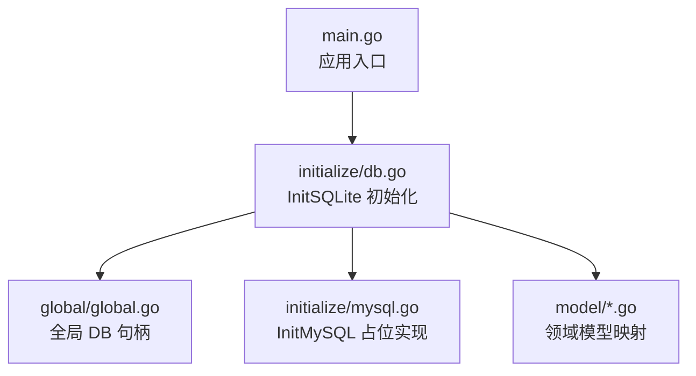
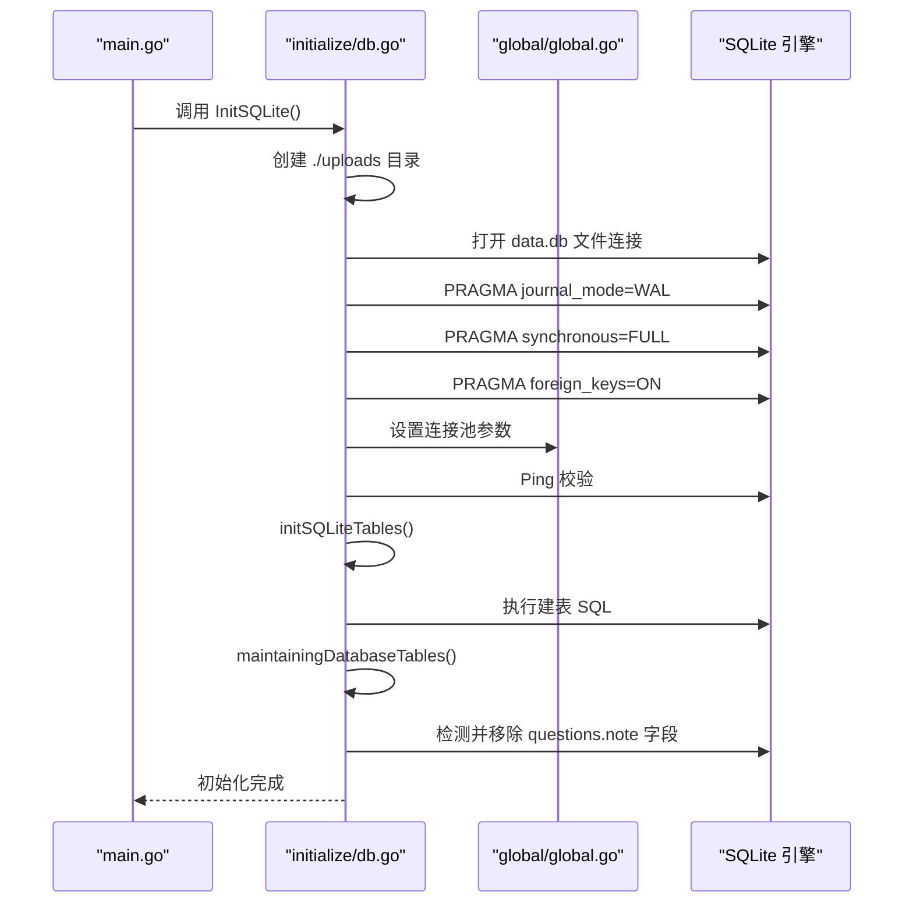
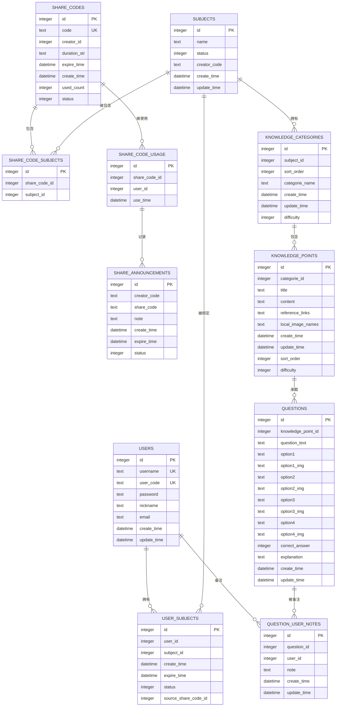
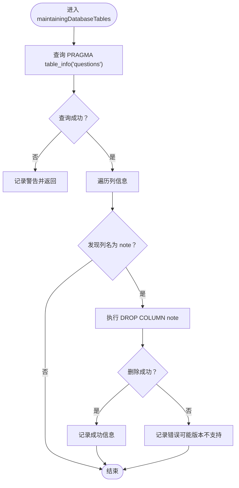
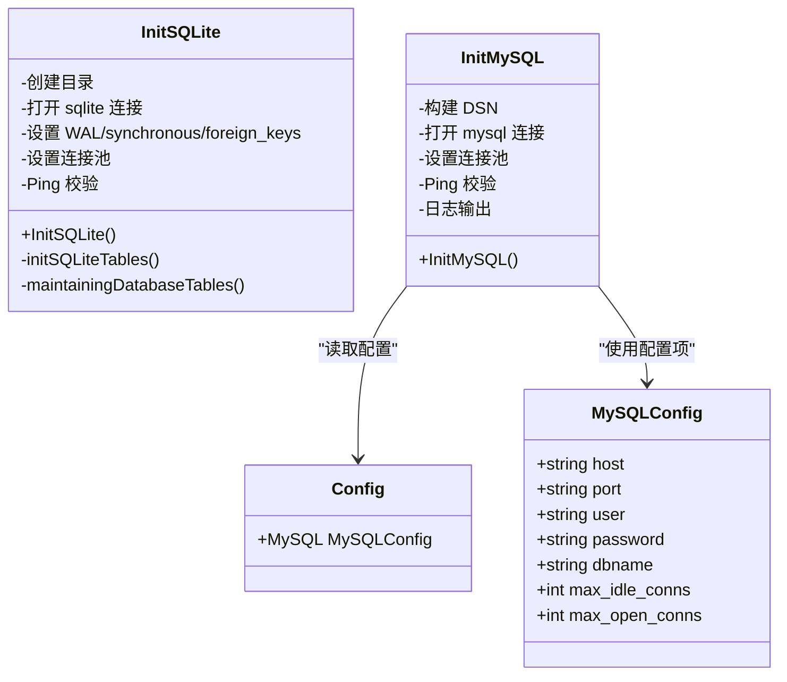
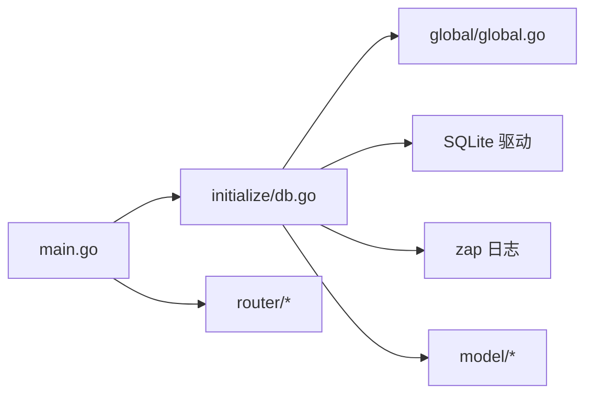

# 数据库初始化

<cite>
**本文引用的文件**
- [db.go](file://initialize/db.go)
- [mysql.go](file://initialize/mysql.go)
- [global.go](file://global/global.go)
- [main.go](file://main.go)
- [config.go](file://config/config.go)
- [question.go](file://model/question.go)
- [category.go](file://model/category.go)
- [point.go](file://model/point.go)
- [subject.go](file://model/subject.go)
- [user.go](file://model/user.go)
</cite>

## 目录
1. [简介](#简介)
2. [项目结构](#项目结构)
3. [核心组件](#核心组件)
4. [架构总览](#架构总览)
5. [详细组件分析](#详细组件分析)
6. [依赖分析](#依赖分析)
7. [性能考量](#性能考量)
8. [故障排查指南](#故障排查指南)
9. [结论](#结论)
10. [附录](#附录)

## 简介
本文件围绕数据库初始化流程展开，系统性解析 InitSQLite 函数的全流程执行过程，包括：
- 创建 ./uploads 目录与 data.db 文件的连接建立
- WAL 模式与 synchronous=FULL 的性能与持久化影响
- 外键约束对数据完整性的保障
- 连接池参数的性能调优考量
- 11 张核心数据表的结构、关联关系与外键约束
- maintainingDatabaseTables 如何动态移除废弃字段，实现数据库结构演进
- 对比 InitMySQL 的结构设计，说明项目对多数据库的扩展潜力

## 项目结构
本项目的数据库初始化集中在 initialize 子模块，全局共享数据库连接保存在 global 包中；应用入口 main.go 中负责调用初始化流程。

图表来源
- [main.go](file://main.go#L13-L21)
- [db.go](file://initialize/db.go#L14-L89)
- [global.go](file://global/global.go#L11-L14)
- [mysql.go](file://initialize/mysql.go#L1-L34)

章节来源
- [main.go](file://main.go#L13-L21)
- [db.go](file://initialize/db.go#L14-L89)
- [global.go](file://global/global.go#L11-L14)
- [mysql.go](file://initialize/mysql.go#L1-L34)

## 核心组件
- 初始化入口：InitSQLite
- 全局数据库句柄：global.DB
- 连接池配置：最大空闲连接、最大打开连接、连接生命周期
- 表结构初始化：initSQLiteTables
- 结构演进：maintainingDatabaseTables
- 多数据库支持：InitMySQL（占位）

章节来源
- [db.go](file://initialize/db.go#L14-L89)
- [global.go](file://global/global.go#L11-L14)
- [mysql.go](file://initialize/mysql.go#L1-L34)

## 架构总览
InitSQLite 的执行顺序如下：创建目录 -> 打开数据库 -> 设置 WAL/synchronous/外键 -> 设置连接池 -> Ping 校验 -> 初始化表结构 -> 结构演进（清理废弃字段）。该流程确保 SQLite 在本地文件系统上稳定运行，并具备良好的并发与一致性特性。

图表来源
- [main.go](file://main.go#L13-L21)
- [db.go](file://initialize/db.go#L14-L89)
- [global.go](file://global/global.go#L11-L14)

## 详细组件分析

### InitSQLite：全流程执行过程
- 目录与文件准备
  - 使用 filepath.Join 组合 ./uploads/data.db，若目录不存在则递归创建
  - 若创建失败直接终止，避免后续初始化阶段出现不可预期问题
- 连接建立
  - 通过 sql.Open("sqlite", dbPath) 建立连接
  - 使用 modernc.org/sqlite 驱动，保证纯 Go 实现与跨平台兼容
- 性能与一致性配置
  - WAL 模式：提升并发读写吞吐，降低写放大
  - synchronous=FULL：确保落盘一致性，牺牲部分性能换取更强可靠性
  - 外键约束：开启 PRAGMA foreign_keys=ON，保证参照完整性
- 连接池参数
  - 最大空闲连接：5
  - 最大打开连接：100
  - 连接生命周期：1 小时
- 健康检查
  - 使用 Ping 校验连接可用性
- 表结构初始化
  - 调用 initSQLiteTables，按顺序执行建表 SQL
- 结构演进
  - 调用 maintainingDatabaseTables，检测并移除废弃字段

章节来源
- [db.go](file://initialize/db.go#L14-L89)

### WAL 模式与 synchronous=FULL 的影响
- WAL 模式（Write-Ahead Logging）
  - 提升并发读写性能：允许多个读事务与一个写事务并行，减少锁竞争
  - 降低写放大：写入以追加方式写入 WAL 文件，避免频繁覆盖主数据库页
- synchronous=FULL
  - 强制操作系统将变更刷到磁盘，提高崩溃后的数据安全性
  - 代价是写入延迟增加，适合对一致性要求高的场景

章节来源
- [db.go](file://initialize/db.go#L39-L65)

### 外键约束的作用
- 开启外键约束后，SQLite 将强制参照完整性
- 删除或更新被其他表引用的记录时，会触发外键约束检查，防止产生悬挂引用
- 有助于长期维护数据一致性与可追踪性

章节来源
- [db.go](file://initialize/db.go#L58-L65)

### 连接池参数的性能调优考量
- 最大空闲连接：5
  - 控制空闲连接数量，避免资源占用过高
- 最大打开连接：100
  - 支持高并发场景下的连接需求
- 连接生命周期：1 小时
  - 避免长时间持有连接导致资源泄漏或状态陈旧

章节来源
- [db.go](file://initialize/db.go#L66-L71)
- [global.go](file://global/global.go#L11-L14)

### initSQLiteTables：11 张核心数据表的结构与关系
- users（用户表）
  - 主键自增 id
  - 唯一约束：username、user_code
  - 触发器：更新时自动刷新 update_time
- subjects（科目表）
  - 主键自增 id
  - 触发器：更新时自动刷新 update_time
- share_codes（分享码定义表）
  - 唯一约束：code
- share_announcements（分享公告/记录表）
  - 记录分享码与使用者的关系
- user_subjects（用户-科目绑定）
  - 联合唯一：(user_id, subject_id)
  - 外键：user_id 引用 users(id)、subject_id 引用 subjects(id)
  - 删除策略：CASCADE
- share_code_subjects（分享码包含的科目）
  - 外键：share_code_id 引用 share_codes(id)、subject_id 引用 subjects(id)
  - 删除策略：CASCADE
- share_code_usage（分享码使用记录）
  - 联合唯一：(share_code_id, user_id)
- knowledge_categories（章节/分类）
  - 外键：subject_id 引用 subjects(id)
  - 删除策略：NO ACTION（禁止删除仍被引用的分类）
- knowledge_points（知识点）
  - 外键：categorie_id 引用 knowledge_categories(id)
  - 删除策略：NO ACTION
- questions（题目）
  - 外键：knowledge_point_id 引用 knowledge_points(id)
  - 删除策略：NO ACTION
- question_user_notes（用户题目备注）
  - 联合唯一：(user_id, question_id)
  - 外键：user_id 引用 users(id)、question_id 引用 questions(id)
  - 删除策略：CASCADE

图表来源
- [db.go](file://initialize/db.go#L154-L379)

章节来源
- [db.go](file://initialize/db.go#L154-L379)

### maintainingDatabaseTables：动态检测并移除废弃字段
- 功能目标：检测 questions 表是否包含 note 字段，若存在则尝试移除
- 实现要点：
  - 使用 PRAGMA table_info(questions) 查询列元信息
  - 遍历扫描结果，匹配列名为 note
  - 若存在，执行 ALTER TABLE questions DROP COLUMN note
  - 对于 SQLite 版本较低不支持 DROP COLUMN 的情况，记录错误但不中断程序
- 日志策略：根据全局日志器是否存在选择不同输出路径

图表来源
- [db.go](file://initialize/db.go#L90-L152)

章节来源
- [db.go](file://initialize/db.go#L90-L152)

### 对比 InitMySQL：多数据库扩展能力
- InitSQLite
  - 使用 modernc.org/sqlite 驱动
  - 通过 sql.Open("sqlite", dbPath) 建立连接
  - 明确设置 WAL、synchronous、foreign_keys、连接池参数
- InitMySQL
  - 当前为占位实现，注释掉具体实现，预留未来接入 MySQL 的接口
  - 通过 sql.Open("mysql", dsn) 建立连接
  - 通过配置结构体提供连接池参数（MaxIdleConns、MaxOpenConns）

图表来源
- [db.go](file://initialize/db.go#L14-L89)
- [mysql.go](file://initialize/mysql.go#L1-L34)
- [config.go](file://config/config.go#L1-L16)

章节来源
- [db.go](file://initialize/db.go#L14-L89)
- [mysql.go](file://initialize/mysql.go#L1-L34)
- [config.go](file://config/config.go#L1-L16)

## 依赖分析
- 模块耦合
  - initialize/db.go 依赖 global/global.go 提供全局 DB 句柄
  - main.go 作为入口，先初始化日志再初始化数据库
  - model/* 仅作数据结构映射，不直接依赖数据库初始化逻辑
- 外部依赖
  - modernc.org/sqlite 驱动
  - zap 日志库（通过 global.Log 使用）
- 潜在循环依赖
  - 未见直接循环依赖；初始化层与模型层解耦良好

图表来源
- [main.go](file://main.go#L13-L21)
- [db.go](file://initialize/db.go#L14-L89)
- [global.go](file://global/global.go#L11-L14)

章节来源
- [main.go](file://main.go#L13-L21)
- [db.go](file://initialize/db.go#L14-L89)
- [global.go](file://global/global.go#L11-L14)

## 性能考量
- WAL 模式
  - 适用于高并发读写场景，显著提升吞吐量
  - 注意：WAL 文件大小增长，需定期维护（如 VACUUM 或 WAL checkpoint）
- synchronous=FULL
  - 提升可靠性，适合对数据安全敏感的场景
  - 会增加写入延迟，建议结合业务峰值评估
- 连接池
  - 最大空闲连接 5：平衡内存占用与复用效率
  - 最大打开连接 100：满足高并发请求
  - 生命周期 1 小时：避免长时间连接导致的状态老化
- 触发器
  - 自动更新时间戳的触发器在高频更新场景下会产生额外开销，建议评估必要性

[本节为通用性能讨论，无需列出章节来源]

## 故障排查指南
- 目录创建失败
  - 现象：初始化直接终止
  - 排查：确认权限与路径正确
- 打开数据库失败
  - 现象：提示打开失败
  - 排查：确认 data.db 文件权限、磁盘空间、SQLite 驱动可用
- PRAGMA 设置失败
  - 现象：启用 WAL/synchronous/foreign_keys 失败
  - 排查：确认 SQLite 版本与驱动支持情况
- Ping 校验失败
  - 现象：连接校验失败
  - 排查：检查文件路径、权限、磁盘空间
- 建表失败
  - 现象：执行 SQL 失败并终止
  - 排查：核对建表语句与字段类型、约束冲突
- 移除字段失败
  - 现象：DROP COLUMN 失败
  - 排查：确认 SQLite 版本是否支持 ALTER TABLE ... DROP COLUMN

章节来源
- [db.go](file://initialize/db.go#L22-L37)
- [db.go](file://initialize/db.go#L39-L71)
- [db.go](file://initialize/db.go#L72-L89)
- [db.go](file://initialize/db.go#L154-L379)
- [db.go](file://initialize/db.go#L90-L152)

## 结论
InitSQLite 通过严格的初始化流程、明确的性能与一致性配置、完善的表结构与外键约束，以及结构演进机制，为 SQLite 在本项目中的稳定运行提供了坚实基础。同时，InitMySQL 的占位设计为未来接入 MySQL 留出了清晰的扩展路径。建议在生产环境中结合业务负载对 WAL、synchronous 与连接池参数进行进一步压测与调优。

[本节为总结性内容，无需列出章节来源]

## 附录

### 数据模型与表字段映射参考
- users
  - 字段映射参考：[user.go](file://model/user.go#L27-L35)
- subjects
  - 字段映射参考：[subject.go](file://model/subject.go#L1-L24)
- knowledge_categories
  - 字段映射参考：[category.go](file://model/category.go#L1-L26)
- knowledge_points
  - 字段映射参考：[point.go](file://model/point.go#L1-L35)
- questions
  - 字段映射参考：[question.go](file://model/question.go#L1-L65)

章节来源
- [user.go](file://model/user.go#L27-L35)
- [subject.go](file://model/subject.go#L1-L24)
- [category.go](file://model/category.go#L1-L26)
- [point.go](file://model/point.go#L1-L35)
- [question.go](file://model/question.go#L1-L65)