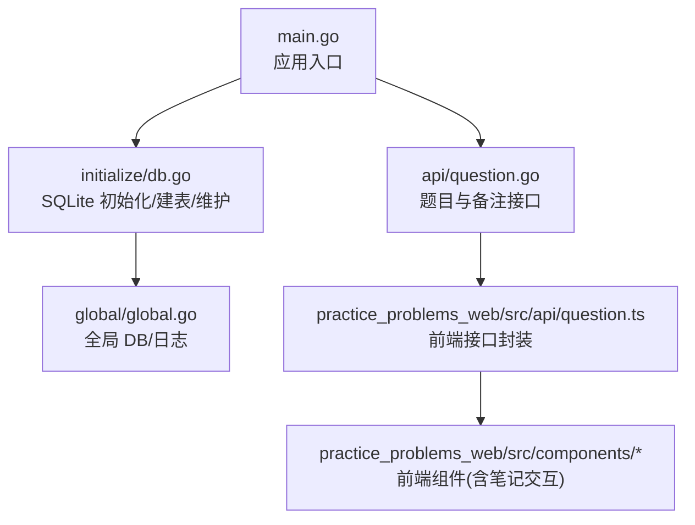
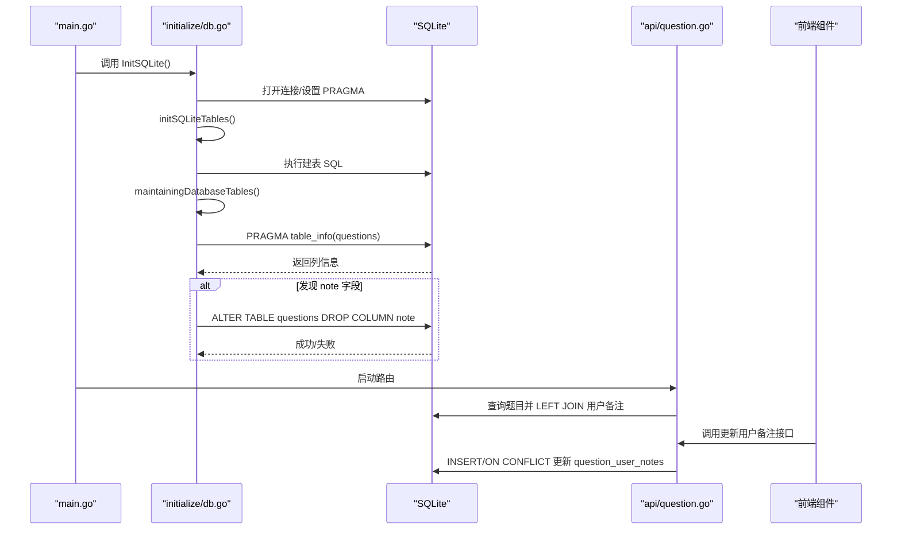
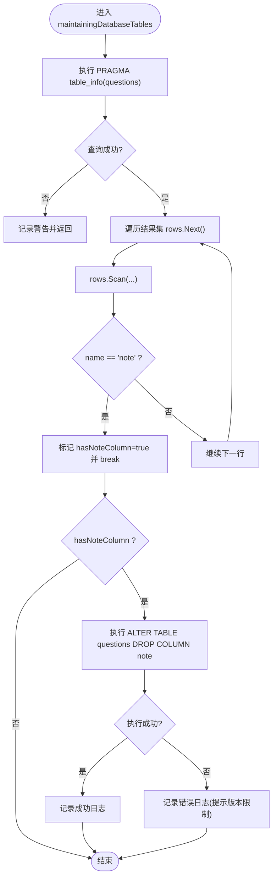
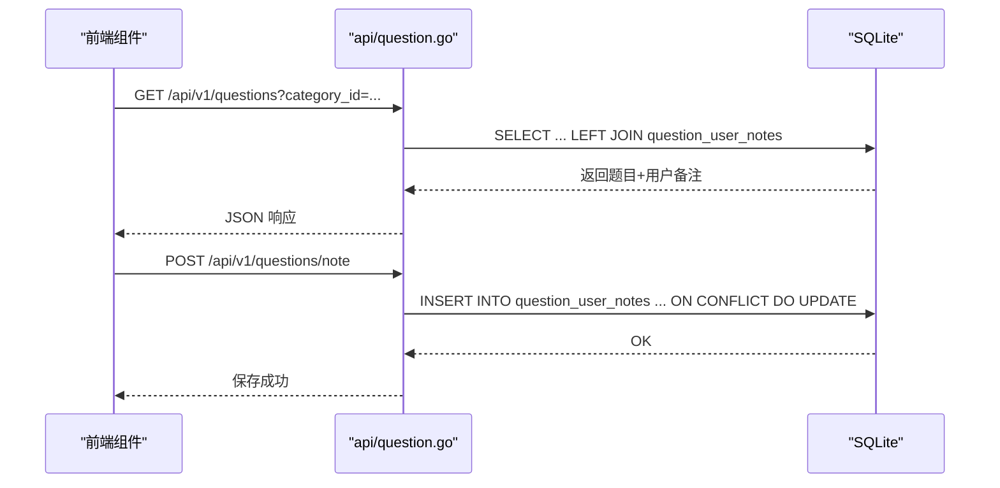
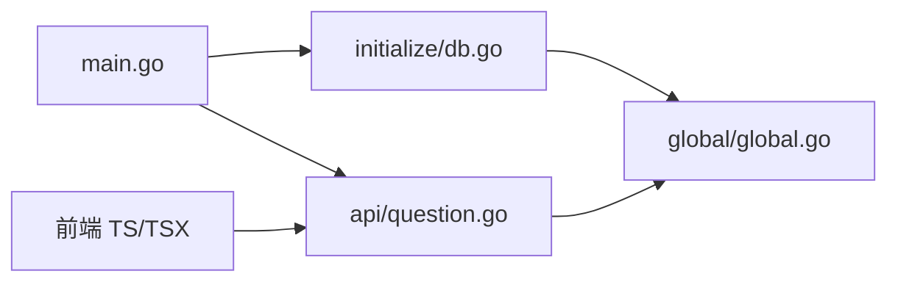

# 数据维护

<cite>
**本文引用的文件列表**
- [main.go](file://main.go)
- [db.go](file://initialize/db.go)
- [global.go](file://global/global.go)
- [question.go](file://api/question.go)
- [question.ts](file://practice_problems_web/src/api/question.ts)
- [CategoryPracticeDrawer.vue](file://practice_problems_web/src/components/CategoryPracticeDrawer.vue)
- [QuestionDrawer.vue](file://practice_problems_web/src/components/QuestionDrawer.vue)
- [question.go(model)](file://model/question.go)
</cite>

## 目录
1. [简介](#简介)
2. [项目结构](#项目结构)
3. [核心组件](#核心组件)
4. [架构总览](#架构总览)
5. [组件详解](#组件详解)
6. [依赖关系分析](#依赖关系分析)
7. [性能考量](#性能考量)
8. [故障排查指南](#故障排查指南)
9. [结论](#结论)
10. [附录](#附录)

## 简介
本文围绕数据库结构演进工具函数 maintainingDatabaseTables 展开，系统讲解其通过 SQLite PRAGMA table_info 探测 questions 表结构、迭代扫描结果判断 note 字段存在性，并在发现废弃字段后尝试执行 ALTER TABLE DROP COLUMN 的兼容性处理策略。同时阐明该函数体现的“非破坏性结构调整”理念：以代码自动检测并安全地执行可回退或可忽略的变更，从而实现无缝版本升级。结合实际场景解释为何将 note 字段从 questions 表迁移至独立的 question_user_notes 表，并强调数据维护脚本在生产环境部署中的重要性。最后提供故障排查建议，包括如何验证字段是否成功删除以及处理权限不足等常见问题。

## 项目结构
本项目采用分层组织方式：
- 入口层：main.go 负责初始化日志、数据库与路由
- 初始化层：initialize/db.go 提供 SQLite 初始化、建表与数据库维护
- 全局层：global/global.go 提供全局数据库连接与日志实例
- API 层：api/question.go 提供题目与用户备注相关接口
- 前端层：practice_problems_web/src 下的 TS/TSX 文件负责与后端交互与展示

图表来源
- [main.go](file://main.go#L1-L32)
- [db.go](file://initialize/db.go#L1-L379)
- [global.go](file://global/global.go#L1-L32)
- [question.go](file://api/question.go#L107-L376)
- [question.ts](file://practice_problems_web/src/api/question.ts#L52-L85)

章节来源
- [main.go](file://main.go#L1-L32)
- [db.go](file://initialize/db.go#L1-L379)
- [global.go](file://global/global.go#L1-L32)

## 核心组件
- maintainingDatabaseTables：数据库结构维护主函数，负责探测 questions 表结构并按需删除 note 字段
- initSQLiteTables：初始化数据库表结构，包含 questions 与 question_user_notes 等表
- API 接口：GetQuestionsByCategory 与 UpdateUserNote 等，体现迁移后的数据流向

章节来源
- [db.go](file://initialize/db.go#L90-L152)
- [db.go](file://initialize/db.go#L154-L379)
- [question.go](file://api/question.go#L107-L376)

## 架构总览
下图展示了应用启动时的数据库初始化与维护流程，以及迁移后数据访问路径。

图表来源
- [main.go](file://main.go#L13-L31)
- [db.go](file://initialize/db.go#L1-L89)
- [db.go](file://initialize/db.go#L90-L152)
- [question.go](file://api/question.go#L107-L376)

## 组件详解

### maintainingDatabaseTables 函数：结构探测与字段删除
- 结构探测
  - 使用 SQLite 特有的 PRAGMA table_info(questions) 获取列元信息
  - 通过 rows.Next/rows.Scan 迭代扫描，逐列比对 name 是否等于 "note"
  - 若命中则标记 hasNoteColumn 并跳出循环
- 删除策略
  - 若存在 note 字段，执行 ALTER TABLE questions DROP COLUMN note
  - 若执行失败（如 SQLite 版本低于 3.35.0 不支持 DROP COLUMN），记录错误但不中断程序
  - 成功时输出成功日志；失败时输出带版本提示的错误日志

图表来源
- [db.go](file://initialize/db.go#L90-L152)

章节来源
- [db.go](file://initialize/db.go#L90-L152)

### initSQLiteTables：建表与迁移前准备
- 启用外键约束与触发器，确保数据一致性
- 定义 questions 与 question_user_notes 等表结构，其中 question_user_notes 用于存放用户对题目的个人备注
- 该阶段为后续迁移做好准备，保证新旧数据结构并行存在时的兼容

章节来源
- [db.go](file://initialize/db.go#L154-L379)

### API 层：迁移后的数据访问与写入
- GetQuestionsByCategory
  - 通过 LEFT JOIN question_user_notes，按当前用户 ID 获取其对该题的备注
  - 返回结构中包含 user_note 字段，前端据此渲染
- UpdateUserNote
  - 使用 SQLite 特有语法 ON CONFLICT DO UPDATE 实现 upsert
  - 将用户备注写入 question_user_notes，避免在 questions 表中冗余存储

图表来源
- [question.go](file://api/question.go#L107-L148)
- [question.go](file://api/question.go#L328-L376)

章节来源
- [question.go](file://api/question.go#L107-L148)
- [question.go](file://api/question.go#L328-L376)

### 前端交互：笔记编辑与保存
- 前端组件在用户编辑笔记时，调用后端接口 updateUserNote，将 note 写入 question_user_notes
- 保存成功后，前端更新本地视图中的 note 字段，保证界面一致

章节来源
- [question.ts](file://practice_problems_web/src/api/question.ts#L52-L85)
- [CategoryPracticeDrawer.vue](file://practice_problems_web/src/components/CategoryPracticeDrawer.vue#L311-L342)
- [QuestionDrawer.vue](file://practice_problems_web/src/components/QuestionDrawer.vue#L502-L522)

## 依赖关系分析
- main.go 依赖 initialize/db.go 完成数据库初始化与维护
- initialize/db.go 依赖 global/global.go 提供全局 DB 与日志
- api/question.go 依赖 global/global.go 访问 DB，并与前端交互
- 前端通过 practice_problems_web/src/api/question.ts 调用后端接口

图表来源
- [main.go](file://main.go#L13-L31)
- [db.go](file://initialize/db.go#L1-L379)
- [global.go](file://global/global.go#L1-L32)
- [question.go](file://api/question.go#L107-L376)
- [question.ts](file://practice_problems_web/src/api/question.ts#L52-L85)

章节来源
- [main.go](file://main.go#L13-L31)
- [db.go](file://initialize/db.go#L1-L379)
- [global.go](file://global/global.go#L1-L32)
- [question.go](file://api/question.go#L107-L376)
- [question.ts](file://practice_problems_web/src/api/question.ts#L52-L85)

## 性能考量
- PRAGMA table_info 查询开销极小，仅用于结构探测，不会影响线上性能
- DROP COLUMN 在 SQLite 3.35.0+ 支持，若版本较低会失败但不影响整体运行
- LEFT JOIN 查询在题目列表场景中可通过索引与触发器维持良好性能
- 建议在低频时段执行维护任务，避免与高峰流量重叠

## 故障排查指南
- 如何验证 note 字段是否成功删除
  - 在 SQLite shell 中执行 PRAGMA table_info(questions)，确认不再出现 note 列
  - 通过 API 查询题目列表，确认响应中不再包含 note 字段
- 常见问题与处理
  - SQLite 版本过低导致 DROP COLUMN 失败
    - 现象：维护日志出现错误提示，包含“SQLite 版本低于 3.35.0”的注释
    - 处理：升级 SQLite 至 3.35.0+；或在迁移后继续使用 LEFT JOIN 方案读取用户备注
  - 权限不足
    - 现象：DROP COLUMN 报错
    - 处理：确保数据库文件与目录具备写权限；重启应用后再次执行维护
  - 数据库连接异常
    - 现象：PRAGMA 查询失败
    - 处理：检查数据库连接字符串、文件路径与驱动；确认数据库文件存在且可访问
  - 生产环境部署建议
    - 在发布前先在测试环境验证维护脚本
    - 为维护脚本增加幂等性与回滚策略（如备份表结构快照）
    - 通过监控观察维护日志，确保无异常

章节来源
- [db.go](file://initialize/db.go#L90-L152)
- [question.go](file://api/question.go#L107-L148)

## 结论
maintainingDatabaseTables 体现了数据库演进的自动化与稳健性：通过 PRAGMA table_info 自动探测结构，以非破坏性的方式清理废弃字段，并在版本不兼容时优雅降级。配合 API 层的 LEFT JOIN 与 question_user_notes 表，实现了用户备注的独立存储与高效访问。该设计使得版本升级更平滑，降低生产风险，提升可维护性。

## 附录
- 为什么移除 questions 表中的 note 字段
  - 业务重构：将用户个人备注迁移到 question_user_notes，避免在主表中存储用户私有数据
  - 数据一致性：通过外键约束与 upsert 保证用户备注的唯一性与一致性
  - 查询效率：LEFT JOIN 在题目列表场景中可控且可扩展
- 生产部署要点
  - 在每次启动时执行维护脚本，确保线上结构与预期一致
  - 为关键迁移步骤增加日志与告警，便于快速定位问题
  - 保持前端与后端接口的一致性，避免因字段缺失导致的兼容问题