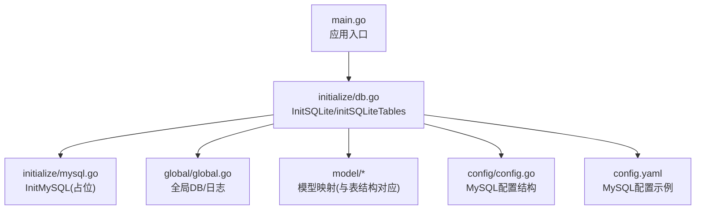
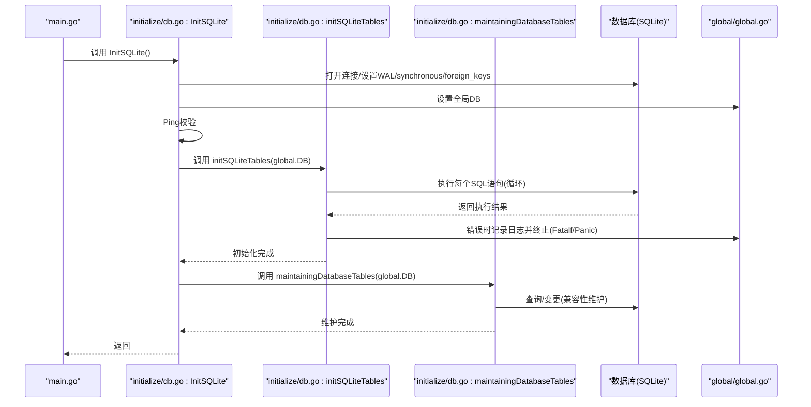
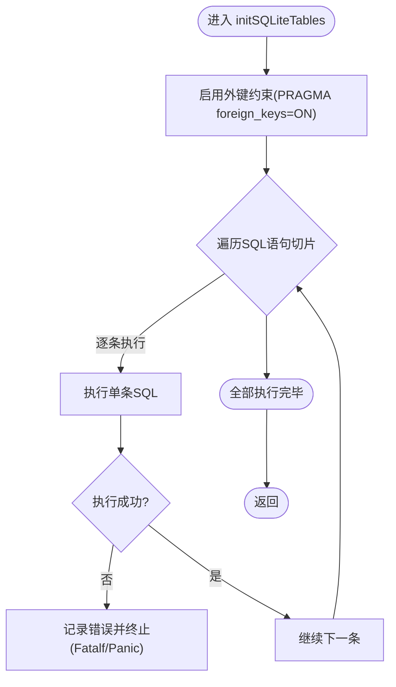
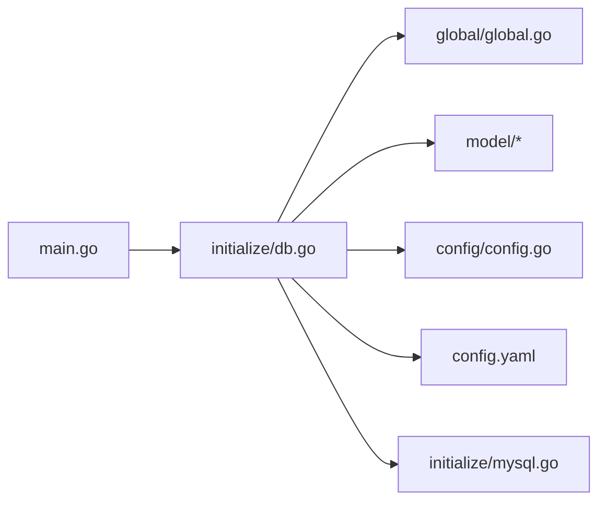

# 表结构初始化

<cite>
**本文引用的文件列表**
- [main.go](file://main.go)
- [db.go](file://initialize/db.go)
- [mysql.go](file://initialize/mysql.go)
- [global.go](file://global/global.go)
- [config.go](file://config/config.go)
- [config.yaml](file://config.yaml)
- [user.go](file://model/user.go)
- [category.go](file://model/category.go)
- [question.go](file://model/question.go)
</cite>

## 目录
1. [简介](#简介)
2. [项目结构](#项目结构)
3. [核心组件](#核心组件)
4. [架构总览](#架构总览)
5. [详细组件分析](#详细组件分析)
6. [依赖关系分析](#依赖关系分析)
7. [性能考虑](#性能考虑)
8. [故障排查指南](#故障排查指南)
9. [结论](#结论)

## 简介
本文件围绕 initSQLiteTables 函数的执行流程进行深入解析，系统性阐述其如何通过 SQL 语句切片一次性创建 11 张核心数据表，并逐项说明每张表的设计目的、业务含义与外键约束策略。同时，文档详细解释基于 SQLite 触发器的 create_time 与 update_time 自动更新机制，对比 SQLite 与 MySQL 初始化函数的结构差异，给出实际 SQL 执行示例与错误处理策略，帮助读者全面理解该模块在多数据库支持下的设计考量与可靠性保障。

## 项目结构
- 初始化入口位于 main.go，启动时调用 initialize.InitSQLite() 完成数据库连接与表结构初始化。
- 初始化模块 initialize/db.go 中包含：
  - InitSQLite：负责 SQLite 连接、WAL/synchronous/foreign_keys 参数设置、连接池配置、Ping 校验与表初始化。
  - initSQLiteTables：以 SQL 语句切片方式创建 11 张核心表及对应触发器。
  - maintainingDatabaseTables：对历史遗留字段进行兼容性维护（例如删除废弃字段）。
- 初始化模块 initialize/mysql.go 提供 MySQL 初始化占位，便于未来扩展。
- 全局变量 global/global.go 暴露全局 *sql.DB 与日志句柄，供初始化与业务层共享。
- 配置模块 config/config.go 与 config.yaml 提供 MySQL 配置结构与示例，为多数据库支持预留接口。

图表来源
- [main.go](file://main.go#L13-L21)
- [db.go](file://initialize/db.go#L14-L89)
- [mysql.go](file://initialize/mysql.go#L1-L33)
- [global.go](file://global/global.go#L11-L31)
- [config.go](file://config/config.go#L1-L15)
- [config.yaml](file://config.yaml#L1-L8)

章节来源
- [main.go](file://main.go#L13-L21)
- [db.go](file://initialize/db.go#L14-L89)
- [mysql.go](file://initialize/mysql.go#L1-L33)
- [global.go](file://global/global.go#L11-L31)
- [config.go](file://config/config.go#L1-L15)
- [config.yaml](file://config.yaml#L1-L8)

## 核心组件
- InitSQLite：完成 SQLite 连接、性能与一致性参数设置、外键启用、连接池配置与 Ping 校验；随后调用 initSQLiteTables 与 maintainingDatabaseTables。
- initSQLiteTables：以 SQL 语句切片方式创建 11 张核心表与相应触发器，确保表结构与业务模型一致。
- maintainingDatabaseTables：对历史遗留字段进行兼容性维护（例如删除废弃字段），保证数据库演进的平滑过渡。
- InitMySQL：当前为占位实现，预留 MySQL 初始化扩展点。
- 全局 DB：由 InitSQLite 初始化后赋值，供后续业务层直接使用。

章节来源
- [db.go](file://initialize/db.go#L14-L89)
- [db.go](file://initialize/db.go#L154-L379)
- [db.go](file://initialize/db.go#L90-L152)
- [mysql.go](file://initialize/mysql.go#L1-L33)
- [global.go](file://global/global.go#L11-L14)

## 架构总览
下图展示初始化阶段的关键调用序列，突出 initSQLiteTables 如何通过 SQL 语句切片批量创建表与触发器，并在执行过程中进行错误处理与日志输出。

图表来源
- [main.go](file://main.go#L13-L21)
- [db.go](file://initialize/db.go#L14-L89)
- [db.go](file://initialize/db.go#L154-L379)
- [db.go](file://initialize/db.go#L90-L152)
- [global.go](file://global/global.go#L11-L14)

## 详细组件分析

### initSQLiteTables 执行流程与表清单
initSQLiteTables 通过一个 SQL 语句切片一次性创建 11 张核心表，并为部分表附加自动更新时间的触发器。其执行步骤如下：
- 启用外键支持（PRAGMA foreign_keys=ON）
- 定义 SQL 语句切片，按顺序包含 11 张表的建表语句与触发器
- 循环执行每个 SQL 语句，遇到错误立即终止并记录详细错误信息
- 成功完成后输出完成日志

图表来源
- [db.go](file://initialize/db.go#L154-L379)

章节来源
- [db.go](file://initialize/db.go#L154-L379)

### 11 张核心数据表与业务含义

- users（用户表）
  - 设计目的：存储用户账户信息，包含用户名、用户编码、密码、昵称、邮箱等字段。
  - 关键点：主键自增，用户名与用户编码唯一；提供自动更新时间触发器。
  - 业务含义：作为系统用户身份的基础凭证与标识。

- subjects（科目表）
  - 设计目的：管理学科/科目元数据，包含名称、状态、创建者编码等。
  - 关键点：提供自动更新时间触发器。
  - 业务含义：支撑题库按科目维度组织与权限控制。

- share_codes（分享码定义表）
  - 设计目的：记录分享码的生成、有效期、使用次数与状态。
  - 关键点：分享码唯一；包含创建时间与状态字段。
  - 业务含义：用于授权访问特定资源或权限范围。

- share_announcements（分享公告/记录表）
  - 设计目的：记录分享码相关的公告与使用记录。
  - 关键点：包含创建时间、过期时间与状态字段。
  - 业务含义：用于追踪分享行为与公告信息。

- user_subjects（用户-科目绑定）
  - 设计目的：建立用户与科目的关联关系，支持绑定有效期与来源分享码。
  - 关键点：联合唯一约束(user_id, subject_id)；外键引用 users 与 subjects。
  - 业务含义：控制用户可访问的科目范围与来源。

- share_code_subjects（分享码包含的科目）
  - 设计目的：记录分享码可访问的科目集合。
  - 关键点：外键引用 share_codes 与 subjects。
  - 业务含义：实现分享码与科目之间的多对多映射。

- share_code_usage（分享码使用记录）
  - 设计目的：记录分享码的使用情况，避免重复使用。
  - 关键点：联合唯一约束(share_code_id, user_id)。
  - 业务含义：防止重复使用与统计使用次数。

- knowledge_categories（章节/分类）
  - 设计目的：构建知识体系的分类层级，支持排序与难度标记。
  - 关键点：外键引用 subjects；提供自动更新时间触发器。
  - 业务含义：作为知识点的上层组织单元。

- knowledge_points（知识点）
  - 设计目的：承载具体知识点内容，支持标题、内容、参考链接与本地图片名等。
  - 关键点：外键引用 knowledge_categories；提供自动更新时间触发器。
  - 业务含义：题库内容的最小可练习单元。

- questions（题目）
  - 设计目的：存储题目文本、四个选项（含图片）、正确答案与解析。
  - 关键点：外键引用 knowledge_points；提供自动更新时间触发器。
  - 业务含义：题库的核心实体，承载练习与测评。

- question_user_notes（用户题目备注）
  - 设计目的：允许用户对特定题目添加个人备注，支持联合唯一约束。
  - 关键点：外键引用 users 与 questions；提供自动更新时间触发器。
  - 业务含义：个性化学习辅助，便于复习与回顾。

章节来源
- [db.go](file://initialize/db.go#L171-L354)
- [user.go](file://model/user.go#L27-L35)
- [category.go](file://model/category.go#L1-L26)
- [question.go](file://model/question.go#L1-L65)

### 外键约束与层级完整性
- knowledge_points.categorie_id -> knowledge_categories.id：确保知识点必须归属于有效的分类。
- knowledge_categories.subject_id -> subjects.id：确保分类必须隶属于有效的科目。
- questions.knowledge_point_id -> knowledge_points.id：确保题目必须归属于有效知识点。
- user_subjects.user_id -> users.id 与 user_subjects.subject_id -> subjects.id：确保用户与科目绑定关系有效。
- share_code_subjects.share_code_id -> share_codes.id 与 share_code_subjects.subject_id -> subjects.id：确保分享码与科目映射有效。
- share_code_usage.share_code_id -> share_codes.id 与 share_code_usage.user_id -> users.id：确保使用记录有效。
- question_user_notes.user_id -> users.id 与 question_user_notes.question_id -> questions.id：确保用户备注与题目关联有效。

这些外键约束共同维护题库的层级完整性与数据一致性，避免悬挂引用与非法数据。

章节来源
- [db.go](file://initialize/db.go#L231-L347)

### 自动更新时间触发器（create_time/update_time）
- users、subjects、knowledge_categories、knowledge_points、questions、question_user_notes 均定义了对应的触发器，当记录被更新时自动刷新 update_time 字段为当前时间戳。
- 该机制无需业务层显式维护时间戳，降低出错概率并统一时间管理策略。

章节来源
- [db.go](file://initialize/db.go#L183-L203)
- [db.go](file://initialize/db.go#L282-L306)
- [db.go](file://initialize/db.go#L325-L353)
- [db.go](file://initialize/db.go#L350-L354)

### SQLite 与 MySQL 初始化函数的结构差异
- SQLite 初始化（initialize/db.go）
  - 显式设置 WAL 模式、synchronous FULL、foreign_keys=ON 等参数，提升并发与一致性。
  - 通过 SQL 语句切片创建表与触发器，集中化管理表结构。
  - 提供兼容性维护逻辑（maintainingDatabaseTables）。
- MySQL 初始化（initialize/mysql.go）
  - 当前为占位实现，预留未来扩展空间（DSN 构建、连接池、Ping 校验等逻辑可在此处补充）。
  - 与 SQLite 初始化在入口调用上保持一致，便于切换数据库类型。

章节来源
- [db.go](file://initialize/db.go#L14-L89)
- [db.go](file://initialize/db.go#L154-L379)
- [mysql.go](file://initialize/mysql.go#L1-L33)

### 实际 SQL 执行示例
以下为 initSQLiteTables 中涉及的典型 SQL 语句片段（以注释形式呈现，便于对照理解）：
- users 表创建与触发器
  - 创建表：包含主键、唯一约束、默认时间戳字段。
  - 触发器：在 UPDATE 后自动更新 update_time。
- subjects 表创建与触发器
  - 创建表：包含名称、状态、创建者编码与默认时间戳字段。
  - 触发器：在 UPDATE 后自动更新 update_time。
- knowledge_categories 表创建与触发器
  - 创建表：包含 subject_id、排序、名称、难度与默认时间戳字段。
  - 触发器：在 UPDATE 后自动更新 update_time。
- knowledge_points 表创建与触发器
  - 创建表：包含 categorie_id、标题、内容、参考链接、本地图片名与默认时间戳字段。
  - 触发器：在 UPDATE 后自动更新 update_time。
- questions 表创建与触发器
  - 创建表：包含 knowledge_point_id、题目文本、四个选项（含图片）、正确答案与解析、默认时间戳字段。
  - 触发器：在 UPDATE 后自动更新 update_time。
- question_user_notes 表创建与触发器
  - 创建表：包含 question_id、user_id、note 与默认时间戳字段，并设置联合唯一约束。
  - 触发器：在 UPDATE 后自动更新 update_time。
- 关联表与外键
  - user_subjects、share_code_subjects、share_code_usage、share_codes、share_announcements 等均包含外键约束与唯一约束，确保数据一致性。

章节来源
- [db.go](file://initialize/db.go#L171-L354)

### 错误处理机制
- 初始化过程中，若任一 SQL 语句执行失败，将记录包含语句与错误详情的日志，并通过 Fatalf 或 Panic 终止程序，确保初始化失败不会被静默忽略。
- 日志输出优先使用全局日志句柄，若尚未初始化则回退到标准日志输出。
- 连接 Ping 失败时同样采用 Fatalf 终止，避免后续业务在无效连接上运行。

章节来源
- [db.go](file://initialize/db.go#L34-L89)
- [db.go](file://initialize/db.go#L362-L378)

## 依赖关系分析
- main.go 依赖 initialize.InitSQLite 完成数据库初始化。
- initialize/db.go 依赖 global.DB 与全局日志句柄，负责数据库连接与表结构初始化。
- model/* 文件中的结构体与数据库表字段一一对应，确保 ORM 层与表结构的一致性。
- config/config.go 与 config.yaml 为 MySQL 配置预留结构与示例，便于未来扩展。

图表来源
- [main.go](file://main.go#L13-L21)
- [db.go](file://initialize/db.go#L14-L89)
- [global.go](file://global/global.go#L11-L31)
- [config.go](file://config/config.go#L1-L15)
- [config.yaml](file://config.yaml#L1-L8)
- [mysql.go](file://initialize/mysql.go#L1-L33)

章节来源
- [main.go](file://main.go#L13-L21)
- [db.go](file://initialize/db.go#L14-L89)
- [global.go](file://global/global.go#L11-L31)
- [config.go](file://config/config.go#L1-L15)
- [config.yaml](file://config.yaml#L1-L8)
- [mysql.go](file://initialize/mysql.go#L1-L33)

## 性能考虑
- WAL 模式：提升并发写入性能与恢复能力。
- synchronous FULL：提高数据安全性，但可能影响写入吞吐；可根据部署环境权衡。
- foreign_keys=ON：启用外键约束，增强数据一致性，避免悬挂引用。
- 连接池参数：合理设置最大空闲与打开连接数，延长连接生命周期，减少频繁创建销毁带来的开销。
- 触发器：自动维护时间戳，避免业务层遗漏导致的数据不一致。

章节来源
- [db.go](file://initialize/db.go#L39-L71)

## 故障排查指南
- 初始化失败
  - 检查数据库目录是否可写（InitSQLite 中会尝试创建 uploads 目录）。
  - 确认 SQLite 驱动已正确引入（modernc.org/sqlite）。
  - 查看日志输出，定位具体失败的 SQL 语句与错误原因。
- 表结构不一致
  - 使用 maintainingDatabaseTables 检测并删除废弃字段（如 questions 表 note 字段）。
  - 确认外键约束已启用（PRAGMA foreign_keys=ON）。
- 时间戳未更新
  - 检查对应表的触发器是否存在且未被禁用。
  - 确认 UPDATE 操作确实触发了触发器。
- MySQL 切换
  - 当前 MySQL 初始化为占位实现，需在 initialize/mysql.go 中完善 DSN 构建、连接池与 Ping 校验逻辑。

章节来源
- [db.go](file://initialize/db.go#L22-L30)
- [db.go](file://initialize/db.go#L39-L71)
- [db.go](file://initialize/db.go#L90-L152)
- [db.go](file://initialize/db.go#L154-L379)
- [mysql.go](file://initialize/mysql.go#L1-L33)

## 结论
initSQLiteTables 通过 SQL 语句切片实现了 11 张核心表的集中化初始化，配合外键约束与自动更新触发器，有效保障了题库层级的完整性与数据一致性。SQLite 初始化模块在性能与可靠性方面做了充分考虑，同时为未来扩展 MySQL 支持预留了清晰的接口。错误处理采用 Fatalf/Panic 机制，确保初始化失败能够被及时发现与处理，从而提升系统的健壮性与可维护性。