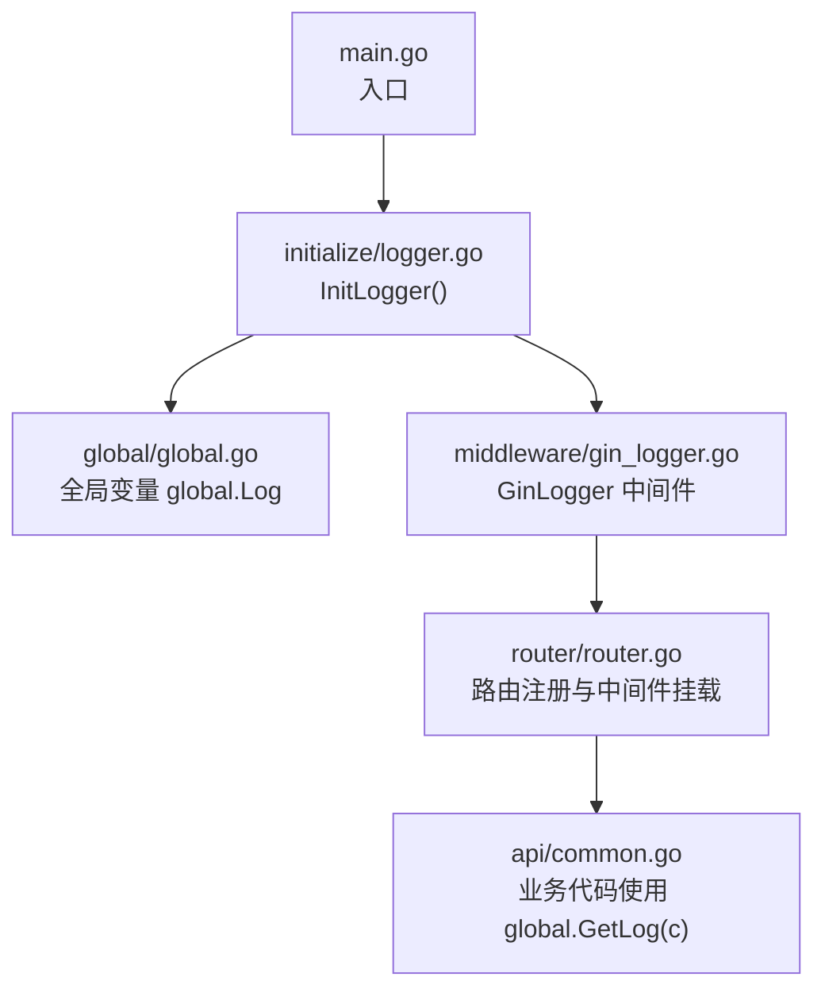
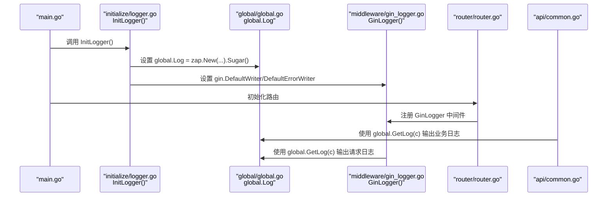
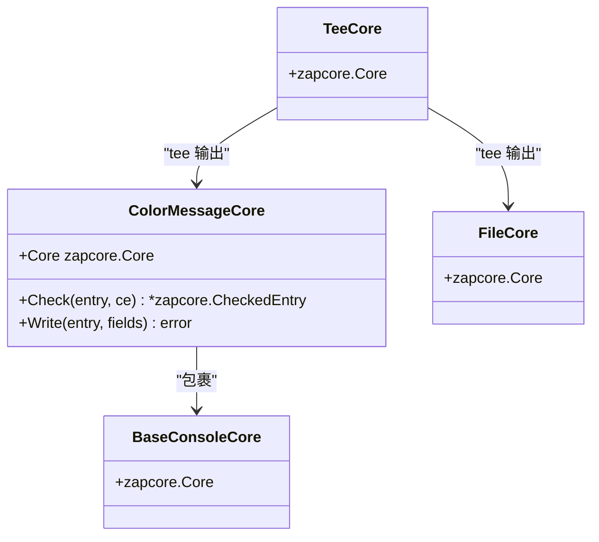
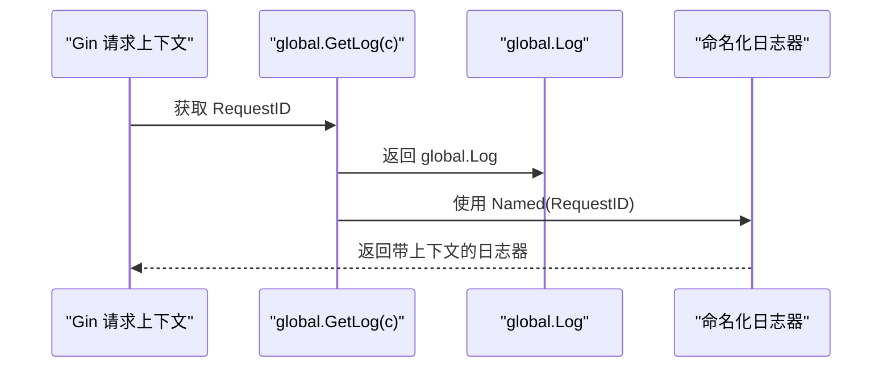
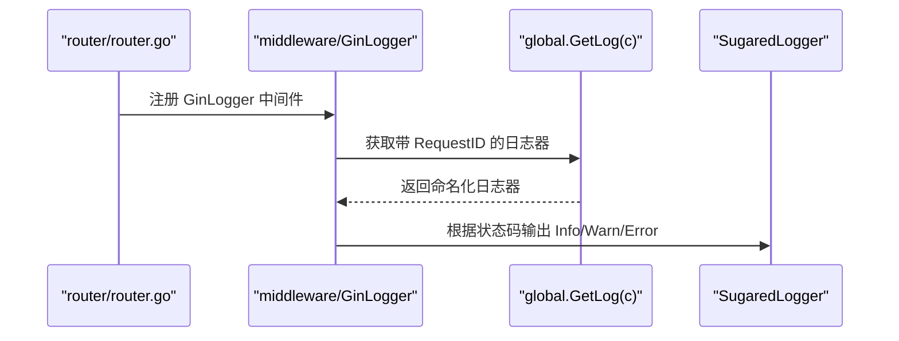
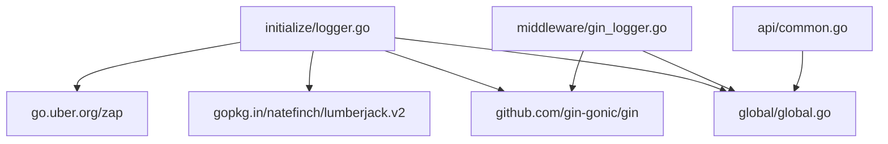

# 日志初始化

<cite>
**本文引用的文件**
- [initialize/logger.go](file://initialize/logger.go)
- [global/global.go](file://global/global.go)
- [main.go](file://main.go)
- [middleware/gin_logger.go](file://middleware/gin_logger.go)
- [router/router.go](file://router/router.go)
- [api/common.go](file://api/common.go)
</cite>

## 目录
1. [简介](#简介)
2. [项目结构](#项目结构)
3. [核心组件](#核心组件)
4. [架构总览](#架构总览)
5. [详细组件分析](#详细组件分析)
6. [依赖关系分析](#依赖关系分析)
7. [性能考量](#性能考量)
8. [故障排查指南](#故障排查指南)
9. [结论](#结论)
10. [附录](#附录)

## 简介
本文件深入解析 initialize/logger.go 中 InitLogger 函数的实现机制，重点说明如何基于 Zap 构建一个支持彩色输出的高性能日志系统。文档涵盖以下要点：
- 自定义 ColorMessageCore 如何拦截并修改日志消息颜色，实现 DEBUG（白色）、INFO（蓝色）、WARN（黄色）、ERROR（红色）的终端高亮显示；
- 日志文件存储路径与滚动策略（Lumberjack：最大 50MB、保留 200 个备份、180 天有效期、压缩开启）；
- 通过 global.Log 进行全局日志实例管理；
- 与 Gin 框架日志系统的集成（gin.DefaultWriter）；
- InitLogger 的调用时机（main 函数早期阶段）及其对后续模块初始化的影响；
- 实际日志输出示例与在业务代码中正确使用 global.Log 的最佳实践。

## 项目结构
本项目的日志初始化位于 initialize/logger.go，全局日志实例由 global.Log 提供，Gin 请求日志通过自定义中间件统一接入；业务层通过 global.GetLog(c) 获取带 RequestID 的命名化日志器。

图表来源
- [main.go](file://main.go#L13-L32)
- [initialize/logger.go](file://initialize/logger.go#L69-L183)
- [global/global.go](file://global/global.go#L11-L31)
- [middleware/gin_logger.go](file://middleware/gin_logger.go#L12-L60)
- [router/router.go](file://router/router.go#L11-L32)
- [api/common.go](file://api/common.go#L82-L174)

章节来源
- [main.go](file://main.go#L13-L32)
- [initialize/logger.go](file://initialize/logger.go#L69-L183)
- [global/global.go](file://global/global.go#L11-L31)
- [middleware/gin_logger.go](file://middleware/gin_logger.go#L12-L60)
- [router/router.go](file://router/router.go#L11-L32)
- [api/common.go](file://api/common.go#L82-L174)

## 核心组件
- InitLogger：完成日志系统初始化，包括目录创建、文件滚动配置、编码器配置、Core 组合、全局日志实例设置、Gin Writer 集成等。
- ColorMessageCore：自定义 Core，覆写 Check 与 Write，实现按日志级别对消息内容进行颜色包装。
- global.Log：全局 SugaredLogger，供业务代码直接使用。
- global.GetLog(c)：在 Gin 请求上下文中注入 RequestID，并以命名方式返回带上下文的日志器。
- GinLogger 中间件：统一输出请求级日志，自动根据状态码选择日志级别。

章节来源
- [initialize/logger.go](file://initialize/logger.go#L16-L66)
- [initialize/logger.go](file://initialize/logger.go#L69-L183)
- [global/global.go](file://global/global.go#L11-L31)
- [middleware/gin_logger.go](file://middleware/gin_logger.go#L12-L60)

## 架构总览
下图展示日志系统在应用中的整体交互流程：InitLogger 在应用启动早期完成初始化，随后业务代码通过 global.Log 或 global.GetLog(c) 输出日志；Gin 请求日志通过自定义中间件统一接入，最终所有日志同时输出到控制台与文件。

图表来源
- [main.go](file://main.go#L13-L32)
- [initialize/logger.go](file://initialize/logger.go#L144-L183)
- [global/global.go](file://global/global.go#L11-L31)
- [middleware/gin_logger.go](file://middleware/gin_logger.go#L12-L60)
- [router/router.go](file://router/router.go#L11-L32)
- [api/common.go](file://api/common.go#L82-L174)

## 详细组件分析

### InitLogger 函数实现机制
- 目录与文件路径
  - 日志目录：./log
  - 日志文件名：practice_problems.log
  - 若目录不存在则自动创建
- Lumberjack 滚动策略
  - 最大文件大小：50 MB
  - 备份数量：200
  - 保留天数：180
  - 压缩开关：开启
- 编码器配置
  - 文件编码器：纯文本，字段键名与时间、级别、调用者等编码器均采用简洁格式
  - 控制台编码器：在时间、级别、名称、调用者等处添加 ANSI 颜色，便于终端阅读
- Core 组合
  - 控制台 Core：使用 ConsoleEncoder，输出到 os.Stdout
  - ColorMessageCore：包裹控制台 Core，覆写 Write 对消息内容进行颜色包装
  - 文件 Core：使用 ConsoleEncoder，输出到 Lumberjack Hook
  - 组合策略：tee 将日志同时写入控制台与文件
- 全局日志实例
  - 通过 zap.New(core, zap.AddCaller()).Sugar() 创建 SugaredLogger，并赋值给 global.Log
- Gin 集成
  - gin.DefaultWriter 与 gin.DefaultErrorWriter 设置为 MultiWriter(os.Stdout, hook)，使 Gin 的日志也走同一套输出通道
- 调用时机与影响
  - 在 main 函数早期调用，确保后续模块（如数据库初始化、路由注册）均可安全使用 global.Log
  - Gin 的默认日志输出被接管，统一到自定义编码器与颜色策略

章节来源
- [initialize/logger.go](file://initialize/logger.go#L69-L183)

### ColorMessageCore 结构体与颜色策略
- 结构体设计
  - 包装底层 zapcore.Core
  - 覆写 Check：保证使用自定义 Core
  - 覆写 Write：根据日志级别为消息内容追加 ANSI 颜色前缀与重置码
- 颜色映射
  - DEBUG：白色
  - INFO：蓝色
  - WARN：黄色
  - ERROR/FATAL/PANIC：红色
- 效果说明
  - 仅对消息内容（Message）着色，不改变其他字段的编码格式
  - 控制台编码器对时间、级别、名称、调用者等也做了颜色装饰，形成统一风格

图表来源
- [initialize/logger.go](file://initialize/logger.go#L31-L66)
- [initialize/logger.go](file://initialize/logger.go#L151-L173)

章节来源
- [initialize/logger.go](file://initialize/logger.go#L31-L66)
- [initialize/logger.go](file://initialize/logger.go#L151-L173)

### 全局日志实例 global.Log 与命名化日志器
- global.Log
  - 类型：*zap.SugaredLogger
  - 作用：全局共享的日志实例，业务代码可直接使用
- global.GetLog(c)
  - 在 Gin 请求上下文中提取 RequestID
  - 使用 Named(RequestID) 返回命名化的日志器，使每条请求日志都带有唯一标识，便于追踪
  - 注意：不要自行拼接方括号，颜色与格式已在全局编码器中统一处理

图表来源
- [global/global.go](file://global/global.go#L16-L31)

章节来源
- [global/global.go](file://global/global.go#L11-L31)

### Gin 框架日志系统集成
- 中间件 GinLogger
  - 计算耗时、拼接请求信息，按状态码选择日志级别（5xx/Error、4xx/Warn、2xx/Info）
  - 使用 global.GetLog(c) 获取命名化日志器，输出统一格式的请求日志
- 路由注册
  - 在 router.InitRouter 中先挂载 RequestID 中间件，再挂载 GinLogger 中间件，确保 RequestID 可用
- Writer 集成
  - InitLogger 将 gin.DefaultWriter/DefaultErrorWriter 设为 MultiWriter(os.Stdout, hook)，使 Gin 的日志与业务日志一致

图表来源
- [router/router.go](file://router/router.go#L11-L32)
- [middleware/gin_logger.go](file://middleware/gin_logger.go#L12-L60)
- [global/global.go](file://global/global.go#L16-L31)

章节来源
- [router/router.go](file://router/router.go#L11-L32)
- [middleware/gin_logger.go](file://middleware/gin_logger.go#L12-L60)
- [global/global.go](file://global/global.go#L16-L31)

### 日志文件存储路径与滚动策略
- 存储路径
  - 目录：./log
  - 文件名：practice_problems.log
- 滚动策略（Lumberjack）
  - MaxSize：50（MB）
  - MaxBackups：200
  - MaxAge：180（天）
  - Compress：true
- 影响
  - 控制台彩色输出便于开发调试
  - 文件滚动避免磁盘占用过大，便于长期留存与审计

章节来源
- [initialize/logger.go](file://initialize/logger.go#L69-L83)
- [initialize/logger.go](file://initialize/logger.go#L164-L169)

### 实际日志输出示例
- 启动时输出
  - InitLogger 内部会输出一条“已启动”提示，以及一条警告与一条错误示例，用于验证颜色效果
- 业务日志示例
  - 上传图片失败：使用 Errorf 记录错误详情
  - 上传图片被拒（越权/数量超限）：使用 Warnf 记录告警
  - 成功上传：使用 Infof 记录成功信息
- 请求日志示例
  - GinLogger 根据状态码输出 Info/Warn/Error，统一格式包含状态码、耗时、客户端 IP、方法与路径

章节来源
- [initialize/logger.go](file://initialize/logger.go#L180-L183)
- [api/common.go](file://api/common.go#L82-L174)
- [middleware/gin_logger.go](file://middleware/gin_logger.go#L41-L59)

### 在业务代码中正确使用 global.Log
- 全局日志
  - 适用于非请求上下文场景，或需要跨模块共享的日志
  - 通过 global.Log 直接调用 Info/Warn/Error 等方法
- 带 RequestID 的日志
  - 在 Gin Handler 中优先使用 global.GetLog(c)，以获得命名化日志器
  - 根据业务语义选择合适的日志级别（Debug/Info/Warn/Error），避免生产环境刷屏
- 最佳实践
  - 错误场景使用 Errorf，记录关键上下文（如用户标识、目标对象 ID、错误原因）
  - 告警场景使用 Warnf，记录异常但可恢复的情况
  - Infof 用于正常流程的确认性日志
  - Debug 仅在开发/测试环境使用，避免在生产环境产生大量日志

章节来源
- [global/global.go](file://global/global.go#L16-L31)
- [api/common.go](file://api/common.go#L82-L174)

## 依赖关系分析
- InitLogger 依赖
  - zap/zapcore：构建 Core、Encoder、AtomicLevel
  - lumberjack：文件滚动
  - gin：设置 DefaultWriter/DefaultErrorWriter
  - global：设置全局日志实例
- GinLogger 依赖
  - global.GetLog(c)：获取命名化日志器
  - gin：读取请求信息与状态码
- 业务代码依赖
  - global.GetLog(c)：在 Handler 中统一输出日志
  - global.Log：全局日志实例

图表来源
- [initialize/logger.go](file://initialize/logger.go#L3-L14)
- [middleware/gin_logger.go](file://middleware/gin_logger.go#L1-L10)
- [global/global.go](file://global/global.go#L1-L15)
- [api/common.go](file://api/common.go#L1-L17)

章节来源
- [initialize/logger.go](file://initialize/logger.go#L3-L14)
- [middleware/gin_logger.go](file://middleware/gin_logger.go#L1-L10)
- [global/global.go](file://global/global.go#L1-L15)
- [api/common.go](file://api/common.go#L1-L17)

## 性能考量
- 高性能日志
  - 使用 zap.NewAtomicLevel 控制日志级别，避免不必要的日志序列化与输出
  - tee 同时输出到控制台与文件，满足开发调试与生产归档需求
- 文件滚动
  - 合理的 MaxSize、MaxBackups、MaxAge 与压缩策略，平衡磁盘占用与检索效率
- 控制台输出
  - 控制台编码器仅对头部字段着色，消息内容由 ColorMessageCore 着色，减少冗余开销
- Gin 集成
  - 将 Gin 默认日志输出统一到 MultiWriter，避免重复 IO 与格式不一致

[本节为通用性能讨论，不涉及具体文件分析]

## 故障排查指南
- 日志目录无法创建
  - 检查运行用户权限与磁盘空间
  - 确认 InitLogger 是否在 main 早期执行
- 颜色不生效
  - 确认终端支持 ANSI 颜色
  - 检查是否在非 TTY 环境（CI/容器）中运行
- 请求日志缺失
  - 确认 GinLogger 已在路由中注册，且 RequestID 中间件在 GinLogger 之前
- 文件未滚动
  - 检查 MaxSize、MaxBackups、MaxAge 配置是否合理
  - 确认 Lumberjack 文件句柄已正确设置

章节来源
- [initialize/logger.go](file://initialize/logger.go#L69-L83)
- [initialize/logger.go](file://initialize/logger.go#L176-L179)
- [router/router.go](file://router/router.go#L11-L32)
- [middleware/gin_logger.go](file://middleware/gin_logger.go#L12-L60)

## 结论
InitLogger 通过自定义 ColorMessageCore 与精心设计的编码器配置，构建了一个兼具终端高亮与文件归档能力的日志系统。结合 global.Log 与 global.GetLog(c) 的命名化日志器，实现了跨模块、跨中间件的一致日志体验。Gin 的日志输出也被统一接管，确保请求级日志与业务日志风格一致。合理的滚动策略与原子级别控制，兼顾了开发效率与生产稳定性。

[本节为总结性内容，不涉及具体文件分析]

## 附录
- 调用时机
  - main 函数早期调用 InitLogger，确保后续模块初始化与业务代码均可安全使用 global.Log
- 关键路径参考
  - 初始化入口：[main.go](file://main.go#L13-L32)
  - 日志初始化：[initialize/logger.go](file://initialize/logger.go#L69-L183)
  - 全局日志实例：[global/global.go](file://global/global.go#L11-L15)
  - 请求日志中间件：[middleware/gin_logger.go](file://middleware/gin_logger.go#L12-L60)
  - 路由注册与中间件挂载：[router/router.go](file://router/router.go#L11-L32)
  - 业务日志使用示例：[api/common.go](file://api/common.go#L82-L174)