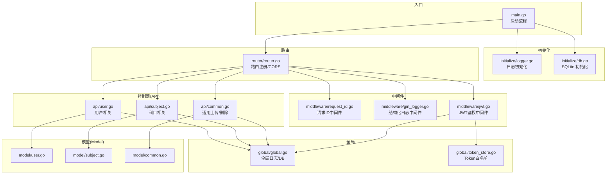
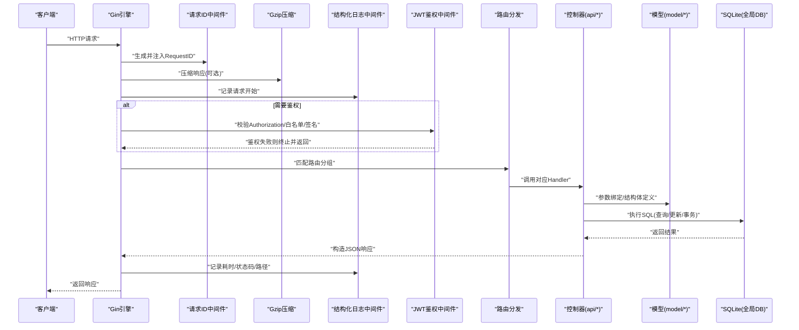
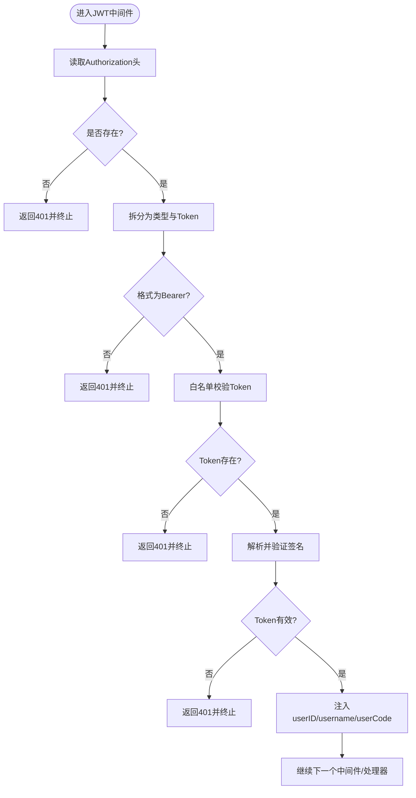
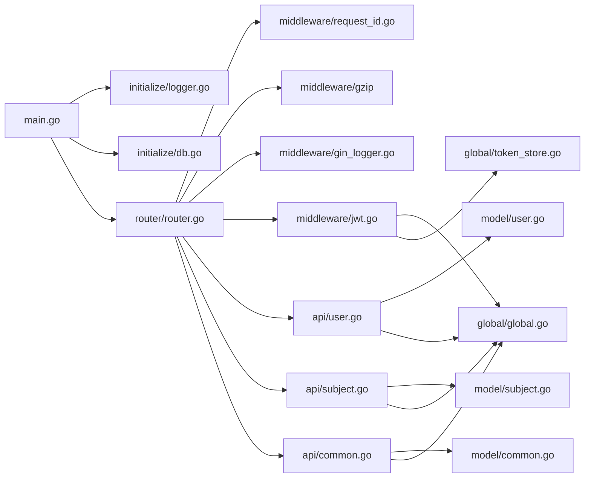

# 后端架构

<cite>
**本文引用的文件**
- [main.go](file://main.go)
- [router/router.go](file://router/router.go)
- [initialize/db.go](file://initialize/db.go)
- [initialize/logger.go](file://initialize/logger.go)
- [middleware/jwt.go](file://middleware/jwt.go)
- [middleware/gin_logger.go](file://middleware/gin_logger.go)
- [middleware/request_id.go](file://middleware/request_id.go)
- [global/global.go](file://global/global.go)
- [global/token_store.go](file://global/token_store.go)
- [api/user.go](file://api/user.go)
- [api/subject.go](file://api/subject.go)
- [api/common.go](file://api/common.go)
- [model/user.go](file://model/user.go)
- [model/subject.go](file://model/subject.go)
- [model/common.go](file://model/common.go)
- [config/config.go](file://config/config.go)
- [go.mod](file://go.mod)
</cite>

## 目录
1. [简介](#简介)
2. [项目结构](#项目结构)
3. [核心组件](#核心组件)
4. [架构总览](#架构总览)
5. [详细组件分析](#详细组件分析)
6. [依赖关系分析](#依赖关系分析)
7. [性能考量](#性能考量)
8. [故障排查指南](#故障排查指南)
9. [结论](#结论)

## 简介
本项目采用基于 Gin 的 MVC 分层设计，围绕“启动流程—中间件—路由—控制器—模型—数据库”展开，形成清晰的职责边界与可维护性。核心特性包括：
- 启动顺序严格：日志初始化 → 数据库初始化 → 路由初始化 → HTTP 服务启动
- 中间件体系：请求 ID 生成、结构化日志、JWT 鉴权、跨域、压缩
- 路由分组：公开接口与认证接口分离，认证接口统一挂载 JWT 中间件
- 控制器层：接收请求、参数校验、调用模型层、返回 JSON 响应
- 模型层：定义请求/响应结构体，封装数据库交互细节
- 全局管理：日志、数据库、Token 白名单集中管理

## 项目结构
项目采用按职责分层的组织方式：
- initialize：系统初始化（日志、数据库）
- middleware：中间件（JWT、日志、请求 ID）
- router：路由注册与 CORS
- api：控制器（用户、科目、通用上传等）
- model：数据模型（请求/响应结构体）
- global：全局变量与 Token 白名单
- config：配置结构（MySQL 示例）

图表来源
- [main.go](file://main.go#L1-L32)
- [initialize/logger.go](file://initialize/logger.go#L69-L184)
- [initialize/db.go](file://initialize/db.go#L14-L89)
- [router/router.go](file://router/router.go#L11-L109)
- [middleware/request_id.go](file://middleware/request_id.go#L10-L28)
- [middleware/gin_logger.go](file://middleware/gin_logger.go#L11-L61)
- [middleware/jwt.go](file://middleware/jwt.go#L39-L101)
- [api/user.go](file://api/user.go#L55-L95)
- [api/subject.go](file://api/subject.go#L19-L79)
- [api/common.go](file://api/common.go#L25-L174)
- [model/user.go](file://model/user.go#L1-L35)
- [model/subject.go](file://model/subject.go#L1-L24)
- [model/common.go](file://model/common.go#L1-L14)
- [global/global.go](file://global/global.go#L11-L32)
- [global/token_store.go](file://global/token_store.go#L1-L50)

章节来源
- [main.go](file://main.go#L13-L32)
- [router/router.go](file://router/router.go#L11-L109)
- [initialize/logger.go](file://initialize/logger.go#L69-L184)
- [initialize/db.go](file://initialize/db.go#L14-L89)
- [middleware/request_id.go](file://middleware/request_id.go#L10-L28)
- [middleware/gin_logger.go](file://middleware/gin_logger.go#L11-L61)
- [middleware/jwt.go](file://middleware/jwt.go#L39-L101)
- [global/global.go](file://global/global.go#L11-L32)
- [global/token_store.go](file://global/token_store.go#L1-L50)

## 核心组件
- 启动流程：main.go 依次调用日志初始化、SQLite 初始化、路由初始化，最后运行 HTTP 服务
- 路由注册：router/router.go 使用 gin.New() 自定义中间件栈，分组注册公开与认证接口
- 中间件：
  - 请求 ID：为每个请求生成短 ID 并注入响应头，便于链路追踪
  - 结构化日志：统一输出请求耗时、状态码、客户端 IP、方法与路径
  - JWT 鉴权：校验 Authorization 头、Token 白名单、签名与有效期
- 控制器：api/* 接收请求，参数绑定与校验，调用 global.DB 执行 SQL，返回 JSON
- 模型：model/* 定义请求/响应结构体，避免控制器直接耦合数据库字段
- 全局：global/global.go 管理 DB 与日志；global/token_store.go 提供 Token 白名单的并发安全存取

章节来源
- [main.go](file://main.go#L13-L32)
- [router/router.go](file://router/router.go#L11-L109)
- [middleware/request_id.go](file://middleware/request_id.go#L10-L28)
- [middleware/gin_logger.go](file://middleware/gin_logger.go#L11-L61)
- [middleware/jwt.go](file://middleware/jwt.go#L39-L101)
- [api/user.go](file://api/user.go#L55-L95)
- [api/subject.go](file://api/subject.go#L19-L79)
- [api/common.go](file://api/common.go#L25-L174)
- [model/user.go](file://model/user.go#L1-L35)
- [model/subject.go](file://model/subject.go#L1-L24)
- [global/global.go](file://global/global.go#L11-L32)
- [global/token_store.go](file://global/token_store.go#L1-L50)

## 架构总览
下图展示了从 HTTP 接入到响应返回的完整生命周期，涵盖中间件处理、路由分发、业务逻辑执行与数据持久化。

图表来源
- [main.go](file://main.go#L13-L32)
- [router/router.go](file://router/router.go#L11-L109)
- [middleware/request_id.go](file://middleware/request_id.go#L10-L28)
- [middleware/gin_logger.go](file://middleware/gin_logger.go#L11-L61)
- [middleware/jwt.go](file://middleware/jwt.go#L39-L101)
- [api/user.go](file://api/user.go#L55-L95)
- [api/subject.go](file://api/subject.go#L19-L79)
- [api/common.go](file://api/common.go#L25-L174)
- [initialize/db.go](file://initialize/db.go#L14-L89)
- [global/global.go](file://global/global.go#L11-L32)

## 详细组件分析

### 启动流程与初始化
- main.go 顺序：InitLogger → InitSQLite → InitRouter → r.Run
- 初始化日志：initialize/logger.go 使用 zap + lumberjack，同时输出到控制台与文件，支持彩色日志与命名 logger（带 RequestID）
- 初始化数据库：initialize/db.go 使用 modernc.org/sqlite 驱动，启用 WAL、同步模式、外键约束，设置连接池，创建/维护表结构

章节来源
- [main.go](file://main.go#L13-L32)
- [initialize/logger.go](file://initialize/logger.go#L69-L184)
- [initialize/db.go](file://initialize/db.go#L14-L89)

### 路由与中间件
- 路由注册：router/router.go 使用 gin.New() 自定义中间件栈，静态资源映射 uploads 目录
- 中间件顺序（重要）：RequestID → GinLogger → Recovery → CORS
- 认证接口：v1 分组下以 auth 组挂载 JWTAuthMiddleware，覆盖用户资料、上传、分享、科目/分类/知识点/题目等接口
- 公开接口：注册/登录等无需 Token

章节来源
- [router/router.go](file://router/router.go#L11-L109)
- [middleware/request_id.go](file://middleware/request_id.go#L10-L28)
- [middleware/gin_logger.go](file://middleware/gin_logger.go#L11-L61)
- [middleware/jwt.go](file://middleware/jwt.go#L39-L101)

### JWT 鉴权中间件
- 校验步骤：检查 Authorization 头格式、从白名单校验 Token、解析并验证签名、将用户信息注入上下文
- 白名单：global/token_store.go 提供 SaveToken/VerifyToken/RemoveToken，基于并发安全 map
- 日志：不同失败场景记录 Warn/Error，调试阶段可调整级别

图表来源
- [middleware/jwt.go](file://middleware/jwt.go#L39-L101)
- [global/token_store.go](file://global/token_store.go#L1-L50)

章节来源
- [middleware/jwt.go](file://middleware/jwt.go#L39-L101)
- [global/token_store.go](file://global/token_store.go#L1-L50)

### 结构化日志中间件
- 记录内容：状态码、耗时（毫秒）、客户端 IP、方法、路径
- 日志级别：5xx 错误用 Error，4xx 用 Warn，2xx 用 Info
- 日志来源：global.GetLog(c) 返回带 RequestID 的 SugaredLogger

章节来源
- [middleware/gin_logger.go](file://middleware/gin_logger.go#L11-L61)
- [global/global.go](file://global/global.go#L16-L32)

### 请求 ID 中间件
- 生成策略：UUID → 清理横线 → 取前 8 位 → 注入上下文与响应头 X-Request-ID
- 作用：统一日志标识，便于链路追踪与问题定位

章节来源
- [middleware/request_id.go](file://middleware/request_id.go#L10-L28)
- [global/global.go](file://global/global.go#L16-L32)

### 控制器层（示例：用户与科目）
- 用户模块（api/user.go）：
  - 注册：参数绑定、双 MD5 + bcrypt、生成唯一 user_code、入库
  - 登录：优先尝试 Token 登录（白名单+解析），否则账号密码登录（bcrypt 校验），生成新 Token 并写入白名单
  - 修改资料/密码：旧密码校验（双 MD5）与新密码保存（双 MD5 + bcrypt）
  - 退出：从白名单移除 Token
- 科目模块（api/subject.go）：
  - 列表/详情：基于 user_subjects 关联查询，支持有效期与作者过滤
  - 创建：事务插入 subjects 与 user_subjects
  - 更新/删除：鉴权仅限创建者，更新/删除时写入更新时间
  - 授权管理：更新有效期、批量更新/移除授权

章节来源
- [api/user.go](file://api/user.go#L55-L95)
- [api/user.go](file://api/user.go#L100-L170)
- [api/user.go](file://api/user.go#L172-L240)
- [api/user.go](file://api/user.go#L242-L342)
- [api/subject.go](file://api/subject.go#L19-L79)
- [api/subject.go](file://api/subject.go#L134-L185)
- [api/subject.go](file://api/subject.go#L187-L310)
- [api/subject.go](file://api/subject.go#L312-L508)

### 通用上传与删除（api/common.go）
- 上传：校验文件大小、权限（仅科目创建者可上传）、JSON 图片列表上限（10 张）、保存文件并更新数据库
- 删除：安全路径校验，支持独立文件删除

章节来源
- [api/common.go](file://api/common.go#L25-L174)
- [api/common.go](file://api/common.go#L176-L222)

### 模型层（model/*）
- 用户：RegisterReq/LoginReq/UpdateUserReq/DbUser
- 科目：Subject/CreateSubjectRequest/UpdateSubjectRequest
- 通用：DeletePointImageRequest/ImageItem

章节来源
- [model/user.go](file://model/user.go#L1-L35)
- [model/subject.go](file://model/subject.go#L1-L24)
- [model/common.go](file://model/common.go#L1-L14)

### 全局管理（global/*）
- DB/Log：全局变量，供中间件与控制器使用
- TokenStore：并发安全 map，提供 SaveToken/VerifyToken/RemoveToken/ClearUserTokens

章节来源
- [global/global.go](file://global/global.go#L11-L32)
- [global/token_store.go](file://global/token_store.go#L1-L50)

## 依赖关系分析
- 启动依赖：main.go 依赖 initialize/logger.go 与 initialize/db.go；router/router.go 依赖 api/* 与 middleware/*
- 中间件依赖：jwt.go 依赖 global/token_store.go 与 global/global.go；gin_logger.go 依赖 global/global.go；request_id.go 依赖 gin
- 控制器依赖：api/* 依赖 model/* 与 global/global.go；部分接口依赖 global.DB
- 数据库：initialize/db.go 依赖 modernc.org/sqlite，初始化 WAL、同步、外键与连接池

图表来源
- [main.go](file://main.go#L13-L32)
- [router/router.go](file://router/router.go#L11-L109)
- [middleware/request_id.go](file://middleware/request_id.go#L10-L28)
- [middleware/gin_logger.go](file://middleware/gin_logger.go#L11-L61)
- [middleware/jwt.go](file://middleware/jwt.go#L39-L101)
- [api/user.go](file://api/user.go#L55-L95)
- [api/subject.go](file://api/subject.go#L19-L79)
- [api/common.go](file://api/common.go#L25-L174)
- [model/user.go](file://model/user.go#L1-L35)
- [model/subject.go](file://model/subject.go#L1-L24)
- [model/common.go](file://model/common.go#L1-L14)
- [global/global.go](file://global/global.go#L11-L32)
- [global/token_store.go](file://global/token_store.go#L1-L50)

章节来源
- [go.mod](file://go.mod#L1-L63)
- [config/config.go](file://config/config.go#L1-L16)

## 性能考量
- 数据库连接池：SQLite 初始化设置最大空闲/打开连接数与连接生命周期，有助于提升并发与稳定性
- WAL 模式：启用 WAL 提升并发读写性能
- 压缩中间件：gzip.Gzip 对响应进行压缩，降低带宽占用
- 日志级别：生产环境建议将调试日志降级，避免高频 Debug 影响性能
- 事务：创建科目等关键写入使用事务，保证一致性与原子性

章节来源
- [initialize/db.go](file://initialize/db.go#L66-L89)
- [router/router.go](file://router/router.go#L11-L26)
- [middleware/gin_logger.go](file://middleware/gin_logger.go#L11-L61)
- [api/subject.go](file://api/subject.go#L134-L185)

## 故障排查指南
- 启动失败：检查日志初始化与数据库初始化是否成功，确认 uploads 目录可写
- 401 未授权：确认 Authorization 头格式为 Bearer Token，且 Token 在白名单中有效
- 403 权限不足：确认操作对象（如科目）的创建者与当前用户一致
- 上传失败：检查文件大小限制、目录权限（0755）、JSON 图片列表是否达到上限
- 数据库异常：查看 WAL/同步/外键设置日志，确认表结构初始化完成

章节来源
- [initialize/logger.go](file://initialize/logger.go#L69-L184)
- [initialize/db.go](file://initialize/db.go#L14-L89)
- [middleware/jwt.go](file://middleware/jwt.go#L39-L101)
- [api/subject.go](file://api/subject.go#L187-L310)
- [api/common.go](file://api/common.go#L25-L174)

## 结论
本项目以 Gin 为核心，构建了清晰的 MVC 分层与中间件体系，通过严格的初始化顺序、结构化日志与 JWT 白名单机制，实现了高内聚、低耦合的服务端架构。配合 SQLite 的 WAL/外键/连接池优化与 gzip 压缩，兼顾了性能与可维护性。建议在生产环境中进一步完善配置加载、错误码标准化与可观测性指标采集。