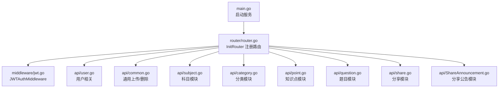
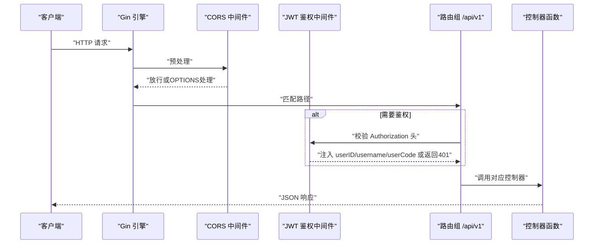
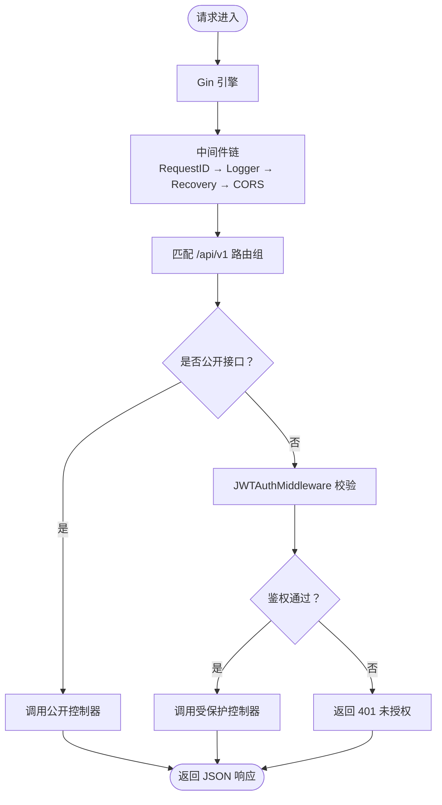
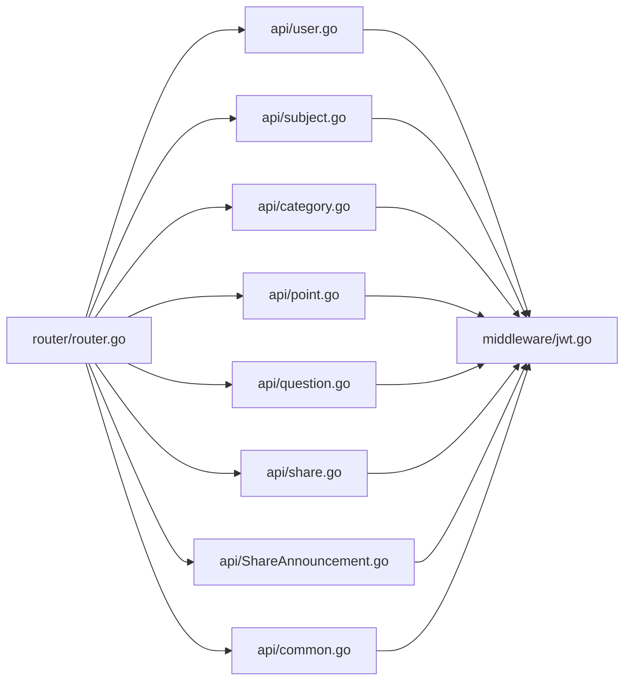

# 路由与控制器

<cite>
**本文引用的文件**
- [router/router.go](file://router/router.go)
- [main.go](file://main.go)
- [middleware/jwt.go](file://middleware/jwt.go)
- [api/user.go](file://api/user.go)
- [api/common.go](file://api/common.go)
- [api/subject.go](file://api/subject.go)
- [api/category.go](file://api/category.go)
- [api/point.go](file://api/point.go)
- [api/question.go](file://api/question.go)
- [api/share.go](file://api/share.go)
- [api/ShareAnnouncement.go](file://api/ShareAnnouncement.go)
</cite>

## 目录
1. [简介](#简介)
2. [项目结构](#项目结构)
3. [核心组件](#核心组件)
4. [架构总览](#架构总览)
5. [详细组件分析](#详细组件分析)
6. [依赖关系分析](#依赖关系分析)
7. [性能考量](#性能考量)
8. [故障排查指南](#故障排查指南)
9. [结论](#结论)
10. [附录：API端点清单](#附录api端点清单)

## 简介
本项目基于 Gin 框架构建 RESTful API，采用版本化路由（/api/v1）与统一 JWT 身份验证中间件，将公开接口与受保护接口清晰分离。路由层通过 router/router.go 的 InitRouter 函数集中注册，控制器层位于 api/*.go 文件中，围绕用户、科目、分类、知识点、题目、分享与公告等模块展开。本文档将系统性解析路由分发、鉴权机制、各模块控制器的实现要点、Gin 上下文的常用用法，以及完整的 API 端点清单与请求流程图。

## 项目结构
- 路由与入口
  - main.go：初始化日志、数据库、路由并启动服务
  - router/router.go：集中注册 /api/v1 下的公开与受保护路由
- 中间件
  - middleware/jwt.go：JWT 鉴权中间件，注入 userID、username、userCode
- 控制器
  - api/user.go：用户注册、登录、退出、资料与密码更新
  - api/common.go：通用上传、删除独立文件
  - api/subject.go：科目列表、详情、创建、更新、删除、授权管理
  - api/category.go：分类列表、创建、更新、删除、排序
  - api/point.go：知识点列表、详情、创建、更新、删除、排序、图片删除
  - api/question.go：题目列表、创建、更新、删除、用户备注
  - api/share.go：分享码创建、绑定、列表、更新、删除；定向授权
  - api/ShareAnnouncement.go：分享公告发布、列表、更新、删除

图表来源
- [main.go](file://main.go#L1-L32)
- [router/router.go](file://router/router.go#L1-L109)
- [middleware/jwt.go](file://middleware/jwt.go#L1-L101)
- [api/user.go](file://api/user.go#L1-L342)
- [api/common.go](file://api/common.go#L1-L222)
- [api/subject.go](file://api/subject.go#L1-L508)
- [api/category.go](file://api/category.go#L1-L387)
- [api/point.go](file://api/point.go#L1-L538)
- [api/question.go](file://api/question.go#L1-L425)
- [api/share.go](file://api/share.go#L1-L580)
- [api/ShareAnnouncement.go](file://api/ShareAnnouncement.go#L1-L224)

章节来源
- [main.go](file://main.go#L1-L32)
- [router/router.go](file://router/router.go#L1-L109)

## 核心组件
- 路由引擎与中间件链
  - 使用 gin.New() 自定义中间件顺序：RequestID → 自定义日志 → Recovery → CORS → 路由组
  - v1.Group('/api/v1') 实现版本化路由
- 鉴权中间件
  - JWTAuthMiddleware 校验 Authorization 头、白名单校验、解析 Claims 并注入 userID、username、userCode
- 控制器职责
  - 参数解析：c.ShouldBindJSON、c.Query、c.Param、c.PostForm、c.GetHeader
  - 业务逻辑：数据库事务、权限校验、外键约束处理
  - 错误处理：状态码与统一响应结构
  - 日志：全局日志记录器记录错误与成功路径

章节来源
- [router/router.go](file://router/router.go#L1-L109)
- [middleware/jwt.go](file://middleware/jwt.go#L1-L101)
- [api/user.go](file://api/user.go#L1-L342)
- [api/common.go](file://api/common.go#L1-L222)

## 架构总览
Gin 引擎启动后，按顺序加载中间件，随后注册 /api/v1 路由组。公开接口无需 Token，受保护接口统一挂载 JWTAuthMiddleware。控制器函数接收 Gin 上下文，完成参数解析、权限校验、数据库操作与响应输出。

图表来源
- [router/router.go](file://router/router.go#L1-L109)
- [middleware/jwt.go](file://middleware/jwt.go#L1-L101)

## 详细组件分析

### 路由与鉴权机制
- InitRouter
  - 使用 gzip、自定义日志、Recovery、CORS、静态资源
  - v1.Group('/api/v1') 下注册公开接口与受保护接口
  - auth := v1.Group('/') 并挂载 JWTAuthMiddleware()，使后续所有子路由均为受保护
- JWTAuthMiddleware
  - 校验 Authorization 头格式与白名单有效性
  - 解析 JWT 并将 Claims 注入上下文（userID、username、userCode）

章节来源
- [router/router.go](file://router/router.go#L1-L109)
- [middleware/jwt.go](file://middleware/jwt.go#L1-L101)

### 用户模块
- 公开接口
  - POST /api/v1/auth/register：创建用户（参数绑定、双MD5+bcrypt、唯一编码生成）
  - POST /api/v1/auth/login：Token 自动登录与账号密码登录
- 受保护接口
  - PUT /api/v1/user/profile：更新用户信息/密码（旧密码校验、新密码加密）
  - POST /api/v1/auth/logout：退出登录（移除白名单）

章节来源
- [router/router.go](file://router/router.go#L33-L60)
- [api/user.go](file://api/user.go#L1-L342)

### 资源管理模块（科目/分类/知识点/题目）
- 科目
  - GET /api/v1/subjects、GET /api/v1/subjects/:id：列表与详情（含作者信息）
  - POST /api/v1/subjects、PUT /api/v1/subjects/:id、DELETE /api/v1/subjects/:id：创建、更新、删除
  - PUT /api/v1/auth/:id、DELETE /api/v1/auth/:id、PUT /api/v1/auth/batch/update、PUT /api/v1/auth/batch/remove：授权管理
  - GET /api/v1/subject/:id/users：授权用户列表（分页、搜索、排序）
- 分类
  - GET /api/v1/categories、POST /api/v1/categories、PUT /api/v1/categories/:id、DELETE /api/v1/categories/:id：CRUD
  - POST /api/v1/categories/:id/sort：排序（上移/下移/置顶）
- 知识点
  - GET /api/v1/points、GET /api/v1/points/:id：列表与详情
  - POST /api/v1/points、PUT /api/v1/points/:id、DELETE /api/v1/points/:id：CRUD
  - DELETE /api/v1/points/:id/image：删除知识点图片（JSON字段维护）
  - PUT /api/v1/points/:id/sort：排序
- 题目
  - GET /api/v1/questions：列表（支持按知识点或分类，带用户备注）
  - POST /api/v1/questions、PUT /api/v1/questions/:id、DELETE /api/v1/questions/:id：CRUD
  - POST /api/v1/questions/note：用户备注（Upsert）

章节来源
- [router/router.go](file://router/router.go#L61-L105)
- [api/subject.go](file://api/subject.go#L1-L508)
- [api/category.go](file://api/category.go#L1-L387)
- [api/point.go](file://api/point.go#L1-L538)
- [api/question.go](file://api/question.go#L1-L425)

### 分享系统
- 公开接口
  - POST /api/v1/upload：通用图片上传（按业务类型与目标ID进行权限校验与数量限制）
- 受保护接口
  - POST /api/v1/share/create：创建分享（定向授权/生成分享码）
  - POST /api/v1/share/bind：绑定资源（智能去重、统计使用次数）
  - GET /api/v1/share/list：获取我创建的分享码列表
  - DELETE /api/v1/share/:id、PUT /api/v1/share/:id：更新/删除分享码
  - POST /api/v1/share/announcement、GET /api/v1/share/announcements、PUT /api/v1/share/announcement/:id、DELETE /api/v1/share/announcement/:id：分享公告 CRUD

章节来源
- [router/router.go](file://router/router.go#L45-L69)
- [api/common.go](file://api/common.go#L1-L222)
- [api/share.go](file://api/share.go#L1-L580)
- [api/ShareAnnouncement.go](file://api/ShareAnnouncement.go#L1-L224)

### 控制器实现要点与Gin上下文用法
- 参数解析
  - c.ShouldBindJSON：解析 JSON 请求体
  - c.Query/c.DefaultQuery：解析查询参数
  - c.Param：解析路径参数
  - c.PostForm：解析表单字段
  - c.GetHeader：解析头部字段（如 Authorization）
- 响应与错误处理
  - 统一返回结构：{"code": 整数, "msg": 字符串, "data": 对象或数组}
  - 根据业务场景返回 200/4xx/5xx
- 权限与鉴权
  - 通过 c.Get("userID"/"userCode") 获取用户上下文
  - 针对资源归属与授权进行校验（作者/订阅者）
- 数据库与事务
  - 使用 global.DB 执行 SQL
  - 对关键操作使用事务（Begin/Commit/Rollback）
- 日志
  - 使用全局日志记录器记录错误与成功路径

章节来源
- [api/user.go](file://api/user.go#L1-L342)
- [api/subject.go](file://api/subject.go#L1-L508)
- [api/category.go](file://api/category.go#L1-L387)
- [api/point.go](file://api/point.go#L1-L538)
- [api/question.go](file://api/question.go#L1-L425)
- [api/share.go](file://api/share.go#L1-L580)
- [api/ShareAnnouncement.go](file://api/ShareAnnouncement.go#L1-L224)
- [api/common.go](file://api/common.go#L1-L222)

### 路由分发流程图（代码级映射）

图表来源
- [router/router.go](file://router/router.go#L1-L109)
- [middleware/jwt.go](file://middleware/jwt.go#L1-L101)

## 依赖关系分析
- 路由到控制器
  - router/router.go 将 HTTP 方法与路径映射到 api/*.go 的控制器函数
- 控制器到中间件
  - 受保护路由依赖 middleware/jwt.go 提供的鉴权上下文
- 控制器到数据库
  - 所有控制器通过 global.DB 执行 SQL，部分使用事务
- 控制器到模型
  - api/*.go 使用 model/*.go 中的数据结构（如 CreateSubjectRequest、KnowledgePoint 等）

图表来源
- [router/router.go](file://router/router.go#L1-L109)
- [middleware/jwt.go](file://middleware/jwt.go#L1-L101)
- [api/user.go](file://api/user.go#L1-L342)
- [api/subject.go](file://api/subject.go#L1-L508)
- [api/category.go](file://api/category.go#L1-L387)
- [api/point.go](file://api/point.go#L1-L538)
- [api/question.go](file://api/question.go#L1-L425)
- [api/share.go](file://api/share.go#L1-L580)
- [api/ShareAnnouncement.go](file://api/ShareAnnouncement.go#L1-L224)
- [api/common.go](file://api/common.go#L1-L222)

## 性能考量
- 中间件顺序
  - RequestID 放在首位，便于日志追踪
  - 自定义日志与 Recovery 顺序合理，避免 panic 导致进程崩溃
- 压缩与跨域
  - gzip.Gzip 提升传输效率
  - CORS 中间件对 OPTIONS 预检快速返回
- 数据库与事务
  - 对关键写操作使用事务，保证一致性
  - 合理使用索引与查询条件，避免全表扫描
- 日志与安全
  - 鉴权失败与业务错误记录日志，便于定位问题
  - 对敏感操作（删除、更新）进行权限校验与白名单校验

[本节为通用指导，不涉及具体文件分析]

## 故障排查指南
- 401 未授权
  - 检查 Authorization 头是否为 Bearer Token
  - 确认 Token 是否在白名单中且未过期
- 403 无权访问
  - 校验资源归属（作者/订阅者）与授权状态
  - 检查过期时间与权限范围
- 500 服务器错误
  - 查看日志中错误堆栈
  - 检查数据库连接、事务提交与外键约束
- 参数错误
  - 使用 c.ShouldBindJSON 返回的错误信息定位字段
  - 校验必填字段与格式（如时间格式、长度限制）

章节来源
- [middleware/jwt.go](file://middleware/jwt.go#L1-L101)
- [api/user.go](file://api/user.go#L1-L342)
- [api/subject.go](file://api/subject.go#L1-L508)
- [api/category.go](file://api/category.go#L1-L387)
- [api/point.go](file://api/point.go#L1-L538)
- [api/question.go](file://api/question.go#L1-L425)
- [api/share.go](file://api/share.go#L1-L580)
- [api/ShareAnnouncement.go](file://api/ShareAnnouncement.go#L1-L224)
- [api/common.go](file://api/common.go#L1-L222)

## 结论
本项目以 Gin 为核心，通过版本化路由与统一 JWT 鉴权中间件，清晰地划分公开与受保护接口。控制器围绕用户与资源管理模块展开，实现了完善的参数解析、权限校验、事务处理与日志记录。整体架构简洁、职责明确，具备良好的扩展性与可维护性。

[本节为总结，不涉及具体文件分析]

## 附录：API端点清单

- 公开接口
  - POST /api/v1/auth/register
    - 认证要求：无需 Token
    - 功能：创建用户（参数绑定、双MD5+bcrypt、唯一编码生成）
  - POST /api/v1/auth/login
    - 认证要求：无需 Token
    - 功能：Token 自动登录或账号密码登录

- 受保护接口
  - PUT /api/v1/user/profile
    - 认证要求：JWT
    - 功能：更新用户信息/密码（旧密码校验、新密码加密）
  - POST /api/v1/auth/logout
    - 认证要求：JWT
    - 功能：退出登录（移除白名单）
  - POST /api/v1/upload
    - 认证要求：JWT
    - 功能：通用图片上传（按业务类型与目标ID进行权限校验与数量限制）
  - POST /api/v1/share/announcement
    - 认证要求：JWT
    - 功能：发布分享公告
  - GET /api/v1/share/announcements
    - 认证要求：JWT
    - 功能：获取公告列表（过滤已过期）
  - DELETE /api/v1/share/announcement/:id
    - 认证要求：JWT
    - 功能：删除公告（软删除，仅限创建者）
  - PUT /api/v1/share/announcement/:id
    - 认证要求：JWT
    - 功能：更新公告（仅限创建者）
  - POST /api/v1/share/create
    - 认证要求：JWT
    - 功能：创建分享（定向授权/生成分享码）
  - POST /api/v1/share/bind
    - 认证要求：JWT
    - 功能：绑定资源（智能去重、统计使用次数）
  - GET /api/v1/share/list
    - 认证要求：JWT
    - 功能：获取我创建的分享码列表
  - DELETE /api/v1/share/:id
    - 认证要求：JWT
    - 功能：删除分享码（仅限创建者）
  - PUT /api/v1/share/:id
    - 认证要求：JWT
    - 功能：更新分享码（截止时间与有效期限制）
  - GET /api/v1/subjects
    - 认证要求：JWT
    - 功能：科目列表（含作者信息）
  - GET /api/v1/subjects/:id
    - 认证要求：JWT
    - 功能：科目详情（含作者信息）
  - POST /api/v1/subjects
    - 认证要求：JWT
    - 功能：创建科目（事务：插入 subjects 与 user_subjects）
  - PUT /api/v1/subjects/:id
    - 认证要求：JWT
    - 功能：更新科目（作者校验）
  - DELETE /api/v1/subjects/:id
    - 认证要求：JWT
    - 功能：删除科目（作者校验）
  - GET /api/v1/subject/:id/users
    - 认证要求：JWT
    - 功能：授权用户列表（分页、搜索、排序）
  - PUT /api/v1/auth/:id
    - 认证要求：JWT
    - 功能：更新授权有效期
  - DELETE /api/v1/auth/:id
    - 认证要求：JWT
    - 功能：解除授权（踢人）
  - PUT /api/v1/auth/batch/update
    - 认证要求：JWT
    - 功能：批量更新授权有效期
  - PUT /api/v1/auth/batch/remove
    - 认证要求：JWT
    - 功能：批量移除授权
  - GET /api/v1/categories
    - 认证要求：JWT
    - 功能：分类列表
  - POST /api/v1/categories
    - 认证要求：JWT
    - 功能：创建分类（作者校验）
  - PUT /api/v1/categories/:id
    - 认证要求：JWT
    - 功能：更新分类（作者校验）
  - DELETE /api/v1/categories/:id
    - 认证要求：JWT
    - 功能：删除分类（作者校验，外键约束处理）
  - POST /api/v1/categories/:id/sort
    - 认证要求：JWT
    - 功能：分类排序（上移/下移/置顶）
  - GET /api/v1/points
    - 认证要求：JWT
    - 功能：知识点列表
  - GET /api/v1/points/:id
    - 认证要求：JWT
    - 功能：知识点详情
  - POST /api/v1/points
    - 认证要求：JWT
    - 功能：创建知识点（作者校验）
  - PUT /api/v1/points/:id
    - 认证要求：JWT
    - 功能：更新知识点（作者校验，支持跨分类移动校验）
  - DELETE /api/v1/points/:id
    - 认证要求：JWT
    - 功能：删除知识点（作者校验，外键约束处理）
  - DELETE /api/v1/points/:id/image
    - 认证要求：JWT
    - 功能：删除知识点图片（JSON字段维护）
  - PUT /api/v1/points/:id/sort
    - 认证要求：JWT
    - 功能：知识点排序（上移/下移/置顶）
  - GET /api/v1/questions
    - 认证要求：JWT
    - 功能：题目列表（支持按知识点或分类，带用户备注）
  - POST /api/v1/questions
    - 认证要求：JWT
    - 功能：创建题目（作者校验）
  - PUT /api/v1/questions/:id
    - 认证要求：JWT
    - 功能：更新题目（作者校验）
  - POST /api/v1/questions/note
    - 认证要求：JWT
    - 功能：用户备注（Upsert）
  - DELETE /api/v1/questions/:id
    - 认证要求：JWT
    - 功能：删除题目（作者校验）

章节来源
- [router/router.go](file://router/router.go#L33-L105)
- [api/user.go](file://api/user.go#L1-L342)
- [api/common.go](file://api/common.go#L1-L222)
- [api/subject.go](file://api/subject.go#L1-L508)
- [api/category.go](file://api/category.go#L1-L387)
- [api/point.go](file://api/point.go#L1-L538)
- [api/question.go](file://api/question.go#L1-L425)
- [api/share.go](file://api/share.go#L1-L580)
- [api/ShareAnnouncement.go](file://api/ShareAnnouncement.go#L1-L224)