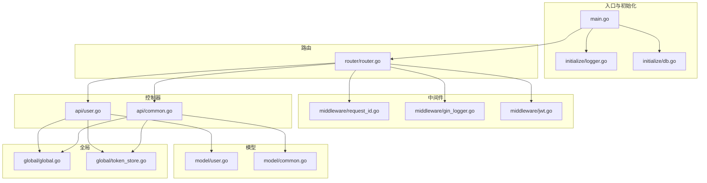
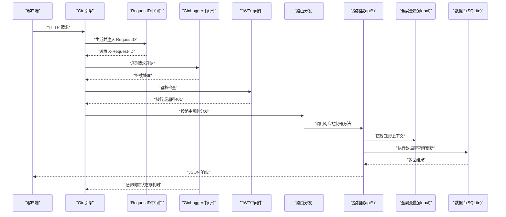
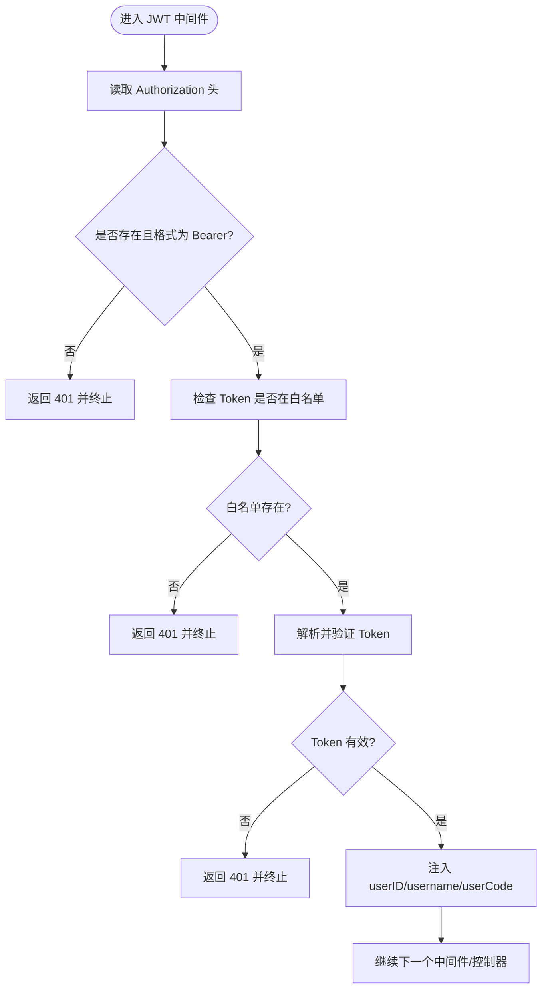
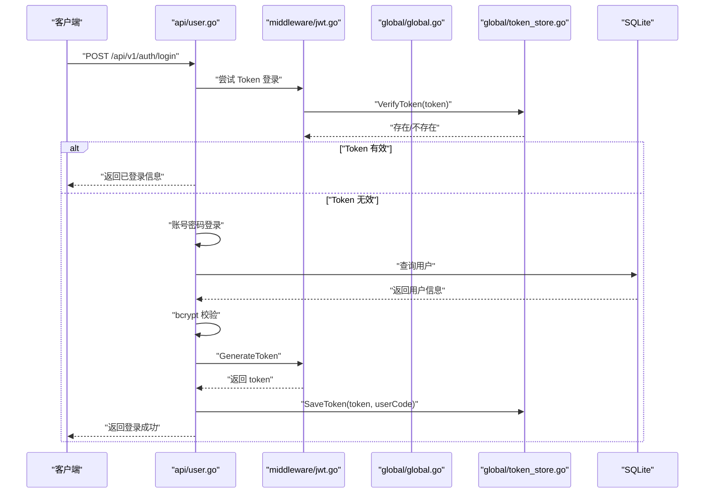
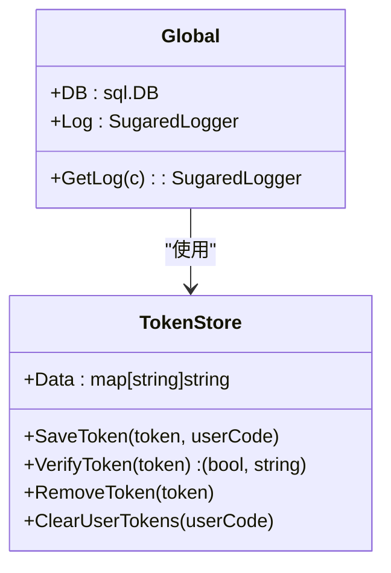
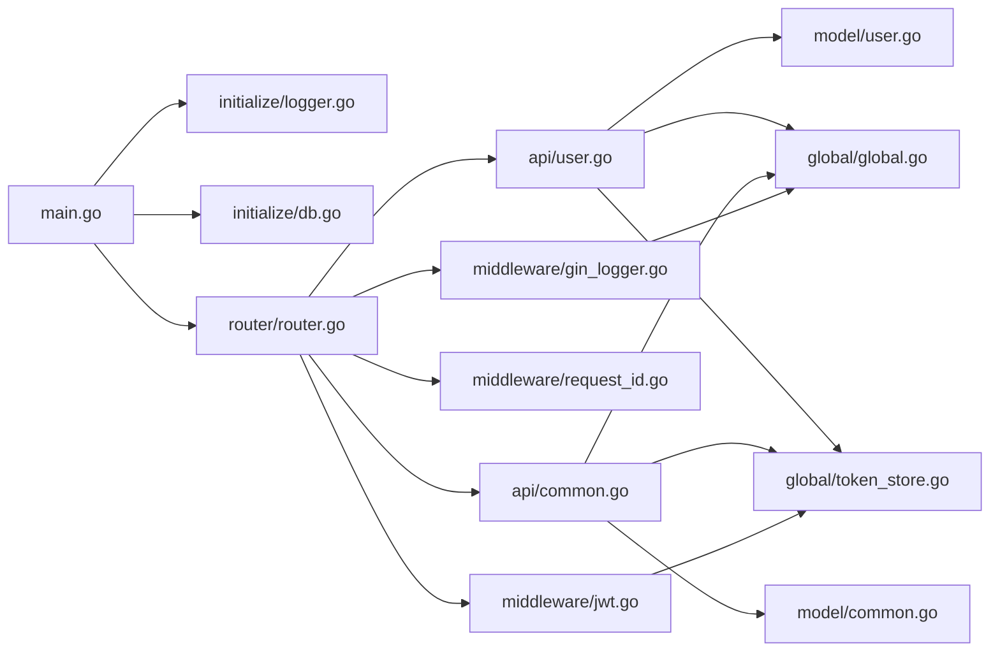

# 架构设计

<cite>
**本文引用的文件**
- [main.go](file://main.go)
- [router/router.go](file://router/router.go)
- [initialize/db.go](file://initialize/db.go)
- [initialize/logger.go](file://initialize/logger.go)
- [middleware/jwt.go](file://middleware/jwt.go)
- [middleware/gin_logger.go](file://middleware/gin_logger.go)
- [middleware/request_id.go](file://middleware/request_id.go)
- [global/global.go](file://global/global.go)
- [global/token_store.go](file://global/token_store.go)
- [api/user.go](file://api/user.go)
- [api/common.go](file://api/common.go)
- [model/user.go](file://model/user.go)
- [model/common.go](file://model/common.go)
- [config/config.go](file://config/config.go)
</cite>

## 目录
1. [简介](#简介)
2. [项目结构](#项目结构)
3. [核心组件](#核心组件)
4. [架构总览](#架构总览)
5. [详细组件分析](#详细组件分析)
6. [依赖关系分析](#依赖关系分析)
7. [性能考量](#性能考量)
8. [故障排查指南](#故障排查指南)
9. [结论](#结论)

## 简介
本项目采用经典的 MVC（Model-View-Controller）与分层架构：
- 控制器层（Controller）：位于 api/ 目录，处理 HTTP 请求与响应，协调模型与视图。
- 模型层（Model）：位于 model/ 目录，定义数据结构与数据库交互契约。
- 视图层（View）：位于 practice_problems_web/ 目录，Vue 3 前端项目，负责用户界面。
- 中间件层：位于 middleware/ 目录，提供认证、日志、跨域、请求ID等横切能力。
- 初始化层：位于 initialize/ 目录，负责日志、数据库等基础设施初始化。
- 全局共享：位于 global/ 目录，集中存放全局变量（如 DB、Log、Token 白名单）。

入口文件 main.go 负责按顺序初始化日志、数据库、路由，并启动 HTTP 服务；router.go 定义 API 路由并将请求映射到 api 控制器；middleware 提供 JWT 认证与日志记录；global 以单例形式暴露 DB 与日志；api 层通过 global.DB 访问数据库模型。

## 项目结构
项目采用按职责分层的组织方式：
- 入口与初始化：main.go -> initialize/* -> router/*
- 中间件：middleware/*
- 控制器：api/*
- 模型：model/*
- 全局共享：global/*
- 前端：practice_problems_web/*

图表来源
- [main.go](file://main.go#L1-L59)
- [initialize/logger.go](file://initialize/logger.go#L69-L184)
- [initialize/db.go](file://initialize/db.go#L14-L89)
- [router/router.go](file://router/router.go#L11-L127)
- [middleware/request_id.go](file://middleware/request_id.go#L1-L28)
- [middleware/gin_logger.go](file://middleware/gin_logger.go#L1-L61)
- [middleware/jwt.go](file://middleware/jwt.go#L1-L101)
- [api/user.go](file://api/user.go#L1-L342)
- [api/common.go](file://api/common.go#L1-L222)
- [model/user.go](file://model/user.go#L1-L35)
- [model/common.go](file://model/common.go#L1-L14)
- [global/global.go](file://global/global.go#L1-L32)
- [global/token_store.go](file://global/token_store.go#L1-L50)

章节来源
- [main.go](file://main.go#L1-L59)
- [router/router.go](file://router/router.go#L11-L127)

## 核心组件
- 入口与生命周期：main.go 负责初始化日志、数据库、路由，并启动服务。
- 路由与分发：router.go 使用 Gin 定义路由组与中间件链，将请求映射到 api 控制器。
- 中间件体系：RequestID、GinLogger、JWT、CORS 提供统一的横切能力。
- 控制器：api/* 实现业务逻辑，读写数据库并通过 global.DB 访问模型。
- 全局共享：global/global.go 暴露 DB 与日志；global/token_store.go 维护 Token 白名单。
- 初始化：initialize/logger.go 构建彩色日志系统；initialize/db.go 初始化 SQLite 并建表。

章节来源
- [main.go](file://main.go#L13-L32)
- [router/router.go](file://router/router.go#L11-L127)
- [middleware/request_id.go](file://middleware/request_id.go#L1-L28)
- [middleware/gin_logger.go](file://middleware/gin_logger.go#L1-L61)
- [middleware/jwt.go](file://middleware/jwt.go#L1-L101)
- [global/global.go](file://global/global.go#L1-L32)
- [global/token_store.go](file://global/token_store.go#L1-L50)
- [initialize/logger.go](file://initialize/logger.go#L69-L184)
- [initialize/db.go](file://initialize/db.go#L14-L89)

## 架构总览
下面的序列图展示了 HTTP 请求从进入、中间件处理、路由分发、调用 API 逻辑、访问数据库模型，再到返回响应的完整数据流。

图表来源
- [router/router.go](file://router/router.go#L11-L127)
- [middleware/request_id.go](file://middleware/request_id.go#L1-L28)
- [middleware/gin_logger.go](file://middleware/gin_logger.go#L1-L61)
- [middleware/jwt.go](file://middleware/jwt.go#L1-L101)
- [api/user.go](file://api/user.go#L1-L342)
- [api/common.go](file://api/common.go#L1-L222)
- [global/global.go](file://global/global.go#L1-L32)
- [initialize/db.go](file://initialize/db.go#L14-L89)

## 详细组件分析

### 入口与初始化：main.go
- 初始化顺序：先日志，再数据库，再路由，最后启动服务。
- 数据库关闭：程序退出时关闭 global.DB，避免资源泄漏。
- 端口配置：默认监听端口，可通过配置扩展。

章节来源
- [main.go](file://main.go#L13-L32)

### 日志系统：initialize/logger.go
- 使用 Zap 构建结构化日志，同时输出到控制台与文件。
- 彩色控制台输出，便于快速识别日志级别。
- Gin 默认输出重定向到日志系统，保证请求日志与业务日志风格一致。
- 通过 global.GetLog(c) 获取带 RequestID 的命名日志器，统一日志格式。

章节来源
- [initialize/logger.go](file://initialize/logger.go#L69-L184)
- [global/global.go](file://global/global.go#L16-L32)

### 数据库初始化：initialize/db.go
- 使用 SQLite 驱动，自动创建 uploads 目录与 data.db 文件。
- 启用 WAL 模式、同步策略与外键约束，提升并发与一致性。
- 初始化连接池参数，测试 Ping 成功后执行建表与表维护。
- 维护 questions 表结构，兼容历史字段变更。

章节来源
- [initialize/db.go](file://initialize/db.go#L14-L89)
- [initialize/db.go](file://initialize/db.go#L154-L379)

### 路由与中间件：router/router.go
- 使用 gin.New() 自定义中间件链，避免默认 Logger/Recovery。
- 中间件顺序：RequestID -> GinLogger -> Recovery -> CORS。
- 路由分组：/api/v1 下划分公开接口与需要 JWT 的接口组。
- 静态资源：/uploads 映射到本地目录，供图片访问。

章节来源
- [router/router.go](file://router/router.go#L11-L127)

### 请求ID中间件：middleware/request_id.go
- 生成短UUID并注入到上下文与响应头，便于跨模块追踪。
- 仅在首个中间件位置生效，确保后续日志能获取 RequestID。

章节来源
- [middleware/request_id.go](file://middleware/request_id.go#L1-L28)
- [middleware/gin_logger.go](file://middleware/gin_logger.go#L1-L61)

### 请求日志中间件：middleware/gin_logger.go
- 记录状态码、耗时、客户端IP、方法与路径。
- 根据状态码选择不同日志级别，统一通过 global.GetLog(c) 输出。
- 与 RequestID 结合，形成可追踪的日志链路。

章节来源
- [middleware/gin_logger.go](file://middleware/gin_logger.go#L1-L61)
- [global/global.go](file://global/global.go#L16-L32)

### JWT 认证中间件：middleware/jwt.go
- 从 Authorization 头解析 Bearer Token，校验格式与有效性。
- 优先检查内存白名单（TokenStore），避免重复解析与数据库压力。
- 解析自定义 Claims，将 userID/username/userCode 注入上下文。
- 记录访问日志（Debug 级别），便于审计与调试。

图表来源
- [middleware/jwt.go](file://middleware/jwt.go#L1-L101)
- [global/token_store.go](file://global/token_store.go#L1-L50)

章节来源
- [middleware/jwt.go](file://middleware/jwt.go#L1-L101)
- [global/token_store.go](file://global/token_store.go#L1-L50)

### 控制器：api/user.go 与 api/common.go
- 用户注册：参数校验、双MD5+bcrypt 加密、唯一 user_code 生成、入库。
- 用户登录：优先尝试 Token 自动登录（白名单+解析），失败则账号密码登录（bcrypt 校验）、签发新 Token 并加入白名单。
- 用户登出：从白名单移除 Token。
- 修改用户信息/密码：旧密码校验（双MD5+bcrypt）、新密码加密入库。
- 图片上传：权限校验（仅知识点创建者可改）、数量限制（最多10张）、目录权限设置、数据库 JSON 更新。

图表来源
- [api/user.go](file://api/user.go#L97-L240)
- [middleware/jwt.go](file://middleware/jwt.go#L24-L37)
- [global/token_store.go](file://global/token_store.go#L16-L31)

章节来源
- [api/user.go](file://api/user.go#L1-L342)
- [api/common.go](file://api/common.go#L1-L222)
- [model/user.go](file://model/user.go#L1-L35)
- [model/common.go](file://model/common.go#L1-L14)

### 全局变量与单例模式：global/global.go 与 global/token_store.go
- DB：全局数据库连接，由 initialize/db.go 初始化，供所有控制器使用。
- Log：全局 SugaredLogger，通过 global.GetLog(c) 获取带 RequestID 的命名日志器。
- TokenStore：全局 Token 白名单，提供 Save/Verify/Remove/ClearUserTokens 等操作，支持并发安全。

图表来源
- [global/global.go](file://global/global.go#L1-L32)
- [global/token_store.go](file://global/token_store.go#L1-L50)

章节来源
- [global/global.go](file://global/global.go#L1-L32)
- [global/token_store.go](file://global/token_store.go#L1-L50)

### 配置与环境：config/config.go
- 定义 MySQL 配置结构（尽管当前使用 SQLite，该结构可用于未来切换）。
- 通过 viper 等工具可从配置文件加载，main.go 中预留了配置加载函数。

章节来源
- [config/config.go](file://config/config.go#L1-L16)
- [main.go](file://main.go#L35-L47)

## 依赖关系分析
- main.go 依赖 initialize/logger.go 与 initialize/db.go，以及 router/router.go。
- router/router.go 依赖 api/* 控制器与 middleware/* 中间件。
- api/* 控制器依赖 model/* 结构体与 global/* 全局变量。
- middleware/* 依赖 global/* 以获取日志与上下文。
- global/token_store.go 为 middleware/jwt.go 与 api/* 提供 Token 白名单能力。

图表来源
- [main.go](file://main.go#L13-L32)
- [router/router.go](file://router/router.go#L11-L127)
- [api/user.go](file://api/user.go#L1-L342)
- [api/common.go](file://api/common.go#L1-L222)
- [middleware/gin_logger.go](file://middleware/gin_logger.go#L1-L61)
- [middleware/jwt.go](file://middleware/jwt.go#L1-L101)
- [global/global.go](file://global/global.go#L1-L32)
- [global/token_store.go](file://global/token_store.go#L1-L50)
- [model/user.go](file://model/user.go#L1-L35)
- [model/common.go](file://model/common.go#L1-L14)

## 性能考量
- 中间件链顺序影响性能：RequestID 放在首位，GinLogger 紧随其后，Recovery 保障稳定性，CORS 一次性处理。
- 数据库连接池：initialize/db.go 设置最大空闲与打开连接数及生命周期，减少连接创建开销。
- WAL 模式与同步策略：提升并发读写性能与可靠性。
- 日志输出：彩色控制台与文件双通道，避免阻塞主业务线程。
- 图片上传：目录权限设置与 JSON 更新，减少磁盘与数据库 IO 次数。

[本节为通用指导，不涉及具体文件分析]

## 故障排查指南
- 无法启动服务：检查 main.go 中端口与初始化顺序，确认日志与数据库初始化成功。
- 401 未授权：确认 Authorization 头格式为 Bearer，检查 Token 是否在白名单中，查看中间件日志。
- 登录失败：核对密码加密流程（双MD5+bcrypt），检查数据库用户记录是否存在。
- 图片上传失败：检查 uploads 目录权限与容量限制，确认 JSON 更新是否成功。
- 日志缺失：确认 Gin 默认输出已重定向到日志系统，RequestID 中间件是否在首位。

章节来源
- [main.go](file://main.go#L13-L32)
- [middleware/jwt.go](file://middleware/jwt.go#L1-L101)
- [api/user.go](file://api/user.go#L97-L240)
- [api/common.go](file://api/common.go#L1-L222)
- [initialize/logger.go](file://initialize/logger.go#L69-L184)

## 结论
本项目通过清晰的分层与中间件体系，实现了高内聚、低耦合的 MVC 架构。入口文件 main.go 有序初始化基础设施，router.go 以中间件链统一处理横切关注点，api/* 控制器聚焦业务逻辑并通过 global.DB 访问数据库模型。JWT 中间件与 Token 白名单提供了高效的认证方案，日志系统与 RequestID 保证了可观测性与可追踪性。整体设计简洁、可扩展性强，适合持续演进与团队协作。