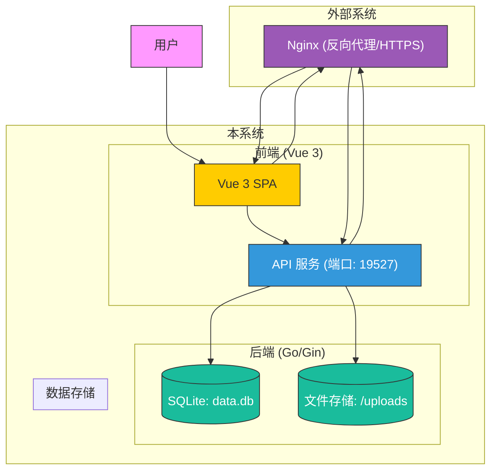

# 系统概述

<cite>
**本文档引用文件**  
- [main.go](file://main.go)
- [README.md](file://README.md)
- [initialize/db.go](file://initialize/db.go)
- [router/router.go](file://router/router.go)
- [api/share.go](file://api/share.go)
- [api/ShareAnnouncement.go](file://api/ShareAnnouncement.go)
- [model/subject.go](file://model/subject.go)
- [model/category.go](file://model/category.go)
- [model/point.go](file://model/point.go)
- [model/question.go](file://model/question.go)
- [practice_problems_web/src/main.js](file://practice_problems_web/src/main.js)
- [practice_problems_web/vite.config.js](file://practice_problems_web/vite.config.js)
</cite>

## 目录
1. [项目简介](#项目简介)
2. [四层知识结构](#四层知识结构)
3. [前后端分离架构](#前后端分离架构)
4. [技术选型：Go + Vue 3 + SQLite](#技术选型go--vue-3--sqlite)
5. [分享码机制与权限控制](#分享码机制与权限控制)
6. [公告系统](#公告系统)
7. [在线体验与项目亮点](#在线体验与项目亮点)
8. [系统上下文图](#系统上下文图)

## 项目简介

本项目是一个轻量级、高性能、易于部署的个人知识库与刷题系统，旨在为用户提供一个结构清晰、操作便捷的知识管理与练习平台。系统支持私有化部署，同时也提供在线服务，满足不同用户的使用需求。其核心定位是通过科学的知识组织方式，帮助用户高效地构建、管理和复习个人知识体系。

系统采用现代化的全栈技术架构，后端基于 Go 语言和 Gin 框架，前端采用 Vue 3 和 TypeScript 构建，数据库选用轻量级的 SQLite。这种技术组合确保了系统的高性能、低资源消耗和极简的部署流程。无论是个人学习、备考复习，还是小范围的知识分享，该系统都能提供稳定可靠的支持。

**本文档引用文件**  
- [README.md](file://README.md)

## 四层知识结构

系统采用“科目 → 分类 → 知识点 → 题目”的四层递进式知识结构，这种设计模仿了人类认知和知识组织的自然逻辑，为个人知识管理带来了显著的价值。

- **科目 (Subject)**：这是知识体系的最高层级，代表一个完整的知识领域，如“高等数学”、“大学物理”或“计算机网络”。一个科目可以包含多个并列的分类。
- **分类 (Category)**：在科目之下，知识被划分为若干个逻辑模块或章节，例如在“高等数学”科目下可以有“极限与连续”、“导数与微分”、“积分学”等分类。这有助于对知识进行宏观的模块化管理。
- **知识点 (Knowledge Point)**：分类的下一层是具体的知识点，它承载了某个概念、定理或方法的详细解释，包括文字内容、参考链接和图片。例如，“洛必达法则”就是一个具体的知识点。知识点是知识体系的核心单元。
- **题目 (Question)**：最底层是与知识点直接关联的练习题。每道题目都附有题干、选项（支持图文）、正确答案和解析。通过做题，用户可以检验对知识点的掌握程度。

这种结构的价值在于它实现了知识的**结构化**和**可追溯性**。用户可以清晰地看到知识的脉络，从宏观到微观层层深入。当在做题时遇到困难，可以一键跳转到对应的知识点进行复习，形成“学习-练习-巩固”的闭环，极大地提升了知识管理的效率和深度。

**Section sources**
- [model/subject.go](file://model/subject.go#L3-L11)
- [model/category.go](file://model/category.go#L3-L13)
- [model/point.go](file://model/point.go#L3-L16)
- [model/question.go](file://model/question.go#L3-L24)

## 前后端分离架构

系统采用前后端分离的架构设计，这是现代 Web 应用开发的主流模式，具有诸多优势。

在这种架构下，后端（Go）专注于提供 RESTful API 接口，处理业务逻辑、数据验证和数据库交互。它只负责接收前端的 HTTP 请求，执行相应的操作，并将结果以 JSON 格式返回。后端不关心页面如何渲染，也不生成任何 HTML。

前端（Vue 3）则是一个独立的单页应用（SPA），负责所有用户界面的展示和交互。它通过调用后端提供的 API 来获取数据，并在浏览器中动态地渲染页面。用户的所有操作，如点击、输入、切换页面，都由前端 JavaScript 代码处理，无需刷新整个页面。

这种设计的优势非常明显：
1.  **职责分离**：前后端开发可以并行进行，互不干扰。前端工程师专注于用户体验和界面设计，后端工程师专注于数据和逻辑，提高了开发效率。
2.  **技术栈独立**：前端和后端可以使用最适合各自领域的技术，如本项目中的 Vue 3 和 Go，充分发挥各自的优势。
3.  **易于维护和扩展**：API 接口定义清晰，使得系统更易于维护。未来如果需要开发移动端应用（如 iOS/Android App），可以直接复用现有的后端 API，无需重复开发业务逻辑。
4.  **高性能体验**：单页应用提供了接近原生应用的流畅交互体验，页面切换迅速，用户体验更佳。

**Section sources**
- [main.go](file://main.go#L13-L32)
- [router/router.go](file://router/router.go#L11-L108)
- [practice_problems_web/src/main.js](file://practice_problems_web/src/main.js#L1-L75)

## 技术选型：Go + Vue 3 + SQLite

本项目选择 Go、Vue 3 和 SQLite 的技术组合，是经过深思熟虑的，旨在实现轻量、高性能和易部署的核心目标。

- **Go 后端**：Go 语言以其卓越的并发性能和高效的编译执行而闻名。基于 Gin 框架构建的后端服务，能够以极低的资源消耗处理高并发的请求，确保了 API 的响应速度。Go 的静态编译特性使得最终生成一个独立的可执行文件，无需在目标服务器上安装复杂的运行环境，极大简化了部署流程。
- **Vue 3 前端**：Vue 3 作为新一代的前端框架，提供了组合式 API 和更好的性能。结合 Vite 构建工具，前端项目拥有闪电般的启动和热更新速度。Element Plus UI 库则提供了丰富且美观的组件，加速了界面开发。TypeScript 的引入增强了代码的可维护性和健壮性。
- **SQLite 数据库**：与需要独立安装和维护的 MySQL 或 PostgreSQL 不同，SQLite 是一个嵌入式数据库，整个数据库就是一个文件（如 `data.db`）。它无需独立的数据库服务器进程，开箱即用。这使得系统可以真正做到“单文件运行”，数据迁移和备份变得极其简单，非常适合个人使用和轻量级部署场景。

这三者的结合，完美地诠释了“极简全栈”的理念：开发体验流畅，运行性能优异，部署维护成本极低。

**Section sources**
- [README.md](file://README.md#L33-L52)
- [initialize/db.go](file://initialize/db.go#L16-L89)
- [practice_problems_web/package.json](file://practice_problems_web/package.json#L1-L33)

## 分享码机制与权限控制

系统通过独创的“分享码 (Share Code)”机制，实现了安全、灵活的资源共享与权限控制。

该机制的核心流程如下：
1.  **创建者生成分享码**：科目创建者可以生成一个唯一的分享码（如 `SHARE-ABC123`），并设置其有效期（如3天、1周或永久）。
2.  **订阅者绑定**：其他用户通过输入该分享码，即可将创建者的题库“订阅”到自己的账户中。
3.  **权限分离**：一旦绑定成功，订阅者获得了该题库的**只读刷题权限**。他们可以自由地查看知识点、练习题目、记录笔记，但无法修改或删除任何内容。而创建者始终拥有对该题库的完全控制权，可以随时修改内容或删除分享码来撤销访问权限。

这种设计确保了知识资源的**所有权**和**使用权**的分离。创建者可以安全地分享自己的知识成果，而不用担心内容被篡改。同时，订阅者也能获得一个稳定、纯净的学习环境。分享码的有效期设置也增加了安全性，可以用于临时分享或限时学习活动。

**Section sources**
- [api/share.go](file://api/share.go#L53-L580)
- [initialize/db.go](file://initialize/db.go#L207-L216)

## 公告系统

系统内置了公告系统，这是一个针对分享码场景的补充功能，用于发布重要通知。

当创建者发布了某个分享码后，他可以针对该分享码发布一条公告。这条公告会向所有通过该分享码订阅了题库的用户进行推送。公告内容可以是题库的更新说明、学习建议、答疑信息或任何需要统一通知的事项。

公告系统的作用场景非常明确：
- **信息同步**：当题库内容有重大更新时，创建者可以通过公告告知所有订阅者，避免信息不对称。
- **集中答疑**：创建者可以将常见问题的解答发布为公告，减少重复沟通的成本。
- **学习指导**：为订阅者提供学习路径建议或重点难点提示，提升学习效率。

公告具有可设置的过期时间，过期后将不再显示，确保了信息的时效性。

**Section sources**
- [api/ShareAnnouncement.go](file://api/ShareAnnouncement.go#L17-L224)
- [initialize/db.go](file://initialize/db.go#L219-L229)

## 在线体验与项目亮点

为了方便新用户快速了解系统价值，项目提供了在线体验地址：[https://pp.yugams.com](https://pp.yugams.com)。用户可以直接访问该网站，注册新账号即可开始体验完整的功能，无需任何本地安装。

结合 README 中的介绍，项目的主要亮点包括：
- **极简部署**：单文件运行，数据迁移方便，支持跨平台编译。
- **安全加固**：全站采用 JWT 无状态认证，密码使用 Bcrypt 加密，支持 Nginx 反向代理和 HTTPS，保障用户数据安全。
- **极致体验**：前端使用 Vite 构建，加载速度极快；后端 Go 服务性能优异，响应迅速。
- **功能完整**：除了核心的四层知识管理和分享功能外，还支持知识点/题目图片上传与自动压缩，满足多样化的学习需求。

这些亮点共同构成了一个对个人用户极具吸引力的知识管理工具。

**Section sources**
- [README.md](file://README.md#L12-L178)

## 系统上下文图

下图展示了本系统的主要组件、用户以及与外部系统的交互关系。

**Diagram sources**
- [main.go](file://main.go#L26-L27)
- [router/router.go](file://router/router.go#L31)
- [initialize/db.go](file://initialize/db.go#L18-L20)
- [README.md](file://README.md#L121-L149)
- [practice_problems_web/vite.config.js](file://practice_problems_web/vite.config.js#L29-L37)

**Section sources**
- [main.go](file://main.go#L26-L27)
- [router/router.go](file://router/router.go#L31)
- [initialize/db.go](file://initialize/db.go#L18-L20)