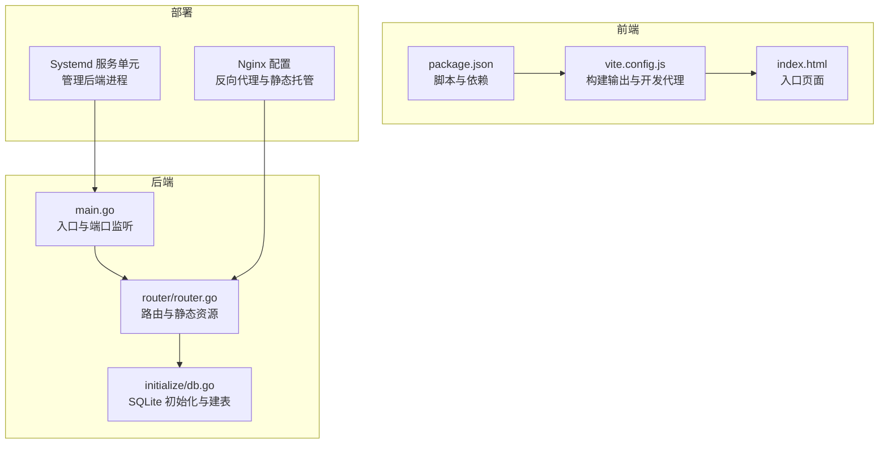
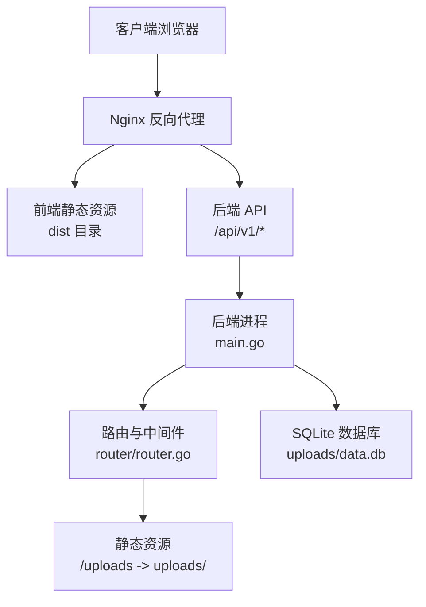
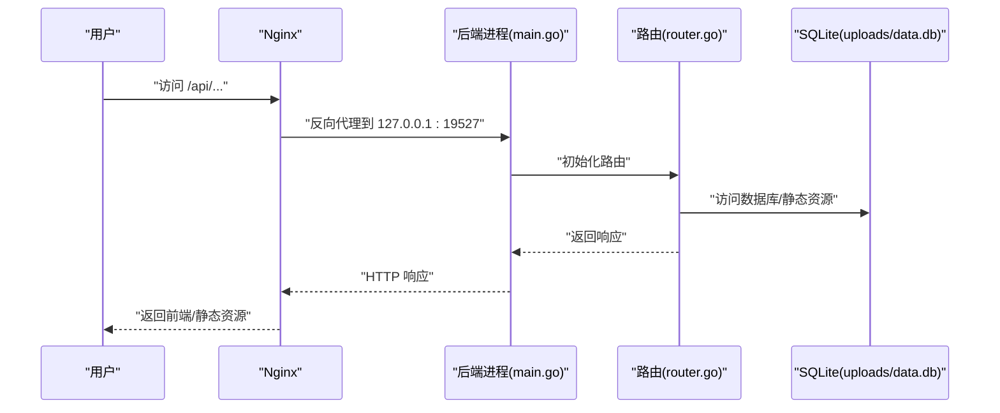

# 部署指南

<cite>
**本文引用的文件**
- [README.md](file://README.md)
- [main.go](file://main.go)
- [router/router.go](file://router/router.go)
- [initialize/db.go](file://initialize/db.go)
- [practice_problems_web/package.json](file://practice_problems_web/package.json)
- [practice_problems_web/vite.config.js](file://practice_problems_web/vite.config.js)
- [practice_problems_web/index.html](file://practice_problems_web/index.html)
- [config.yaml](file://config.yaml)
- [config/config.go](file://config/config.go)
</cite>

## 目录
1. [简介](#简介)
2. [项目结构](#项目结构)
3. [核心组件](#核心组件)
4. [架构总览](#架构总览)
5. [详细组件分析](#详细组件分析)
6. [依赖关系分析](#依赖关系分析)
7. [性能注意事项](#性能注意事项)
8. [故障排查指南](#故障排查指南)
9. [结论](#结论)
10. [附录](#附录)

## 简介
本指南面向生产环境部署，目标是帮助你在 Linux 服务器上稳定运行该全栈应用。内容涵盖：
- 使用 CGO_ENABLED=0 进行跨平台编译，生成静态链接的可执行文件
- 前端构建流程：执行 npm run build 生成 dist 目录
- Systemd 服务配置文件示例，用于管理后端进程
- Nginx 反向代理配置要点：托管前端静态文件、将 /api/ 路径代理到后端、配置 SSL 证书启用 HTTPS、通过 /uploads/ 提供用户上传的图片资源
- 安全最佳实践：使用非 root 用户运行服务

## 项目结构
项目采用前后端分离的结构，后端为 Go 语言实现，前端为 Vue 3 + Vite。部署时需要：
- 后端二进制文件（Linux amd64）
- 前端构建产物 dist 目录
- Nginx 配置文件
- Systemd 服务单元文件

图表来源
- [main.go](file://main.go#L1-L32)
- [router/router.go](file://router/router.go#L1-L32)
- [initialize/db.go](file://initialize/db.go#L1-L89)
- [practice_problems_web/package.json](file://practice_problems_web/package.json#L1-L10)
- [practice_problems_web/vite.config.js](file://practice_problems_web/vite.config.js#L1-L23)
- [practice_problems_web/index.html](file://practice_problems_web/index.html#L1-L14)

章节来源
- [README.md](file://README.md#L88-L164)
- [main.go](file://main.go#L1-L32)
- [router/router.go](file://router/router.go#L1-L32)
- [initialize/db.go](file://initialize/db.go#L1-L89)
- [practice_problems_web/package.json](file://practice_problems_web/package.json#L1-L10)
- [practice_problems_web/vite.config.js](file://practice_problems_web/vite.config.js#L1-L23)
- [practice_problems_web/index.html](file://practice_problems_web/index.html#L1-L14)

## 核心组件
- 后端入口与监听
  - 后端默认监听端口为 19527，可通过配置调整
  - 启动时初始化日志、SQLite 并启动 HTTP 服务
- 路由与静态资源
  - 路由组 /api/v1 下提供认证、分享、科目、分类、知识点、题目等接口
  - 静态资源 /uploads 挂载到 ./uploads 目录，用于图片等资源访问
- 数据库初始化
  - SQLite 数据库文件位于 uploads/data.db，首次运行会自动创建目录与表
- 前端构建
  - 使用 Vite 构建，输出目录为 dist；开发时通过代理 /api/ 指向前端开发服务器
- 配置文件
  - config.yaml 为 MySQL 配置示例（当前项目使用 SQLite），可按需启用或忽略

章节来源
- [main.go](file://main.go#L1-L32)
- [router/router.go](file://router/router.go#L1-L32)
- [initialize/db.go](file://initialize/db.go#L1-L89)
- [practice_problems_web/package.json](file://practice_problems_web/package.json#L1-L10)
- [practice_problems_web/vite.config.js](file://practice_problems_web/vite.config.js#L1-L23)
- [config.yaml](file://config.yaml#L1-L9)
- [config/config.go](file://config/config.go#L1-L15)

## 架构总览
生产环境典型拓扑：
- Nginx 作为反向代理与静态资源服务器，监听 443 端口，提供 HTTPS
- 将 /api/ 请求转发到后端服务（127.0.0.1:19527）
- 将 /uploads/ 请求映射到后端 uploads 目录
- 前端静态资源来自 dist 目录，通过 try_files 支持 SPA 路由

图表来源
- [README.md](file://README.md#L121-L149)
- [main.go](file://main.go#L24-L32)
- [router/router.go](file://router/router.go#L1-L32)
- [initialize/db.go](file://initialize/db.go#L1-L89)

## 详细组件分析

### 后端编译与运行（CGO_ENABLED=0）
- 使用 CGO_ENABLED=0 进行跨平台编译，生成纯静态链接的 Linux 可执行文件
- 推荐在 Windows 或 macOS 上执行交叉编译命令，输出文件命名为 practiceProblem
- 生成的二进制文件与 dist 目录一起上传至服务器

章节来源
- [README.md](file://README.md#L91-L103)

### 前端构建（npm run build 与 dist 目录）
- 进入前端目录，执行 npm install 安装依赖
- 执行 npm run build 生成 dist 目录，作为静态资源根目录
- Vite 构建配置指定输出目录为 dist，开发代理 /api/ 指向本地后端端口 19527

章节来源
- [README.md](file://README.md#L99-L102)
- [practice_problems_web/package.json](file://practice_problems_web/package.json#L1-L10)
- [practice_problems_web/vite.config.js](file://practice_problems_web/vite.config.js#L1-L23)

### Systemd 服务配置（.service）
- 使用 Systemd 管理后端进程，建议以非 root 用户运行
- WorkingDirectory 指向可执行文件所在目录
- ExecStart 指向可执行文件路径
- Restart=always 实现异常自动重启
- 可结合日志与防火墙策略进一步加固

章节来源
- [README.md](file://README.md#L106-L121)

### Nginx 反向代理配置
- 监听 443 端口并启用 SSL 证书
- 前端静态资源托管：root 指向 dist 目录，index 指定 index.html，try_files 支持 SPA
- API 代理：location /api/ 反向代理到 127.0.0.1:19527
- 上传资源：location /uploads/ 使用 alias 映射到 uploads 目录
- 建议在生产中仅允许必要 HTTP 头透传，避免不必要的风险

章节来源
- [README.md](file://README.md#L121-L149)
- [router/router.go](file://router/router.go#L1-L32)

### 数据库与静态资源目录
- SQLite 数据库文件位于 uploads/data.db，首次运行会自动创建 uploads 目录
- /uploads 静态资源挂载到 ./uploads，用于图片等资源访问
- 建议为 uploads 目录设置合适的权限，避免被外部直接下载敏感文件

章节来源
- [initialize/db.go](file://initialize/db.go#L1-L89)
- [router/router.go](file://router/router.go#L1-L32)

### 安全最佳实践
- 使用非 root 用户运行后端进程，降低系统风险
- 限制 Nginx 对 uploads 目录的访问范围，避免未授权下载
- 仅暴露必要的端口，启用防火墙策略
- 使用 HTTPS 并定期更新证书
- 对上传文件类型与大小进行严格校验，避免恶意文件上传

章节来源
- [README.md](file://README.md#L121-L149)

## 依赖关系分析
后端启动流程的关键依赖链：
- main.go 调用 initialize.InitLogger 与 initialize.InitSQLite
- 初始化完成后创建路由并启动 HTTP 服务
- 路由层挂载 /uploads 静态资源与 /api/v1 接口

图表来源
- [main.go](file://main.go#L1-L32)
- [router/router.go](file://router/router.go#L1-L32)
- [initialize/db.go](file://initialize/db.go#L1-L89)

章节来源
- [main.go](file://main.go#L1-L32)
- [router/router.go](file://router/router.go#L1-L32)
- [initialize/db.go](file://initialize/db.go#L1-L89)

## 性能注意事项
- 启用 gzip 压缩减少传输体积
- 合理设置 SQLite 连接池参数，避免过高并发导致锁争用
- 前端静态资源缓存策略与 CDN 配合，提升首屏加载速度
- Nginx 层面开启静态文件缓存与压缩，减轻后端压力

章节来源
- [router/router.go](file://router/router.go#L1-L18)
- [initialize/db.go](file://initialize/db.go#L66-L76)

## 故障排查指南
- 后端无法启动
  - 检查端口占用与权限
  - 查看 Systemd 日志与后端日志输出
- 前端 404 或路由异常
  - 确认 Nginx root 指向 dist 目录且 index 指定 index.html
  - 确认 try_files $uri $uri/ /index.html 生效
- API 404 或跨域问题
  - 确认 /api/ 代理到 127.0.0.1:19527
  - 检查 CORS 中间件是否生效
- 上传图片无法访问
  - 确认 /uploads/ 使用 alias 指向 uploads 目录
  - 检查 uploads 目录权限与 SELinux/AppArmor 策略
- 数据库初始化失败
  - 检查 uploads 目录是否存在且可写
  - 查看 SQLite 初始化日志与建表语句执行情况

章节来源
- [README.md](file://README.md#L121-L149)
- [router/router.go](file://router/router.go#L1-L32)
- [initialize/db.go](file://initialize/db.go#L1-L89)

## 结论
通过 CGO_ENABLED=0 生成静态链接的 Linux 可执行文件，结合 Systemd 与 Nginx 的标准配置，可实现稳定、安全、易维护的生产部署。配合 SQLite 的零依赖特性与前端构建产物的静态托管，整体部署复杂度较低，适合个人与小团队快速上线。

## 附录
- 后端默认监听端口：19527
- 前端构建输出目录：dist
- 上传资源目录：uploads
- Nginx 反向代理路径：/api/ -> 127.0.0.1:19527
- 上传资源路径：/uploads/ -> uploads/

章节来源
- [main.go](file://main.go#L24-L32)
- [practice_problems_web/vite.config.js](file://practice_problems_web/vite.config.js#L1-L23)
- [router/router.go](file://router/router.go#L1-L32)
- [README.md](file://README.md#L121-L149)